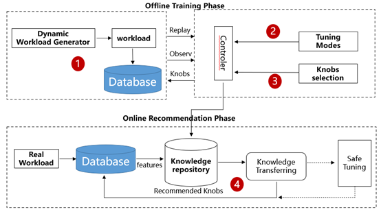
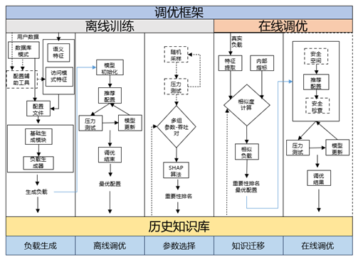

# 智能参数调优

## 功能介绍

### 背景

现代数据库管理系统往往有数百个配置参数，这些参数控制了系统的内存分配、I/O优化、备份与恢复等诸多方面,并极大地影响了数据库的吞吐量、延迟等性能。
参数调优技术通过调整数据库参数配置来优化数据库性能。传统参数调优面临着许多困难，主要体现在以下几方面：
1. 参数数量众多（往往数以百计，而且作用各不相同）。
2. 参数间不独立（更改一项参数可能会影响其他参数）。
3. 配置不通用（不同工作负载以及不同应用程序下的最优参数配置并不相同）。

目前主流的方法仍然是由经验丰富的数据库管理员借助历史经验和反复测试人工进行 调整。
但随着数据库系统和应用程序规模的扩大，复杂度也随之增长，仅凭DBA和一些简单的辅助工具进行参数调优不仅达不到预期效果，还会给企业等带来极高的人力成本和时间资源成本。 
数据库智能参数调优结合了机器学习方法，有效利用当前负载信息和数据库历史性能表现，推荐一组最优的参数。
基本无需人工参与便可以根据当前负载自动地优化数据库参数配置，不仅可以降低人力成本，还能够进一步提升数据库的性能。
数据库智能参数调优是近年来业界研究 的热点，常见的有OtterTune、ResTune、hunter、OnlineTune等，但在落地在生产环境中面临很多挑战，如对不同的负载，不同的硬件环境，进行快速的适应 和迭代，在贝叶斯优化的基础上，利用历史的观测数据和专家经验形成先验数据（不同优化任务的历史经验积累与专家知识沉淀等问题），在不同的观测之间设计相似性的度量关系，通过算法学习进行快速适应和迭代优化。

### 主要功能

数据库智能参数调优工具主要包括如下功能：
1. **负载特征分析**

   此功能从用户负载中抽取出负载特征,多角度精准刻画负载，结果可用于负载生成。

2. **数据库模式抽取**

   此功能从用户数据库中提取出数据库模式，结果可用于负载生成。

3. **负载生成**

   此功能可生成多样化负载，用于离线调优。需输入数据库模式及负载特征。

4. **离线调优**

   此功能针对特定负载离线参数调优。调优过程中会重启数据库，调优时间较长，优化效果好。

5. **在线调优**

   此功能在不影响数据库正常运行的同时在线调优。快速推荐出一组优化负载，之后用户可自行选择是否需要进一步微调。使用前需要提前进行离线调优。

6. **在线微调**

   使用离线调优的历史数据初始化采样池，并基于此调用调优模型进行参数微调，用户可自行设置微调的次数，并选取微调过程中的最优配置。

### 架构设计

数据库智能参数调优工具主要架构如下图所示，主要由四部分组成：



1. **负载生成**: 

   提取DBMS内部指标和query特征作为负载特征，生成相似负载。

2. **调优模型**: 

   以高斯过程作为代理模型并对其进行初始化，利用探索进行参数配置选择，将推荐配置应用到DBMS后，用获得数据更新高斯过程，迭代完成后输出最终推荐配置。

3. **参数选择**: 

   对所有参数进行重要性排名，选择top-n参数，以将高维空间映射到低维空间，针对低维空间进行训练。

4. **知识迁移**: 

   通过workload mapping方法，进行数据库负载相似度匹配，将历史经验应用到新数据库调优中。
整体调优流程如下图所示，主要分为离线训练和在线调优两个阶段。离线训练阶段主要用于针对不同优化任务进行调优，其目的在于1）积累丰富的历史经验，构建相对
完善的知识库，以支持在在线调优时能够准确匹配出相似负载，实现快速响应；2）利用调优结果识别重要参数，缩减特征空间，提高调优效率。具体来说，首先由负载
生成器根据不同的负载特征组合生成负载，在真实数据库上执行生成的负载，同时观测数据库性能及相关内部指标。之后将观测值传递给调优模型，调优模型给出一组
推荐的参数并应用在数据库上，再次执行负载并观测结果，用于在下一轮调优中更新调优模型参数。重复上述迭代调优流程，直到调优模型收敛或达到停止条件。
基于迭代过程中产生的数据，执行参数选择模块，通过分析历史数据给出参数重要性排名，用于在线调优时缩减特征空间，提高调优效率。最后将负载-最优配置-重要
性排名合并为一条调优历史数据，保存在历史知识库中。 在线调优阶段即在真实生产场景下，快速响应、动态调优。首先从真实负载和数据库内部指标中提取负载特征，
据此在历史知识库中匹配最为相似的历史负载，通过知识迁移选择对应参数作为推荐配置应用在数据库中。如条件允许，可以在其基础上迭代运行安全调优模型，对参数
做进一步微调，直到模型收敛或达到停止条件。调优后的运行结果同样可以作为历史数据记录到知识库中。

   


### 软件环境要求

<table>
   <tr>
      <th>软件类型</th>
      <th>配置描述</th>
   </tr>
   <tr>
      <td>Linux操作系统</td>
      <td>ARM:OpenEuler20.03LTS；麒麟V10<br>X86:OpenEuler20.03LTS；CentOS7.6</td>
   </tr>
   <tr>
      <td>Python</td>
      <td>3.7</td>
   </tr>
</table>

### 软件依赖要求

<table>
   <tr>
      <th>所需软件</th>
      <th>建议版本</th>
   </tr>
   <tr>
      <td>Python3-devel</td>
      <td>3.7.4</td>
   </tr>
   <tr>
      <td>libtool</td>
      <td>2.4.6</td>
   </tr>
   <tr>
      <td>postgresql-devel</td>
      <td>10.5</td>
   </tr>
   <tr>
      <td>make</td>
      <td>4.2.1</td>
   </tr>
   <tr>
      <td>mariadb-devel</td>
      <td>10.3.9</td>
   </tr>
   <tr>
      <td>libaio-devel</td>
      <td>0.3.111</td>
   </tr>
   <tr>
      <td>automake</td>
      <td>1.16.1</td>
   </tr>
   <tr>
      <td>openssl-devel</td>
      <td>1.1.1d</td>
   </tr>
</table>

## 使用指导

### 安装与运行

1. 安装sysbench1.0及生成数据
2. 下载sysbench1.0.17安装包并上传至项目所在机器 (下载地址`https://github.com/akopytov/sysbench/releases/`)
3. 进入sysbench压缩包路径，依次执行如下命令
      ```
       tar -zxvf sysbench-1.0.17.tar.gz
       yum -y install make automake libtool pkgconfig libaio-devel
       yum -y install mariadb-devel openssl-devel
       yum -y install postgresql-devel
       ./autogen.sh
       ./configure --with-pgsql
       make -j
       make install
      ```
4. 检查是否安装成功 `sysbench --version`

### 注意事项

jdk版本为11+
maven版本为3.6.3
datakit 所在服务器环境要求:
1. yum 命令能够正常使用。
2. python环境 python3.7+,能够正确执行python3 命令。
3. 每一个openGauss数据库集群第一次训练会校验python环境是否正常安装项目需要的依赖,如果返回python环境失败，或者hebo安装失败，
假设datakit的安装目录为`/usr/local/work`,前往`/usr/local/work/data/tuning/log/`，查看训练日志文件。
