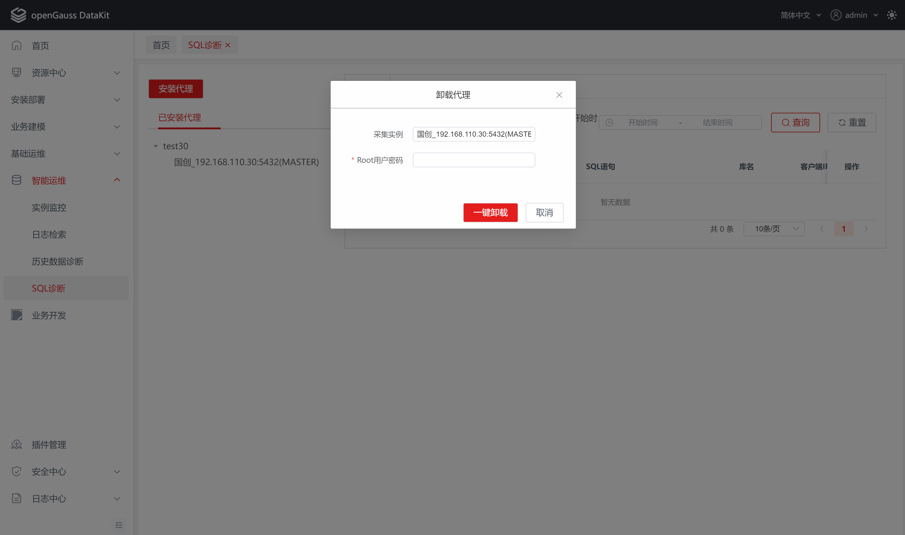
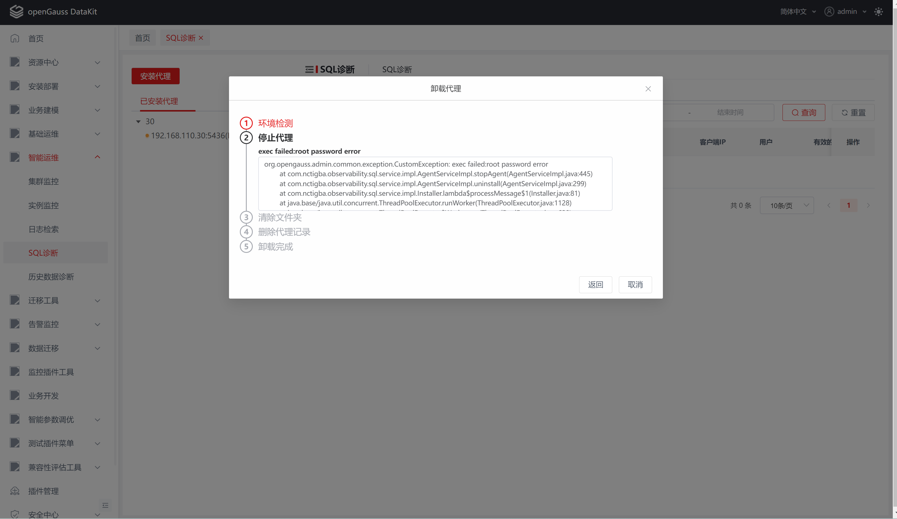

# 智能诊断

## 功能介绍

### 概述

在生产环境中，当用户发现性能问题时，往往需要丰富的运维经验，通过多种命令、工具进行数据采集，然后进行分析，才能发现最终问题根因。智能诊断插件提供了一个不断完善的知识库，帮助智能分析各种性能问题产生的根因，从而极大地提高openGauss的可维护性和易用性。

SQL诊断模块支持实时查询慢SQL，对正在执行的慢SQL执行诊断任务。诊断过程中会对服务器基础性能数据和内核性能数据以及数据库视图数据进行采集分析，最后会以图表、表格等形式展示采集的数据，并提供优化建议信息。

历史数据诊断模块支持对历史时间段执行诊断任务，执行过程中会对服务器性能数据和数据库视图数据进行采集分析，最后以图表、表格的形式展示数据，并提供优化建议信息。

### 支持的功能

智能诊断插件提供的功能如下：

- 慢SQL查询以及诊断
- 历史数据诊断
- 代理端安装卸载
- 阈值设置

### 约束和限制

**项目运行**

本项目依赖一体化主平台，若需要使用本项目所有功能，只能通过编译成 jar 包的形式作为插件运行在主平台上。

### 系统要求

本节介绍使用智能诊断插件的最低系统要求。

**浏览器兼容性**

| 内置对象 \ 浏览器及版本                                      | Chrome | Edge | Firefox | Opera | Safari |
| ------------------------------------------------------------ | ------ | ---- | ------- | ----- | ------ |
| `Proxy`                                                      | 49     | 12   | 18      | 36    | 10     |
| [`Proxy()` constructor](https://gitee.com/link?target=https%3A%2F%2Fdeveloper.mozilla.org%2Fen-US%2Ffiguress%2FWeb%2FJavaScript%2FReference%2FGlobal_Objects%2FProxy%2FProxy) | 49     | 12   | 18      | 36    | 10     |
| [`revocable`](https://gitee.com/link?target=https%3A%2F%2Fdeveloper.mozilla.org%2Fen-US%2Ffiguress%2FWeb%2FJavaScript%2FReference%2FGlobal_Objects%2FProxy%2Frevocable) | 63     | 12   | 34      | 50    | 10     |

**系统要求**

| 操作系统 | 版本           |
| -------- | -------------- |
| Windows  | windows7及以上 |

**软件要求**

| 软件 | 规格         |
| ---- | ------------ |
| Java | jdk 11及以上 |

**数据库版本要求**

| 数据库    | 版本 |
| --------- | ---- |
| openGauss | 所有 |

##  使用指导

### 概述

智能诊断插件主要有安装部署、慢SQL、SQL诊断和历史数据诊断功能。

1. 安装部署主要包括代理的安装、卸载、启动、停止和状态监控功能。代理需要部署在对应的数据库服务器，且需要通过root用户进行安装。

2. 慢SQL主要包括慢SQL查询和慢SQL诊断功能，对纳入平台管理的集群/实例下的数据库中的历史慢SQL记录进行查询以及诊断操作。

3. SQL诊断主要包括创建诊断任务、查询诊断任务、查看诊断详情、删除诊断任务以及设置阈值功能。SQL诊断插件依赖本插件代理的部署，没有部署代理时，只会对执行计划相关的诊断项进行分析。SQL诊断插件可以通过慢SQL创建诊断任务，也可以通过自定义创建诊断任务。创建诊断任务后才可以查看和删除诊断任务，诊断任务运行完成后才可以查看诊断结果的详情信息。

4. 历史数据诊断主要包括发起诊断、查看诊断详情以及设置阈值的功能。历史数据诊断不依赖本插件代理的部署，但会依赖实例监控插件服务端的部署，实例监控插件没有部署服务端时，历史指标数据相关的诊断项会分析异常。发起诊断之后，等待诊断完成才可以查看诊断结果的详情信息。

###  部署代理

#### 安装代理

1. 登录一体化平台，点击【智能运维】下【SQL诊断】菜单进入SQL诊断首页。

    

2. 在首页点击【安装代理】按钮，弹出安装代理窗口。

    

3. 选择对应数据库实例，输入Root密码，点击【一键部署】按钮开始安装，点击【取消】按钮可取消安装。

    **说明：** 所有必选参数均需要填写。必填参数用星号（*）标识。
    
    | 配置项       | 必填 | 组件形式   | 配置说明                                            |
    | ------------ | ---- | ---------- | --------------------------------------------------- |
    | 采集实例     | 是   | 下拉框     | 平台纳入管理的集群/实例                             |
    | Root用户密码 | 是   | 文本输入框 | 部署实例的服务器Root用户密码                        |
    | 代理端口     | 是   | 文本输入框 | 安装代理的端口号，默认为2321，非法输入会出现异常    |
    | 回调路径     | 是   | 文本输入框 | 平台的地址，代理回传数据时调用平台Api接口，有默认值 |
    | 安装目录     | 是   | 文本输入框 | 代理安装在服务器上的绝对路径，有默认值              |

    

4. 点击完【一键部署】按钮后，会弹出安装过程窗口，安装完成后，可以点击【返回】按钮，跳转到安装代理窗口，点击【取消】关闭安装窗口。

    **说明：** 

    安装过程中会涉及到如下操作：
    
    1. 检测数据库实例是否存在，不存在会提示异常信息；
    
    2. 检测安装目录是否为空，不为空会提示异常信息；
    
    3. 检测端口是否被占用，被占用会提示异常信息；
    
    4. 检测python环境是否存在，不存在会提示异常信息；
    
    5. 检测java版本是否大于1.8，不存在会在线下载，无法连接外网会提示异常信息；
    
    6. 检测bcc是否安装，没安装会在线下载，无法连接外网会提示异常信息；
    
    7. SSH上传代理jar包、FlameGraph工具、启动脚本。

    

5. 在安装过程界面中可以查看安装异常信息。

    

6. 安装代理完成后，会在【已安装代理】TAB中新增一条数据。

#### 查看已安装代理

安装完成后，即可在【已安装代理】TAB中看到对应代理的信息。

**说明：**
    
1. 默认展示集群名称，点击【集群名称】可查看集群下已安装代理的实例；

2. 安装成功会在实例前显示绿色圆点，表示代理正在运行中，且状态健康；

3. 运行中的代理可以停止以及卸载。

    

#### 停止代理

1. 在【已安装代理】TAB中，当鼠标悬停在实例上时，可以看到实例后有【停止】以及【卸载】按钮，点击【停止】按钮会在实例前显示蓝色圆点，表示代理正在停止中。

    **说明：** 仅能停止运行状态健康的代理。

    

2. 停止成功会在实例前显示黄色圆点，表示代理已经停止。

    

3. 停止失败在实例前显示绿色圆点以及红色感叹号，表示代理停止异常，当鼠标悬停在红色感叹上可以看到异常信息。

    

#### 启动代理

1. 在【已安装代理】TAB中，当当鼠标悬停在实例上时，可以看到实例后有【启动】以及【卸载】按钮，点击【启动】按钮会在实例前显示蓝色圆点，表示代理正在启动中。

    **说明：** 仅能启动运行状态不健康的代理。

    

2. 启动成功会在实例前显示绿色圆点，表示代理已经启动。

    

3. 启动失败在实例前显示黄色圆点以及红色感叹号，表示代理启动异常，当鼠标悬停在红色感叹上可以看到异常信息。

    

####  卸载代理

1. 在【已安装代理】TAB中，当鼠标悬停在实例上时，可以看到实例后有【卸载】按钮，点击【卸载】按钮，弹出卸载窗口。

    

2. 输入Root密码，点击【一键卸载】按钮，开始卸载操作，点击【取消】按钮，关闭卸载窗口。

    **说明：** 所有必选参数均需要填写。必填参数用星号（*）标识。
    
    | 配置项       | 必填 | 组件形式   | 配置说明                     |
    | ------------ | ---- | ---------- | ---------------------------- |
    | 采集实例     | 是   | 下拉框     | 平台纳入管理的集群/实例      |
    | Root用户密码 | 是   | 文本输入框 | 部署实例的服务器Root用户密码 |

    **注：** 卸载过程不可逆，卸载完成后将会清除该代理所有有关的数据（不影响SQL诊断历史诊断数据），请谨慎卸载！

    

3. 点击【一键卸载】按钮后，会弹出卸载过程窗口，卸载完成后，可以点击【返回】按钮，跳转到卸载代理窗口，点击【取消】关闭卸载窗口。

    

4. 在卸载过程窗口可以查看卸载异常信息。

    

5. 卸载代理完成后，会在【已安装代理】TAB中删除一条数据。

#### 状态监控

通过定时器每隔1分钟检测采集代理的运行状态。

###  慢SQL

#### 查看慢SQL

1. 智能诊断首页默认展示慢SQL的TAB页面，输入相关查询条件，点击【查询】按钮可以查看选择的实例下数据库的慢SQL信息，点击【重置】按钮会清除筛选条件。

    **说明：**
    
    | 配置项       | 必填 | 组件形式   | 配置说明                |
    | ------------ | ---- | ---------- | ----------------------- |
    | 集群/实例    | 是   | 下拉框     | 平台纳入管理的集群/实例 |
    | 数据库       | 否   | 下拉框     | 实例下已安装的数据库    |
    | 执行开始时间 | 否   | 时间选择框 | 结束时间大于开始时间    |

     

#### 慢SQL诊断

1. 在数据列表选择一条数据，点击【诊断】操作按钮，输入相关信息，可创建诊断任务，新增的【诊断任务】将在【SQL诊断任务】中显示，点击【取消】按钮可返回慢SQL列表页面。

    **说明：** 创建诊断任务的配置信息可详见【SQL诊断任务】。

    

    

### SQL诊断

#### 查看SQL诊断任务

1. 点击【SQL诊断任务】TAB，进入【SQL诊断任务】页面，输入筛选条件可点击【查询】按钮查看sql诊断任务。

    **说明：**
    
    | 配置项       | 必填 | 组件形式   | 配置说明                |
    | ------------ | ---- | ---------- | ----------------------- |
    | 集群/实例    | 否   | 下拉框     | 平台纳入管理的集群/实例 |
    | 数据库       | 否   | 下拉框     | 实例下已安装的数据库    |
    | 任务名称     | 否   | 文本输入框 | 任务名称，支持模糊筛选  |
    | 执行开始时间 | 否   | 时间选择框 | 结束时间大于开始时间    |

    

#### 创建SQL诊断任务

1. 点击【新建任务】按钮，弹出创建任务窗口，输入相关表单数据，点击【创建任务】按钮，即可创建SQL诊断任务，点击【取消】按钮关闭创建任务窗口。

    **说明：**
    
    | 配置项           | 必填 | 组件形式   | 配置说明                                             |
    | ---------------- | ---- | ---------- | ---------------------------------------------------- |
    | 集群/实例        | 是   | 下拉框     | 平台纳入管理的集群/实例                              |
    | 数据库           | 是   | 下拉框     | 实例下已安装的数据库                                 |
    | 任务名称         | 是   | 文本输入框 | 任务名称                                             |
    | SQL              | 是   | 文本输入框 | 有效的SQL语句,支持create、insert、update、delete语句 |
    | 可选项           | 否   | 勾选框     | 默认不勾选，勾选会诊断相关的诊断点                   |
    | 本次诊断阈值配置 | 是   | 列表       | 有默认值，设置诊断项本次诊断是否建议的阈值           |
    | 全局阈值         | 否   | 按钮       | 设置诊断项全局生效是否建议的阈值                     |

    

#### 查看SQL诊断详情

1. 创建诊断任务完成后，会关闭创建任务窗口，并且会在诊断列表中新增一条诊断任务数据，点击诊断任务列表中的【任务名称】，可打开【SQL诊断详情】页面，可查看【分析报告】和【诊断详情】TAB页数据。

    **说明：**

    【分析报告】默认展示建议项相关的拓扑图诊断点。
    
    【诊断详情】默认展示【任务信息】诊断点的数据。

    

    

2. 点击【分析报告】中下拉框【所有诊断项】按钮时，分析报告将展示拓扑图所有诊断点。

    

3. 点击【分析报告】中拓扑图上相应的【诊断点】时，【诊断详情】将展示该诊断点的详细信息。

    

4. 点击右上角的【放大】按钮，将放大诊断详情页面。

    

5. 再点击右上角的【缩小】按钮，可恢复至放大前的页面。

    

#### 删除SQL诊断任务

1. 选择一条诊断任务，点击操作列下的【删除】按钮，弹出确认窗口，点击【确定】按钮即可删除该条诊断任务。点击【取消】按钮关闭确认窗口。

    **注：** 删除过程不可逆，删除完成后将会清除该诊断任务的数据，请谨慎删除！

    

2. 确定删除后，诊断任务列表将会刷新数据。

### 历史数据诊断

1. 登录一体化平台，点击【智能运维】下【历史数据诊断】菜单。

    

2. 输入诊断条件，点击【诊断】按钮，开始诊断。

    **说明：**
    
    | 配置项           | 必填 | 组件形式   | 配置说明                                       |
    | ---------------- | ---- | ---------- | ---------------------------------------------- |
    | 集群/实例        | 是   | 下拉框     | 平台纳入管理的集群/实例                        |
    | 开始时间         | 是   | 时间选择框 | 开始时间小于结束时间                           |
    | 结束时间         | 否   | 时间选择框 | 结束时间大于开始时间                           |
    | 锁分析           | 否   | 勾选框     | 默认不勾选，勾选后将会诊断与可选项有关的诊断点 |
    | 本次诊断阈值配置 | 是   | 文本输入框 | 有默认值，设置诊断项本次诊断是否建议的阈值     |
    | 全局阈值         | 否   | 按钮       | 设置诊断项全局生效是否建议的阈值               |

    

3. 诊断过程需要等待一段时间，页面处于等待状态页面。

    

4. 诊断完成后，将打开一个新的TAB页【历史数据诊断详情】页面，点击【分析报告】页面下【建议项】/【所有建议项】下拉框，可查看全部诊断点。

    **说明：**

    【分析报告】默认展示建议项相关的拓扑图诊断点。

    【诊断详情】默认展示【任务详情】诊断点的数据。

    

5. 在拓扑图上点击【诊断点】，可查看诊断详情信息，详情信息有【诊断结果】和【诊断说明】2个TAB页面。

    **说明：**

    【诊断结果】主要展示优化建议和分析数据。

    【诊断详情】主要展示诊断点诊断逻辑或者其他说明。

    

    

6. 在诊断详情右上角可以点击【放大】/【缩小】按钮，可将【诊断详情】页面放大/缩小。

    

    

7. 关闭【历史数据诊断详情】页面后，将不能再重新打开此页面，只能通过再次诊断查看最新诊断数据结果。

##  FAQ

1. 现象：使用在线安装代理或服务端时，安装界面卡住不动。

   原因：服务器下载速度过慢或下载异常会发生此情况。
   
   解决方法：可尝试使用离线安装的方式进行安装。

2. 现象：安装过程中错误信息提示`yum install -y unzip zip` 。

   原因：服务器yum不可用可用或者未安装unzip和zip命令。

   解决方法：需在服务器提前配置yum可用或者安装unzip和zip命令。

3. 现象：创建SQL诊断任务时，如果勾选了explain analyze可选项，执行计划节点将会没有数据。

   原因：当以explain analyze方式执行SQL时，即使该语句满足statement_history表的写入条件，目前版本的数据库（openGauss3.1.0）也不会将该语句记录进statement_history。
   
   解决方法：不勾选explain analyze可选项

4. 现象：如下图

    
   
   原因：插件版本低

   解决方法：请尝试先更新实例监控或者日志检索插件
