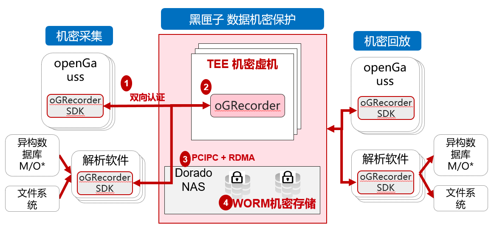

# 黑匣子

GR（oGRecorder）是一款数据库日志保护软件。其典型部署场景是运行于virtCCA中，南向对接Dorado Worm存储，北向通过oGRecorderSDK对接数据库，实现对数据库WAL日志的实时同步，形成对用户数据库系统的日志安全保护的软硬一体组合方案。
其中virtCCA基于硬件硬隔离和机密计算能力，为oGRecorder的运行提供隔离于宿主机、REE的安全TEE计算环境；Dorado Worm存储提供Write Once Read Many技术，对数据存储只能新增、禁止删改，实现数据库日志的防篡改保护，防止出现数据库文件、备份数据发生勒索攻击时数据无法恢复；oGRecorder实现类vfs系统支持数据的高效写入和读取，支持和SDK之间安全认证、数据安全写入；而oGRecorderSDK提供完备的文件操作API，供第三方软件调用，进而实现对数据库日志的实时同步、灾备回放

-   **[黑匣子API介绍](黑匣子API介绍.md)**  
-   **[黑匣子配置参数介绍](黑匣子配置参数介绍.md)**  
-   **[黑匣子错误日志信息参考](黑匣子错误日志信息参考.md)**  
-   **[黑匣子双向认证介绍](黑匣子双向认证介绍.md)**  
