# 《OpenGauss一体化平台》		

版本修订记录

|**序号**|**修改后版本号**|**生效日期**|**变更记录**|**更改人**|**审核**|**备注**|
| :-: | :-: | :-: | :-: | :-: | :-: | :-: |
|1|V1.0|2022-12-01||arkin|||
|2|V1.1|2023-02-20|增加新的截图，梳理了功能描述|yangsen|||
||||||||
||||||||
||||||||

## 1. 引言
 ### 1.1  编写目的
本文档主要描述软件操作使用方法。本文档适用于管理员、各角色数据使用人员。

 ### 1.2  适用范围
使用该软件的所有技术人员与客户人员。
## 2.  客户端环境要求
 ### 2.1  硬件设备要求

|**用途**|**性能要求**|
| :-: | :-: |
|客户端|CPU：4核8G 2.0GHz 内存：128GB|
 ### 2.2  支撑软件
支持软件,包括要用到的操作系统、浏览器等。

|**用途**|**支撑软件**|**操作系统**|
| :-: | :-: | :-: |
|客户端|Chrome|Windows 10 |
## 3 安装部署

 ### 3.1  一键安装
左侧菜单栏点击【安装部署】-【一键安装】进入该页面。
 #### 3.1.1  安装-选择主机

用户切换主机IP时，主机的架构信息将显示在右侧。

用户可以选择不同版本的极简版进行安装，版本号来自于安装包管理内与用户所选系统和CPU架构匹配的极简版版本号。

选择主机IP，输入有效的root密码，点击【一键安装】进入安装页面。

主机IP：默认显示所有物理机。

root密码：安全校验，需填写物理机对应密码。

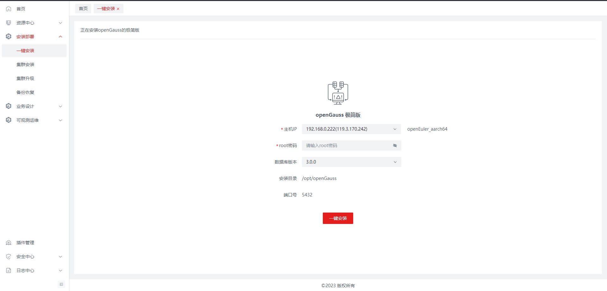

当用户已经在该机器上安装了极简版时（判断方式为默认安装目录/opt/openGauss下是否有文件，如果有，认为已经安装了极简版），提示用户前往集群安装画面进行更为个性化的安装。

 #### 3.1.2  安装中

选择主机IP，输入有效的root密码，点击【一键安装】进入安装中页面。显示安装实时进程信息。

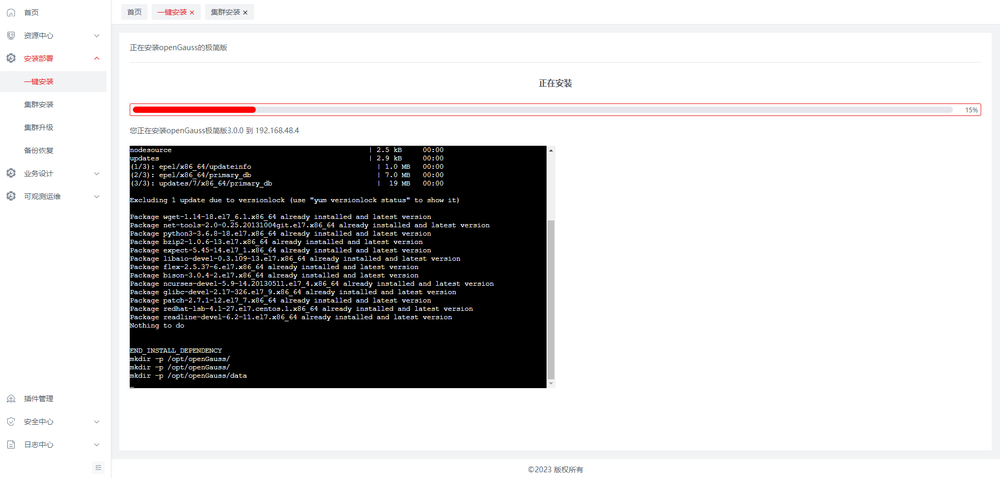

一键安装的过程中不能关闭tab，点击关闭时，将会提示用户不能关闭tab。

 #### 3.1.3  安装失败

安装失败后，左侧控制台显示安装失败信息。右侧显示自定义控制台、重试按钮。用户可以在右侧自定义控制台中执行命令修正机器上的安装问题。

重试：点击后重新开始安装过程。

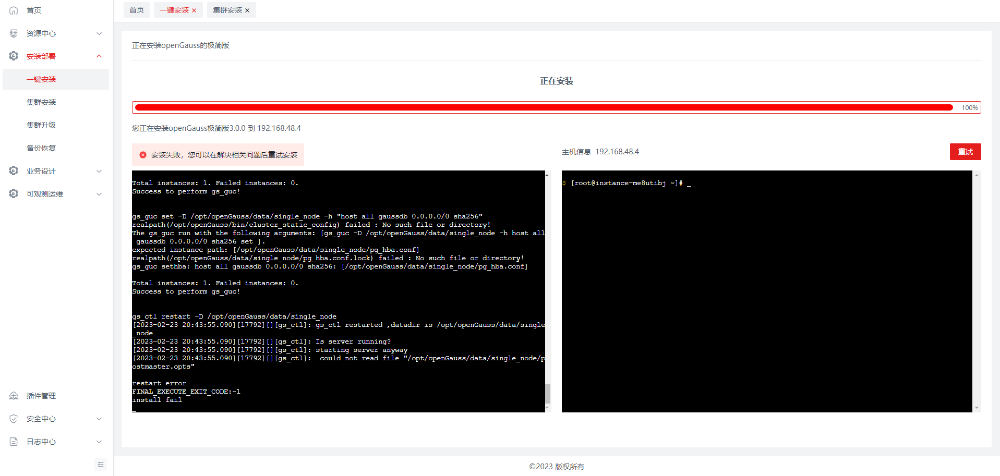

 #### 3.1.4  安装成功
安装成功时，提示安装成功，点击【集群运维】可以跳转到集群运维页面进行运维操作。

 ### 3.2  集群安装
左侧菜单栏点击【安装部署】-【集群安装】进入该页面。

对于openGauss的三个版本，安装的前三个步骤是一致的，下面介绍这些通用步骤。

 #### 3.2.1  通用步骤

##### 3.2.1.1 选择版本

用户首先选择一个openGauss的版本进行安装，目前提供极简版、轻量版、企业版的安装选项。

 ##### 3.2.1.2  选择安装模式
安装模式分为安装、导入两种模式，默认的选择为“安装”选项，即通过后续步骤在物理机上安装openGauss。

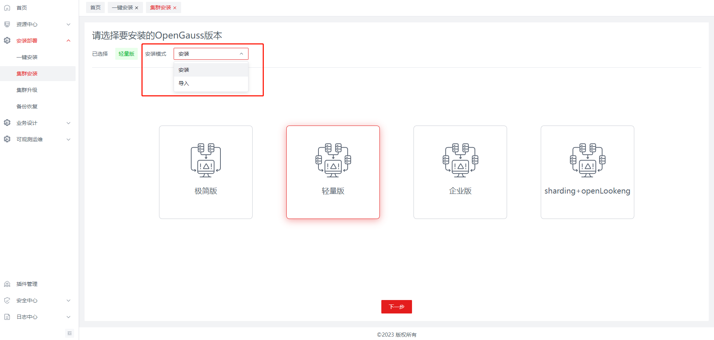

##### 3.2.1.3  选择安装网络类型

安装网络类型分为离线安装和在线安装两类，离线安装需要用户自行指定安装包路径，在线安装会按照安装包管理页面上的在线地址设置进行下载。

1. 离线安装：选择后，跳转安装包选择页面。

   用户在输入安装包目录后将根据上一步选择的对应版本进行过滤，过滤出来的安装包将以列表形式展示在这个画面上。支持输入Linux目录，这个目录指的是当前部署Datakit应用所在机器上的目录。

   安装包名称中含有-all.tar.gz的将被过滤为企业版，含有-Lite-的被过滤为轻量版，两者都不满足的，并且以.tar.bz2结尾的，过滤为极简版。

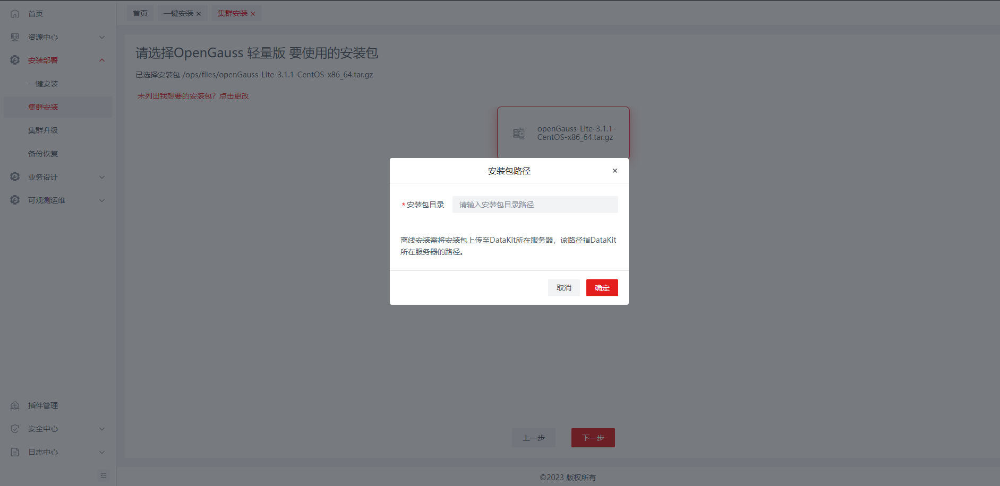

2. 在线安装：选择后，跳转安装包下载页面，支持用户下载不同版本的安装包，下载后成功点击【下一步】进入安装步骤页面。

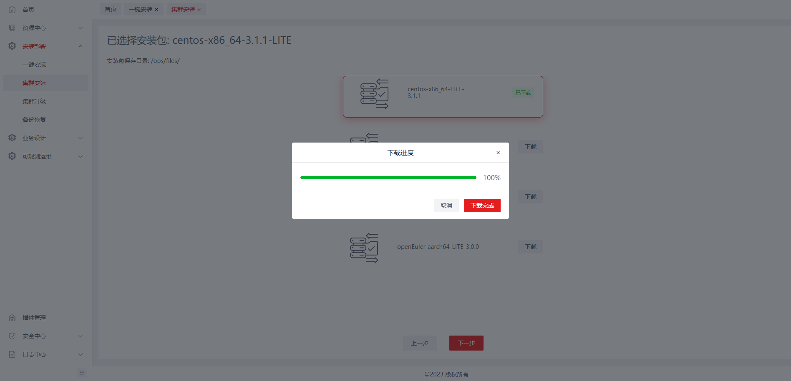

当用户下载了多个不同版本的安装包时，可以选择任意一个进行安装。

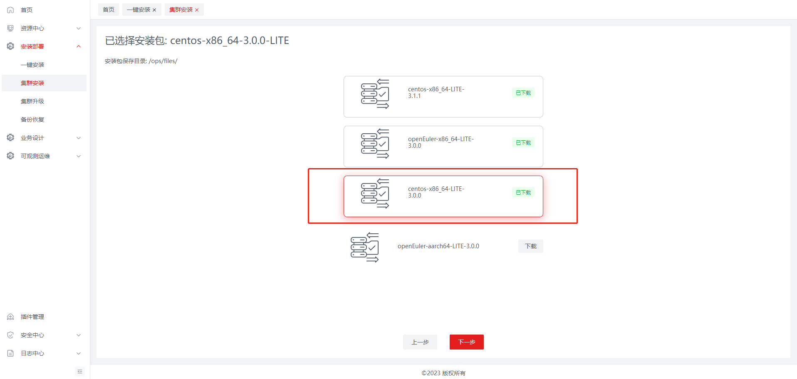

对于不同的版本，安装步骤有所不同，下面分别进行介绍。

 #### 3.2.2  极简版安装

安装版本选择页面，选择【极简版】后，选择安装网络类型后跳转到极简版安装引导界面

##### 3.2.2.1 安装步骤-部署方式

部署方式页面，选择集群部署方式为极简版单节点或一主一备，点击【下一步】跳转到对应安装配置页面

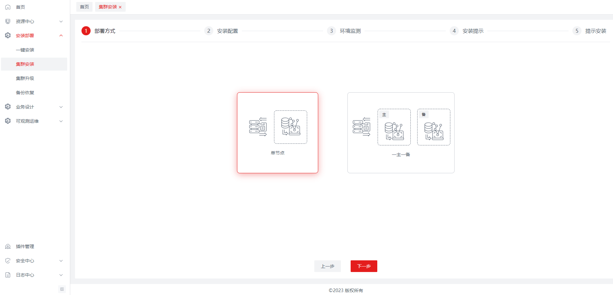

##### 3.2.2.2 安装步骤-安装配置

安装配置页面，填写有效的配置信息，点击【下一步】校验通过后，将进入到环境检测页面。

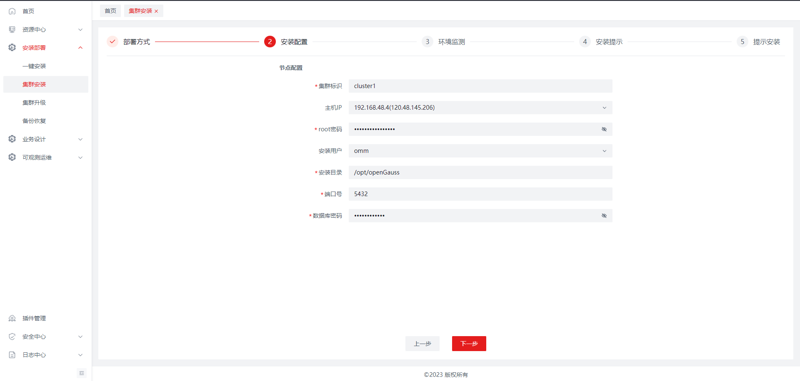

点击【下一步】校验不通过时，会对相应项目进行提示，目前的检测项目为端口与安装目录。

##### 3.2.2.3 安装步骤-环境检测

在这个页面上，会自动检测当前安装主机硬件环境、软件环境，检测完成后弹出对应提示信息。

##### 3.2.2.4 安装步骤-安装提示

安装提示页面，显示用户在前面步骤选择的安装主机IP、安装目录等提示信息，方便用户做最后的确认。点击【下一步】进入安装执行页面。

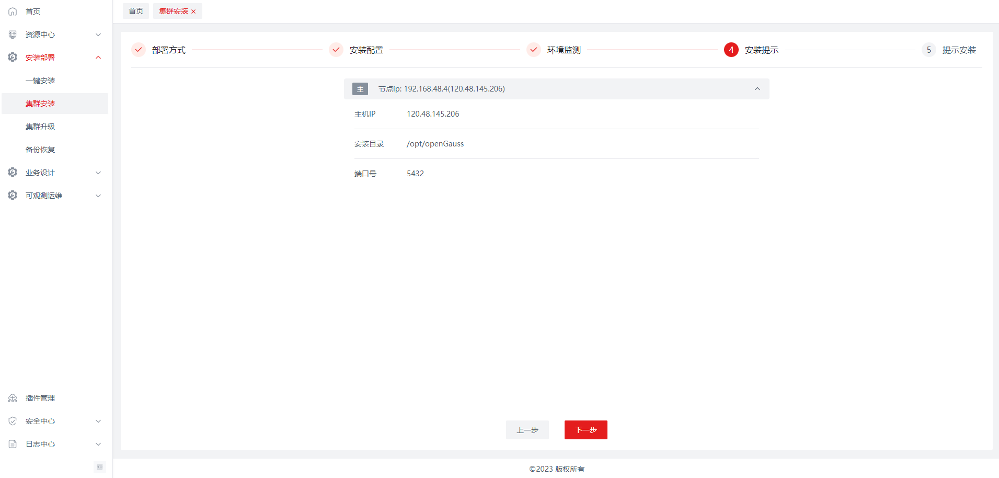

##### 3.2.2.5 安装步骤-执行安装

安装执行页面，显示安装进度及安装日志。

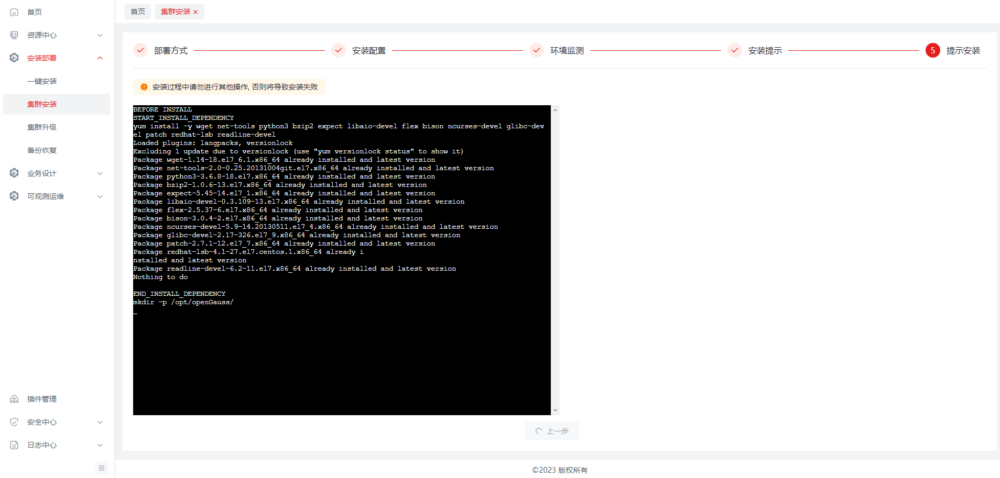

安装成功后，点击下方【集群运维】按钮即可跳转到集群运维页面，进行集群运维管理。

 #### 3.2.3  轻量版安装
安装版本选择页面，选择【轻量版】后，选择安装网络类型后跳转到轻量版安装引导界面

##### 3.2.3.1 安装步骤-部署方式

部署方式页面，选择集群部署方式为轻量版单节点或一主一备，点击【下一步】跳转到对应安装配置页面

##### 3.2.3.2 安装步骤-安装配置

安装配置页面，填写有效的配置信息，点击【下一步】校验通过后，将进入到环境检测页面。

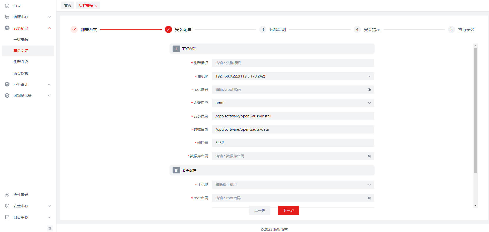

点击【下一步】校验不通过时，会对相应项目进行提示，目前的检测项目为端口与数据目录。

##### 3.2.3.3 安装步骤-环境检测

在这个页面上，会自动检测当前安装主机硬件环境、软件环境，检测完成后弹出对应提示信息。

##### 3.2.3.4 安装步骤-安装提示

安装提示页面，显示用户在前面步骤选择的安装主机IP、安装目录等提示信息，方便用户做最后的确认。点击【下一步】进入安装执行页面。

##### 3.2.3.5 安装步骤-执行安装

安装执行页面，显示安装进度及安装日志。

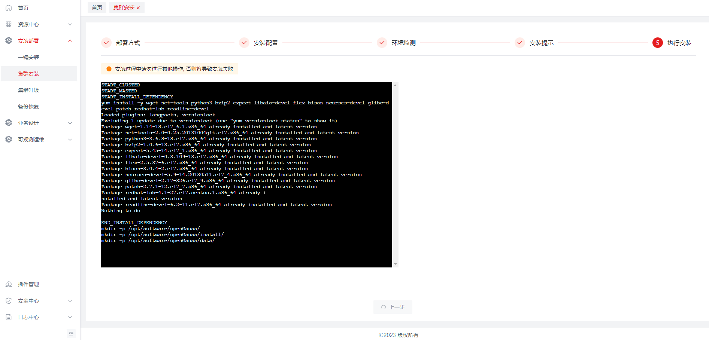

安装成功后，点击下方【集群运维】按钮即可跳转【集群运维】页面，进行集群管理。

若安装失败时，可在右侧自定义控制台输入命令。如果在轻量版一主一备模式下，可以分别在两个不同的机器上执行命令。处理完成后，点击【重试】按钮再次进行安装。

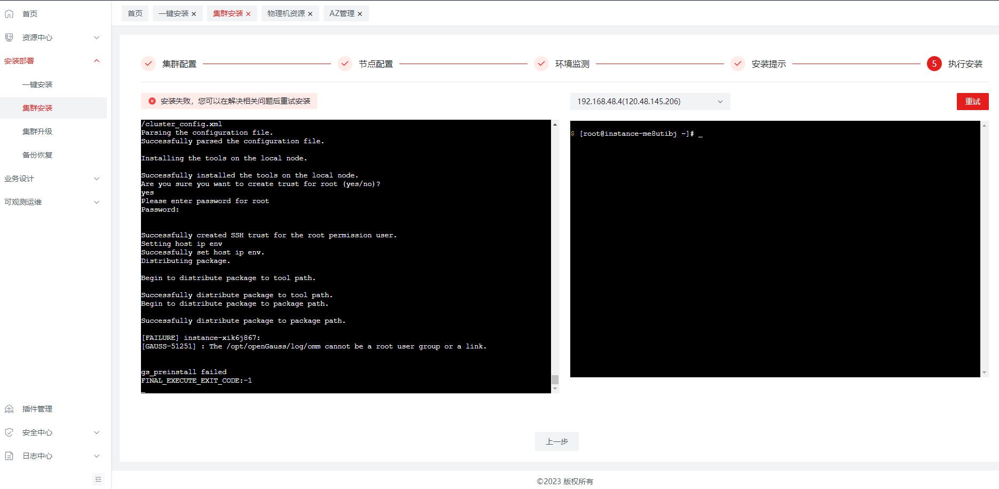

 #### 3.2.4 企业版安装

安装版本选择页面，选择【企业版】后，选择安装网络类型后跳转到企业版安装引导界面。

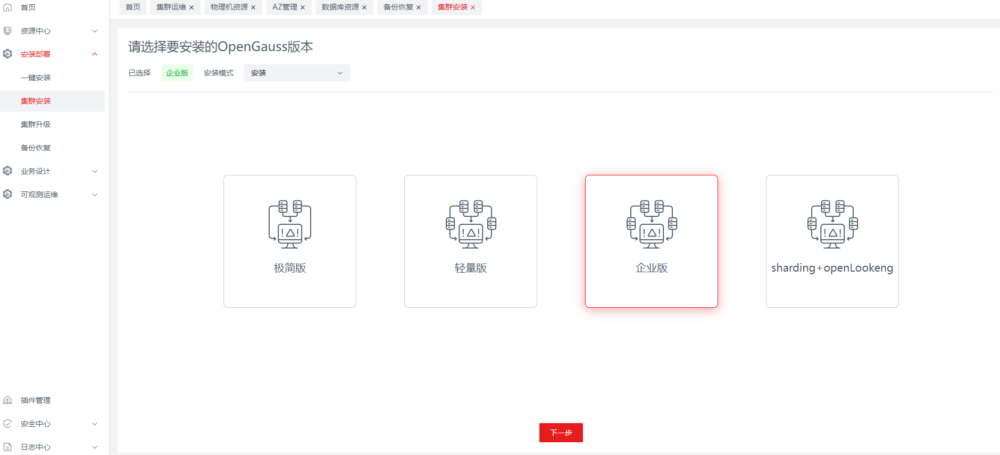

##### 3.2.4.1 安装步骤-集群配置

用户在这个页面进行集群版安装前的配置准备，一般来说用户不需要更改安装目录。用户需要输入集群标识、数据库密码。

用户需要选择是否安装CM，根据是否选择安装CM，分为以下两种情况。

1. 在安装CM的情况下必须至少安装一主二备。可以启用DCF自选主功能。

2. 在不安装CM的情况下，用户可以安装最少一个主节点，并且不能开启DCF自选主功能。

##### 3.2.4.2 安装步骤-节点配置

在节点配置页面上，用户需要填写每个节点对应的配置信息，选择要安装节点的机器，并且选择一个AZ用于企业版安装。

如果在一主多备并且DCF开启的模式下，用户输入更高的AZ优先级数字可以使得该节点更容易被选择为主节点。

确认无误后，点击【下一步】完成节点配置。

以下为一种单节点企业版节点配置的典型情况。

开启安装CM的情况下，需要配置额外的CM信息，例如CM的数据路径和CM的端口号。一般情况下用户无需改变里面的默认配置。

以下为一种一主两备企业版节点配置的典型情况。

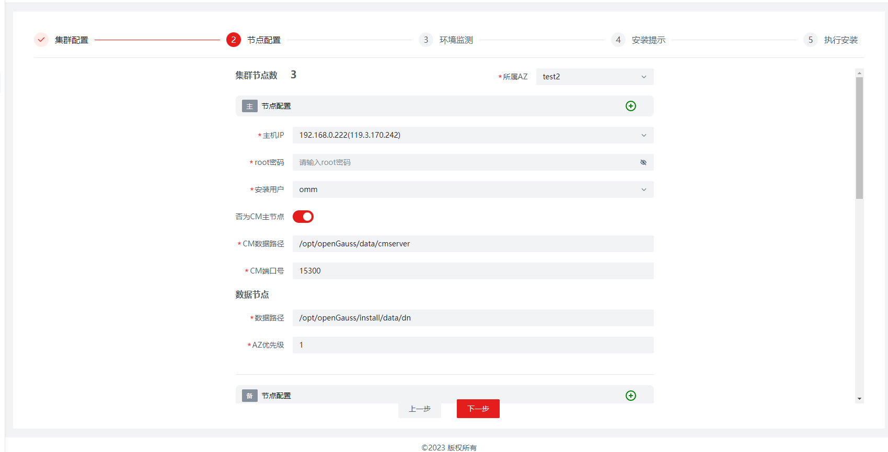

点击【下一步】后，将会对企业版安装相关端口和数据目录的占用情况进行校验，相应检查问题会表示在对应项目的下方。当检查未发生端口、路径占用后，将进入到环境检测步骤。

##### 3.2.4.3  安装步骤-环境检测

在这个页面上将自动检测当前企业版所有节点的安装主机硬件环境、软件环境是否满足安装要求，检测完成后弹出对应提示信息。

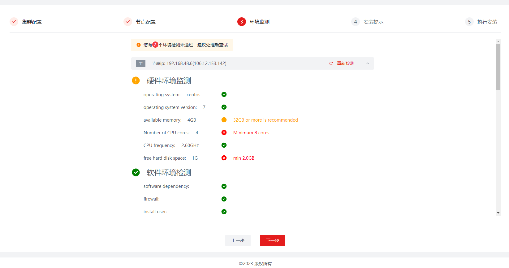

##### 3.2.4.4  安装步骤-安装提示

这个页面显示用户在前面步骤选择的每个节点的安装主机IP、安装目录等提示信息，方便用户做最后的确认。点击【下一步】进入安装执行页面。

##### 3.2.4.5  安装步骤-执行安装

安装执行页面，显示安装进度及安装日志。

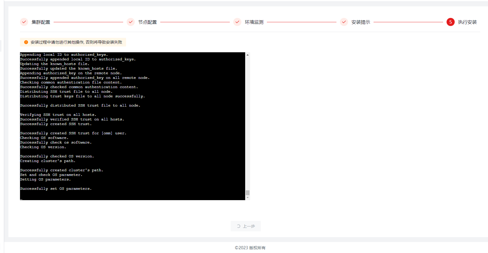

安装成功后，点击下方【集群运维】按钮即可跳转【集群运维】页面，进行集群运维管理。

若安装失败时，可在右侧自定义控制台输入命令或点击【重试】按钮

### 3.3 集群导入

#### 3.3.1 极简版导入

##### 3.3.1.1 导入步骤-选择版本

选择安装模式为【导入】，并且选择极简版，点击【下一步】

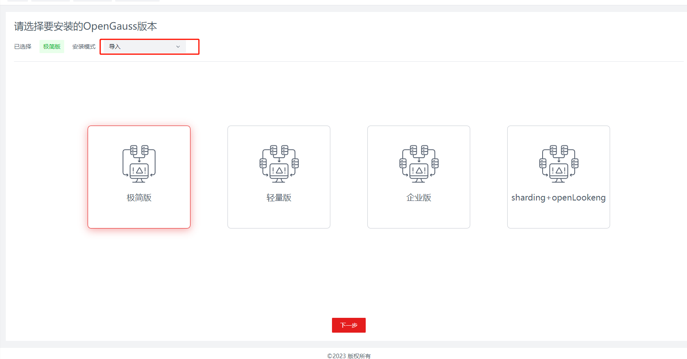

##### 3.3.1.2 导入步骤-部署方式

选择要导入的极简版的部署方式，可以为单节点或一主一备。选择完成后，点击【下一步】进入节点配置步骤。

##### 3.3.1.2 导入步骤-节点配置

本步骤需要输入极简版集群节点配置信息，输入集群标识及要导入集群的安装目录与端口、数据库用户名与密码。如果此处输入的数据库用户名密码不正确，将导致后续无法正确连接数据库而导致导入失败。点击【下一步】将进行实例校验，防止用户输入错误路径或者端口导致导入失败。

校验失败时，对应项目的下方会弹出提示。目前检测的项目有安装目录和端口。

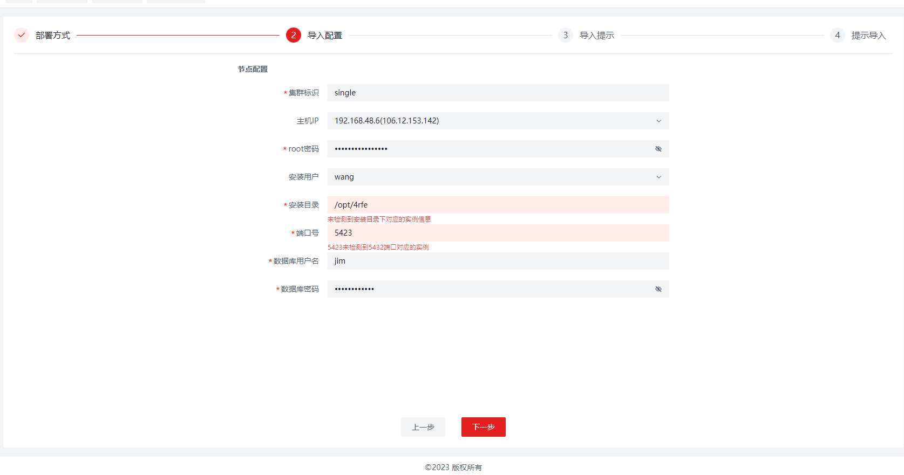

##### 3.3.1.3 导入步骤-导入提示

这个页面显示用户在前面步骤输入的每个节点的安装主机IP、安装目录等提示信息，方便用户做最后的确认。点击【下一步】进入导入执行页面。

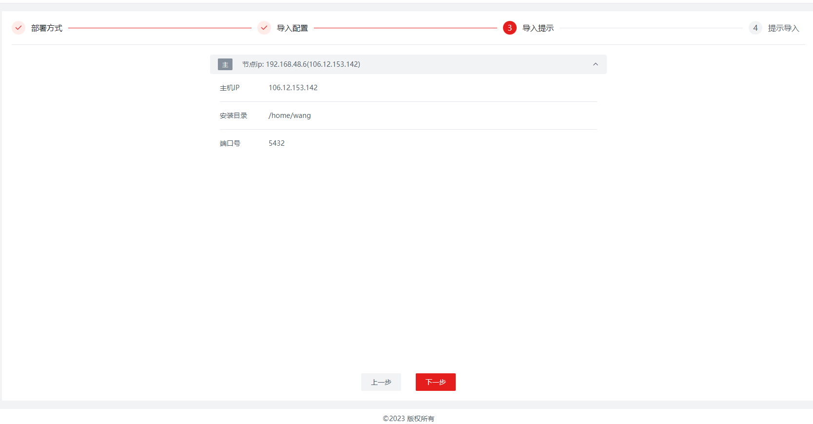

##### 3.3.1.4 导入步骤-执行导入

执行导入时，将首先尝试连接目标集群，如果连接失败，将会提示连接错误，用户可以返回【集群配置】步骤进行修改。

导入成功时，将提示导入成功页面，用户可以在这里返回首页或者进入【集群运维】页面。至此，极简版集群就已经被导入了。

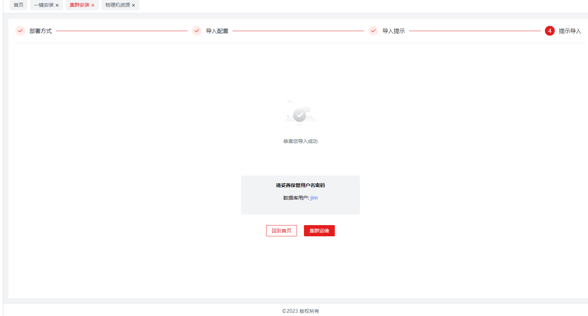

#### 3.3.2 轻量版导入

##### 3.3.2.1 导入步骤-选择版本

选择安装模式为【导入】，并且选择轻量版，点击【下一步】

##### 3.3.2.2 导入步骤-部署方式

选择要导入的轻量版的部署方式，可以为单节点或一主一备。选择完成后，点击【下一步】进入节点配置步骤。

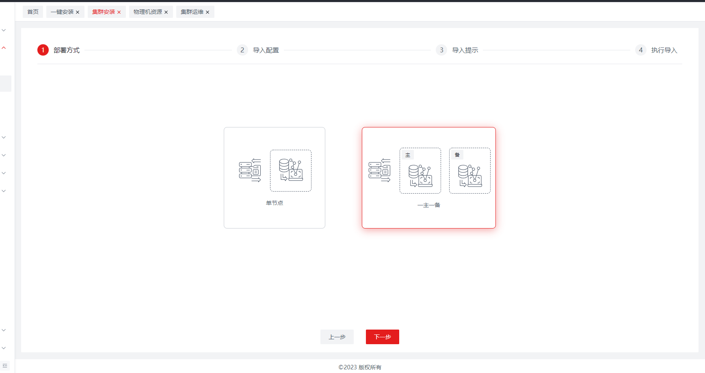

##### 3.3.2.3 导入步骤-节点配置

本步骤需要输入轻量版集群节点配置信息，输入集群标识及要导入集群的安装目录与端口、数据库用户名与密码。如果此处输入的数据库用户名密码不正确，将导致后续无法正确连接数据库而导致导入失败。点击【下一步】将进行实例校验，防止用户输入错误路径或者端口导致导入失败。

校验失败时，对应项目的下方会弹出提示。目前检测的项目有数据目录和端口。

##### 3.3.2.4 导入步骤-导入提示

这个页面显示用户在前面步骤输入的每个节点的安装主机IP、安装目录等提示信息，方便用户做最后的确认。点击【下一步】进入导入执行页面。

##### 3.3.2.5 导入步骤-执行导入

执行导入时，将首先尝试连接目标集群，如果连接失败，将会提示连接错误，用户可以返回【集群配置】步骤进行修改。

导入成功时，将提示导入成功页面，用户可以在这里返回首页或者进入【集群管理】页面。至此，轻量版集群就已经被导入了。

#### 3.3.3 企业版导入

导入集群之前，需要对现有数据库进行设置以便于平台能够获取到数据库的监控数据信息。

1. 创建平台所需的连接用户

   CREATE USER username WITH MONADMIN PASSWORD "password";

2. 对所有节点配置白名单并重启数据库

   gs_guc set -N all -I all -h "host all all 平台ip地址/32 sha256"

##### 3.3.3.1 导入步骤-选择版本

选择安装模式为【导入】，并且选择企业版，点击【下一步】

##### 3.3.3.2 导入步骤-集群配置

输入集群标识及要导入集群的各种路径与端口、数据库用户名与密码，及该集群是否安装了CM。如果此处输入的数据库用户名密码不正确，将导致后续无法正确连接数据库而导致导入失败。点击【下一步】进入节点配置。

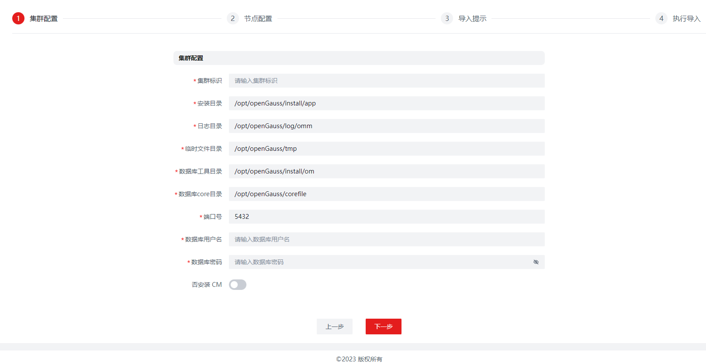

##### 3.3.3.3 导入步骤-节点配置

本步骤需要输入完整的企业版集群节点配置信息，假设企业版有一主二备，这里也增加同样数量的节点并输入每个节点的配置。

节点配置时不需要输入AZ名称及每个节点的AZ优先级，相关信息将自动从企业版集群中获取，并创建到Datakit平台上。

点击【下一步】进行实例校验，防止用户输入错误路径或者端口导致导入失败。

校验失败时，对应项目的下方会弹出提示。目前检测的项目有数据路径和端口。

##### 3.3.3.4 导入步骤-导入提示

这个页面显示用户在前面步骤输入的每个节点的安装主机IP、安装目录等提示信息，方便用户做最后的确认。点击【下一步】进入导入执行页面。

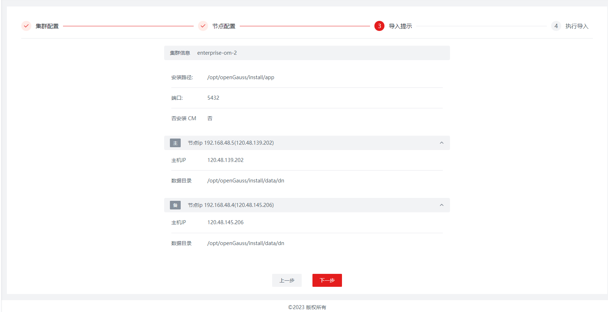

##### 3.3.3.5 导入步骤-执行导入

执行导入时，将首先尝试连接目标集群，如果连接失败，将会提示连接错误，用户可以返回【集群配置】步骤进行修改。

导入成功时，将提示导入成功页面，用户可以在这里返回首页或者进入【集群管理】页面。至此，企业版集群就已经被导入了。

### 3.4 备份恢复

##### 3.4.1 备份操作

用户在集群运维页面上进行备份操作，点击某个集群上的备份按钮进行数据库备份。弹出确认备份对话框，输入必要的备注以后点击备份按钮进行备份。

备份采用的是`gs_dumpall`逻辑备份，详细信息请查看openGauss官方文档：[备份与恢复](https://docs.opengauss.org/zh/docs/3.1.1/docs/Administratorguide/%E5%A4%87%E4%BB%BD%E4%B8%8E%E6%81%A2%E5%A4%8D.html)

备份开始后，相关执行过程中的日志将会弹出显示。

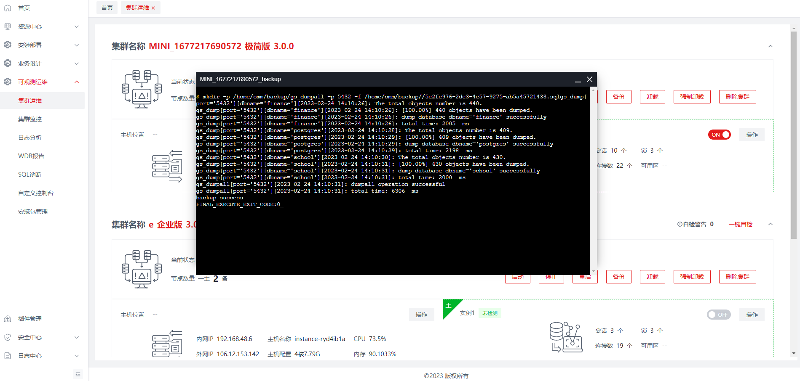

##### 3.4.2 恢复操作

点击左侧菜单的【安装部署】-【备份恢复】菜单，进入备份恢复页面，这里可以看到每个集群所产生的备份文件列表。

通过右上角的集群标识，用户可以过滤自己想要查看的集群备份列表。

点击右侧的【恢复】，即可将备份文件中的数据恢复到对应的集群中。

点击【删除】按钮，将会把选中的这一条备份信息连同备份文件一起删除。

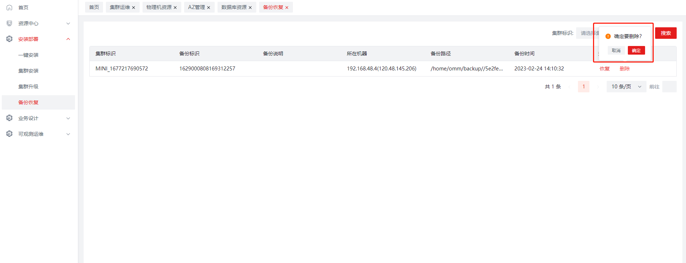

## 4 可观测运维

 ### 4.1  集群运维

左侧菜单栏点击【可观察运维】-【集群运维】进入该页面。

在这个页面上，用户可以查看所有集群信息，集群对应的机器信息，也可以对集群、实例进行运维操作。

 #### 4.1.1  集群操作

集群运维的下图部分为集群操作，上面的任意操作都是针对整个集群的运维操作。

启动：点击后可启动该集群。

停止：点击后可停止该集群。

重启：点击后可重新启动该集群。

备份：点击后自动生成备份。

卸载：点击后可卸载该集群。

强制卸载：点击后可强制卸载该集群。会调用openGauss卸载命令，同时也会删除当前这条记录。

删除集群：只会删除当前这条记录，但是不会调用卸载命令。

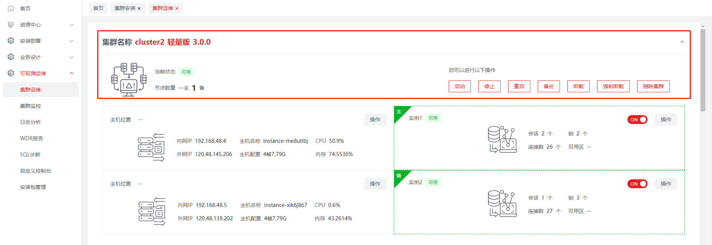

点击任意操作按钮后弹出执行窗口执行，窗口可以进行缩放、拖动。

 #### 4.1.2  实例操作

对于极简版和轻量版，实例操作有启动、停止、重启。

##### 4.1.2.1 主机上的实例操作

对于单个实例来说，选择主机点击操作，可进行【启动所有实例、停止所有实例】

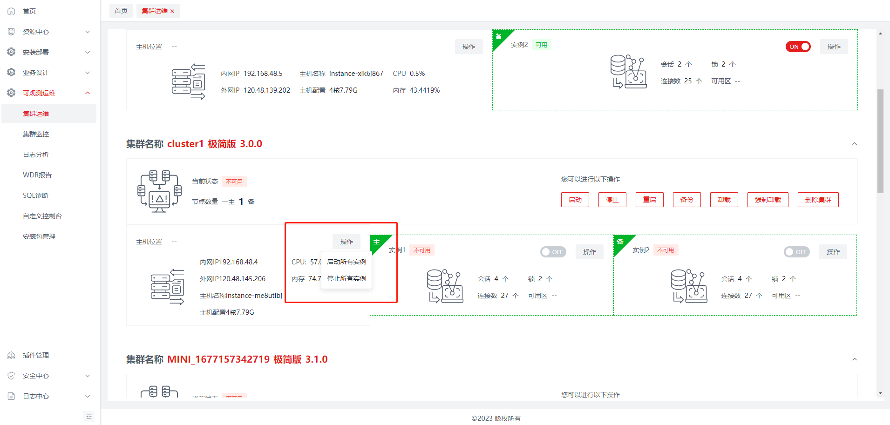

##### 4.1.2.2 单独实例上的操作

对于单个实例来说，可以点击开关，开启关闭实例，也可以从右侧的操作下拉面板中选择对应的启停操作。

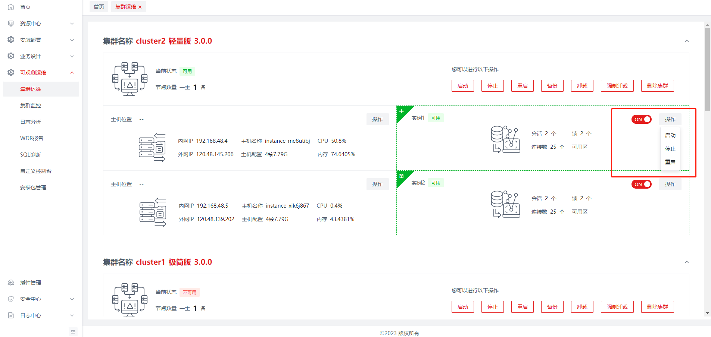

##### 4.1.2.3 企业版额外操作

对于企业版的节点，有额外的三个高级操作可以选择，分别是主备切换、生成配置、节点重建。其中主备切换和节点重建位于备节点上，生成配置在主备节点上都存在。

- 主备切换：用来手动将备机切换为主机，该功能使用的命令为`gs_ctl switchover`。关于这个命令的详细文档请参照[实例主备切换 ](https://docs.opengauss.org/zh/docs/3.0.0/docs/Administratorguide/%E5%AE%9E%E4%BE%8B%E4%B8%BB%E5%A4%87%E5%88%87%E6%8D%A2.html)。**注意：一旦将备机转换为主机，可能导致集群中出现两个主节点的错误状态，此时可以参照此文档中的异常处理章节进行调整。**

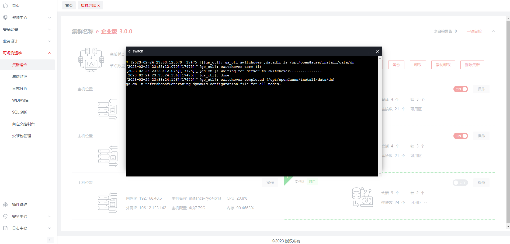

- 生成配置：如果静态配置文件无意损坏后，会影响openGauss感知openGauss拓扑结构和主备关系。使用本功能，可以替换已经损坏的配置文件，保证openGauss的正常运行。使用的命令为`gs_om -t generateconf`，这个操作在主节点和备节点上均可以执行。关于这个命令的详细文档请参照[生成配置文件](https://docs.opengauss.org/zh/docs/3.0.0/docs/Administratorguide/%E7%94%9F%E6%88%90%E9%85%8D%E7%BD%AE%E6%96%87%E4%BB%B6.html)

- 节点重建： 用来重建备机实例，使用的命令为`gs_ctl build`。关于这个命令的详细文档请参照[gs_ctl build](https://docs.opengauss.org/zh/docs/3.0.0/docs/Toolreference/gs_ctl.html#zh-cn_topic_0287275989_zh-cn_topic_0237152408_zh-cn_topic_0059777628_t22fb7e7152bf4c939f6316c48cb80b5b)

 ### 4.2  集群监控

左侧菜单栏点击【可观测运维】-【集群监控】进入该页面。

页面上可以进行集群名称、主机IP的筛选，其中集群名称、主机IP在进入画面时均默认第一项。

- #### CPU使用率

横轴：当前主机CPU使用率占比（%）
纵轴：当前时间格式，MM:SS

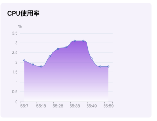
- #### 内存占用率

横轴：当前主机内存占用率（%）

纵轴：当前时间格式，MM:SS

- #### 网络状态

横轴：当前主机网络状态（G）

纵轴：当前时间格式，MM:SS

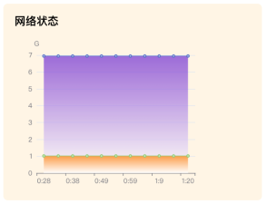
- #### 锁

横轴：当前主机锁（pcs）

纵轴：当前时间格式，MM:SS

- #### 会话

横轴：当前主机会话（pcs）

纵轴：当前时间格式，MM:SS

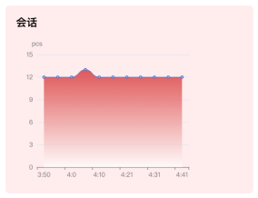
- #### 连接数

横轴：当前主机连接数（pcs）

纵轴：当前时间格式，MM:SS

- #### 占用内存最多的会话TOP10

横轴为会话sessionID，纵轴为占用内存，单位为字节

按照占用内存大小倒序排列

 ### 4.3  日志分析
左侧菜单栏点击【可观测运维】-【日志分析】进入该页面。

在这个页面上用户可以查看与openGauss相关的各类日志并下载，包含系统日志、操作日志、审计日志、性能日志、黑匣子日志。

页面上可以进行集群名称、主机IP的筛选，其中集群名称、ip地址在进入画面时均默认为第一项。

 #### 4.3.1  系统日志
系统日志tab页面，默认显示当前集群对应主机的系统日志。

用户可以使用【..】回到上一层文件系统中，每一行文件后面的数字为文件的字节大小，用户可以点击下载按钮进行日志下载。

切换集群及IP地址后，页面刷新显示对应IP地址的系统日志信息。

 #### 4.3.2  操作日志
操作日志tab页面，默认显示当前集群对应主机的操作日志，没有对应日志时显示为空白。

切换集群及IP地址后，页面刷新显示对应IP地址的操作日志信息。可点击下载按钮查看日志信息。

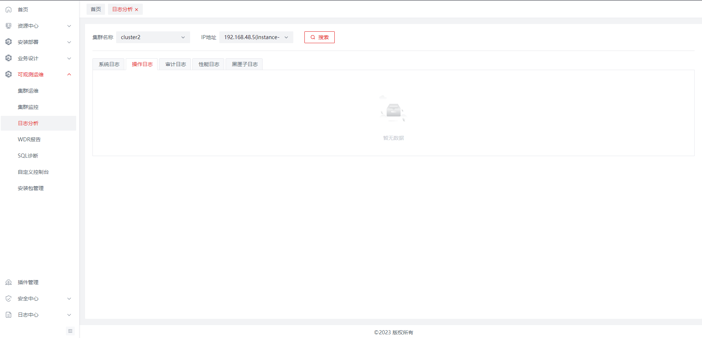
 #### 4.3.3  审计日志
审计日志tab页面，默认显示当前集群对应主机的审计日志，没有对应日志时显示为空白。

支持日期时间筛选，切换集群及IP地址后，页面刷新显示对应IP地址的审计日志信息。可点击查看操作日志信息。

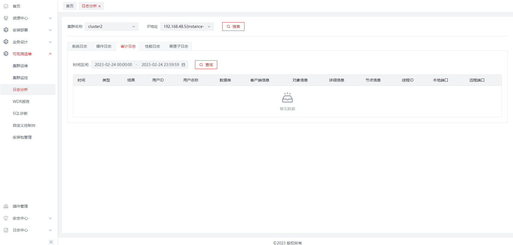

 #### 4.3.4  性能日志
性能日志tab页面，默认显示当前集群对应主机的性能日志，没有对应日志时显示为空白。

切换集群及IP地址后，页面刷新显示对应IP地址的性能日志信息。可点击查看、下载日志信息。

 #### 4.3.5  黑匣子日志
黑匣子日志tab页面，默认显示当前集群对应主机的黑匣子日志，没有对应日志时显示为空白。

切换集群及IP地址后，页面刷新显示对应IP地址的黑匣子日志信息。可点击查看、下载日志信息。

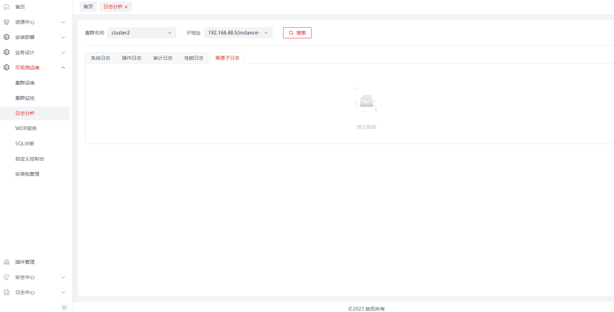

 ### 4.4  WDR报告
左侧菜单栏点击【可观测运维】-【WDR报告】进入该页面，列表显示集群对应的所有WDR报告信息。

用户可以通过集群名称、报告范围、报告类型、生产时间条件进行筛选。默认选择集群列表中的第一个。

 #### 4.4.1  查看报告
在某条报告的后面点击【查看】按钮，浏览器将自动打开一个新的tab页面，显示该报告的内容，用户可以进行在线查看。

 #### 4.4.2  下载
在某条报告的后面点击【下载】按钮，将下载该报告的HTML文件。

 #### 4.4.3  删除
列表选择报告数据，操作项点击【删除】

删除确认框内点击【确定】，即可删除该报告。

 #### 4.4.4  快照管理

WDR报告页面左上角，点击【快照管理】，弹出“快照管理”窗口。

在这个页面上，可以创建快照、筛选快照。

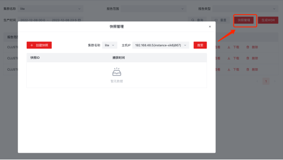

1. 筛选区域：集群名称、主机IP

集群名称、主机IP：均默认选择第一项，即列表默认显示该集群主机IP下对应快照信息。

2. 创建快照：

点击【创建快照】按钮，自动为当前集群生成快照信息。

#### 4.4.5 生成WDR报告

点击右上角的【生成WDR按钮】，弹出生成对话框，选择任意两个快照后点击【生成】按钮即可生成新的WDR报告。关于不同报告类型的详细区别，请查看openGauss官方文档：[例行维护-导出并查看wdr诊断报告](https://docs.opengauss.org/zh/docs/3.1.1/docs/Administratorguide/%E4%BE%8B%E8%A1%8C%E7%BB%B4%E6%8A%A4.html#%E5%AF%BC%E5%87%BA%E5%B9%B6%E6%9F%A5%E7%9C%8Bwdr%E8%AF%8A%E6%96%AD%E6%8A%A5%E5%91%8A)。

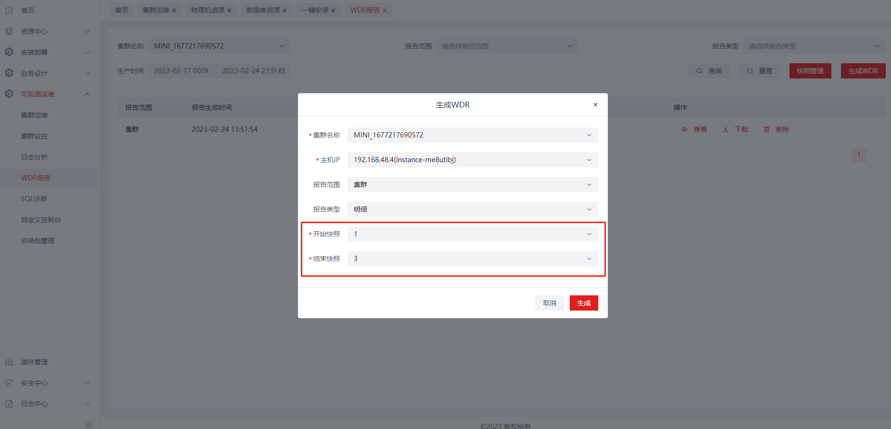

 ### 4.5  SQL诊断

左侧菜单栏点击【可观测运维】-【SQL诊断】进入该页面，显示当前主机SQL诊断信息。

用户可以根据集群名称、主机IP、报告创建时间进行筛选。集群名称及主机IP默认选择第一项，时间控件默认选择当天。

 ### 4.6  自定义控制台
左侧菜单栏点击【可观测运维】-【自定义控制台】进入该页面。

用户可以切换主机IP进行不同机器上的操作。主机IP默认选择第一项，需要输入root密码进行安全校验。

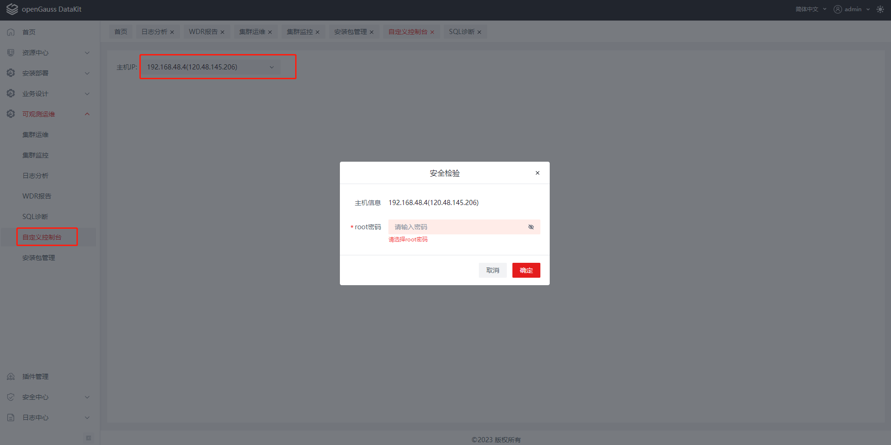

root密码校验成功后，自动连接该主机；连接成功后，控制台可直接输入命令执行。

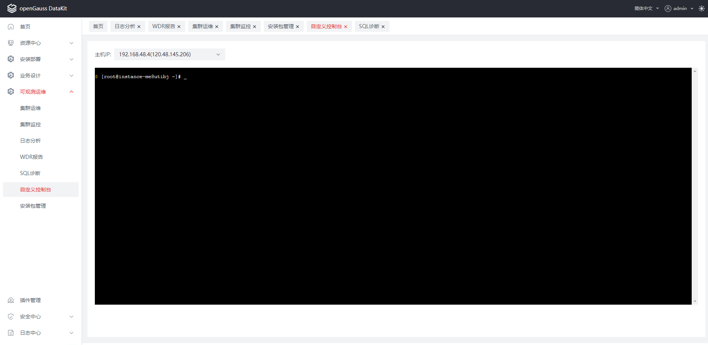

 ### 4.7  安装包管理

左侧菜单栏点击【可观测运维】-【安装包管理】进入该页面。

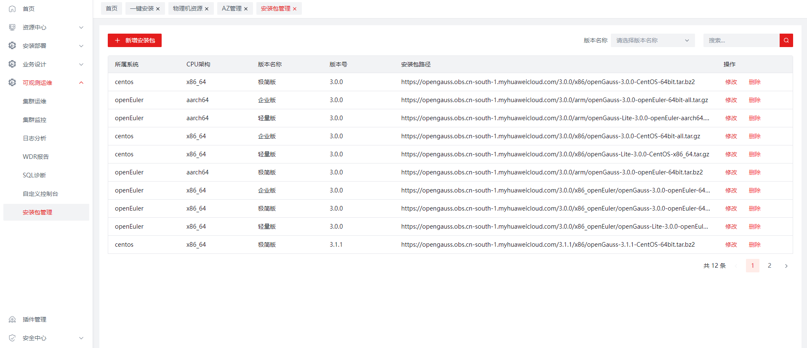

 #### 4.7.1  新增安装包

点击【新增安装包】按钮，弹出新增安装包窗口，用户选择所属系统、CPU架构、版本名称，输入版本号后将自动计算华为官方的在线下载地址。点击确定进行新增。

用户也可以在在线地址处输入自定义的安装包下载地址。

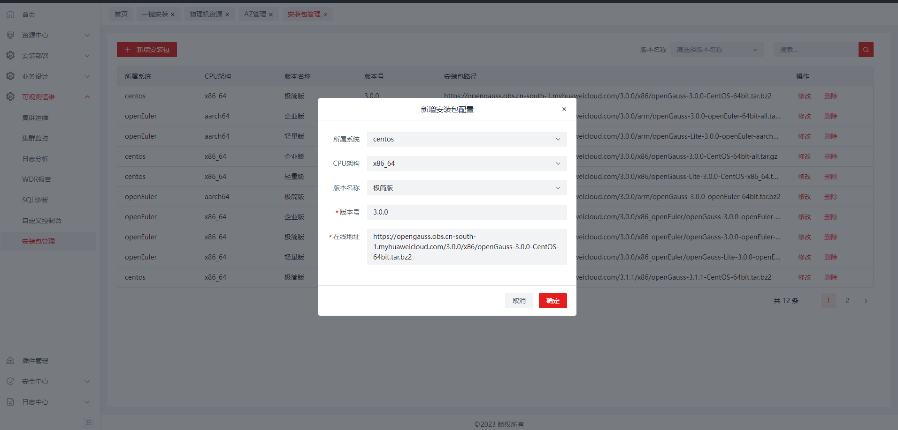

 #### 4.7.2  编辑

列表选择安装包，点击操作项【修改】，弹出“修改”窗口，即可编辑该安装包信息。

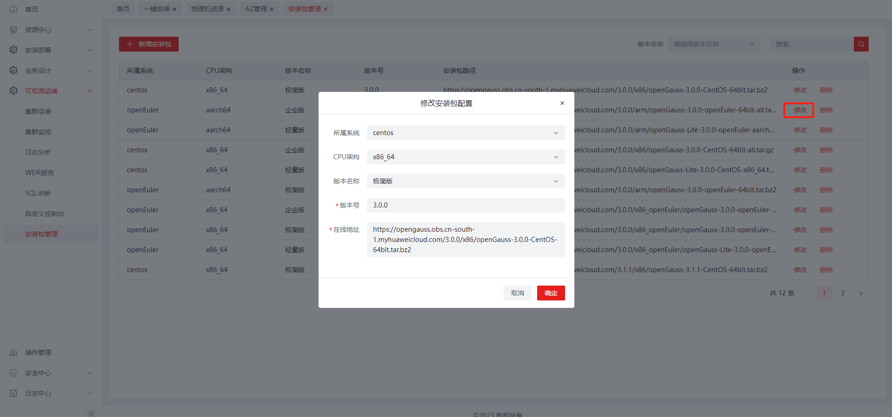

 #### 4.7.3  删除

列表选择安装包，点击操作项【删除】，删除确认框内点击【确定】，即可删除该安装包。

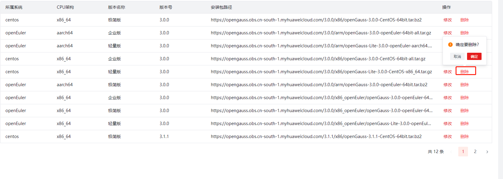
