# 1实例监控插件(observability instance) 用户手册


## 1实例监控插件(observability instance)用户手册

​		实例监控插件主要目的是为 openGauss 用户提供实例监控能力。它作为一体化平台的可插拔插件开发，本特性依赖于openGauss一体化平台的插件特性。

​		实例监控支持监控 openGauss 数据库以及数据库所在服务器，本特性主要关注数据库和操作系统监控指标，以及 TOPSQL 捕获和分析。

​		与其他需求及特性的交互分析：支持关联 SQL 诊断功能，进入 TOPSQL 详情页面，用户可触发创建诊断任务，对 TOPSQL 进行诊断分析。

## 2 前言


### 2.1 概述

​	本章介绍手册相关信息。


### 2.2 读者对象

​	本手册主要适用于以下人员：

- 数据库开发人员
- 数据库管理员


### 2.3 修订记录

| 日期       | 版本   | 变更说明     | 修改人   | 审核人      |
| ---------- | ------ | ------------ | -------- | ----------- |
| 2023/03/13 | v1.0.0 | 新增编译初版 | wuyuebin | zengseliang |


### 2.4 文档约定

​	本节描述了本手册的（内容、符号、GUI 和文本）约定。

**图形化界面格式约定**

​    	本手册中可能出现下列图形化界面格式约定，它们所代表的含义如下。

| 格式 | 说明                                                         |
| ---- | ------------------------------------------------------------ |
| 粗体 | 按钮、菜单、参数、页签、窗口及对话框标题均使用【】括起来。例如，单击【确定】。 |


### 2.5 第三方许可证

​	本节包含适用于该插件的第三方许可证。

​	**表2-1 第三方软件列表**

| 第三方软件     |
| -------------- |
| 木兰宽松许可证 |


### 2.6 参考文档

无


## 3实例监控插件(observability instance)简介


### 3.1 概述

​	实例监控插件主要目的是为 openGauss 用户提供实例监控能力。它作为一体化平台的可插拔插件开发，本特性依赖于openGauss一体化平台的插件特性。

​	实例监控功能主要分系统负载、TOPSQL、WDR报告、系统配置、代理端和服务端安装卸载功能等五大功能。


### 3.2 支持的功能

​	实例监控插件(observability instance)提供的功能如下：

​    **系统负载**

- Sql执行消耗时间监控
- 数据库负载监控
- 服务器资源监控

​	**TOPSQL**

- DB_TIME
- CPU_TIME
- EXEC_TIME

​	**WDR报告**

- 快照管理
- 快照生成
- WDR报告列表查询
- WDR报告生成
- WDR报告查看
- WDR报告下载
- WDR报告删除

​	**系统配置**

- 系统配置参数展示
- 数据库配置参数展示
- 参数刷新

​	**代理和服务端安装卸载**

- 代理安装和卸载（exporter）
- 服务端安装和卸载（prometheus）


### 3.3 约束和限制

**WDR报告生成**

WDR报告基于快照生成，而且必须至少要有两个不同版本的快照才能生成。当没有快照时，需先进行快照生成，再进行WDR报告生成。


**代理安装**

前置条件：服务端不存在时，先安装服务端。


**服务端安装**

只能安装一个服务端。


**项目运行**

本项目依赖一体化主平台，若需要使用本项目所有功能，只能通过编译成 jar 包的形式作为插件运行在主平台上。


### 3.4 实例监控插件(observability instance)项目结构

下载实例监控插件(observability instance)项目代码：

```
git clone https://gitee.com/opengauss/openGauss-workbench
```

实例监控插件(observability instance)项目结构如下图所示：

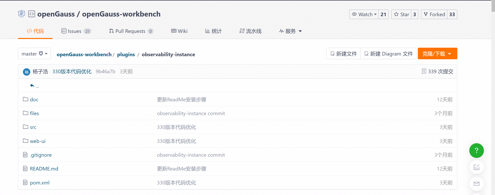

实例监控插件项目结构说明如下：

| 文件夹/文件 | 说明                   |
| ----------- | ---------------------- |
| src         | 保存后端代码及资源文件 |
| web-ui      | 保存前端代码           |
| .gitignore  | 提交git忽略的目录      |
| pom.xml     | 后端依赖项             |
| LICENSE     | 许可证                 |

### 3.5 系统要求

​	本节介绍使用实例监控插件(observability instance)的最低系统要求。

**系统要求**

| 操作系统 | 版本           |
| -------- | -------------- |
| windows  | windows7及以上 |

**软件要求**

| 软件 | 规格         |
| ---- | ------------ |
| Java | jdk 11及以上 |

**数据库版本要求**

| 数据库    | 版本 |
| --------- | ---- |
| openGauss | 所有 |


## 4 部署实例监控插件(observability instance)

​	 本章详细介绍如何部署实例监控插件(observability instance)。

​     前端技术栈：Vue3.0 + TS + Element plus

​     后端技术栈：Java + Spring boot

### 4.1 编译项目并部署至一体化平台

**前置条件：** ① 安装 node.js，建议使用 v16 以上版本；

​                   ② 安装Java jdk （建议使用v11及以上版本） 和 maven 3.X。

**步骤 1：**  检查自动构建前端项目的配置是否为false；

```
在 plugins > observability-instance > pom.xml 下将以下值设为false：
<web.build.skip>false</web.build.skip>
<web.clean.skip>false</web.clean.skip>
```

**步骤 2：**  启动打包命令；

```
mvn clean package -P prod
```

**步骤 3：** 在target目录下找到生成的jar，安装到一体化平台。


### 4.2 启动后端项目

**前置条件**：安装Java jdk （建议使用v11及以上版本） 和 maven 3.X。

**步骤 1：** 使用idea打开项目，并配置好maven；

**步骤 2：** 通过启动后端命令与前端命令的方式进入，此方式受限制，详情请参见 3.3 约束和限制。

​                **步骤 2-1：** 找到 ObservabilityPluginApplication类，执行 main 函数

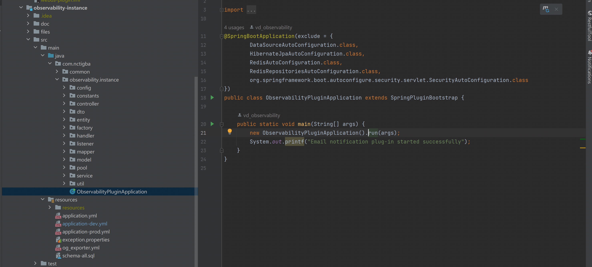

​             **步骤2-2：** 启动前端项目，请参见 4.3 启动前端项目。

**注**：项目基于spring-brick-bootstrap插件开发，目前项目只能以jar的形式运行于主平台，无法单独启动。若需要进行本地启动，需要修改ObservabilityPluginApplication类，参考https://www.yuque.com/starblues/spring-brick-3.0.0/xgf98o。

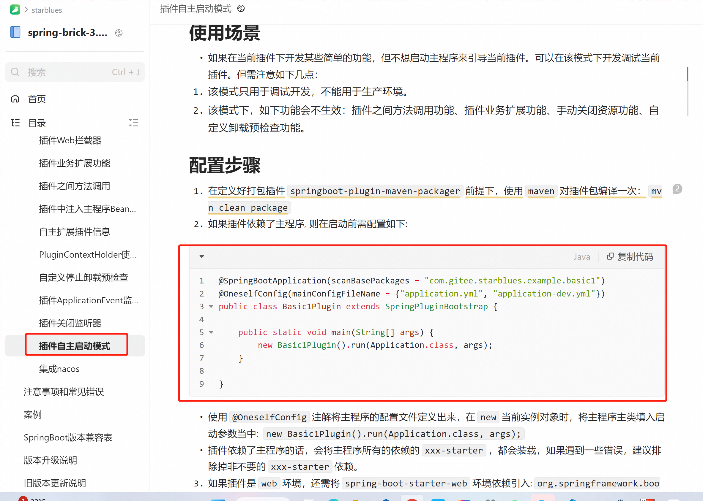


### 4.3 启动前端项目

**前置条件：** 安装 node.js，建议使用 v16 以上版本。

**步骤 1：** 下载依赖包

```
 任选以下一种命令：
 npm install
 yarn install
```

**步骤 2：** 启动前端项目

```
 根据package.json配置启动以下命令来启动前端项目：
 npm run dev
```

**步骤 3：**  根据启动提示进入对应的URL地址，如下图所示：


## 5 使用实例监控插件(observability instance)

### 5.1 概述

​	本章详细介绍如何使用实例监控插件(observability instance) 的功能。

### 5.2  代理和服务端的安装和卸载

#### 5.2.1 代理和服务端的安装

**步骤 1：** 点击左边菜单【智能运维】-【实例监控】，打开【实例监控】tab,点击tab内容的左上角的收缩按钮，如下图：

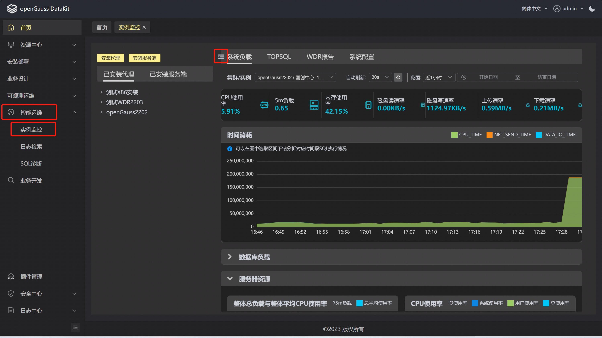

**步骤 2：** 安装代理：点击【安装代理】按钮或者【安装服务端】按钮。

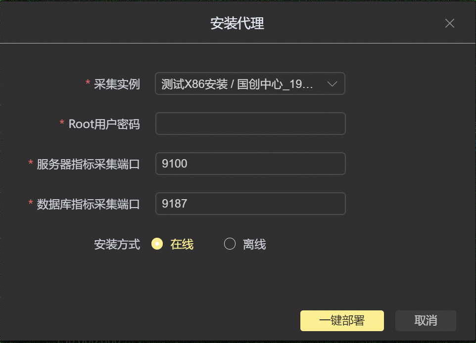

选择离线时，若安装包不存在，则需要上传安装包：

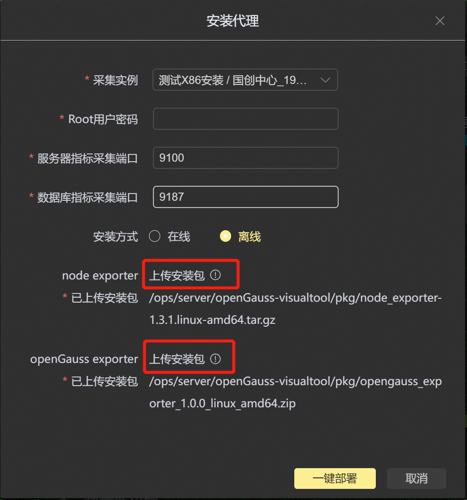

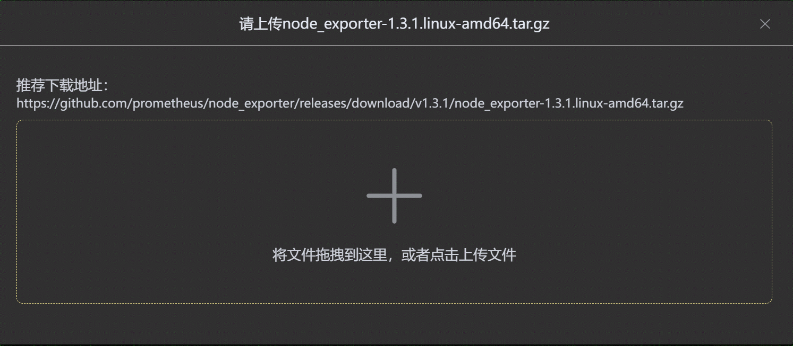

**步骤 3：** 填写表单，点击一键部署。

​			   **说明：** 所有必选参数均需要填写。必填参数用星号（*）标识。

【代理安装】配置项

| 配置项             | 必填 | **组件形式** | 配置说明                                                     |
| ------------------ | ---- | ------------ | ------------------------------------------------------------ |
| 采集实例           | 是   | 下拉框       | 平台已安装的实例，默认选第一个                               |
| root用户密码       | 是   | 输入框       | 采集实例对应的服务器的root用户密码                           |
| 服务器指标采集端口 | 是   | 输入框       | 默认9100                                                     |
| 数据库指标采集端口 | 是   | 输入框       | 默认9187                                                     |
| 安装方式           | 是   | 输入框       | 分【在线】和【离线】，默认选在线                             |
| node exporter      | 否   | 文件上传框   | 安装方式为【离线】时，必填。根据提示，上传node_exporter安装包，上传完成后，显示安装路径 |
| openGauss exporter | 否   | 文件上传框   | 安装方式为【离线】时，必填。根据提示，上传openGauss_exporter安装包，上传完成后，显示安装路径 |

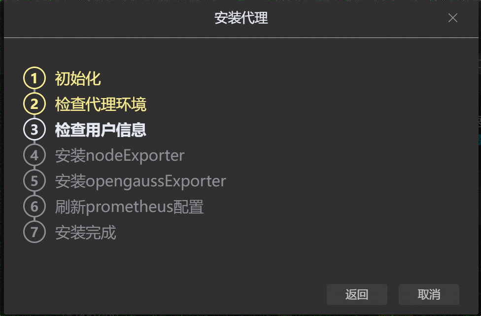


【代理服务端】配置项

| 配置项       | 必填 | **组件形式** | 配置说明                                                     |
| ------------ | ---- | ------------ | ------------------------------------------------------------ |
| 物理机       | 是   | 下拉框       | 平台可用的服务器设备，，默认选一个                           |
| root用户密码 | 是   | 输入框       | 物理机服务器的root用户密码                                   |
| 服务端端口   | 是   | 输入框       | 默认9090                                                     |
| 安装方式     | 是   | 输入框       | 分【在线】和【离线】，默认选在线                             |
| Prometheus   | 否   | 文件上传框   | Prometheus安装包上传路径。安装方式为【离线】时，必填。根据提示，上传Prometheus安装包，上传完成后，显示安装路径 |

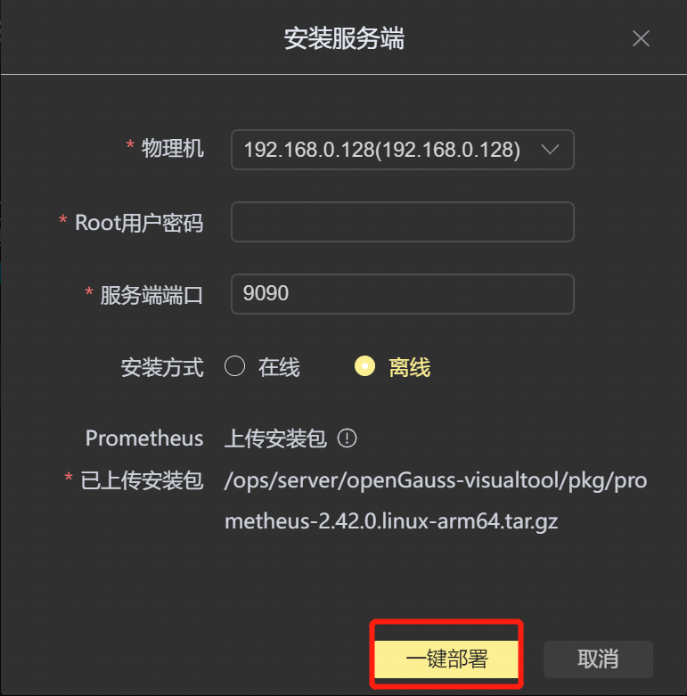


#### 5.2.2 代理和服务端的卸载

**步骤 1：** 点击左边菜单【智能运维】-【实例监控】，打开【实例监控】tab,点击tab内容的左上角的收缩按钮

**步骤 2：** 点击【已安装代理】或者【已安装服务端】，展开对应的安装菜单，继续点击菜单，将鼠标移到对应的实例。

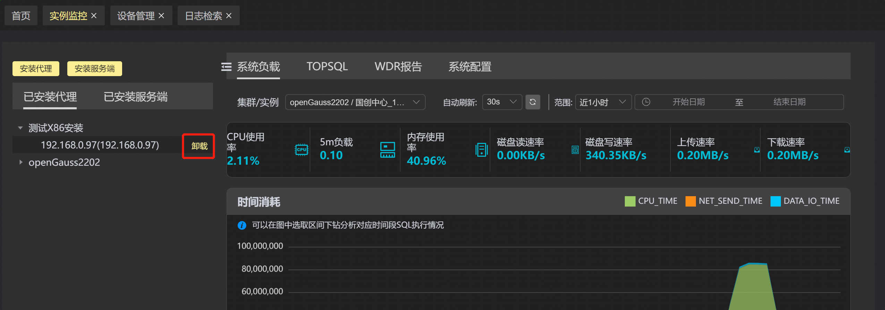

**步骤 3：** 点击【卸载】，填写表单，点击【一键卸载】，完成卸载。

​				**说明：** 所有必选参数均需要填写。必填参数用星号（*）标识。

【代理卸载】配置项

| 配置项   | 必填 | **组件形式** | 配置说明                       |
| -------- | ---- | ------------ | ------------------------------ |
| 采集实例 | 是   | 下拉框       | 平台已安装的实例，默认选第一个 |

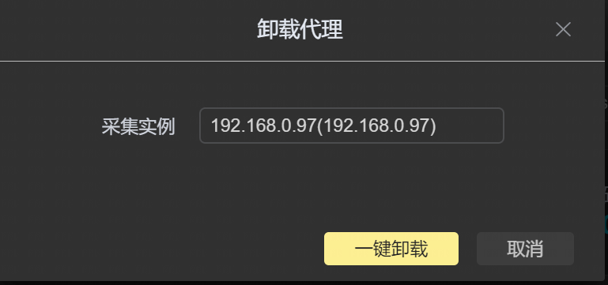

【服务端卸载】配置项

| 配置项 | 必填 | **组件形式** | 配置说明                         |
| ------ | ---- | ------------ | -------------------------------- |
| 物理机 | 是   | 下拉框       | 平台可用的服务器设备，默认选一个 |

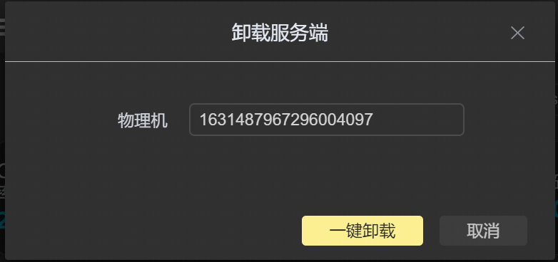


### 5.3 系统负载

​	进入插件后，默认选择【系统负载】 tab ，包括【筛选条件区域】，【时间消耗】，【等待事件】，【数据库负载】及【服务器资源】部分。

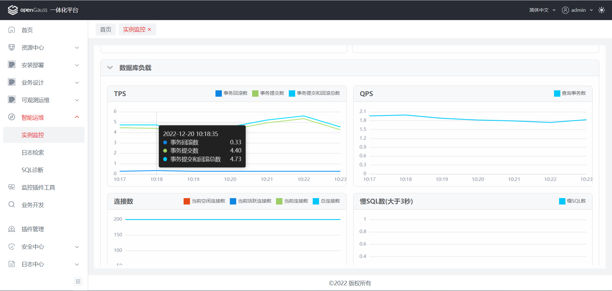


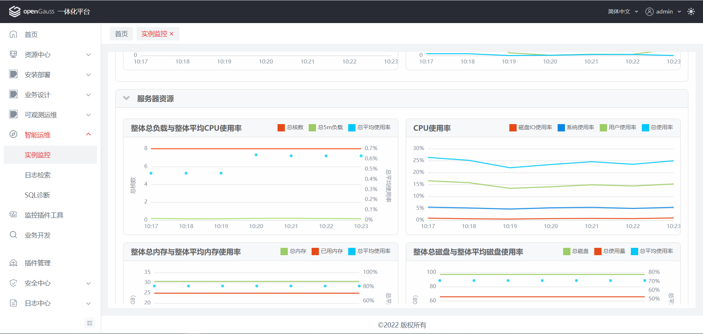


### 5.4 TOPSQL

​	选择 TOPSQL 标签可查看按不同维度排列前十的 sql 语句 。

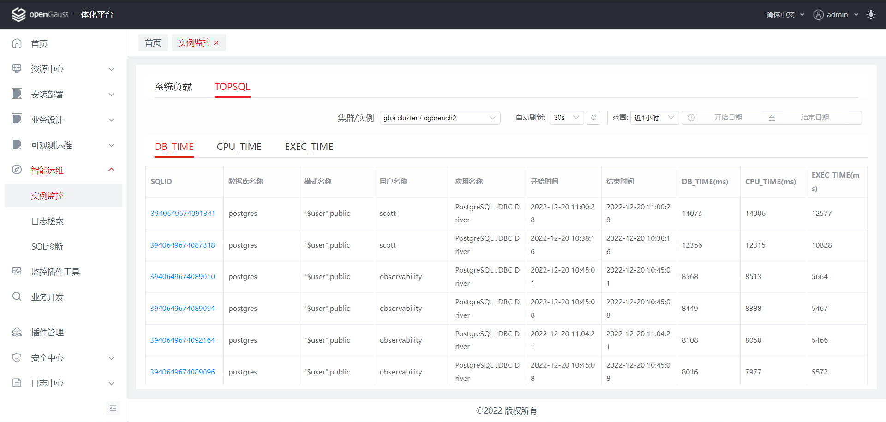

可点击 【SQLID】 进入详情页面。

【实例监控详情】：

（1）点击【 SQLID 】进入详情页面，默认展示统计信息页。

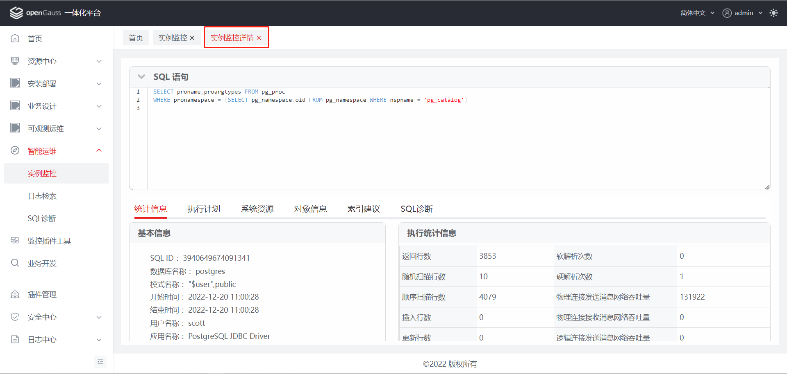


完整的【统计信息】部分：

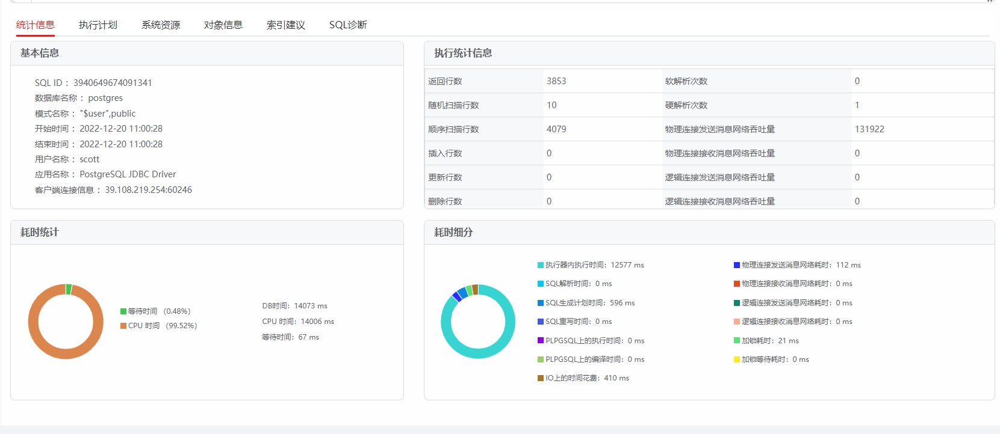


（2）执行计划：

展示可视化的【执行计划】数据，点击右侧按钮可高亮显示对应的行。

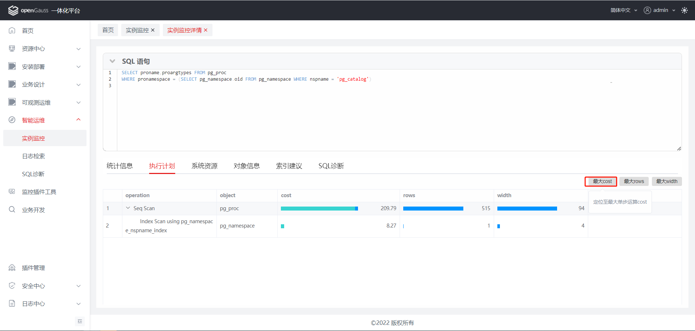


（3）系统资源：

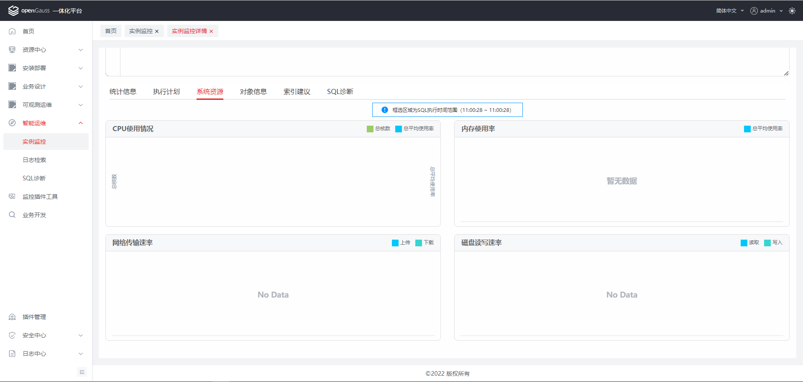


（4）对象信息

【对象信息】tab下，可选择对应的对象，右侧展示涉及到的【基本信息】，【对象结构】，【索引信息】。

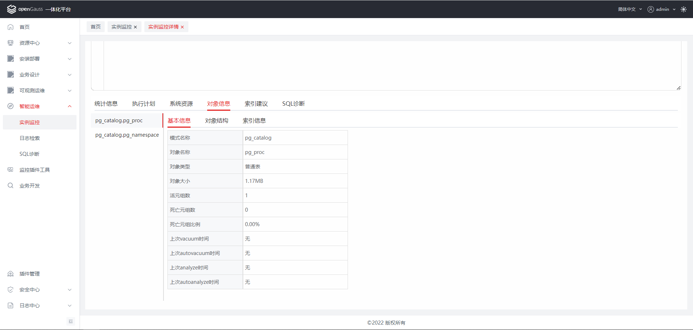


（5）索引建议

根据建议规则给出 sql 对应的【索引建议】。

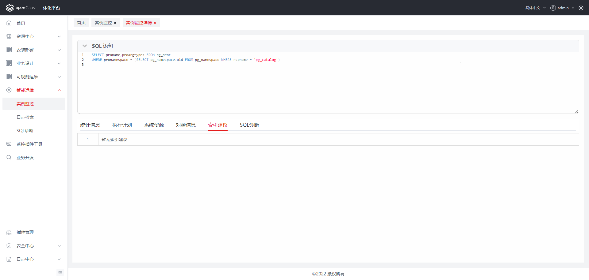


（6）sql 诊断

在这里可以对当前的sql进行诊断分析，通过点击可跳转至【诊断详情】。


### 5.5 WDR报告

#### 5.5.1 WDR报告列表显示

点击【WDR报告】tab，进入WDR报告页面，选择【集群名称】，点击【查询】按钮，显示WDR报告列表。

​			   **说明：**【集群名称】、【报告范围】、【报告类型】选项为必选，其他查询条件可选；

​			              单击 【查询】将根据条件查询数据；

​                          单击 【重置】 即可重置列表。

| 配置项   | 必填 | 组件形式   | 数据类型限制 | 配置说明                                                     |
| -------- | ---- | ---------- | ------------ | ------------------------------------------------------------ |
| 集群名称 | 是   | 下拉框     | -            | 平台已安装的实例，默认为空。                                 |
| 报告范围 | 是   | 下拉框     | -            | 分【集群】和【节点】，默认【集群】。                         |
| 报告类型 | 是   | 下拉框     | -            | 分【明细】、【汇总】和【全部】，默认明细。                   |
| 生产时间 | 否   | 时间下拉框 | 时间类型     | yyyy-MM-dd HH:mm:ss,可为空，默认当天00:00:00到当天23:59:59。 |

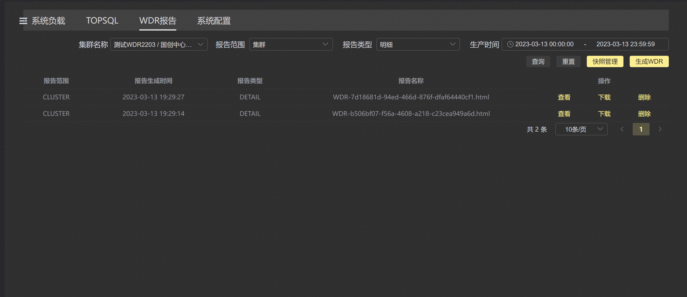


#### 5.5.2 快照管理

点击【快照管理】按钮，进入快照管理页面。

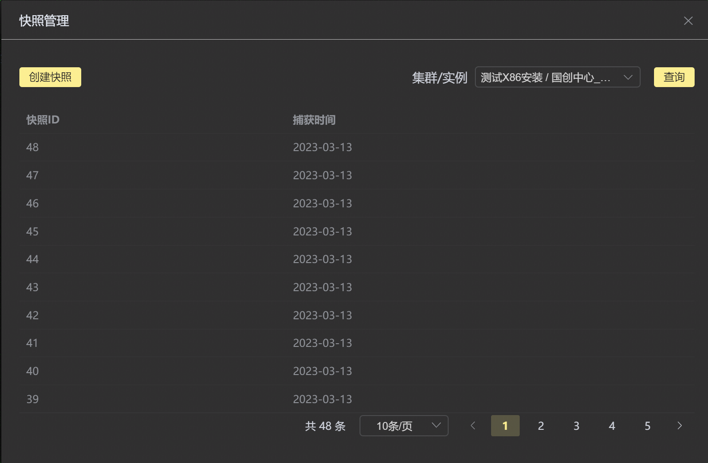

| 配置项    | 必填 | 组件形式 | 数据类型限制 | 配置说明     |
| --------- | ---- | -------- | ------------ | ------------ |
| 集群/实例 | 是   | 下拉框   | -            | 默认选第一个 |


#### 5.5.3 创建快照

​               选择【集群/实例】，点击【创建快照】，生成新的快照。

​              **说明**：由于创建快照有延迟，需要手动点击【查询】来刷新数据。


#### 5.5.4 生成WDR

​              在主页面点击【生成WDR】，进入【生成WDR】编辑页面，填写表单，点击【生成】。

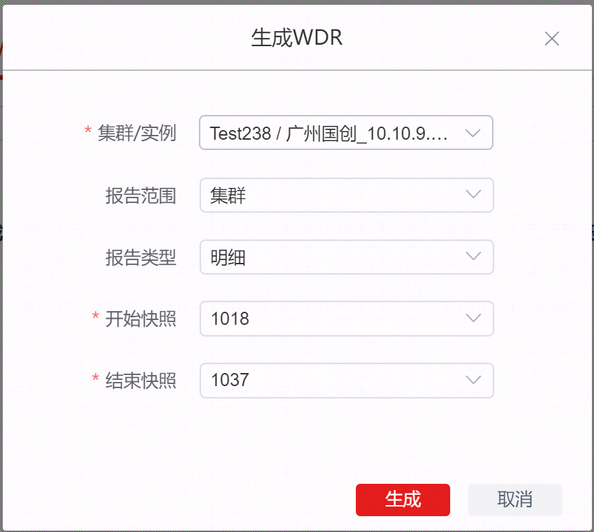


| 配置项    | 必填 | 组件形式 | 数据类型限制 | 配置说明                                                    |
| --------- | ---- | -------- | ------------ | ----------------------------------------------------------- |
| 集群/实例 | 是   | 下拉框   | -            | 平台已安装的实例，默认为空。                                |
| 报告范围  | 是   | 下拉框   | -            | 分【集群】和【节点】，默认【集群】。                        |
| 报告类型  | 是   | 下拉框   | -            | 分【明细】、【汇总】和【全部】，默认明细。                  |
| 开始快照  | 是   | 下拉框   | -            | 默认为倒数第20个快照，如果快照不足20条，将默认是第1条快照。 |
| 结束快照  | 是   | 下拉框   | -            | 默认为最后一个快照。                                        |


#### 5.5.5 查看快照

​              点击WDR报告列表中的某一个数据的【查看】操作按钮，将打开新页面，展示该数据的WDR报告详情。

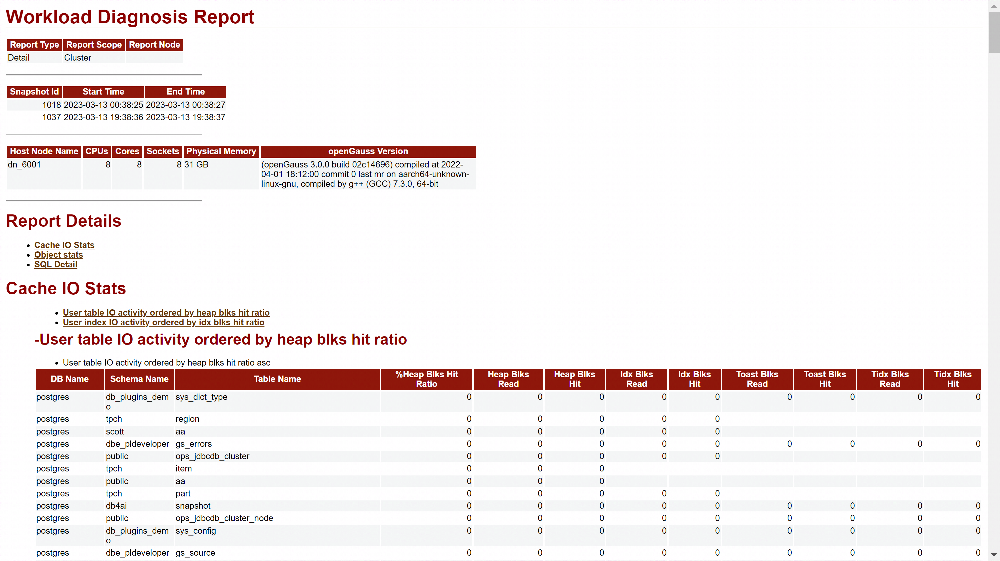


#### 5.5.6 WDR报告下载

​	           点击WDR报告列表中的某一个数据的【下载】操作按钮，下载该数据的WDR报告。


#### 5.5.7 WDR报告删除

​	          点击WDR报告列表中的某一个数据的【下载】操作按钮，弹出删除提示，选择【确定】，将删除该WDR报告。

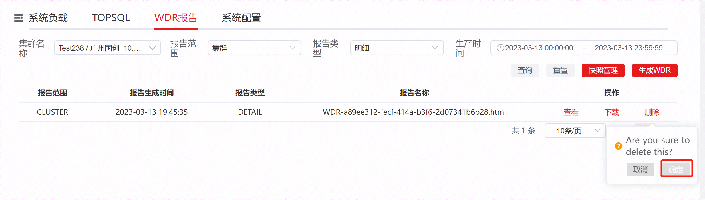

### 5.6 系统配置

#### 5.6.1 系统配置查询

​	           点击【系统配置】tab,选择【集群/实例】，点击【查询】。

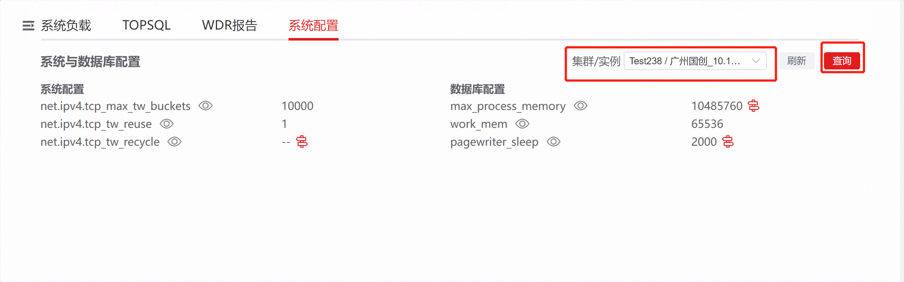


#### 5.6.2 系统配置刷新

​               点击【系统配置】tab,选择【集群/实例】，点击【刷新】，填写root密码，点击【确定】。

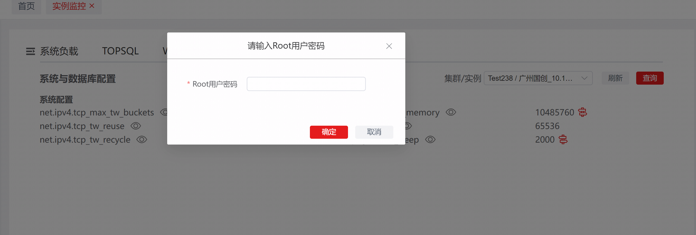


## 6 FAQS

1、使用在线安装代理或服务端时，安装界面卡住不动。

原因：服务器下载速度过慢或下载异常会发生此情况，可尝试使用离线安装的方式进行安装。