# 1SQL诊断(observability sql diagnosis) 用户手册


## 1SQL诊断(observability sql diagnosis) 用户手册

​		SQL诊断插件主要目的是为openGauss用户提供慢SQL监控、问题SQL诊断分析的功能。它作为一体化平台的可插拔插件开发，本特性依赖于openGauss一体化平台的插件特性。

## 2 前言


### 2.1 概述

​	本章介绍手册相关信息。


### 2.2 读者对象

​	本手册主要适用于以下人员：

- 数据库开发人员
- 数据库管理员


### 2.3 修订记录

| 日期       | 版本   | 变更说明     | 修改人   | 审核人      |
| ---------- | ------ | ------------ | -------- | ----------- |
| 2022/12/19 | v1.0.0 | 新增编译初版 | wuyuebin | zengseliang |


### 2.4 文档约定

​	本节描述了本手册的（内容、符号、GUI 和文本）约定。

**图形化界面格式约定**

​    	本手册中可能出现下列图形化界面格式约定，它们所代表的含义如下。

| 格式 | 说明                                                         |
| ---- | ------------------------------------------------------------ |
| 粗体 | 按钮、菜单、参数、页签、窗口及对话框标题均使用【】括起来。例如，单击【确定】。 |


### 2.5 第三方许可证

​	本节包含适用于该插件的第三方许可证。

​	**表2-1 第三方软件列表**

| 第三方软件     |
| -------------- |
| 木兰宽松许可证 |


### 2.6 参考文档

无。


## 3SQL诊断插件简介


### 3.1 概述

​	在生产环境中，当用户发现慢SQL时，往往需要丰富的运维经验，通过多种命令、工具进行数据采集，然后进行分析，才能发现最终问题根因。SQL诊断插件提供了一个不断完善的知识库，帮助智能分析各种慢SQL产生的根因，从而极大地提高openGauss的可维护性和易用性。

​	SQL诊断插件支持查询慢SQL，支持对SQL执行诊断任务。SQL诊断过程中会进行相关数据的采集，包括系统数据、SQL执行计划等，然后基于采集的数据进行分析，分析发现问题会以图表、表格等形式展示数据，并提供建议项信息。


### 3.2 支持的功能

​	SQL诊断插件提供的功能如下：

- 慢sql诊断
- sql诊断的增删查
- 代理和服务端安装卸载


### 3.3 约束和限制

**项目运行**

本项目依赖一体化主平台，若需要使用本项目所有功能，只能通过编译成 jar 包的形式作为插件运行在主平台上。


### 3.4 SQL诊断插件项目结构

下载日志检索插件项目代码：

```
git clone https://gitee.com/opengauss/openGauss-workbench
```

SQL诊断插件项目结构如下图所示：

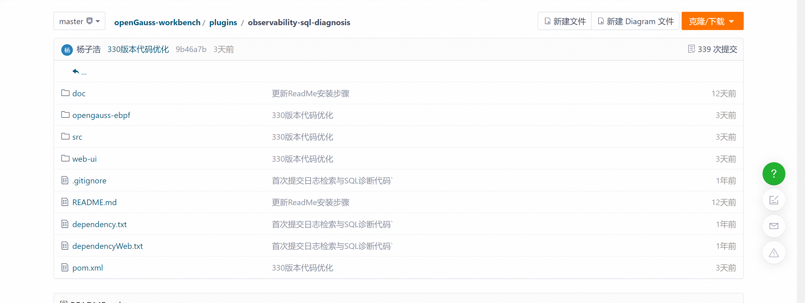

SQL诊断插件项目结构说明如下：

| 文件夹/文件 | 说明                   |
| ----------- | ---------------------- |
| src         | 保存后端代码及资源文件 |
| web-ui      | 保存前端代码           |
| .gitignore  | 提交git忽略的目录      |
| pom.xml     | 后端依赖项             |
| LICENSE     | 许可证                 |

### 3.5 系统要求

​	本节介绍使用SQL诊断插件的最低系统要求。

**系统要求**

| 操作系统 | 版本           |
| -------- | -------------- |
| windows  | windows7及以上 |

**软件要求**

| 软件 | 规格         |
| ---- | ------------ |
| Java | jdk 11及以上 |

**数据库版本要求**

| 数据库    | 版本 |
| --------- | ---- |
| openGauss | 所有 |


## 4 部署SQL诊断插件

​	 本章详细介绍如何部署SQL诊断插件。

​     前端技术栈：Vue3.0 + TS + Element plus

​     后端技术栈：Java + Spring boot

### 4.1 编译项目并部署至一体化平台

**前置条件：** ① 安装 node.js，建议使用 v16 以上版本；

​                   ② 安装Java jdk （建议使用v11及以上版本） 和 maven 3.X。

**步骤 1：** 检查自动构建前端项目的配置是否为false；

```
在 plugins > observability-instance > pom.xml 下将以下值设为false：
<web.build.skip>false</web.build.skip>
<web.clean.skip>false</web.clean.skip>
```

**步骤 2：** 启动打包命令；

```
mvn clean package -P prod
```

**步骤 3：** 在target目录下找到生成的jar，安装到一体化平台。


### 4.2 启动后端项目

**前置条件**：安装Java jdk （建议使用v11及以上版本） 和 maven 3.X。

**步骤 1：** 使用idea打开项目，并配置好maven；

**步骤 2：** 通过启动后端命令与前端命令的方式进入，此方式受限制，详情请参见 3.3 约束和限制。

​                **步骤 2-1：** 找到 ObservabilityPluginApplication类，执行 main 函数；

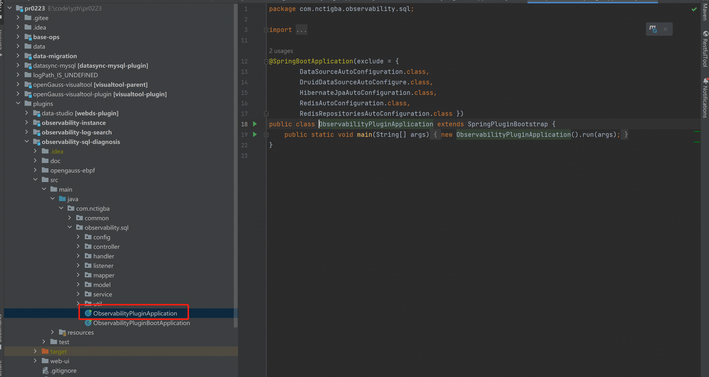

​             **步骤2-2：** 启动前端项目，请参见 4.3 启动前端项目。

**注**：项目基于spring-brick-bootstrap插件开发，目前项目只能以jar的形式运行于主平台，无法单独启动。若需要进行本地启动，需要修改ObservabilityPluginApplication类，参考https://www.yuque.com/starblues/spring-brick-3.0.0/xgf98o。


### 4.3 启动前端项目

**前置条件：** 安装 node.js，建议使用 v16 以上版本。

**步骤 1：** 下载依赖包

```
 任选以下一种命令：
 npm install
 yarn install
```

**步骤 2：** 启动前端项目

```
 根据package.json配置执行以下命令启动前端项目：
 npm run dev
```

**步骤 3：** 根据启动提示进入对应的URL地址，如下图所示：

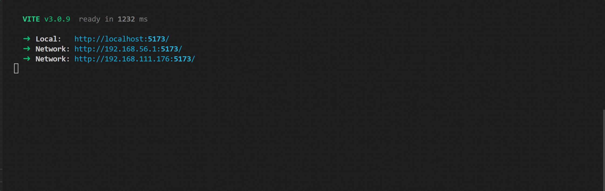


## 5 SQL诊断插件

### 5.1 概述

​	本章详细介绍如何使用SQL诊断插件的功能。

### 5.2 部署数据采集代理

1. 点击【安装代理】按钮，弹出安装框。

   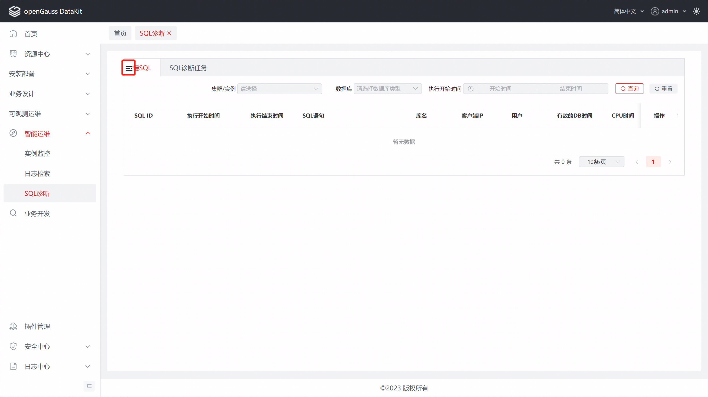

2. 选择对应数据库实例，输入Root密码，点击【一键部署】即可完成安装。

   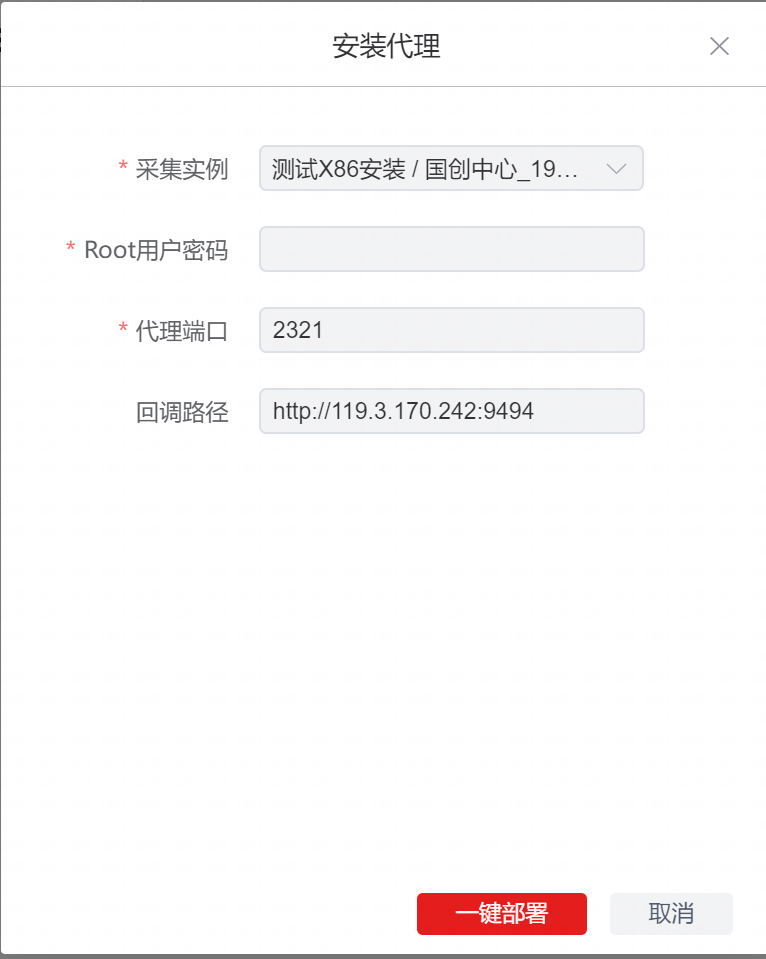

3. 安装完成后，即可在【已安装代理】TAB中看到对应代理的信息。

   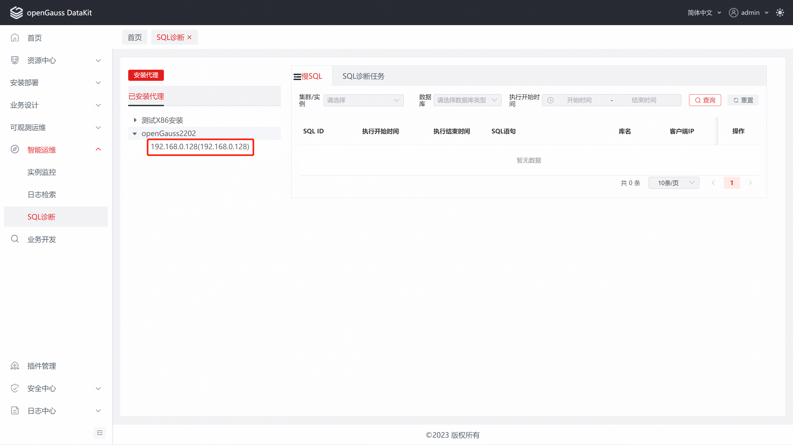


### 5.3 卸载

1、在【已安装服务端】和【已安装代理】列表中，鼠标悬停后会显示【卸载】按钮，点击【卸载】按钮，打开卸载窗口。

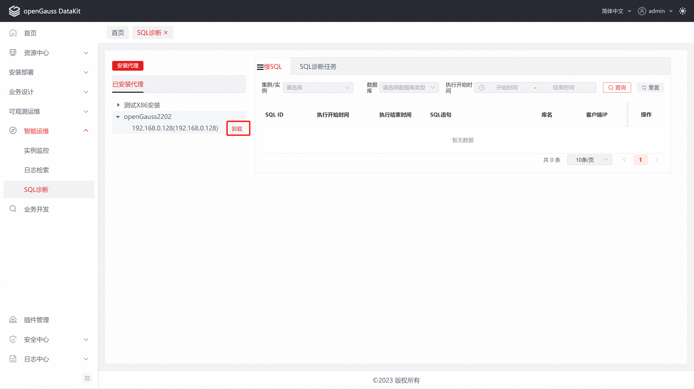

2、输入root密码，点击【一键卸载】，即可进行卸载操作。

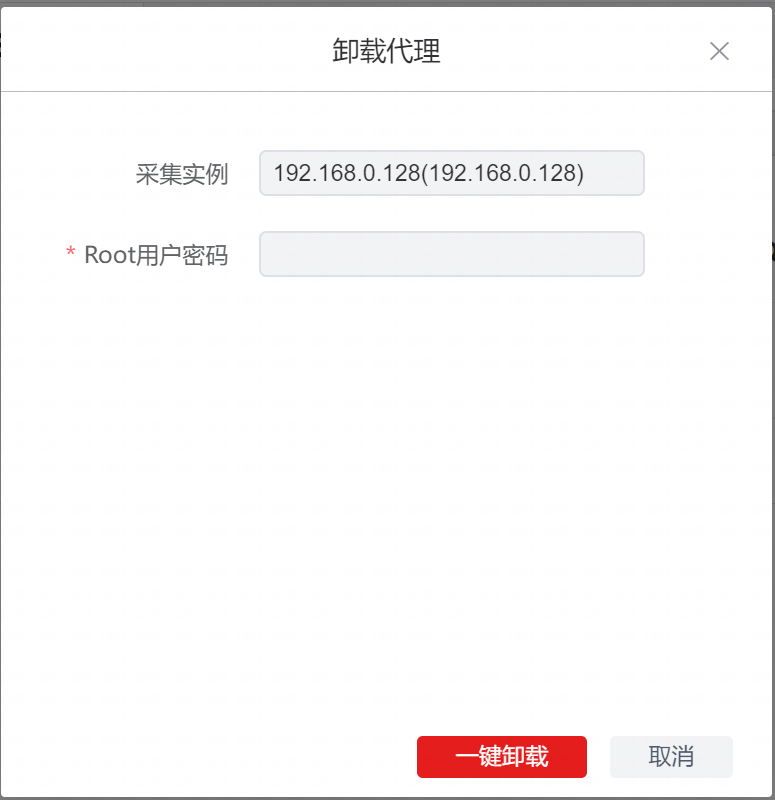

### 5.4 慢sql

1、输入相关查询条件，点击【查询】。

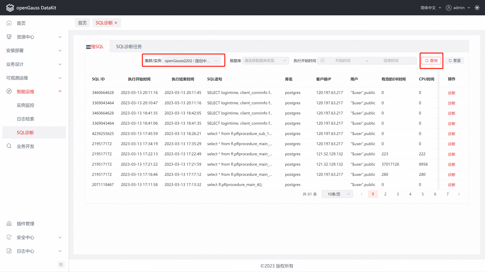

2、点击某个数据的【诊断】操作按钮,输入相关信息，生成诊断任务，新增的【诊断任务】将在【SQL诊断任务】中显示。

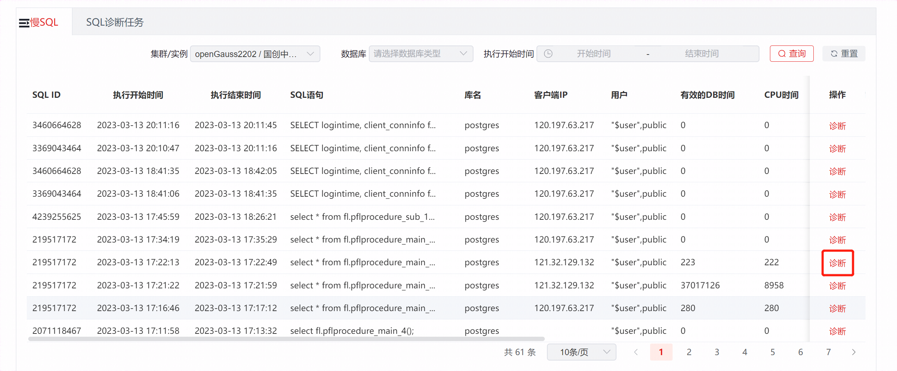

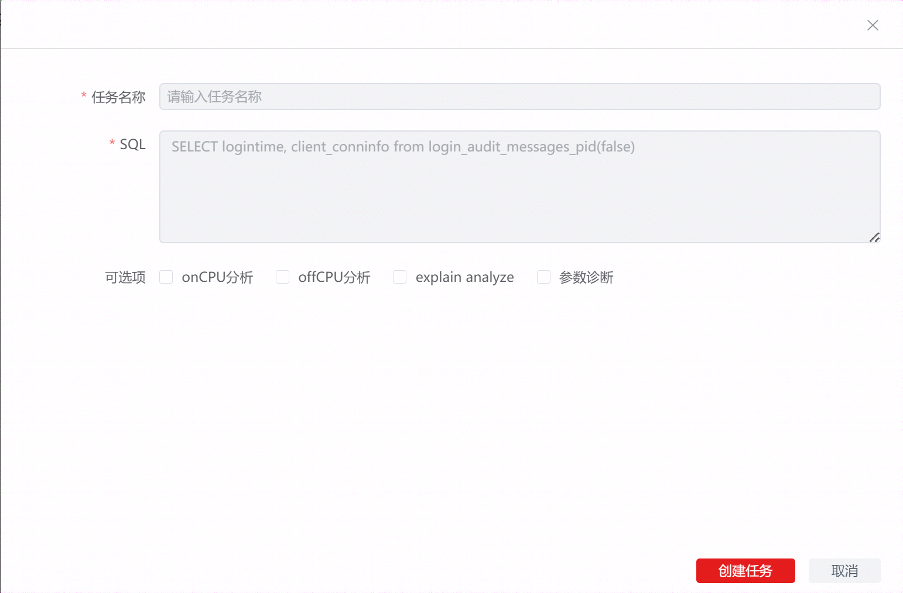


### 5.5 sql诊断任务

1、点击【sql诊断任务】tab，进入【sql诊断任务】页面。

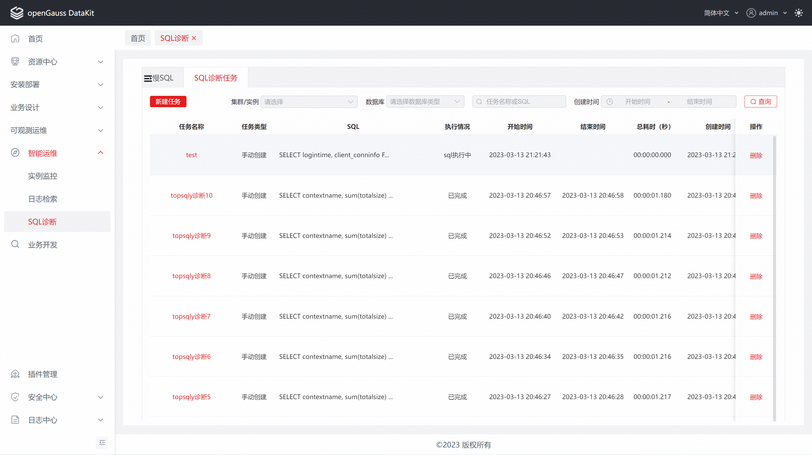

注：可以输入相关查询条件，查询数据。

2、点击【新建任务】，输入相关表单，即可创建sql诊断任务。

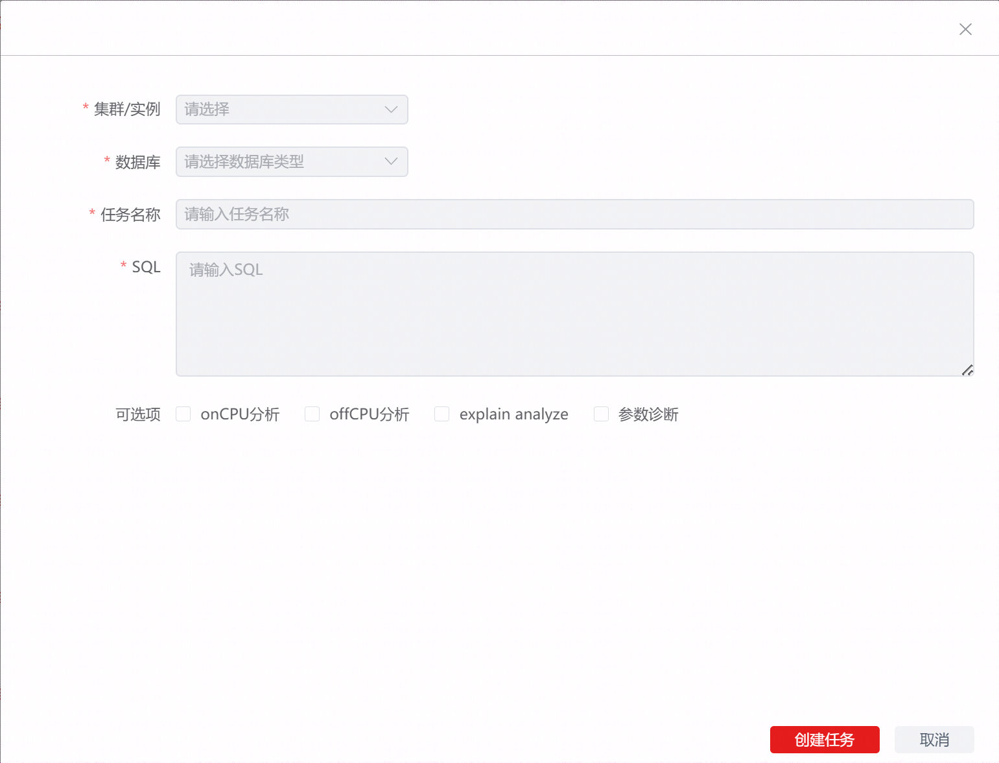

3、点击诊断任务列表中的任务名称，打开【sql诊断详情】页面,显示【分析报告】和【详情诊断】。

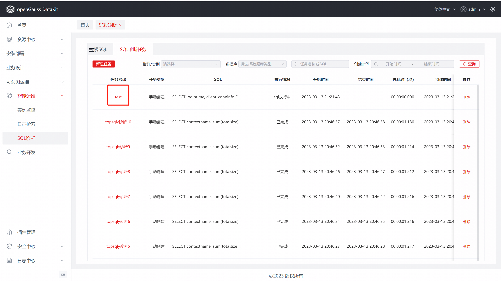

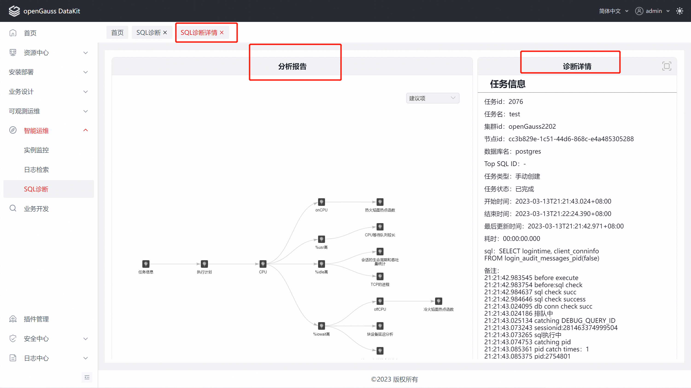

点击分析报告中相应的建议项时，【诊断详情】将展示该项的详细。

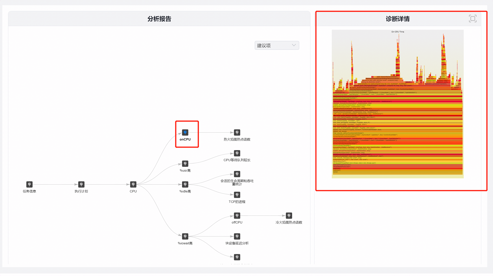

点击放大按钮，将放大诊断详情。


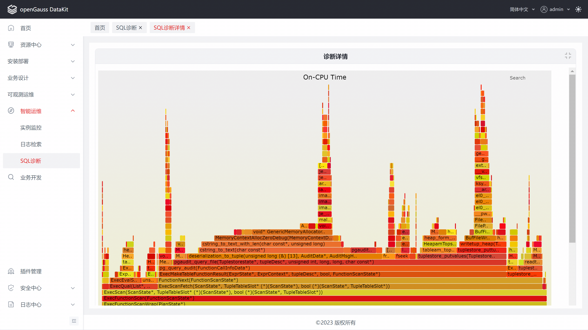

4、删除诊断任务：在主页面点击某个数据的【删除】按钮，弹出删除提示框，点击【确定】即可删除。


## 6 FAQS

1、使用在线安装代理或服务端时，安装界面卡住不动。

原因：服务器下载速度过慢或下载异常会发生此情况，可尝试使用离线安装的方式进行安装。