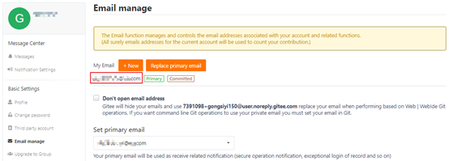

# 安装并配置Git<a name="ZH-CN_TOPIC_0000001284903586"></a>

1.  安装Git。下载Git并按默认设置安装。Git下载地址：<u>[https://git-scm.com/downloads](https://gitee.com/link?target=https%3A%2F%2Fgit-scm.com%2Fdownloads)</u>
2.  配置Git。

    1.  把git上的 user 设置成您gitee的个人名称。

    ```
     git config --global user.name "your Gitee Name" 
    ```

    进入 gitee个人主页，@符号后的名称即为此处设置的个人名称。

    

    2.  配置您的git邮箱。

    ```
    git config --global user.email "email@your_Gitee_email"
    ```

    

    "email@your\_Gitee\_email"为在gitee配置的注册邮箱。

    3.  生成ssh公钥。

    ```
    ssh-keygen -t rsa -C "email@your_Gitee_email"   
    ```

    "email@your\_Gitee\_email"为在gitee配的注册邮箱。根据提示设置公钥文件名称，不设置密码。

    执行如下命令获取公钥，“.ssh/id\_rsa.pub”为公钥文件保存地址，id\_rsa为自定义的pub文件名称。

    ```
    cat ~/.ssh/id_rsa.pub 
    ```

    4.  在个人Gitee账添加您的ssh公钥。

    

    5.  在个人电脑上完成gitee在SSH上的登记。ssh -T git@**gitee**.**com**如果提示如下信息，可继续往下执行。

    


