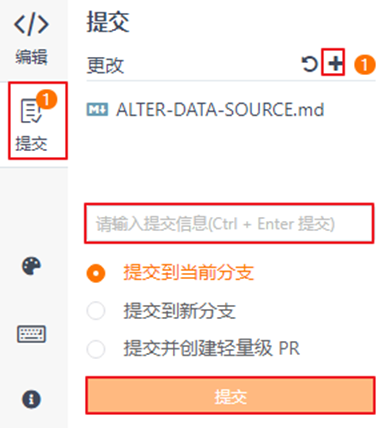
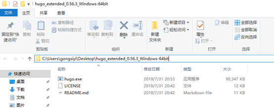

# 贡献文档<a name="ZH-CN_TOPIC_0000001274583262"></a>

您可以通过提交PR的方式贡献新增特性相关文档，修改现有文档的缺陷、优化文档内容。

## 文档贡献流程<a name="section1743132115195"></a>

**图 1**  文档贡献流程图<a name="fig84111116191517"></a>  


**表 1**  文档贡献流程图说明

<a name="table1228153491111"></a>
<table><thead align="left"><tr id="row10282133419117"><th class="cellrowborder" valign="top" width="33.94%" id="mcps1.2.3.1.1"><p id="p1328313451116"><a name="p1328313451116"></a><a name="p1328313451116"></a>流程</p>
</th>
<th class="cellrowborder" valign="top" width="66.06%" id="mcps1.2.3.1.2"><p id="p32831434181114"><a name="p32831434181114"></a><a name="p32831434181114"></a>说明</p>
</th>
</tr>
</thead>
<tbody><tr id="row10283634151111"><td class="cellrowborder" valign="top" width="33.94%" headers="mcps1.2.3.1.1 "><p id="p528316346115"><a name="p528316346115"></a><a name="p528316346115"></a>准备环境</p>
</td>
<td class="cellrowborder" valign="top" width="66.06%" headers="mcps1.2.3.1.2 "><p id="p139701626131613"><a name="p139701626131613"></a><a name="p139701626131613"></a>在修改文档内容之前，您需要拥有签署CLA权限的Gitee账号和本地Git工具。</p>
<p id="p189701426111619"><a name="p189701426111619"></a><a name="p189701426111619"></a>账号准备与环境配置请参见<a href="#section2701141518128">准备环境</a>。</p>
</td>
</tr>
<tr id="row1428414344113"><td class="cellrowborder" valign="top" width="33.94%" headers="mcps1.2.3.1.1 "><p id="p32848343112"><a name="p32848343112"></a><a name="p32848343112"></a>认领issue</p>
</td>
<td class="cellrowborder" valign="top" width="66.06%" headers="mcps1.2.3.1.2 "><p id="p11284193412111"><a name="p11284193412111"></a><a name="p11284193412111"></a>选择并认领准备修改的issue，详情请参见<a href="#section20919102111128">认领issue</a>。</p>
</td>
</tr>
<tr id="row528463491118"><td class="cellrowborder" valign="top" width="33.94%" headers="mcps1.2.3.1.1 "><p id="p1128593415116"><a name="p1128593415116"></a><a name="p1128593415116"></a>修改文档</p>
</td>
<td class="cellrowborder" valign="top" width="66.06%" headers="mcps1.2.3.1.2 "><p id="p3285133491120"><a name="p3285133491120"></a><a name="p3285133491120"></a>确认issue问题，并修改对应的文档。修改文档有两种方式：</p>
<a name="ul5387172122312"></a><a name="ul5387172122312"></a><ul id="ul5387172122312"><li>在文档需要大量修改或者新增的场景下，建议您使用<a href="#li209521521143110">•Git方式修改资料</a>。</li><li><span>在修改内容较少的场景下，建议您使用</span><a href="#li7579124515310">•Web方式修改资料</a><span>。</span></li></ul>
</td>
</tr>
<tr id="row7285193416112"><td class="cellrowborder" valign="top" width="33.94%" headers="mcps1.2.3.1.1 "><p id="p1285183410115"><a name="p1285183410115"></a><a name="p1285183410115"></a>发布验证（可选）</p>
</td>
<td class="cellrowborder" valign="top" width="66.06%" headers="mcps1.2.3.1.2 "><p id="p52851134161115"><a name="p52851134161115"></a><a name="p52851134161115"></a>修改完成后，在本地使用hugo软件验证文档正确性，详情请参见<a href="#section11106143720144">（可选）发布验证</a>。</p>
<p id="p1622363144115"><a name="p1622363144115"></a><a name="p1622363144115"></a>此步骤为可选步骤，您也可以选择直接提交PR，社区门禁会进行检查。如果存在错误，PR会显示opengauss-cla/no。</p>
</td>
</tr>
<tr id="row4876553171216"><td class="cellrowborder" valign="top" width="33.94%" headers="mcps1.2.3.1.1 "><p id="p15877165361215"><a name="p15877165361215"></a><a name="p15877165361215"></a>提交PR</p>
</td>
<td class="cellrowborder" valign="top" width="66.06%" headers="mcps1.2.3.1.2 "><p id="p9877155331213"><a name="p9877155331213"></a><a name="p9877155331213"></a>将个人docs仓库的修改内容通过PR合入openGauss/docs，详情请参见<a href="#section486565018147">提交PR</a>。</p>
</td>
</tr>
</tbody>
</table>

## 准备环境<a name="section2701141518128"></a>

在修改文档内容之前，您需要拥有签署CLA权限的Gitee账号和本地Git工具。您需要完成以下操作：

-   拥有自己的Gitee账号，详情请参见[注册Gitee账户](注册Gitee账户.md)。
-   签署CLA，详情请参见[签署openGauss社区贡献者许可协议（CLA）](签署openGauss社区贡献者许可协议（CLA）.md)。
-   如果需要批量修改多个文件，请安装并配置Git，详情请参见[安装并配置Git](安装并配置Git.md)。

## 认领issue<a name="section20919102111128"></a>

1.  进入[issue列表](https://gitee.com/opengauss/docs/issues)页面，查看所有开启的issue。
2.  单击要修改的issue，在评论框输入“/assign”命令认领该issue，并且在页面右侧标明开始时间和结束时间。

    > **须知：** 
    >在结束时间之后，如果issue还未修改，其他贡献者可以重新认领此issue进行修改。


## 修改文档<a name="section13770181819142"></a>

-   **Git方式修改资料**

此方法适用于大量文档修改或者文档新增的场景。例如，新增特性涉及的文档修改。

1.  **复制个人仓库到本地并修改内容**。
    
    1.  在个人电脑上创建文件夹，用户存放远程仓库文件。
    2.  获取个人仓库地址。
3.  复制到本地。在git工具中执行如下命令：
    
        ```
        # 进入本地目录 
        cd  D:\openGauss  
        # 把远程仓库复制到本地 
        git clone https://gitee.com/"your Gitee Name"/repository_name   #个人远程仓库地址 
        # 设置本地工作目录的upstream源 
        git remote add upstream https://gitee.com/opengauss /repository-name #opengauss远程仓库地址 
        # 设置同步方式 
        git remote set-url --push upstream no_push 
    ```
    
4.  确认本地分支。
    
    进入本地docs目录下，打开Git Bash，查看当前分支。红框处为本地文档当前分支。
    
    
    
    如需修改其它分支，请执行如下命令，切换分支。
    
        ```
        git checkout 分支名称
    ```
    
5.  修改个人分支本地文件。（推荐使用Typora编辑）
    
2.  **提交修改。**

    在git工具执行如下命令，提交本地修改到个人远程仓库。

    ```
    git add .  
    git commit -m "提交原因" 
    git push -f origin master 
    ```

    如果修改了多个文件夹下的文件，建议依次cd进入到每个子文件夹，然后再执行提交操作。


-   **Web方式修改资料**

直接在web网页上修改md文件，适用于内容较少的修改。例如维护版本的日常问题处理。

**方式一：Web IDE，适用于多个文件修改后统一提交**

1.  进入个人Fork路径，在分支下拉框选择需要修改的分支。

    

2.  单击Web IDE。

    

3.  编辑对应文件。
4.  预览。
5.  提交。先单击保存修改，填写修改原因后提交到当前分支。



**方式二：直接编辑单个md文件**

1.  进入个人Fork路径，在分支下拉框选择需要修改的分支。

    

2.  进入待编辑md文件界面，单击“编辑”。

    

3.  修改内容后，填写修改理由，提交到当前分支。

    


## （可选）发布验证<a name="section11106143720144"></a>

1. 在如下地址下载hugo软件（以<u>[hugo\_extended\_0.56.3\_Windows-64bit.zip](https://gitee.com/link?target=https%3A%2F%2Fgithub.com%2Fgohugoio%2Fhugo%2Freleases%2Fdownload%2Fv0.56.3%2Fhugo_extended_0.56.3_Windows-64bit.zip)</u>为例）和获取帮助信息。下载地址：<u>[https://github.com/gohugoio/hugo/releases](https://gitee.com/link?target=https%3A%2F%2Fgithub.com%2Fgohugoio%2Fhugo%2Freleases)</u>帮助信息：<u>[https://www.gohugo.org/doc/overview/installing/](https://gitee.com/link?target=https%3A%2F%2Fwww.gohugo.org%2Fdoc%2Foverview%2Finstalling%2F)</u>

2. 解压下载的hugo软件，解压后的文件中有hugo.exe文件。记录下该文件所在的文件目录，如“C:\\Users\\gongsiyi\\Desktop\\hugo\_extended\_0.56.3\_Windows-64bit”。

   

3. 设置windows环境变量。不同的命令执行工具（cmd，powershell），设置windows环境变量的命令不同。
   -   cmd：

       ```
       set PATH=%PATH%;C:\Users\gongsiyi\Desktop\hugo_extended_0.56.3_Windows-64bit 
       ```

   -   powershell：

       ```
       $env:Path += “;C:\Users\gongsiyi\Desktop\hugo_extended_0.56.3_Windows-64bit” 
       ```

4. 验证设置环境变量结果。执行hugo help命令，有打印则表示设置成功。

5. 执行命令进入本地docs目录下。例如：cd Dsektop\\openGauss\\docs

6. 执行hugo命令，显示如下时表示验证通过。如果提示报错，则需要修改报错直至验证通过。

   


## 提交PR<a name="section486565018147"></a>

1.  进入个人Fork路径，检查修改的内容是否已合入。
2.  单击“+Pull Request”。

    

3.  填写修改的详细信息，并单击“Create”。填写的信息包含并不限于：

    -   What type of PR is this：此PR是属于缺陷（bug）修复还是特性（feature）新增。
    -   What this PR does / why we need it：此PR修改的内容、造成的影响。
    -   Which issue this PR fixes：使用\# 字符+issue编号来引用PR相关的issue。
    -   Release note：修改涉及的版本号。

    

4.  提交完成等待commiter/Maintainer审核后合入。

