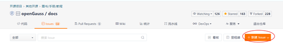

# 提出内容改进意见

如果您发现一个问题、对文档有改进建议，或者您有重大需求需要跟踪，可以通过issue反馈。本节介绍issue如何提交、提交时的注意事项、以及不同类型issue的使用场景。

## 提交issue

您可以在[issue提交](https://gitee.com/opengauss/docs/issues)页面，提交文档相关问题。

1.  在Gitee页面中，“Issue“页签中单击“新建Issue“，进入issue创建页面。

2.  选择issue的类型、在标题栏中描述问题、在编辑框中添加详细问题描述。

> **说明：** 
>**描述问题时，建议您关注以下点：**
>
>-   issue类型的选择请参见[选择issue类型](#section1010815112178)。
>-   提供问题的清晰描述，包括具体缺失、过时、错误的内容或者需要改进的文字。
>-   解释该问题对用户的影响。
>-   将给定问题的范围限定在一个具体内容、任务。如果问题牵涉的领域较大，可以将其分解为多个小一点的问题。例如："文档需要优化" 是一个过于宽泛的问题，而 "XX开发指南缺少对XXX步骤的介绍" 就是一个足够具体的、可操作的问题。
>-   搜索现有问题的列表，查看是否已经有相关的或者类似的问题已被记录。
>-   如果新问题与某其他问题或PR有关联，可以使用其完整 URL 或带 \# 字符的PR编号来引用它。关联方法请参见<u>[https://gitee.com/help/articles/4142\#article-header0](https://gitee.com/help/articles/4142#article-header0)</u>。
>-   在issue中标明涉及版本号，以方便修改时定位问题。例如：master/3.0.0，全量版/轻量版。
>-   提交issue时请遵守行为准则，尊重社区贡献者。例如，“文档很糟糕”是没有帮助或礼貌的反馈。

3.  单击“创建“按钮，提交Issue。

## 选择issue类型

目前使用中的issue类型为如下三种：

-   **缺陷**

    如果您发现了一些缺陷（包括但不限于描述错误、功能性错误、链接跳转不正常、拼写错误），可以选择创建此类型的issue。

    该类型issue包含如下状态，您可以通过查看issue的状态确定此issue的所处的环节。

    -   待办的：issue创建的初始状态。

        > **说明：** 
        >该状态下的issue，如果您有兴趣解决，在评论框输入“/assign”命令认领该issue，并且在页面右侧标明开始时间和结束时间。在结束时间之后，如果issue还未修改，其他贡献者可以重新认领此issue进行修改。

    -   修复中：已经着手开始修复的issue**。**
    -   已完成：已经修改且内容成功合入Docs仓的issue。提PR时，请使用\#+issue号关联PR对应的issue。
    -   已取消：确认为非问题的issue。

-   **需求**

    社区会根据每个版本规划的需求特性提供配套文档（例如开发者指南、管理员指南、发行说明、特性描述等）。这些需求特性部分涉及新增功能特性，部分需求是对现有特性的更新。当这些特性合入代码时，需要在对应版本上修改或者新增对应的文档，可以选择此类型的issue跟踪文档合入。

    > **说明：** 
    >需求类的issue，请注明以下内容：
    >
    >-   关联特性代码PR/issue，可以使用其完整 URL 或带 \# 字符的PR/issue编号来引用它。
    >-   简要说明需要修改或者新增的手册以及内容。
    >-   简要说明该特性以及对用户的影响。
>-   搜索现有问题的列表，确保为非重复问题。
    
该类型issue包含如下状态，您可以通过查看issue的状态确定此issue的所处的环节。
    
-   待办的：issue创建的初始状态。
    
        > **说明：** 
    >该状态下的issue，如果您有兴趣解决，在评论框输入“/assign”命令认领该issue，并且在页面右侧标明开始时间和结束时间。在结束时间之后，如果issue还未修改，其他贡献者可以重新认领此issue进行修改。
    
    -   进行中：issue涉及需求文档正在开发中。
    -   已完成：PR合入时，issue状态会自己转为**已完成**。
    -   已拒绝：不接纳此需求。

-   **咨询**

    您对文档的使用有疑惑或者新想法时，可以选择此类型的issue，Docs SIG组成员会尽力为您解决疑惑。

    该类型issue包含如下状态，您可以通过查看issue的状态确定此issue的所处的环节。

    -   待办的：issue创建的初始状态。
    -   进行中：issue正在确认中。
    -   已完成：咨询者确认issue已经回答且无疑义，选择此状态关闭issue。如果认领人答复后超过3天咨询者没有回复且没有关闭issue，Commiter/Maintainer会关闭此issue。
    -   已取消：问题已取消。

