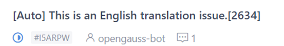

# 文档英文化

openGauss社区为开发者提供中文、英文的官方文档，中文文档完成审核，PR合入之后，会自动生成翻译需求issue，由SIG Docs团队的翻译专家完成英文文档。

翻译专家通过PR提交英文文档，并在PR描述中提供对应的中文需求Issue链接。如果您也有兴趣参与文档英文化，可以参照如下步骤操作。

## 贡献英文文档

1.  识别英文issue。

    中文文档完成审核，PR合入之后，会自动生成翻译需求Issue，您可以在[issue页面](https://gitee.com/opengauss/docs/issues)查看，其中由opengauss-bot生成的带有\[Auto\]标签的为英文issue。

    

2.  认领英文issue。

    找到想要修改的英文issue，在评论框中输入“/assign”命令，将该issue分配给自己。

3.  识别需要翻译内容。
    1.  在issue的正文中有中文PR的链接。
    2.  单击链接，在中文PR页面查看文件修改内容。

4.  翻译并修改英文文档，提交修改。

    > **说明：** 
    >-   在本地文件夹中修改英文文档，并提交修改至openGauss的docs仓。流程与修改中文文档一致，详情请参见[贡献文档](贡献文档.md)。
    >-   docs文件夹中的en文件夹下为英文文档。

5.  修改英文PR提交之后，等待commiter/maintainer评审合入。

    在评审周期内，所有评审意见闭环修改后，该PR通过审核可以合并入仓的必要条件：

    -   文档技术评审专家审核后给出/approve的评论。
    -   英文文档规范性评审专家审核后给出/approve的评论。

