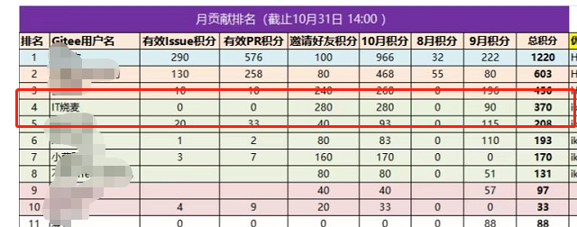
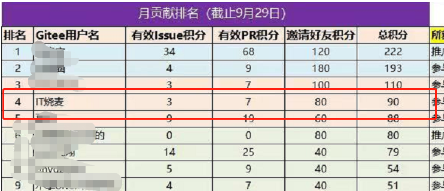

参评人姓名：IT烧麦
理由：
    1、在openGauss docs仓提出了建设性建议的PR1个、sr和1个
    2、积极推广并邀请其他开发者加入openGauss Docs SIG，共邀请18人
举证材料：
sr：https://gitee.com/opengauss/docs/issues/I5S30D
pr：https://gitee.com/opengauss/docs/pulls/2953
邀请人员：

