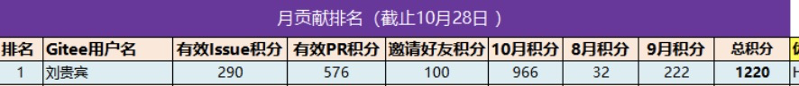
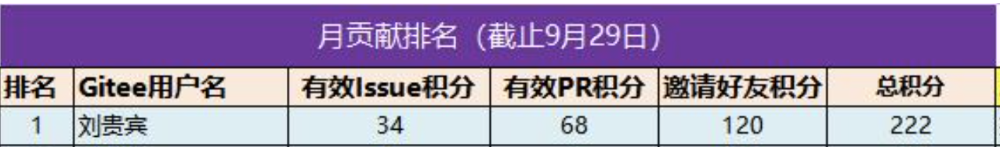
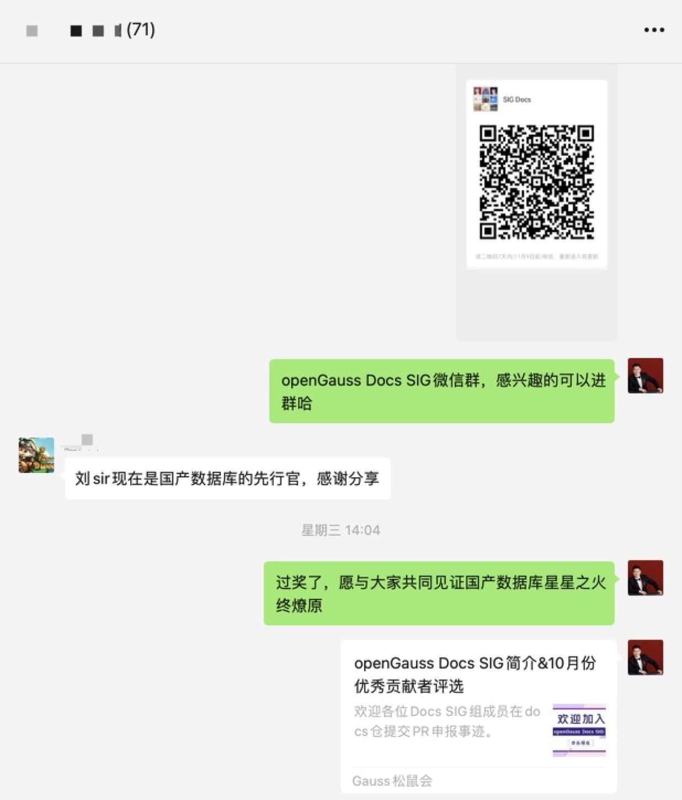
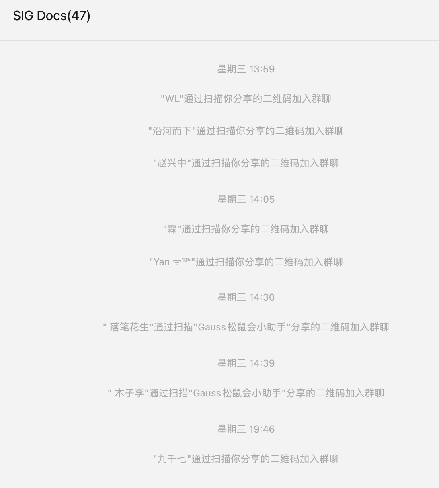
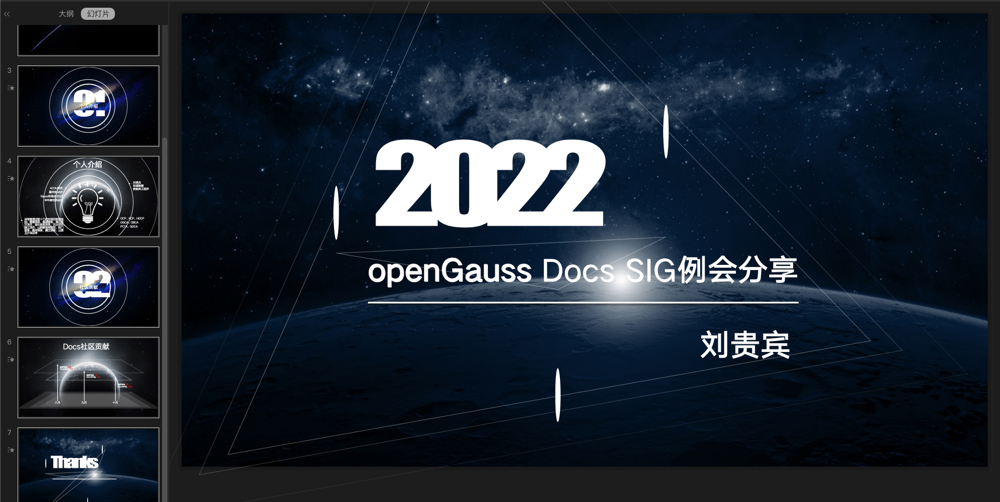

参评人姓名：
刘贵宾

推选理由：
1、积极推广openGauss Docs SIG相关活动，如《openGauss资料捉虫活动》，邀请12位开发者参与到《openGauss资料捉虫活动》
2、积极推广并邀请6位开发者加入openGauss Docs SIG群组
3、在openGauss docs仓共提出325个issue和pr，涉及语句错误、命令错误、格式错误等问题
4、于2022年11月3日下午4点首次参加openGauss Docs SIG组例会，并在zoom中共享屏幕使用PPT分享了个人介绍及社区贡献

举证材料：

