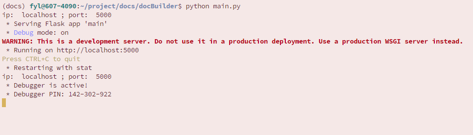
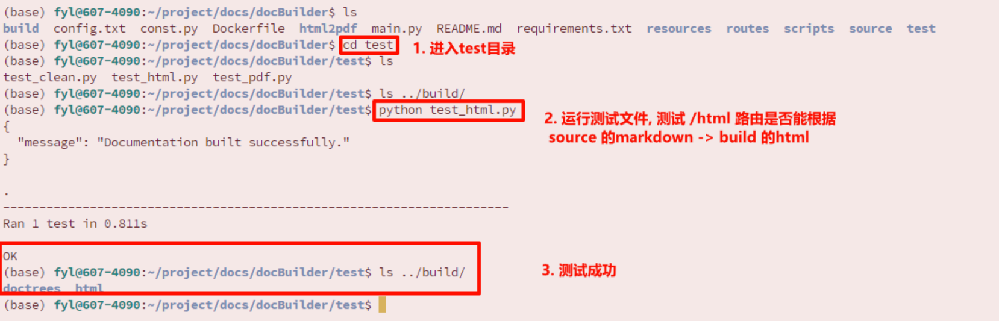
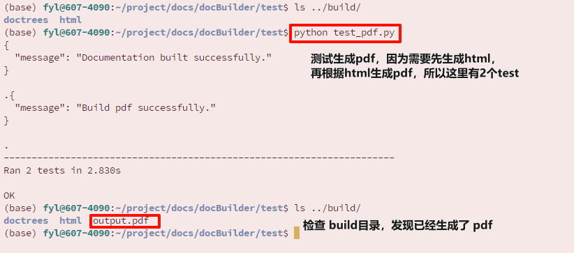
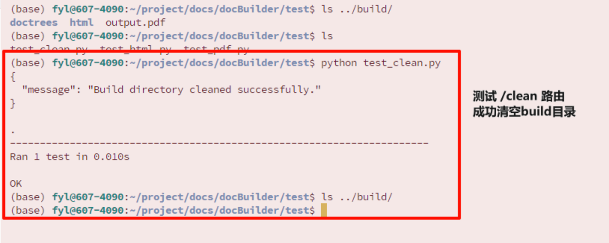
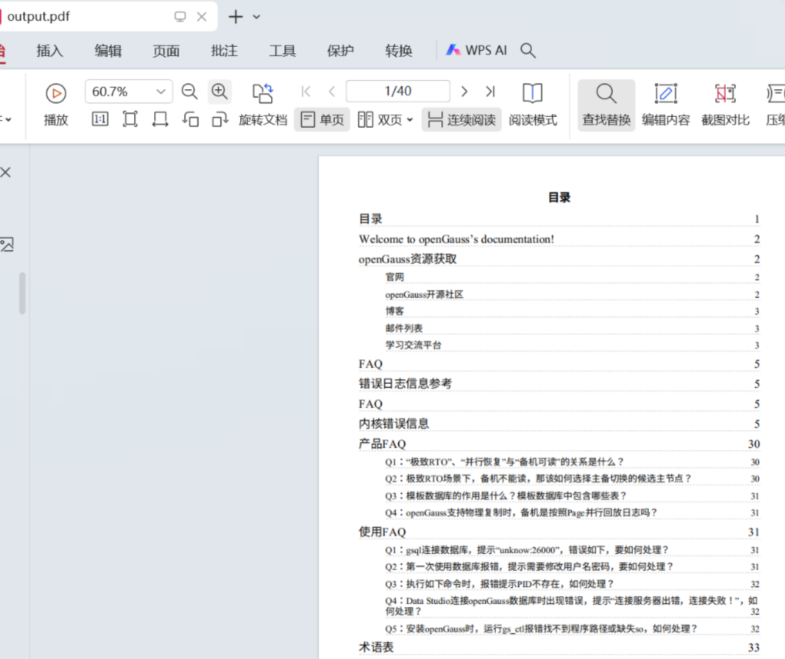
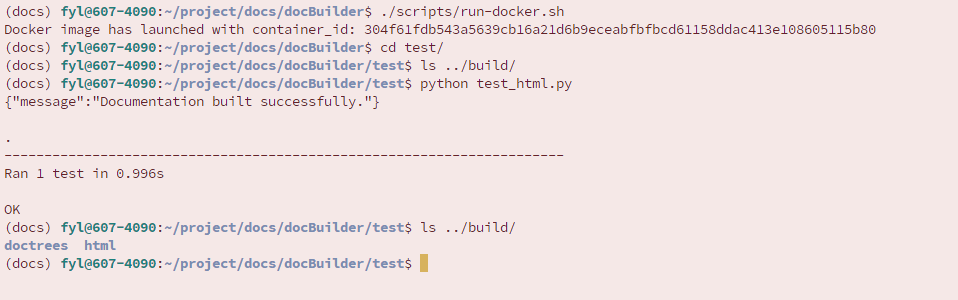
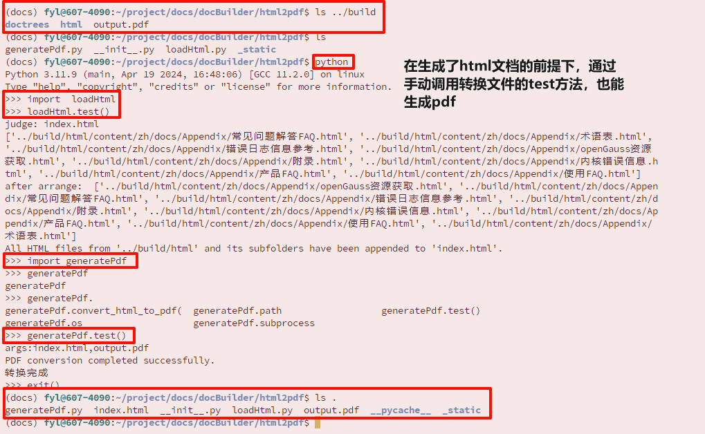
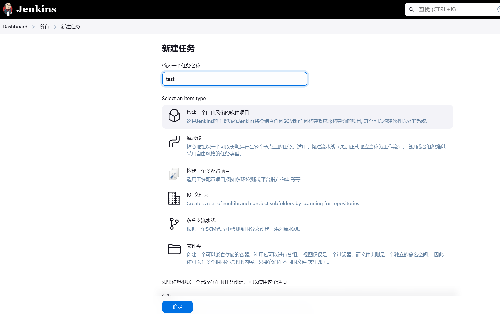
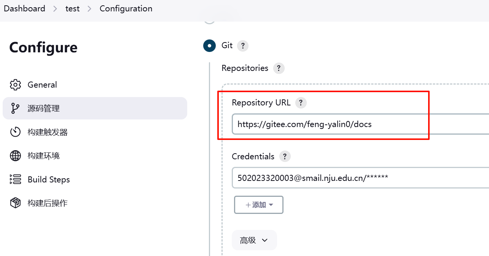
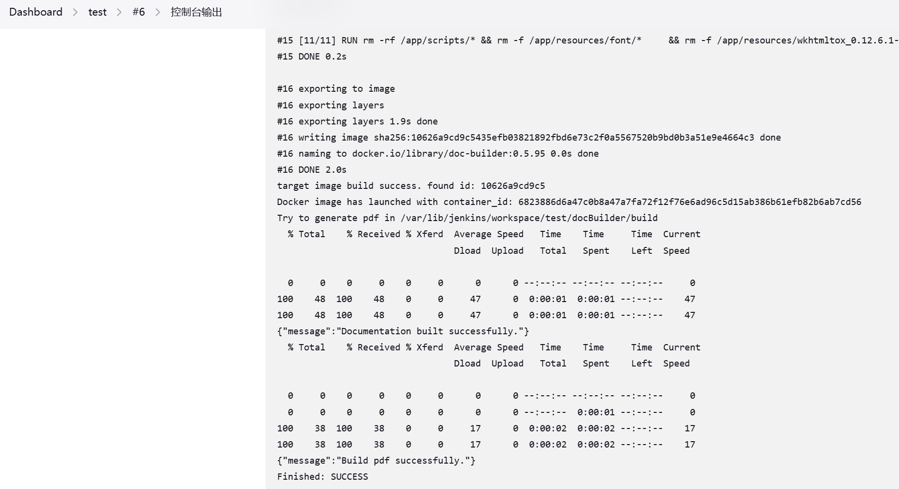

# docBuilder 服务简介

docBuilder 服务用于将markdown格式的文档自动转换为 HTML 和 PDF 格式。

**业务上**，项目主要有以下功能：

- 管理（上传、查看、删除、下载）markdown 格式的文件
- 将 markdown 格式的文本文件转换为 html 或 pdf 格式
- 管理转换生成的html、pdf 文件


**从项目开发维护、项目设计的角度**，docBuilder目录包括以下几个部分：

1. 文档（README.md）
2. OSPP 2023 迭代留下的脚本文件
3. flask微服务
   1. 实现业务功能
   2. 单元测试
4. Docker：Dockerfile和构建镜像所需的资源文件
   
5. Jenkins CI/CD 逻辑：获取源代码变更，使用参数管理镜像信息，并通过 build steps 构建和运行镜像，最后生成 pdf


# 应用环境：生成 pdf
有3种方式使用docBuilder服务：
1. 使用 Flask 微服务
2. 通过 Docker 使用微服务 
3. 通过脚本使用


## 1. 通过 Flask 使用 

### 依赖和启动Flask

如果要直接在服务器上启动Flask微服务，我们首先需要安装python、flask及相关依赖，依赖都记录在 requirements.txt 文件。
推荐基于 python 3.11.x 或 3.12.x 配置环境。

```bash
$ git clone <docs-repo-url>
$ cd docs/docBuilder
$ python --version
Python 3.11.9
$ pip install -i https://mirrors.aliyun.com/pypi/simple/  --no-cache-dir -r requirements.txt
```

安装好后，直接在 `docBuilder`  目录下执行 Flask服务端：

```bash
$ python main.py
```

注意 ip 和 端口都是使用的默认值（localhost:5000），要避免端口冲突。



### 测试

打开一个新的bash，进入test目录，运行测试文件（可以模拟客户端的请求）：
```bash
$ cd test
$ python test_html.py
$ python test_pdf.py
$ python test_clean.py
```

- 测试生成html：python test_html.py 




- 测试生成pdf：python test_pdf.py 




- 测试清空build目录




- 检查生成的pdf文件，没有问题




## 2. 通过 Docker 容器使用

### 运行镜像
如果要通过docker在服务器上启动docker-Flask服务，我们首先需要安装docker，并且拥有相关权限。

我们在制作好镜像后（见本文的【开发环境—2. 制作镜像】一节），可以参考下面的命令运行docker容器：

```bash
docker run -d -p 5000:5000 -v ./build:/app/build "$name:$version"
```

注意：

- "$name:$version" 是对应的镜像名称和版本号；
- `-v`选项将build目录进行了映射，便于管理容器生成的文件。
- -p 选项的 5000:5000，前者是宿主机的端口号；后者是容器内部的Flask服务 默认占用的端口


### 测试

- 使用 docker run运行（图中的run-docker.sh即执行docker run命令），cd进入test目录执行 test_html.py：




测试成功。


## 3. 通过脚本使用

### 3.1	使用 Sphinx 和 html2pdf 

OSPP 2023 版的docBuilder 通过调用脚本来转换格式。

脚本使用`Sphinx`实现 markdown 到 html 的转换；通过 wkhtmltopdf 和python脚本，实现 html 到 pdf 的转换。

可以参考`docBuilder/scripts/Makefile`里的写法，实现从 source中的 markdown 文件 -> build 中的 html 文件 的转换。

```makefile
SPHINXBUILD   ?= sphinx-build
SOURCEDIR     = source
BUILDDIR      = build

...
@$(SPHINXBUILD) -M $@ "$(SOURCEDIR)" "$(BUILDDIR)" $(SPHINXOPTS) $(O)
```

在 `build`目录生成了 `html`和`doctrees`这些中间文件之后，可以使用图中方式在`html2pdf`目录（而非`build`）生成pdf文件：



命令如下：

```bash
# 必须先生成html，才能接着转换pdf
docBuilder/html2pdf$ ls ../build
> doctrees html

# 运行python，执行两个test方法
docBuilder/html2pdf$ python
> import loadHtml
> loadHtml.test()
> import generatePdf
> generatePdf.test()
```


### 3.2	参考 OSPP 2023 脚本

OSPP 2023 版本为脚本逻辑编写了详尽的README。可以进入目录`scripts`：

```bash
$ cd docs/docBuilder/scripts
.../docs/docBuilder/scripts$ ls
make.bat  Makefile  README.md
```

拷贝该目录下的`make.bat`和 ` Makefile`到 docBuilder/ ，然后参考 scripts/README.md 即可。

或者也可以使用 `git reset/ git checkout -b <branch_name> <commit_id>` 回退到提交 `20aef52f7aadfe42f02bdccb350823163c0ad794`，使用项目在OSPP 2023迭代中的逻辑。


# 开发环境

## 1.  Docker 逻辑：制作镜像

在制作镜像前，我们首先需要安装docker，并且拥有相关权限。

要注意，使用docker 制作/上传/pull镜像时，很非常容易出现网络问题。

> 如果安装依赖使用pypi和docker镜像的国外源，那么可能需要配置代理和国内镜像仓库，docker镜像仓库推荐配置 `DaoCloud` (2024.09)，pypi的国内源则有很多。
> 但在本项目的Dockerfile里，pip install命令已经配置了阿里云的国内pypi镜像，所以构建镜像时不需要代理。

- 制作镜像命令

```bash
$ cd docBuilder
$ docker build --network=host --no-cache -t $name:$version .
```

"$name:$version" 是想要构建的docker 镜像名称和版本号；'.' 指向具有 `Dockerfile`文件的目录


## 2. Jenkins 逻辑：从源代码到 pdf

Jenkins Project 有多种配置方式，本项目推荐使用自由风格式项目 (freestyle)。该服务的业务比较简单，不需要复杂配置。流水线（pipeline）的效率远低于 freestyle风格，没有必要。


以下介绍如何使用 Jenkins，实现从源代码变更到 pdf 生成的全流程和周期。

1. 启动 Jenkins，访问 Jenkins 页面

**注意，**build steps里执行的脚本会调用 docker。所以jenkins服务需要具有调用 docker的权限，一般情况下是将用户 jenkins 加入到docker用户组中。


2. 创建自由风格项目并配置




- 指定 git repository & branch：


https://gitee.com/opengauss/docs [branch]

- 测试时可以使用：

https://gitee.com/feng-yalin0/docs 的 master 分支

- Jenkins构建参数

（均为字符型参数）

| 参数名        | 默认值      | 描述                               |
| ------------- | ----------- | ---------------------------------- |
| IMAGE_NAME    | doc-builder | 传入本次构建的镜像名称（必须小写） |
| IMAGE_VERSION | 0.5.95      | 传入本次构建的镜像tag              |

- build steps 参考：


```bash
#!/bin/bash
# 打印当前目录，切换到 docBuilder 目录(debug)
pwd
ls
if [ -d "./docBuilder" ]; then
    cd ./docBuilder
    echo "Now build script entered docBuilder directory."
else
    echo "Directory 'docBuilder' not found"
    exit 1
fi

# 1. 构建镜像
docker build --network=host --no-cache -t $IMAGE_NAME:$IMAGE_VERSION .

# 2. 获取对应名称和版本号的 docker 镜像 id
IMAGE_ID=$(docker images --quiet  $IMAGE_NAME:$IMAGE_VERSION)
if [ -z "$IMAGE_ID" ]; then
    echo "build failed. no target image id found"
    exit 1
else
    echo "target image build success. found id: $IMAGE_ID"
fi

# 3. 运行镜像，捕获输出，同时将服务器上的字体目录挂载到容器内
CURRENT_DIR=$(pwd)
#SERVER_FONT_DIR="/usr/share/fonts/"
RUN_OUTPUT=$(docker run -d -p ${PORT}:5000 \
-v ${CURRENT_DIR}/build:/app/build \
--rm "$IMAGE_NAME:$IMAGE_VERSION")

# 4. 运行成功则尝试生成 pdf
if [ $? -eq 0 ]; then
    CONTAINER_ID=$(echo "$RUN_OUTPUT" | awk '{print $NF}')
    echo "Docker image has launched with container_id: ${CONTAINER_ID}"
    sleep 1
    echo "Try to generate pdf in ${CURRENT_DIR}/build"
    # fc-cache 更新字体缓存; curl 给微服务发送信息
    docker exec ${CONTAINER_ID} /bin/sh -c "fc-cache -fv && curl http://127.0.0.1:5000/html && curl http://127.0.0.1:5000/pdf"
else
    echo "Failed to start container. Reason: $RUN_OUTPUT"
fi
```

如果使用该配置，执行完会在 build目录下生成目标结果 "output.pdf"。


- **注意**

1. 再次提醒，Jenkins服务要能调用宿主机的docker服务，一般情况下是宿主机上需要将用户`jenkins`加入到docker的用户组中。
2. 服务的 ip 和 port 是使用的默认值 localhost 和 5000。注意避免端口冲突。
3. 上文的build step是clone repository以后，在目录里制作镜像 image，然后运行以image为基础的容器；如果我们将某个 image 上传到镜像仓库中，那么可以直接使用 docker pull xxx_image 来获得镜像，就不需要第一步 【1. 构建镜像】了。


3. 测试：

指定仓库（无论是哪个分支或fork仓库，GIT REPOSITORY 一定是指向 docs 这个目录的）：




4. 测试成功
- 使用上文的jenkins配置，参数化执行:




# 设计说明

- 微服务依赖
微服务的依赖记录在 `requirements.txt` 之中，其中主要包括 轻量级Web服务器框架 Flask、处理网络请求的 requests、解析 HTML/XML 的 beautifulsoup4 、处理转换逻辑的 Sphinx及其依赖wkhtmltopdf等第三方库。


- 微服务实现

1. main.py: 启动 flask
2. routes：处理Flask路由
	1. doc.py：管理文档（上传、下载与转换）
	2. file_management: 处理服务管理的文件（用于远程上传或下载文件）
	3. help.py：返回提示信息
3. const.py: 定义与寻址和路径相关的常数
4. html2pdf: 逻辑转换
html2pdf/generatePdf.py: markdown -> html -> pdf；依赖 loadHtml
html2pdf/loadHtml.py: markdown -> html

5. test/test_xxx.py：单元测试文件


- 为什么使用 Docker镜像？

使用 Docker 好处在于，生产环境只需要docker，不需要处理复杂的依赖问题，极大简化了部署流程。
此外，Docker 镜像比虚拟机更加轻量级，节省了系统资源，速度快。


-  Dockerfile

基于 requirements.txt ，我们可以很方便地编写 Dockerfile。

Dockerfile 基于 `python:3.12.5-slim-bullseye` 镜像，更新相关依赖，设置工作目录 /app，然后在工作目录执行`pip install -i <mirror> --no-cache-dir -r requirements.txt`，在容器内部安装依赖。最后复制剩余源代码到容器中，设置一些参数，就完成了构建。


- 参数和脚本

秉持一种设计思想：固定不变的流程，让变化的部分更改成本最低。
docker镜像的构建基于jenkins的参数化构建，其中的可变参数即`IMAGE_NAME`和`IMAGE_VERSION`，便于修改。


- 资源文件归类

在资源文件目录 resources 中保存了：jenkins 相关的配置说明（build steps等）、镜像依赖安装包（wkhtmltopdf）以及该markdown的图片文件（README_IMG），转换需要的字体文件（font）等。


# 其他

在使用过程中，如需更多帮助，请查阅相关文档或联系项目维护者。