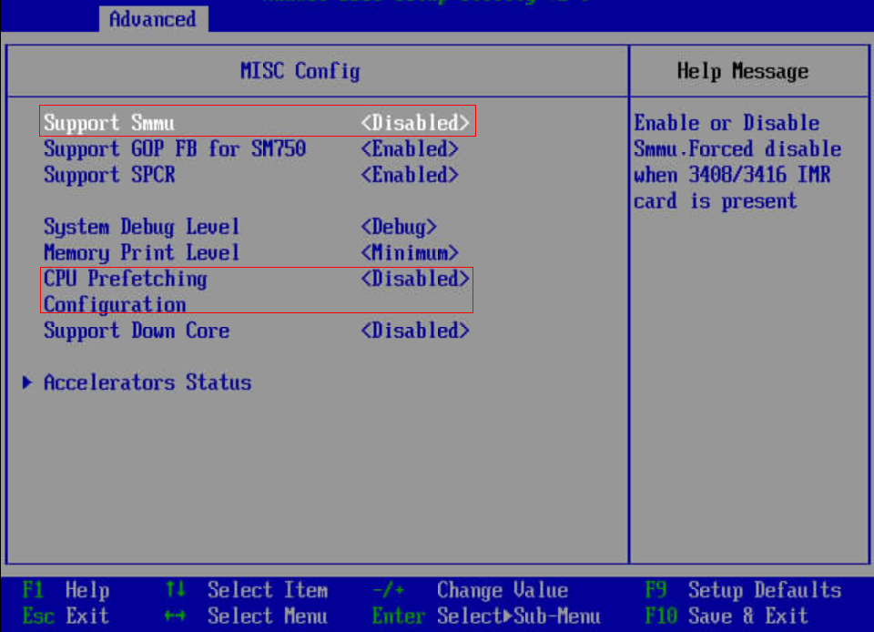
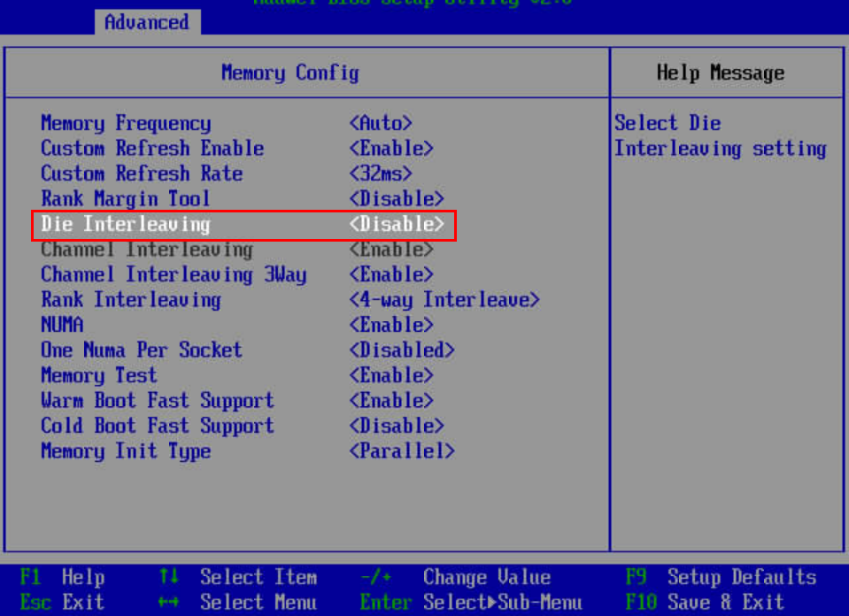
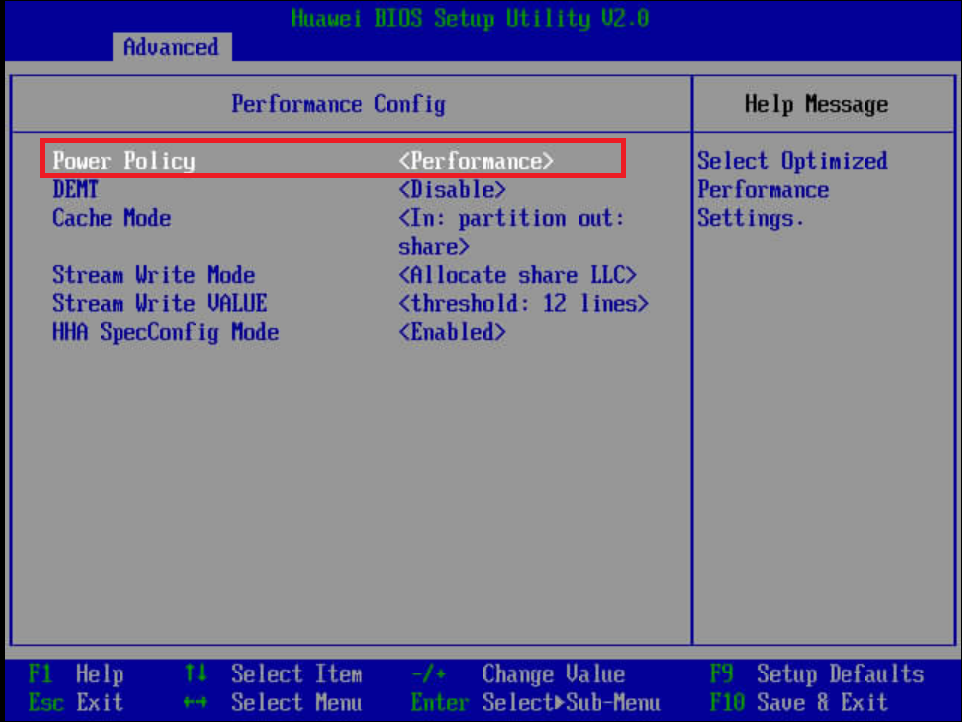

# MOT Deployment

## MOT Server Optimization – x86<a name="EN-US_TOPIC_0289900027"></a>

Generally, databases are bounded by the following components –

- **CPU –**  A faster CPU speeds up any CPU-bound database.
- **Disk –**  High-speed SSD/NVME speeds up any I/O-bound database.
- **Network –**  A faster network speeds up any  **SQL\*Net**-bound database.

In addition to the above, the following general-purpose server settings are used by default and may significantly affect a database's performance.

MOT performance tuning is a crucial step for ensuring fast application functionality and data retrieval. MOT can utilize state-of-the-art hardware, and therefore it is extremely important to tune each system in order to achieve maximum throughput.

The following are optional settings for optimizing MOT database performance running on an Intel x86 server. These settings are optimal for high throughput workloads –

### BIOS<a name="en-us_topic_0283136603_en-us_topic_0270171556_section318382161118"></a>

- Hyper Threading – ON

    Activation \(HT=ON\) is highly recommended.

    We recommend turning hyper threading ON while running OLTP workloads on MOT. When hyper‑threading is used, some OLTP workloads demonstrate performance gains of up to40%.

### OS Environment Settings<a name="en-us_topic_0283136603_en-us_topic_0270171556_section13692132341213"></a>

- NUMA

    Disable NUMA balancing, as described below. MOT performs its own memory management with extremely efficient NUMA-awareness, much more than the default methods used by the operating system.

    ```
    echo 0 > /proc/sys/kernel/numa_balancing
    ```

- Services

    Disable Services, as described below –

    ```
    service irqbalance stop           # MANADATORY
    service sysmonitor stop           # OPTIONAL, performance 
    service rsyslog stop       # OPTIONAL, performance
    ```

- Tuned Service

    The following section is mandatory.

    The server must run the throughput-performance profile –

    ```
    [...]$ tuned-adm profile throughput-performance 
    ```

    The  **throughput-performance**  profile is broadly applicable tuning that provides excellent performance across a variety of common server workloads.

    Other less suitable profiles for openGauss and MOT server that may affect MOT's overall performance are – balanced, desktop, latency-performance, network-latency, network-throughput and powersave.

- Sysctl

    The following lists the recommended operating system settings for best performance.

    - Add the following settings to /etc/sysctl.conf and run sysctl -p

        ```
        net.ipv4.ip_local_port_range = 9000 65535
        kernel.sysrq = 1
        kernel.panic_on_oops = 1
        kernel.panic = 5
        kernel.hung_task_timeout_secs = 3600
        kernel.hung_task_panic = 1
        vm.oom_dump_tasks = 1
        kernel.softlockup_panic = 1
        fs.file-max = 640000
        kernel.msgmnb = 7000000
        kernel.sched_min_granularity_ns = 10000000
        kernel.sched_wakeup_granularity_ns = 15000000
        kernel.numa_balancing=0
        vm.max_map_count = 1048576
        net.ipv4.tcp_max_tw_buckets = 10000
        net.ipv4.tcp_tw_reuse = 1
        net.ipv4.tcp_tw_recycle = 1
        net.ipv4.tcp_keepalive_time = 30
        net.ipv4.tcp_keepalive_probes = 9
        net.ipv4.tcp_keepalive_intvl = 30
        net.ipv4.tcp_retries2 = 80
        kernel.sem = 250 6400000 1000 25600
        net.core.wmem_max = 21299200
        net.core.rmem_max = 21299200
        net.core.wmem_default = 21299200
        net.core.rmem_default = 21299200
        #net.sctp.sctp_mem = 94500000 915000000 927000000
        #net.sctp.sctp_rmem = 8192 250000 16777216
        #net.sctp.sctp_wmem = 8192 250000 16777216
        net.ipv4.tcp_rmem = 8192 250000 16777216
        net.ipv4.tcp_wmem = 8192 250000 16777216
        net.core.somaxconn = 65535
        vm.min_free_kbytes = 26351629
        net.core.netdev_max_backlog = 65535
        net.ipv4.tcp_max_syn_backlog = 65535
        #net.sctp.addip_enable = 0
        net.ipv4.tcp_syncookies = 1
        vm.overcommit_memory = 0
        net.ipv4.tcp_retries1 = 5
        net.ipv4.tcp_syn_retries = 5
        ```

    - Update the section of /etc/security/limits.conf to the following –

        ```
        <user> soft nofile 100000
        <user> hard nofile 100000
        ```

    The  **soft**  and a  **hard**  limit settings specify the quantity of files that a process may have opened at once. The soft limit may be changed by each process running these limits up to the hard limit value.

- Disk/SSD

    The following describes how to ensure that disk R/W performance is suitable for database synchronous commit mode.

    To do so, test your disk bandwidth using the following

    ```
    [...]$ sync; dd if=/dev/zero of=testfile bs=1M count=1024; sync
    1024+0 records in
    1024+0 records out
    1073741824 bytes (1.1 GB) copied, 1.36034 s, 789 MB/s 
    ```

    In case the disk bandwidth is significantly below the above number \(789 MB/s\), it may create a performance bottleneck for openGauss, and especially for MOT.

### Network<a name="en-us_topic_0283136603_en-us_topic_0270171556_section77145406184"></a>

Use a 10Gbps network or higher.

To verify, use iperf, as follows –

```
Server side: iperf -s
Client side: iperf -c <IP>
```

- rc.local – Network Card Tuning

    The following optional settings have a significant effect on performance –

    1. Copy set\_irq\_affinity.sh from  [https://gist.github.com/SaveTheRbtz/8875474](https://gist.github.com/SaveTheRbtz/8875474)  to /var/scripts/.
    2. Put in /etc/rc.d/rc.local and run chmod in order to ensure that the following script is executed during boot –

        ```
        'chmod +x /etc/rc.d/rc.local' 
        var/scripts/set_irq_affinity.sh -x all <DEVNAME>
        ethtool -K <DEVNAME> gro off
        ethtool -C <DEVNAME> adaptive-rx on adaptive-tx on
        Replace <DEVNAME> with the network card, i.e. ens5f1
        ```

## MOT Server Optimization – ARM Huawei Taishan 2P/4P<a name="EN-US_TOPIC_0289900749"></a>

The following are optional settings for optimizing MOT database performance running on an ARM/Kunpeng-based Huawei Taishan 2280 v2 server powered by 2-sockets with a total of 256 Cores<sup>\[</sup><sup>[Comparison: Disk vs. MOT](comparison_disk_vs_mot.md)</sup><sup>\]</sup>  and Taishan 2480 v2 server powered by 4-sockets with a total of 256 Cores<sup>\[</sup>[Comparison: Disk vs. MOT](comparison_disk_vs_mot.md)<sup>\]</sup>.

Unless indicated otherwise, the following settings are for both client and server machines –

### BIOS<a name="en-us_topic_0283136697_en-us_topic_0270171568_section191581414102218"></a>

Modify related BIOS settings, as follows –

1. Select  **BIOS**  è  **Advanced**  è  **MISC Config**. Set  **Support Smmu**  to  **Disabled**.
2. Select  **BIOS**  è  **Advanced**  è  **MISC Config**. Set  **CPU Prefetching Configuration**  to  **Disabled**.

    

3. Select  **BIOS**  è  **Advanced**  è  **Memory Config**. Set  **Die Interleaving**  to  **Disabled**.

    

4. Select  **BIOS**  è  **Advanced**  è  **Performance Config**. Set  **Power Policy**  to  **Performance**.

    

### OS – Kernel and Boot<a name="en-us_topic_0283136697_en-us_topic_0270171568_section5765175572217"></a>

- The following operating system kernel and boot parameters are usually configured by a sysadmin.

    Configure the kernel parameters, as follows –

    ```
    net.ipv4.ip_local_port_range = 9000 65535
    kernel.sysrq = 1
    kernel.panic_on_oops = 1
    kernel.panic = 5
    kernel.hung_task_timeout_secs = 3600
    kernel.hung_task_panic = 1
    vm.oom_dump_tasks = 1
    kernel.softlockup_panic = 1
    fs.file-max = 640000
    kernel.msgmnb = 7000000
    kernel.sched_min_granularity_ns = 10000000
    kernel.sched_wakeup_granularity_ns = 15000000
    kernel.numa_balancing=0
    vm.max_map_count = 1048576
    net.ipv4.tcp_max_tw_buckets = 10000
    net.ipv4.tcp_tw_reuse = 1
    net.ipv4.tcp_tw_recycle = 1
    net.ipv4.tcp_keepalive_time = 30
    net.ipv4.tcp_keepalive_probes = 9
    net.ipv4.tcp_keepalive_intvl = 30
    net.ipv4.tcp_retries2 = 80
    kernel.sem = 32000 1024000000      500     32000
    kernel.shmall = 52805669
    kernel.shmmax = 18446744073692774399
    sys.fs.file-max = 6536438
    net.core.wmem_max = 21299200
    net.core.rmem_max = 21299200
    net.core.wmem_default = 21299200
    net.core.rmem_default = 21299200
    net.ipv4.tcp_rmem = 8192 250000 16777216
    net.ipv4.tcp_wmem = 8192 250000 16777216
    net.core.somaxconn = 65535
    vm.min_free_kbytes = 5270325
    net.core.netdev_max_backlog = 65535
    net.ipv4.tcp_max_syn_backlog = 65535
    net.ipv4.tcp_syncookies = 1
    vm.overcommit_memory = 0
    net.ipv4.tcp_retries1 = 5
    net.ipv4.tcp_syn_retries = 5
    ##NEW
    kernel.sched_autogroup_enabled=0
    kernel.sched_min_granularity_ns=2000000
    kernel.sched_latency_ns=10000000
    kernel.sched_wakeup_granularity_ns=5000000
    kernel.sched_migration_cost_ns=500000
    vm.dirty_background_bytes=33554432
    kernel.shmmax=21474836480
    net.ipv4.tcp_timestamps = 0
    net.ipv6.conf.all.disable_ipv6=1
    net.ipv6.conf.default.disable_ipv6=1
    net.ipv4.tcp_keepalive_time=600
    net.ipv4.tcp_keepalive_probes=3
    kernel.core_uses_pid=1
    ```

- Tuned Service

    The following section is mandatory.

    The server must run a throughput-performance profile –

    ```
    [...]$ tuned-adm profile throughput-performance
    ```

    The  **throughput-performance**  profile is broadly applicable tuning that provides excellent performance across a variety of common server workloads.

    Other less suitable profiles for openGauss and MOT server that may affect MOT's overall performance are – balanced, desktop, latency-performance, network-latency, network-throughput and powersave.

- Boot Tuning

    Add  **iommu.passthrough=1**  to the  **kernel boot arguments**.

    When operating in  **pass-through**  mode, the adapter does require  **DMA translation to the memory,**  which improves performance.
