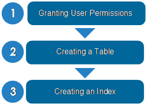

# MOT Usage

Using MOT tables is quite simple and is described in the few short sections below.

openGauss enables an application to use of MOT tables and standard disk-based tables. You can use MOT tables for your most active, high-contention and throughput-sensitive application tables or you can use MOT tables for all your application's tables.

The following commands describe how to create MOT tables and how to convert existing disk-based tables into MOT tables in order to accelerate an application's database-related performance. MOT is especially beneficial when applied to tables that have proven to be bottlenecks.

Workflow Overview

The following is a simple overview of the tasks related to working with MOT tables –

- [Granting User Permissions](granting_user_permissions.md)
- [Creating/Deleting an MOT](creating_dropping_an_mot_table.md)
- **Creating an Index for an MOT Table**
- This section also describes how to perform various additional MOT-related tasks, as well as  [MOT SQL Coverage and Limitations](mot_sql_coverage_and_limitations.md)  –

- **[Granting User Permissions](granting_user_permissions.md)**  

- **[Creating/Deleting an MOT](creating_dropping_an_mot_table.md)**  

- **[Creating an Index for an MOT](creating_an_index_for_an_mot_table.md)**  

- **[Converting a Disk Table into an MOT](converting_a_disk_table_into_an_mot_table.md)**  

- **[Query Native Compilation](query_native_compilation.md)**  

- **[Retrying an Aborted Transaction](retrying_an_aborted_transaction.md)**  

- **[MOT External Support Tools](mot_external_support_tools.md)**  

- **[MOT SQL Coverage and Limitations](mot_sql_coverage_and_limitations.md)**  
