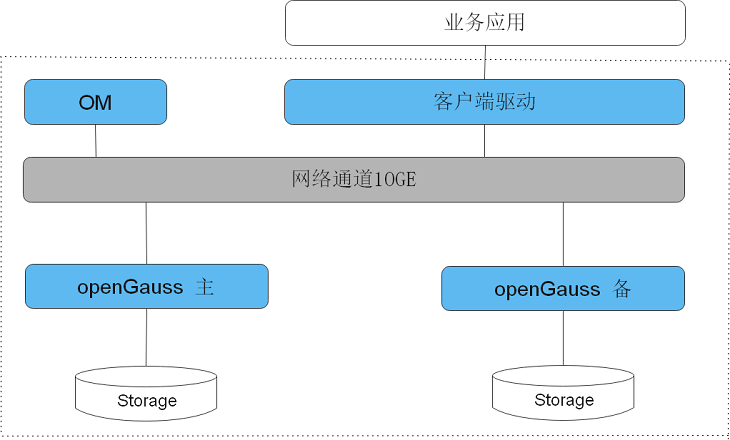

# 产品描述

本文档对openGauss数据库进行了详细描述，包含产品定位、系统架构介绍、应用场景、运行环境、技术指标、基本功能和特性、企业级增强特性介绍等信息。

## 产品定位

openGauss是一款支持SQL2003标准语法，支持主备部署的高可用多模数据库。

- 支持多种数据模型（如关系型、图结构、向量、全文搜索等），满足多样化的业务需求。
- 多种存储模式支持复合业务场景，新引入提供原地更新存储引擎。
- NUMA化数据结构支持高性能。
- 主备模式，CRC校验支持高可用。
- 支持账本数据库等安全特性，提供全方位端到端的数据安全保护。
- 通过Table Access Method接口层支持多存储引擎。

openGauss是一款提供面向多核的极致性能、全链路的业务和数据安全、基于AI的调优和高效运维的能力，全面友好开放，携手伙伴共同打造全球领先的企业级开源多模数据库，采用木兰宽松许可证v2发行。openGauss深度融合华为在数据库领域多年的研发经验，结合企业级场景需求，持续构建竞争力特性。

## 技术特点

openGauss相比其他数据库主要有多存储模式，NUMA化内核结构和高可用等产品特点。

- 多存储模式
    - 行存储，支持业务数据频繁更新场景；行存中支持融合引擎（Ustore）和原有的Astore。
    - 列存储，支持业务数据追加和分析场景。

- NUMA化内核结构
    - 关键数据结构分区，降低数据访问冲突。
    - 关键数据结构NUMA化，降低数据结构访问时延。
    - 关键业务线程绑核，避免核间线程漂移。

- 高可用
    - 支持主备同步，异步多种部署模式。
    - 数据页CRC校验，损坏数据页通过备机自动修复。

- 高安全性

    支持访问控制、加密认证、数据库审计、动态数据脱敏等安全特性，提供全方位端到端的数据安全保护。

## 系统架构

openGauss是单机系统，在这样的系统架构中，业务数据存储在单个物理节点上，数据访问任务被推送到服务节点执行，通过服务器的高并发，实现对数据处理的快速响应。同时通过日志复制可以把数据复制到备机，提供数据的高可靠和读扩展。

openGauss是单机系统，支持主备部署。

openGauss逻辑架构如[图1](#zh-cn_topic_0283136530_zh-cn_topic_0237080634_zh-cn_topic_0231764167_fig5205420191411)所示。

**图 1**  openGauss逻辑架构图  

**表 1**  架构说明

| 名称 | 描述 |
|------|------|
| OM | 运维管理模块（Operation Manager）。提供数据库日常运维、配置管理的管理接口、工具。 |
| 客户端驱动 | 客户端驱动（Client Driver）。负责接收来自应用的访问请求，并向应用返回执行结果。客户端驱动负责与 openGauss 实例通信，发送应用的 SQL 命令，接收 openGauss 实例的执行结果。 |
| openGauss（主备） | openGauss 主备（Datanode）。负责存储业务数据、执行数据查询任务以及向客户端返回执行结果。 openGauss 实例包含主、备两种类型，支持一主多备。建议将主、备 openGauss 实例分散部署在不同的物理节点中。 |
| Storage | 服务器的本地存储资源，持久化存储数据。 |

## 应用场景

- 交易型应用

    大并发、大数据量、以联机事务处理为主的交易型应用，如电商、金融、O2O、电信CRM/计费等，应用可按需选择不同的主备部署模式。

- 物联网数据

    在工业监控和远程控制、智慧城市的延展、智能家居、车联网等物联网场景下，传感监控设备多，采样率高，数据存储为追加模型，操作和分析并重的场景。
