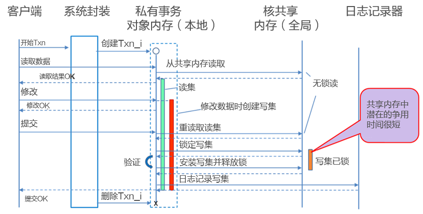

# MOT并发控制机制<a name="ZH-CN_TOPIC_0289900650"></a>

通过大量研究，我们找到了最佳的并发控制机制，结论为：基于SILO<sup>\[</sup>的OCC算法是MOT中最符合ACID特性的OCC算法。SILO为满足MOT的挑战性需求提供了最好的基础。

>[!NOTE]说明
>
>MOT完全符合原子性、一致性、隔离性、持久性（ACID）特性，如[MOT简介](mot_introduction.md)所述。

下面介绍MOT的并发控制机制。

## MOT本地内存和全局内存<a name="ZH-CN_TOPIC_0289900476"></a>

SILO管理本地内存和全局内存，如所示。

- 全局内存是所有核共享的长期内存，主要用于存储所有的表数据和索引。
- 本地内存是短期内存，主要由会话使用，用于处理事务及将数据更改存储到事务内存中，直到提交阶段。

当事务需要更改时，SILO将该事务的所有数据从全局内存复制到本地内存。使用OCC方法，全局内存中放置的是最小的锁，因此争用时间极短。事务更改完成后，该数据从本地内存回推到全局内存中。

本地内存与SILO增强并发控制的基本交互式事务流如下所示：

**图 1**  私有（本地）内存（每个事务）和全局内存（所有核的所有事务）<a name="zh-cn_topic_0283136457_zh-cn_topic_0280525155_fig18716015"></a>  


具体请参见_Industrial-Strength OLTP Using Main Memory and Many-cores_<sup>\[</sup>[对比：磁盘与MOT](comparison_disk_vs_mot.md)<sup>\]</sup>。

## MOT SILO增强特性<a name="ZH-CN_TOPIC_0289900804"></a>

SILO<sup>\[</sup>[对比：磁盘与MOT](comparison_disk_vs_mot.md)<sup>\]</sup>凭借其基本算法流程，优于我们在研究实验中测试的许多其他符合ACID的OCC算法。然而，为了使SILO成为产品级机制，我们必须用许多在最初设计中缺失的基本功能来增强它，例如：

- 新增对交互式事务的支持，其中事务的SQL运行在客户端实现，而不是作为服务器端的单个步骤运行。
- 新增乐观插入
- 新增对非唯一索引的支持
- 新增对事务中写后读校验（RAW）的支持，使用户能够在提交之前查看更改
- 新增对无锁协同垃圾回收的支持
- 新增对无锁检查点的支持
- 新增对快速恢复的支持
- 新增对两阶段提交的支持

在不破坏原始SILO的可扩展特性的前提下添加这些增强是非常具有挑战性的。

## MOT隔离级别<a name="ZH-CN_TOPIC_0289900771"></a>

即使MOT完全兼容ACID，openGauss 1.0并非支持所有的隔离级别。下表介绍了各隔离级别，以及MOT支持和不支持的内容。

**表 1**  隔离级别

<a name="zh-cn_topic_0283137490_zh-cn_topic_0280525158_table9960143"></a>
<table><thead align="left"><tr id="zh-cn_topic_0283137490_zh-cn_topic_0280525158_row28427054"><th class="cellrowborder" valign="top" width="24.242424242424242%" id="mcps1.2.3.1.1"><p id="zh-cn_topic_0283137490_zh-cn_topic_0280525158_p20890046"><a name="zh-cn_topic_0283137490_zh-cn_topic_0280525158_p20890046"></a><a name="zh-cn_topic_0283137490_zh-cn_topic_0280525158_p20890046"></a>隔离级别</p>
</th>
<th class="cellrowborder" valign="top" width="75.75757575757575%" id="mcps1.2.3.1.2"><p id="zh-cn_topic_0283137490_zh-cn_topic_0280525158_p14372146"><a name="zh-cn_topic_0283137490_zh-cn_topic_0280525158_p14372146"></a><a name="zh-cn_topic_0283137490_zh-cn_topic_0280525158_p14372146"></a>说明</p>
</th>
</tr>
</thead>
<tbody><tr id="zh-cn_topic_0283137490_zh-cn_topic_0280525158_row23293171"><td class="cellrowborder" valign="top" width="24.242424242424242%" headers="mcps1.2.3.1.1 "><p id="zh-cn_topic_0283137490_zh-cn_topic_0280525158_p7698664"><a name="zh-cn_topic_0283137490_zh-cn_topic_0280525158_p7698664"></a><a name="zh-cn_topic_0283137490_zh-cn_topic_0280525158_p7698664"></a>READ UNCOMMITTED</p>
</td>
<td class="cellrowborder" valign="top" width="75.75757575757575%" headers="mcps1.2.3.1.2 "><p id="zh-cn_topic_0283137490_zh-cn_topic_0280525158_p19612025"><a name="zh-cn_topic_0283137490_zh-cn_topic_0280525158_p19612025"></a><a name="zh-cn_topic_0283137490_zh-cn_topic_0280525158_p19612025"></a><strong id="zh-cn_topic_0283137490_zh-cn_topic_0280525158_b42290504"><a name="zh-cn_topic_0283137490_zh-cn_topic_0280525158_b42290504"></a><a name="zh-cn_topic_0283137490_zh-cn_topic_0280525158_b42290504"></a>MOT不支持</strong></p>
</td>
</tr>
<tr id="zh-cn_topic_0283137490_zh-cn_topic_0280525158_row2978832"><td class="cellrowborder" valign="top" width="24.242424242424242%" headers="mcps1.2.3.1.1 "><p id="zh-cn_topic_0283137490_zh-cn_topic_0280525158_p39958824"><a name="zh-cn_topic_0283137490_zh-cn_topic_0280525158_p39958824"></a><a name="zh-cn_topic_0283137490_zh-cn_topic_0280525158_p39958824"></a>READ COMMITTED</p>
</td>
<td class="cellrowborder" valign="top" width="75.75757575757575%" headers="mcps1.2.3.1.2 "><p id="zh-cn_topic_0283137490_zh-cn_topic_0280525158_p15439288"><a name="zh-cn_topic_0283137490_zh-cn_topic_0280525158_p15439288"></a><a name="zh-cn_topic_0283137490_zh-cn_topic_0280525158_p15439288"></a><strong id="zh-cn_topic_0283137490_zh-cn_topic_0280525158_b4735869"><a name="zh-cn_topic_0283137490_zh-cn_topic_0280525158_b4735869"></a><a name="zh-cn_topic_0283137490_zh-cn_topic_0280525158_b4735869"></a>MOT支持</strong></p>
<p id="zh-cn_topic_0283137490_zh-cn_topic_0280525158_p48061109"><a name="zh-cn_topic_0283137490_zh-cn_topic_0280525158_p48061109"></a><a name="zh-cn_topic_0283137490_zh-cn_topic_0280525158_p48061109"></a>READ COMMITTED（读已提交）隔离级别保证任何正在读取的数据在上一次读取时都已提交。它只是限制读者看到任何中间数据、未提交数据，或脏读。数据被读取后可以自由更改，因此，读已提交隔离级别并不保证事务再次读取时能找到相同的数据。</p>
</td>
</tr>
<tr id="zh-cn_topic_0283137490_zh-cn_topic_0280525158_row29896802"><td class="cellrowborder" valign="top" width="24.242424242424242%" headers="mcps1.2.3.1.1 "><p id="zh-cn_topic_0283137490_zh-cn_topic_0280525158_p5721932"><a name="zh-cn_topic_0283137490_zh-cn_topic_0280525158_p5721932"></a><a name="zh-cn_topic_0283137490_zh-cn_topic_0280525158_p5721932"></a>SNAPSHOT</p>
</td>
<td class="cellrowborder" valign="top" width="75.75757575757575%" headers="mcps1.2.3.1.2 "><p id="zh-cn_topic_0283137490_zh-cn_topic_0280525158_p60823375"><a name="zh-cn_topic_0283137490_zh-cn_topic_0280525158_p60823375"></a><a name="zh-cn_topic_0283137490_zh-cn_topic_0280525158_p60823375"></a><strong id="zh-cn_topic_0283137490_zh-cn_topic_0280525158_b10539465"><a name="zh-cn_topic_0283137490_zh-cn_topic_0280525158_b10539465"></a><a name="zh-cn_topic_0283137490_zh-cn_topic_0280525158_b10539465"></a>MOT不支持</strong></p>
<p id="zh-cn_topic_0283137490_zh-cn_topic_0280525158_p48390307"><a name="zh-cn_topic_0283137490_zh-cn_topic_0280525158_p48390307"></a><a name="zh-cn_topic_0283137490_zh-cn_topic_0280525158_p48390307"></a>SNAPSHOT（快照）隔离级别提供与SERIALIZABLE（可序列化）相同的保证，同时支持并发事务修改数据。相反，它迫使每个读者看到自己的世界版本（自己的快照）。不阻止并发更新使得编程非常容易，且可扩展性很强。然而，在许多实现中，这种隔离级别需要更高的服务器资源。</p>
</td>
</tr>
<tr id="zh-cn_topic_0283137490_zh-cn_topic_0280525158_row32859581"><td class="cellrowborder" valign="top" width="24.242424242424242%" headers="mcps1.2.3.1.1 "><p id="zh-cn_topic_0283137490_zh-cn_topic_0280525158_p44380409"><a name="zh-cn_topic_0283137490_zh-cn_topic_0280525158_p44380409"></a><a name="zh-cn_topic_0283137490_zh-cn_topic_0280525158_p44380409"></a>REPEATABLE READ</p>
</td>
<td class="cellrowborder" valign="top" width="75.75757575757575%" headers="mcps1.2.3.1.2 "><p id="zh-cn_topic_0283137490_zh-cn_topic_0280525158_p38043373"><a name="zh-cn_topic_0283137490_zh-cn_topic_0280525158_p38043373"></a><a name="zh-cn_topic_0283137490_zh-cn_topic_0280525158_p38043373"></a><strong id="zh-cn_topic_0283137490_zh-cn_topic_0280525158_b6846044"><a name="zh-cn_topic_0283137490_zh-cn_topic_0280525158_b6846044"></a><a name="zh-cn_topic_0283137490_zh-cn_topic_0280525158_b6846044"></a>MOT支持</strong></p>
<p id="zh-cn_topic_0283137490_zh-cn_topic_0280525158_p17658712"><a name="zh-cn_topic_0283137490_zh-cn_topic_0280525158_p17658712"></a><a name="zh-cn_topic_0283137490_zh-cn_topic_0280525158_p17658712"></a>REPEATABLE READ（可重复读）是一个更高的隔离级别，除了READ COMMITTED隔离级别的保证之外，它还保证任何读取的数据都不能更改。如果一个事务再次读取相同的数据，它将找出该数据，不做更改，并且保证它可读取。</p>
<p id="zh-cn_topic_0283137490_zh-cn_topic_0280525158_p24710688"><a name="zh-cn_topic_0283137490_zh-cn_topic_0280525158_p24710688"></a><a name="zh-cn_topic_0283137490_zh-cn_topic_0280525158_p24710688"></a>乐观模型使得并发事务能更新该事务读取的行。在提交时，该事务将验证REPEATABLE READ隔离级别是否被违反。若违反，则回滚该事务，必须重试。</p>
</td>
</tr>
<tr id="zh-cn_topic_0283137490_zh-cn_topic_0280525158_row21069601"><td class="cellrowborder" valign="top" width="24.242424242424242%" headers="mcps1.2.3.1.1 "><p id="zh-cn_topic_0283137490_zh-cn_topic_0280525158_p28916126"><a name="zh-cn_topic_0283137490_zh-cn_topic_0280525158_p28916126"></a><a name="zh-cn_topic_0283137490_zh-cn_topic_0280525158_p28916126"></a>SERIALIZABLE</p>
</td>
<td class="cellrowborder" valign="top" width="75.75757575757575%" headers="mcps1.2.3.1.2 "><p id="zh-cn_topic_0283137490_zh-cn_topic_0280525158_p60504888"><a name="zh-cn_topic_0283137490_zh-cn_topic_0280525158_p60504888"></a><a name="zh-cn_topic_0283137490_zh-cn_topic_0280525158_p60504888"></a><strong id="zh-cn_topic_0283137490_zh-cn_topic_0280525158_b7673083"><a name="zh-cn_topic_0283137490_zh-cn_topic_0280525158_b7673083"></a><a name="zh-cn_topic_0283137490_zh-cn_topic_0280525158_b7673083"></a>MOT不支持</strong></p>
<p id="zh-cn_topic_0283137490_zh-cn_topic_0280525158_p17539978"><a name="zh-cn_topic_0283137490_zh-cn_topic_0280525158_p17539978"></a><a name="zh-cn_topic_0283137490_zh-cn_topic_0280525158_p17539978"></a>SERIALIZABLE（可序列化）隔离提供了更强的保证。除了REPEATABLE READ隔离级别保证的所有内容外，它还保证后续读取不会看到新数据。</p>
<p id="zh-cn_topic_0283137490_zh-cn_topic_0280525158_p23642081"><a name="zh-cn_topic_0283137490_zh-cn_topic_0280525158_p23642081"></a><a name="zh-cn_topic_0283137490_zh-cn_topic_0280525158_p23642081"></a>它之所以被命名为SERIALIZABLE，是因为隔离非常严格，几乎有点像事务串行运行，而不是并行运行。</p>
</td>
</tr>
</tbody>
</table>

下表显示了不同隔离级别启用的并发副作用。

**表 2**  隔离级别启用的并发副作用

<a name="zh-cn_topic_0283137490_zh-cn_topic_0280525158_table1465227"></a>
<table><thead align="left"><tr id="zh-cn_topic_0283137490_zh-cn_topic_0280525158_row30089192"><th class="cellrowborder" valign="top" width="32.6530612244898%" id="mcps1.2.5.1.1"><p id="zh-cn_topic_0283137490_zh-cn_topic_0280525158_p21305513"><a name="zh-cn_topic_0283137490_zh-cn_topic_0280525158_p21305513"></a><a name="zh-cn_topic_0283137490_zh-cn_topic_0280525158_p21305513"></a>隔离级别</p>
</th>
<th class="cellrowborder" valign="top" width="18.367346938775512%" id="mcps1.2.5.1.2"><p id="zh-cn_topic_0283137490_zh-cn_topic_0280525158_p48025031"><a name="zh-cn_topic_0283137490_zh-cn_topic_0280525158_p48025031"></a><a name="zh-cn_topic_0283137490_zh-cn_topic_0280525158_p48025031"></a>说明</p>
</th>
<th class="cellrowborder" valign="top" width="32.6530612244898%" id="mcps1.2.5.1.3"><p id="zh-cn_topic_0283137490_zh-cn_topic_0280525158_p64822313"><a name="zh-cn_topic_0283137490_zh-cn_topic_0280525158_p64822313"></a><a name="zh-cn_topic_0283137490_zh-cn_topic_0280525158_p64822313"></a>不可重复读</p>
</th>
<th class="cellrowborder" valign="top" width="16.3265306122449%" id="mcps1.2.5.1.4"><p id="zh-cn_topic_0283137490_zh-cn_topic_0280525158_p16116024"><a name="zh-cn_topic_0283137490_zh-cn_topic_0280525158_p16116024"></a><a name="zh-cn_topic_0283137490_zh-cn_topic_0280525158_p16116024"></a>幻影</p>
</th>
</tr>
</thead>
<tbody><tr id="zh-cn_topic_0283137490_zh-cn_topic_0280525158_row30329563"><td class="cellrowborder" valign="top" width="32.6530612244898%" headers="mcps1.2.5.1.1 "><p id="zh-cn_topic_0283137490_zh-cn_topic_0280525158_p40775547"><a name="zh-cn_topic_0283137490_zh-cn_topic_0280525158_p40775547"></a><a name="zh-cn_topic_0283137490_zh-cn_topic_0280525158_p40775547"></a>READ UNCOMMITTED</p>
</td>
<td class="cellrowborder" valign="top" width="18.367346938775512%" headers="mcps1.2.5.1.2 "><p id="zh-cn_topic_0283137490_zh-cn_topic_0280525158_p14484991"><a name="zh-cn_topic_0283137490_zh-cn_topic_0280525158_p14484991"></a><a name="zh-cn_topic_0283137490_zh-cn_topic_0280525158_p14484991"></a>是</p>
</td>
<td class="cellrowborder" valign="top" width="32.6530612244898%" headers="mcps1.2.5.1.3 "><p id="zh-cn_topic_0283137490_zh-cn_topic_0280525158_p32433616"><a name="zh-cn_topic_0283137490_zh-cn_topic_0280525158_p32433616"></a><a name="zh-cn_topic_0283137490_zh-cn_topic_0280525158_p32433616"></a>是</p>
</td>
<td class="cellrowborder" valign="top" width="16.3265306122449%" headers="mcps1.2.5.1.4 "><p id="zh-cn_topic_0283137490_zh-cn_topic_0280525158_p9877205"><a name="zh-cn_topic_0283137490_zh-cn_topic_0280525158_p9877205"></a><a name="zh-cn_topic_0283137490_zh-cn_topic_0280525158_p9877205"></a>是</p>
</td>
</tr>
<tr id="zh-cn_topic_0283137490_zh-cn_topic_0280525158_row21785982"><td class="cellrowborder" valign="top" width="32.6530612244898%" headers="mcps1.2.5.1.1 "><p id="zh-cn_topic_0283137490_zh-cn_topic_0280525158_p19834157"><a name="zh-cn_topic_0283137490_zh-cn_topic_0280525158_p19834157"></a><a name="zh-cn_topic_0283137490_zh-cn_topic_0280525158_p19834157"></a>READ COMMITTED</p>
</td>
<td class="cellrowborder" valign="top" width="18.367346938775512%" headers="mcps1.2.5.1.2 "><p id="zh-cn_topic_0283137490_zh-cn_topic_0280525158_p63062917"><a name="zh-cn_topic_0283137490_zh-cn_topic_0280525158_p63062917"></a><a name="zh-cn_topic_0283137490_zh-cn_topic_0280525158_p63062917"></a>否</p>
</td>
<td class="cellrowborder" valign="top" width="32.6530612244898%" headers="mcps1.2.5.1.3 "><p id="zh-cn_topic_0283137490_zh-cn_topic_0280525158_p7822637"><a name="zh-cn_topic_0283137490_zh-cn_topic_0280525158_p7822637"></a><a name="zh-cn_topic_0283137490_zh-cn_topic_0280525158_p7822637"></a>是</p>
</td>
<td class="cellrowborder" valign="top" width="16.3265306122449%" headers="mcps1.2.5.1.4 "><p id="zh-cn_topic_0283137490_zh-cn_topic_0280525158_p29653837"><a name="zh-cn_topic_0283137490_zh-cn_topic_0280525158_p29653837"></a><a name="zh-cn_topic_0283137490_zh-cn_topic_0280525158_p29653837"></a>是</p>
</td>
</tr>
<tr id="zh-cn_topic_0283137490_zh-cn_topic_0280525158_row65557946"><td class="cellrowborder" valign="top" width="32.6530612244898%" headers="mcps1.2.5.1.1 "><p id="zh-cn_topic_0283137490_zh-cn_topic_0280525158_p8593410"><a name="zh-cn_topic_0283137490_zh-cn_topic_0280525158_p8593410"></a><a name="zh-cn_topic_0283137490_zh-cn_topic_0280525158_p8593410"></a>REPEATABLE READ</p>
</td>
<td class="cellrowborder" valign="top" width="18.367346938775512%" headers="mcps1.2.5.1.2 "><p id="zh-cn_topic_0283137490_zh-cn_topic_0280525158_p24977623"><a name="zh-cn_topic_0283137490_zh-cn_topic_0280525158_p24977623"></a><a name="zh-cn_topic_0283137490_zh-cn_topic_0280525158_p24977623"></a>否</p>
</td>
<td class="cellrowborder" valign="top" width="32.6530612244898%" headers="mcps1.2.5.1.3 "><p id="zh-cn_topic_0283137490_zh-cn_topic_0280525158_p9921568"><a name="zh-cn_topic_0283137490_zh-cn_topic_0280525158_p9921568"></a><a name="zh-cn_topic_0283137490_zh-cn_topic_0280525158_p9921568"></a>否</p>
</td>
<td class="cellrowborder" valign="top" width="16.3265306122449%" headers="mcps1.2.5.1.4 "><p id="zh-cn_topic_0283137490_zh-cn_topic_0280525158_p65449542"><a name="zh-cn_topic_0283137490_zh-cn_topic_0280525158_p65449542"></a><a name="zh-cn_topic_0283137490_zh-cn_topic_0280525158_p65449542"></a>是</p>
</td>
</tr>
<tr id="zh-cn_topic_0283137490_zh-cn_topic_0280525158_row52174967"><td class="cellrowborder" valign="top" width="32.6530612244898%" headers="mcps1.2.5.1.1 "><p id="zh-cn_topic_0283137490_zh-cn_topic_0280525158_p65422770"><a name="zh-cn_topic_0283137490_zh-cn_topic_0280525158_p65422770"></a><a name="zh-cn_topic_0283137490_zh-cn_topic_0280525158_p65422770"></a>SNAPSHOT</p>
</td>
<td class="cellrowborder" valign="top" width="18.367346938775512%" headers="mcps1.2.5.1.2 "><p id="zh-cn_topic_0283137490_zh-cn_topic_0280525158_p64753022"><a name="zh-cn_topic_0283137490_zh-cn_topic_0280525158_p64753022"></a><a name="zh-cn_topic_0283137490_zh-cn_topic_0280525158_p64753022"></a>否</p>
</td>
<td class="cellrowborder" valign="top" width="32.6530612244898%" headers="mcps1.2.5.1.3 "><p id="zh-cn_topic_0283137490_zh-cn_topic_0280525158_p10503426"><a name="zh-cn_topic_0283137490_zh-cn_topic_0280525158_p10503426"></a><a name="zh-cn_topic_0283137490_zh-cn_topic_0280525158_p10503426"></a>否</p>
</td>
<td class="cellrowborder" valign="top" width="16.3265306122449%" headers="mcps1.2.5.1.4 "><p id="zh-cn_topic_0283137490_zh-cn_topic_0280525158_p45471207"><a name="zh-cn_topic_0283137490_zh-cn_topic_0280525158_p45471207"></a><a name="zh-cn_topic_0283137490_zh-cn_topic_0280525158_p45471207"></a>否</p>
</td>
</tr>
<tr id="zh-cn_topic_0283137490_zh-cn_topic_0280525158_row6587685"><td class="cellrowborder" valign="top" width="32.6530612244898%" headers="mcps1.2.5.1.1 "><p id="zh-cn_topic_0283137490_zh-cn_topic_0280525158_p63840510"><a name="zh-cn_topic_0283137490_zh-cn_topic_0280525158_p63840510"></a><a name="zh-cn_topic_0283137490_zh-cn_topic_0280525158_p63840510"></a>SERIALIZABLE</p>
</td>
<td class="cellrowborder" valign="top" width="18.367346938775512%" headers="mcps1.2.5.1.2 "><p id="zh-cn_topic_0283137490_zh-cn_topic_0280525158_p3698827"><a name="zh-cn_topic_0283137490_zh-cn_topic_0280525158_p3698827"></a><a name="zh-cn_topic_0283137490_zh-cn_topic_0280525158_p3698827"></a>否</p>
</td>
<td class="cellrowborder" valign="top" width="32.6530612244898%" headers="mcps1.2.5.1.3 "><p id="zh-cn_topic_0283137490_zh-cn_topic_0280525158_p31169589"><a name="zh-cn_topic_0283137490_zh-cn_topic_0280525158_p31169589"></a><a name="zh-cn_topic_0283137490_zh-cn_topic_0280525158_p31169589"></a>否</p>
</td>
<td class="cellrowborder" valign="top" width="16.3265306122449%" headers="mcps1.2.5.1.4 "><p id="zh-cn_topic_0283137490_zh-cn_topic_0280525158_p41708771"><a name="zh-cn_topic_0283137490_zh-cn_topic_0280525158_p41708771"></a><a name="zh-cn_topic_0283137490_zh-cn_topic_0280525158_p41708771"></a>否</p>
</td>
</tr>
</tbody>
</table>

在不久后将发布的版本中，openGauss MOT还将支持SNAPSHOT和SERIALIZABLE隔离级别。

## MOT乐观并发控制<a name="ZH-CN_TOPIC_0289899956"></a>

并发控制模块（简称CC模块）提供了主内存引擎的所有事务性需求。CC模块的主要目标是为主内存引擎提供各种隔离级别的支持。

### 乐观OCC与悲观2PL<a name="zh-cn_topic_0283137599_zh-cn_topic_0280525159_section48860244"></a>

悲观2PL（2阶段锁定）和乐观并发控制（OCC）的功能差异在于对事务完整性分别采用悲观和乐观方法。

基于磁盘的表使用悲观方法，这是最常用的数据库方法。MOT引擎使用的是乐观方法。

悲观方法和乐观方法的主要功能区别在于，如果冲突发生，

- 悲观的方法会导致客户端等待；
- 而乐观方法会导致其中一个事务失败，使得客户端必须重试失败的事务。

**乐观并发控制方法（MOT使用）**

乐观并发控制（OCC）方法在冲突发生时检测冲突，并在提交时执行验证检查。

乐观方法开销较小，而且通常效率更高，原因之一是事务冲突在大多数应用程序中并不常见。

当强制执行REPEATABLE READ隔离级别时，乐观方法与悲观方法之间的函数差异更大，而当强制执行SERIALIZABLE隔离级别时，函数差异最大。

**悲观方法（MOT未使用）**

悲观并发控制（2PL，或称2阶段锁定）方法使用锁阻止在潜在冲突的发生。执行语句时应用锁，提交事务时释放锁。基于磁盘的行存储使用这种方法，并且添加了多版本并发控制（Multi-version Concurrency Control，MVCC）。

在2PL算法中，当一个事务正在写入行时，其他事务不能访问该行；当一个行正在读取时，其他事务不能覆盖该行。在访问时锁定每个行，以进行读写；在提交时释放锁。这些算法需要一个处理和避免死锁的方案。死锁可以通过计算等待图中的周期来检测。死锁可以通过使用TSO<sup>\[</sup>[对比：磁盘与MOT](comparison_disk_vs_mot.md)<sup>\]</sup>保持时序或使用某种回退方案来避免。

**遇时锁定（ETL）**

另一种方法是遇时锁定（ETL），它以乐观的方式处理读取，但写入操作锁定它们访问的数据。因此，来自不同ETL事务的写入操作相互感知，并可以决定中止。实验证明<sup>\[</sup>[对比：磁盘与MOT](comparison_disk_vs_mot.md)<sup>\]</sup>，ETL通过两种方式提高OCC的性能：

- 首先，ETL会在早期检测冲突，并通常能增加事务吞吐量。这是因为事务不会执行无用的操作。（通常）在提交时发现的冲突无法在不中止至少一个事务的情况下解决。
- 其次，ETL写后读校验（RAW）运行高效，无需昂贵或复杂的机制。

**结论：**

OCC是大多数工作负载<sup>\[</sup>[对比：磁盘与MOT](comparison_disk_vs_mot.md)<sup>\]\[</sup>[对比：磁盘与MOT](comparison_disk_vs_mot.md)<sup>\]</sup>最快的选项。这一点我们在初步研究阶段已经发现。

其中一个原因是，当每个核执行多个线程时，锁很可能被交换线程持有，特别是在交互模式下。另一个原因是悲观算法涉及死锁检测（产生开销），并通常使用读写锁（比标准自旋锁效率低）。

我们选择Silo<sup>\[</sup>[对比：磁盘与MOT](comparison_disk_vs_mot.md)<sup>\]</sup>是因为它比其他现有选项（如TicToc<sup>\[</sup>[对比：磁盘与MOT](comparison_disk_vs_mot.md)<sup>\]</sup>）简单，同时对大多数工作负载保持相同的性能。ETL有时比OCC更快，但它引入了假中止，可能会使用户混淆，而OCC则只在提交时中止。

### OCC与2PL的区别举例<a name="zh-cn_topic_0283137599_zh-cn_topic_0280525159_section37089017"></a>

下面是会话同时更新同一个表时，两种用户体验的区别：悲观（针对基于磁盘的表）和乐观（针对MOT表）。

本例中，使用如下表测试命令：

```
table “TEST” – create table test (x int, y int, z int, primary key(x));
```

本示例描述同一测试的两个方面：用户体验（本示例中的操作）和重试要求。

**悲观方法示例——用于基于磁盘的表**

下面是一个悲观方法例子（非MOT）。任何隔离级别都可能适用。

以下两个会话执行尝试更新单个表的事务。

WAIT LOCK操作发生，客户端体验是：会话2卡住，直到会话1完成COMMIT，会话2才能进行。

但是，使用这种方法时，两个会话都成功，并且不会发生异常中止（除非应用了SERIALIZABLE或REPEATABLE-READ隔离级别），这会导致整个事务需要重试。

**表 1**  悲观方法代码示例

<a name="zh-cn_topic_0283137599_zh-cn_topic_0280525159_table38422929"></a>
<table><thead align="left"><tr id="zh-cn_topic_0283137599_zh-cn_topic_0280525159_row697534"><th class="cellrowborder" valign="top" width="5.050000000000001%" id="mcps1.2.4.1.1"><p id="p5622203131514"><a name="p5622203131514"></a><a name="p5622203131514"></a>时间</p>
</th>
<th class="cellrowborder" valign="top" width="32.32%" id="mcps1.2.4.1.2"><p id="zh-cn_topic_0283137599_zh-cn_topic_0280525159_p13119782"><a name="zh-cn_topic_0283137599_zh-cn_topic_0280525159_p13119782"></a><a name="zh-cn_topic_0283137599_zh-cn_topic_0280525159_p13119782"></a>会话1</p>
</th>
<th class="cellrowborder" valign="top" width="62.629999999999995%" id="mcps1.2.4.1.3"><p id="zh-cn_topic_0283137599_zh-cn_topic_0280525159_p56069431"><a name="zh-cn_topic_0283137599_zh-cn_topic_0280525159_p56069431"></a><a name="zh-cn_topic_0283137599_zh-cn_topic_0280525159_p56069431"></a>会话2</p>
</th>
</tr>
</thead>
<tbody><tr id="zh-cn_topic_0283137599_zh-cn_topic_0280525159_row45330064"><td class="cellrowborder" valign="top" width="5.050000000000001%" headers="mcps1.2.4.1.1 "><p id="zh-cn_topic_0283137599_zh-cn_topic_0280525159_p47856602"><a name="zh-cn_topic_0283137599_zh-cn_topic_0280525159_p47856602"></a><a name="zh-cn_topic_0283137599_zh-cn_topic_0280525159_p47856602"></a>t0</p>
</td>
<td class="cellrowborder" valign="top" width="32.32%" headers="mcps1.2.4.1.2 "><p id="zh-cn_topic_0283137599_zh-cn_topic_0280525159_p51179581"><a name="zh-cn_topic_0283137599_zh-cn_topic_0280525159_p51179581"></a><a name="zh-cn_topic_0283137599_zh-cn_topic_0280525159_p51179581"></a>Begin</p>
</td>
<td class="cellrowborder" valign="top" width="62.629999999999995%" headers="mcps1.2.4.1.3 "><p id="zh-cn_topic_0283137599_zh-cn_topic_0280525159_p51905376"><a name="zh-cn_topic_0283137599_zh-cn_topic_0280525159_p51905376"></a><a name="zh-cn_topic_0283137599_zh-cn_topic_0280525159_p51905376"></a>Begin</p>
</td>
</tr>
<tr id="zh-cn_topic_0283137599_zh-cn_topic_0280525159_row64495201"><td class="cellrowborder" valign="top" width="5.050000000000001%" headers="mcps1.2.4.1.1 "><p id="zh-cn_topic_0283137599_zh-cn_topic_0280525159_p56728775"><a name="zh-cn_topic_0283137599_zh-cn_topic_0280525159_p56728775"></a><a name="zh-cn_topic_0283137599_zh-cn_topic_0280525159_p56728775"></a>t1</p>
</td>
<td class="cellrowborder" valign="top" width="32.32%" headers="mcps1.2.4.1.2 "><p id="zh-cn_topic_0283137599_zh-cn_topic_0280525159_p31628099"><a name="zh-cn_topic_0283137599_zh-cn_topic_0280525159_p31628099"></a><a name="zh-cn_topic_0283137599_zh-cn_topic_0280525159_p31628099"></a>update test set y=200 where x=1;</p>
</td>
<td class="cellrowborder" valign="top" width="62.629999999999995%" headers="mcps1.2.4.1.3 "><p id="zh-cn_topic_0283137599_zh-cn_topic_0280525159_p11739194"><a name="zh-cn_topic_0283137599_zh-cn_topic_0280525159_p11739194"></a><a name="zh-cn_topic_0283137599_zh-cn_topic_0280525159_p11739194"></a>-</p>
</td>
</tr>
<tr id="zh-cn_topic_0283137599_zh-cn_topic_0280525159_row38543888"><td class="cellrowborder" valign="top" width="5.050000000000001%" headers="mcps1.2.4.1.1 "><p id="zh-cn_topic_0283137599_zh-cn_topic_0280525159_p35047246"><a name="zh-cn_topic_0283137599_zh-cn_topic_0280525159_p35047246"></a><a name="zh-cn_topic_0283137599_zh-cn_topic_0280525159_p35047246"></a>t2</p>
</td>
<td class="cellrowborder" valign="top" width="32.32%" headers="mcps1.2.4.1.2 "><p id="zh-cn_topic_0283137599_zh-cn_topic_0280525159_p20254652"><a name="zh-cn_topic_0283137599_zh-cn_topic_0280525159_p20254652"></a><a name="zh-cn_topic_0283137599_zh-cn_topic_0280525159_p20254652"></a>y=200</p>
</td>
<td class="cellrowborder" valign="top" width="62.629999999999995%" headers="mcps1.2.4.1.3 "><p id="zh-cn_topic_0283137599_zh-cn_topic_0280525159_p30014082"><a name="zh-cn_topic_0283137599_zh-cn_topic_0280525159_p30014082"></a><a name="zh-cn_topic_0283137599_zh-cn_topic_0280525159_p30014082"></a>Update test set y=300 where x=1; -- Wait on lock</p>
</td>
</tr>
<tr id="zh-cn_topic_0283137599_zh-cn_topic_0280525159_row1691286"><td class="cellrowborder" valign="top" width="5.050000000000001%" headers="mcps1.2.4.1.1 "><p id="zh-cn_topic_0283137599_zh-cn_topic_0280525159_p2776468"><a name="zh-cn_topic_0283137599_zh-cn_topic_0280525159_p2776468"></a><a name="zh-cn_topic_0283137599_zh-cn_topic_0280525159_p2776468"></a>t4</p>
</td>
<td class="cellrowborder" valign="top" width="32.32%" headers="mcps1.2.4.1.2 "><p id="zh-cn_topic_0283137599_zh-cn_topic_0280525159_p23567359"><a name="zh-cn_topic_0283137599_zh-cn_topic_0280525159_p23567359"></a><a name="zh-cn_topic_0283137599_zh-cn_topic_0280525159_p23567359"></a>Commit</p>
</td>
<td class="cellrowborder" valign="top" width="62.629999999999995%" headers="mcps1.2.4.1.3 "><p id="zh-cn_topic_0283137599_zh-cn_topic_0280525159_p29907902"><a name="zh-cn_topic_0283137599_zh-cn_topic_0280525159_p29907902"></a><a name="zh-cn_topic_0283137599_zh-cn_topic_0280525159_p29907902"></a>-</p>
</td>
</tr>
<tr id="zh-cn_topic_0283137599_zh-cn_topic_0280525159_row735665"><td class="cellrowborder" valign="top" width="5.050000000000001%" headers="mcps1.2.4.1.1 "><p id="zh-cn_topic_0283137599_zh-cn_topic_0280525159_p59588874"><a name="zh-cn_topic_0283137599_zh-cn_topic_0280525159_p59588874"></a><a name="zh-cn_topic_0283137599_zh-cn_topic_0280525159_p59588874"></a>-</p>
</td>
<td class="cellrowborder" valign="top" width="32.32%" headers="mcps1.2.4.1.2 "><p id="zh-cn_topic_0283137599_zh-cn_topic_0280525159_p61969451"><a name="zh-cn_topic_0283137599_zh-cn_topic_0280525159_p61969451"></a><a name="zh-cn_topic_0283137599_zh-cn_topic_0280525159_p61969451"></a>-</p>
</td>
<td class="cellrowborder" valign="top" width="62.629999999999995%" headers="mcps1.2.4.1.3 "><p id="zh-cn_topic_0283137599_zh-cn_topic_0280525159_p53469629"><a name="zh-cn_topic_0283137599_zh-cn_topic_0280525159_p53469629"></a><a name="zh-cn_topic_0283137599_zh-cn_topic_0280525159_p53469629"></a>Unlock</p>
</td>
</tr>
<tr id="zh-cn_topic_0283137599_zh-cn_topic_0280525159_row11464615"><td class="cellrowborder" valign="top" width="5.050000000000001%" headers="mcps1.2.4.1.1 "><p id="zh-cn_topic_0283137599_zh-cn_topic_0280525159_p56218661"><a name="zh-cn_topic_0283137599_zh-cn_topic_0280525159_p56218661"></a><a name="zh-cn_topic_0283137599_zh-cn_topic_0280525159_p56218661"></a>-</p>
</td>
<td class="cellrowborder" valign="top" width="32.32%" headers="mcps1.2.4.1.2 "><p id="zh-cn_topic_0283137599_zh-cn_topic_0280525159_p57417703"><a name="zh-cn_topic_0283137599_zh-cn_topic_0280525159_p57417703"></a><a name="zh-cn_topic_0283137599_zh-cn_topic_0280525159_p57417703"></a>-</p>
</td>
<td class="cellrowborder" valign="top" width="62.629999999999995%" headers="mcps1.2.4.1.3 "><p id="zh-cn_topic_0283137599_zh-cn_topic_0280525159_p20322390"><a name="zh-cn_topic_0283137599_zh-cn_topic_0280525159_p20322390"></a><a name="zh-cn_topic_0283137599_zh-cn_topic_0280525159_p20322390"></a>Commit</p>
<p id="zh-cn_topic_0283137599_zh-cn_topic_0280525159_p48683785"><a name="zh-cn_topic_0283137599_zh-cn_topic_0280525159_p48683785"></a><a name="zh-cn_topic_0283137599_zh-cn_topic_0280525159_p48683785"></a>(in READ-COMMITTED this will succeed, in SERIALIZABLE it will fail)</p>
</td>
</tr>
<tr id="zh-cn_topic_0283137599_zh-cn_topic_0280525159_row35500889"><td class="cellrowborder" valign="top" width="5.050000000000001%" headers="mcps1.2.4.1.1 "><p id="zh-cn_topic_0283137599_zh-cn_topic_0280525159_p56999769"><a name="zh-cn_topic_0283137599_zh-cn_topic_0280525159_p56999769"></a><a name="zh-cn_topic_0283137599_zh-cn_topic_0280525159_p56999769"></a>-</p>
</td>
<td class="cellrowborder" valign="top" width="32.32%" headers="mcps1.2.4.1.2 "><p id="zh-cn_topic_0283137599_zh-cn_topic_0280525159_p53578557"><a name="zh-cn_topic_0283137599_zh-cn_topic_0280525159_p53578557"></a><a name="zh-cn_topic_0283137599_zh-cn_topic_0280525159_p53578557"></a>-</p>
</td>
<td class="cellrowborder" valign="top" width="62.629999999999995%" headers="mcps1.2.4.1.3 "><p id="zh-cn_topic_0283137599_zh-cn_topic_0280525159_p44895854"><a name="zh-cn_topic_0283137599_zh-cn_topic_0280525159_p44895854"></a><a name="zh-cn_topic_0283137599_zh-cn_topic_0280525159_p44895854"></a>y = 300</p>
</td>
</tr>
</tbody>
</table>

**乐观方法示例——用于MOT**

下面是一个乐观方法的例子。

它描述了创建一个MOT表，然后有两个并发会话同时更新同一个MOT表的情况。

```
create foreign table test (x int, y int, z int, primary key(x));
```

- OCC的优点是，在COMMIT之前没有锁。
- OCC的缺点是，如果另一个会话更新了相同的记录，则更新可能会失败。如果更新失败（在所有支持的隔离级别中），则必须重试整个会话\#2事务。
- 更新冲突由内核在提交时通过版本检查机制检测。
- 会话2将不会等待其更新操作，并且由于在提交阶段检测到冲突而中止。

**表 2**  乐观方法代码示例——用于MOT

<a name="zh-cn_topic_0283137599_zh-cn_topic_0280525159_table55018171"></a>
<table><thead align="left"><tr id="zh-cn_topic_0283137599_zh-cn_topic_0280525159_row46055710"><th class="cellrowborder" valign="top" width="11.219999999999999%" id="mcps1.2.4.1.1"><p id="zh-cn_topic_0283137599_zh-cn_topic_0280525159_p39525028"><a name="zh-cn_topic_0283137599_zh-cn_topic_0280525159_p39525028"></a><a name="zh-cn_topic_0283137599_zh-cn_topic_0280525159_p39525028"></a>时间</p>
</th>
<th class="cellrowborder" valign="top" width="41.839999999999996%" id="mcps1.2.4.1.2"><p id="zh-cn_topic_0283137599_zh-cn_topic_0280525159_p47410670"><a name="zh-cn_topic_0283137599_zh-cn_topic_0280525159_p47410670"></a><a name="zh-cn_topic_0283137599_zh-cn_topic_0280525159_p47410670"></a>会话1</p>
</th>
<th class="cellrowborder" valign="top" width="46.94%" id="mcps1.2.4.1.3"><p id="zh-cn_topic_0283137599_zh-cn_topic_0280525159_p15059044"><a name="zh-cn_topic_0283137599_zh-cn_topic_0280525159_p15059044"></a><a name="zh-cn_topic_0283137599_zh-cn_topic_0280525159_p15059044"></a>会话2</p>
</th>
</tr>
</thead>
<tbody><tr id="zh-cn_topic_0283137599_zh-cn_topic_0280525159_row11823088"><td class="cellrowborder" valign="top" width="11.219999999999999%" headers="mcps1.2.4.1.1 "><p id="zh-cn_topic_0283137599_zh-cn_topic_0280525159_p18146039"><a name="zh-cn_topic_0283137599_zh-cn_topic_0280525159_p18146039"></a><a name="zh-cn_topic_0283137599_zh-cn_topic_0280525159_p18146039"></a>t0</p>
</td>
<td class="cellrowborder" valign="top" width="41.839999999999996%" headers="mcps1.2.4.1.2 "><p id="zh-cn_topic_0283137599_zh-cn_topic_0280525159_p60543075"><a name="zh-cn_topic_0283137599_zh-cn_topic_0280525159_p60543075"></a><a name="zh-cn_topic_0283137599_zh-cn_topic_0280525159_p60543075"></a>Begin</p>
</td>
<td class="cellrowborder" valign="top" width="46.94%" headers="mcps1.2.4.1.3 "><p id="zh-cn_topic_0283137599_zh-cn_topic_0280525159_p5042076"><a name="zh-cn_topic_0283137599_zh-cn_topic_0280525159_p5042076"></a><a name="zh-cn_topic_0283137599_zh-cn_topic_0280525159_p5042076"></a>Begin</p>
</td>
</tr>
<tr id="zh-cn_topic_0283137599_zh-cn_topic_0280525159_row45378689"><td class="cellrowborder" valign="top" width="11.219999999999999%" headers="mcps1.2.4.1.1 "><p id="zh-cn_topic_0283137599_zh-cn_topic_0280525159_p51795159"><a name="zh-cn_topic_0283137599_zh-cn_topic_0280525159_p51795159"></a><a name="zh-cn_topic_0283137599_zh-cn_topic_0280525159_p51795159"></a>t1</p>
</td>
<td class="cellrowborder" valign="top" width="41.839999999999996%" headers="mcps1.2.4.1.2 "><p id="zh-cn_topic_0283137599_zh-cn_topic_0280525159_p34658350"><a name="zh-cn_topic_0283137599_zh-cn_topic_0280525159_p34658350"></a><a name="zh-cn_topic_0283137599_zh-cn_topic_0280525159_p34658350"></a>update test set y=200 where x=1;</p>
</td>
<td class="cellrowborder" valign="top" width="46.94%" headers="mcps1.2.4.1.3 "><p id="zh-cn_topic_0283137599_zh-cn_topic_0280525159_p55862957"><a name="zh-cn_topic_0283137599_zh-cn_topic_0280525159_p55862957"></a><a name="zh-cn_topic_0283137599_zh-cn_topic_0280525159_p55862957"></a>-</p>
</td>
</tr>
<tr id="zh-cn_topic_0283137599_zh-cn_topic_0280525159_row33004572"><td class="cellrowborder" valign="top" width="11.219999999999999%" headers="mcps1.2.4.1.1 "><p id="zh-cn_topic_0283137599_zh-cn_topic_0280525159_p56124651"><a name="zh-cn_topic_0283137599_zh-cn_topic_0280525159_p56124651"></a><a name="zh-cn_topic_0283137599_zh-cn_topic_0280525159_p56124651"></a>t2</p>
</td>
<td class="cellrowborder" valign="top" width="41.839999999999996%" headers="mcps1.2.4.1.2 "><p id="zh-cn_topic_0283137599_zh-cn_topic_0280525159_p49802871"><a name="zh-cn_topic_0283137599_zh-cn_topic_0280525159_p49802871"></a><a name="zh-cn_topic_0283137599_zh-cn_topic_0280525159_p49802871"></a>y=200</p>
</td>
<td class="cellrowborder" valign="top" width="46.94%" headers="mcps1.2.4.1.3 "><p id="zh-cn_topic_0283137599_zh-cn_topic_0280525159_p7500711"><a name="zh-cn_topic_0283137599_zh-cn_topic_0280525159_p7500711"></a><a name="zh-cn_topic_0283137599_zh-cn_topic_0280525159_p7500711"></a>Update test set y=300 where x=1;</p>
</td>
</tr>
<tr id="zh-cn_topic_0283137599_zh-cn_topic_0280525159_row397536"><td class="cellrowborder" valign="top" width="11.219999999999999%" headers="mcps1.2.4.1.1 "><p id="zh-cn_topic_0283137599_zh-cn_topic_0280525159_p32200450"><a name="zh-cn_topic_0283137599_zh-cn_topic_0280525159_p32200450"></a><a name="zh-cn_topic_0283137599_zh-cn_topic_0280525159_p32200450"></a>t4</p>
</td>
<td class="cellrowborder" valign="top" width="41.839999999999996%" headers="mcps1.2.4.1.2 "><p id="zh-cn_topic_0283137599_zh-cn_topic_0280525159_p58099644"><a name="zh-cn_topic_0283137599_zh-cn_topic_0280525159_p58099644"></a><a name="zh-cn_topic_0283137599_zh-cn_topic_0280525159_p58099644"></a>Commit</p>
</td>
<td class="cellrowborder" valign="top" width="46.94%" headers="mcps1.2.4.1.3 "><p id="zh-cn_topic_0283137599_zh-cn_topic_0280525159_p8450743"><a name="zh-cn_topic_0283137599_zh-cn_topic_0280525159_p8450743"></a><a name="zh-cn_topic_0283137599_zh-cn_topic_0280525159_p8450743"></a>y = 300</p>
</td>
</tr>
<tr id="zh-cn_topic_0283137599_zh-cn_topic_0280525159_row8947828"><td class="cellrowborder" valign="top" width="11.219999999999999%" headers="mcps1.2.4.1.1 "><p id="zh-cn_topic_0283137599_zh-cn_topic_0280525159_p53685491"><a name="zh-cn_topic_0283137599_zh-cn_topic_0280525159_p53685491"></a><a name="zh-cn_topic_0283137599_zh-cn_topic_0280525159_p53685491"></a>-</p>
</td>
<td class="cellrowborder" valign="top" width="41.839999999999996%" headers="mcps1.2.4.1.2 "><p id="zh-cn_topic_0283137599_zh-cn_topic_0280525159_p53557510"><a name="zh-cn_topic_0283137599_zh-cn_topic_0280525159_p53557510"></a><a name="zh-cn_topic_0283137599_zh-cn_topic_0280525159_p53557510"></a>-</p>
</td>
<td class="cellrowborder" valign="top" width="46.94%" headers="mcps1.2.4.1.3 "><p id="zh-cn_topic_0283137599_zh-cn_topic_0280525159_p43191062"><a name="zh-cn_topic_0283137599_zh-cn_topic_0280525159_p43191062"></a><a name="zh-cn_topic_0283137599_zh-cn_topic_0280525159_p43191062"></a>Commit</p>
</td>
</tr>
<tr id="zh-cn_topic_0283137599_zh-cn_topic_0280525159_row53175240"><td class="cellrowborder" valign="top" width="11.219999999999999%" headers="mcps1.2.4.1.1 "><p id="zh-cn_topic_0283137599_zh-cn_topic_0280525159_p12227165"><a name="zh-cn_topic_0283137599_zh-cn_topic_0280525159_p12227165"></a><a name="zh-cn_topic_0283137599_zh-cn_topic_0280525159_p12227165"></a>-</p>
</td>
<td class="cellrowborder" valign="top" width="41.839999999999996%" headers="mcps1.2.4.1.2 "><p id="zh-cn_topic_0283137599_zh-cn_topic_0280525159_p50876323"><a name="zh-cn_topic_0283137599_zh-cn_topic_0280525159_p50876323"></a><a name="zh-cn_topic_0283137599_zh-cn_topic_0280525159_p50876323"></a>-</p>
</td>
<td class="cellrowborder" valign="top" width="46.94%" headers="mcps1.2.4.1.3 "><p id="zh-cn_topic_0283137599_zh-cn_topic_0280525159_p27341505"><a name="zh-cn_topic_0283137599_zh-cn_topic_0280525159_p27341505"></a><a name="zh-cn_topic_0283137599_zh-cn_topic_0280525159_p27341505"></a>ABORT</p>
</td>
</tr>
<tr id="zh-cn_topic_0283137599_zh-cn_topic_0280525159_row44746961"><td class="cellrowborder" valign="top" width="11.219999999999999%" headers="mcps1.2.4.1.1 "><p id="zh-cn_topic_0283137599_zh-cn_topic_0280525159_p625256"><a name="zh-cn_topic_0283137599_zh-cn_topic_0280525159_p625256"></a><a name="zh-cn_topic_0283137599_zh-cn_topic_0280525159_p625256"></a>-</p>
</td>
<td class="cellrowborder" valign="top" width="41.839999999999996%" headers="mcps1.2.4.1.2 "><p id="zh-cn_topic_0283137599_zh-cn_topic_0280525159_p50645738"><a name="zh-cn_topic_0283137599_zh-cn_topic_0280525159_p50645738"></a><a name="zh-cn_topic_0283137599_zh-cn_topic_0280525159_p50645738"></a>-</p>
</td>
<td class="cellrowborder" valign="top" width="46.94%" headers="mcps1.2.4.1.3 "><p id="zh-cn_topic_0283137599_zh-cn_topic_0280525159_p8664129"><a name="zh-cn_topic_0283137599_zh-cn_topic_0280525159_p8664129"></a><a name="zh-cn_topic_0283137599_zh-cn_topic_0280525159_p8664129"></a>y = 200</p>
</td>
</tr>
</tbody>
</table>
