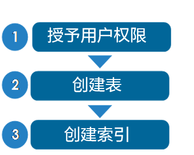

# MOT使用

使用MOT非常简单，以下几个小节将会进行描述。

openGauss允许应用程序使用MOT和基于标准磁盘的表。MOT适用于最活跃、高竞争和对吞吐量敏感的应用程序表，也可用于所有应用程序的表。

以下命令介绍如何创建MOT，以及如何将现有的基于磁盘的表转换为MOT，以加速应用程序的数据库相关性能。MOT尤其有利于已证明是瓶颈的表。

工作流程概述

以下是与使用MOT相关的任务的简单概述：

- [授予用户权限](granting_user_permissions.md)
- [创建/删除MOT](creating_dropping_an_mot_table.md)
- 为MOT创建索引
- 本小节还介绍了如何执行各种与MOT相关的附加任务，以及[MOT SQL覆盖和限制](mot_sql_coverage_and_limitations.md)。

- **[授予用户权限](granting_user_permissions.md)**  

- **[创建/删除MOT](creating_dropping_an_mot_table.md)**  

- **[为MOT创建索引](creating_an_index_for_an_mot_table.md)**  

- **[将磁盘表转换为MOT](mot_prerequisites.md)**  

- **[查询原生编译](query_native_compilation.md)**  

- **[重试中止事务](retrying_an_aborted_transaction.md)**  

- **[MOT外部支持工具](mot_external_support_tools.md)**  

- **[MOT SQL覆盖和限制](mot_sql_coverage_and_limitations.md)**  
