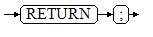
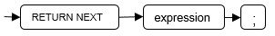
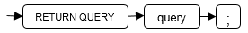
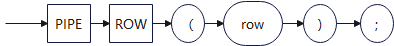

# 返回语句<a name="ZH-CN_TOPIC_0289899872"></a>

openGauss提供两种方式返回数据：RETURN或RETURN NEXT及RETURN QUERY。其中，RETURN NEXT和RETURN QUERY只适用于函数，不适用存储过程。

## RETURN<a name="ZH-CN_TOPIC_0289900893"></a>

### 语法<a name="zh-cn_topic_0283137214_zh-cn_topic_0237122231_zh-cn_topic_0059778007_s016991a2aeae4600b9f678c46d8de828"></a>

返回语句的语法请参见[图1](#zh-cn_topic_0283137214_zh-cn_topic_0237122231_zh-cn_topic_0059778007_f7ff63e01e2a840c69a1c17b91e7dc3eb)。

**图 1**  return\_clause::=<a name="zh-cn_topic_0283137214_zh-cn_topic_0237122231_zh-cn_topic_0059778007_f7ff63e01e2a840c69a1c17b91e7dc3eb"></a>  


对以上语法的解释如下：

用于将控制从存储过程或函数返回给调用者。

### 示例<a name="zh-cn_topic_0283137214_zh-cn_topic_0237122231_section11628101012578"></a>

请参见调用语句的[示例](call_statement.md#zh-cn_topic_0283136925_zh-cn_topic_0237122223_zh-cn_topic_0059778001_scfc5c5fdac3e4a11a915ebac95b49f79)。

## RETURN NEXT及RETURN QUERY<a name="ZH-CN_TOPIC_0289900097"></a>

### 语法<a name="zh-cn_topic_0283137380_zh-cn_topic_0237122232_section66906369117"></a>

创建函数时需要指定返回值SETOF datatype。

return\_next\_clause::=



return\_query\_clause::=



对以上语法的解释如下：

当需要函数返回一个集合时，使用RETURN NEXT或者RETURN QUERY向结果集追加结果，然后继续执行函数的下一条语句。随着后续的RETURN NEXT或RETURN QUERY命令的执行，结果集中会有多个结果。函数执行完成后会一起返回所有结果。

RETURN NEXT可用于标量和复合数据类型。

RETURN QUERY有一种变体RETURN QUERY EXECUTE，后面还可以增加动态查询，通过USING向查询插入参数。

### 示例<a name="zh-cn_topic_0283137380_zh-cn_topic_0237122232_section663313751118"></a>

```
openGauss=# CREATE TABLE t1(a int);
openGauss=# INSERT INTO t1 VALUES(1),(10);

--RETURN NEXT
openGauss=# CREATE OR REPLACE FUNCTION fun_for_return_next() RETURNS SETOF t1 AS $$
DECLARE
   r t1%ROWTYPE;
BEGIN
   FOR r IN select * from t1
   LOOP
      RETURN NEXT r;
   END LOOP;
   RETURN;
END;
$$ LANGUAGE PLPGSQL;
openGauss=# call fun_for_return_next();
 a
---
 1
 10
(2 rows)

-- RETURN QUERY
openGauss=# CREATE OR REPLACE FUNCTION fun_for_return_query() RETURNS SETOF t1 AS $$
DECLARE
   r t1%ROWTYPE;
BEGIN
   RETURN QUERY select * from t1;
END;
$$
language plpgsql;
openGauss=# call fun_for_return_query();
 a
---
 1
 10
(2 rows)
```

## PIPE ROW

### 限制

只能在指定了PIPELINED的函数中使用。

### 语法

pipe_row_clause::=



对以上语法的解释如下：

PIPE ROW语句只能出现指定了PIPELINED的函数主体中，它向函数的调用程序返回一个表行。

函数返回给其调用程序的行（表元素），它的类型需要为函数指定的表元素。

如果表达式是记录变量，则必须使用表元素的数据类型显式声明它。不能使用仅在结构上与元素类型相同的数据类型来声明它。

### 示例

```
CREATE TYPE t_tf_row as (
    id number,
    description varchar2(50)
);
CREATE TYPE t_tf_tab is table of t_tf_row;
CREATE OR REPLACE FUNCTION get_tab_ptf(p_rows in number) returns t_tf_tab pipelined LANGUAGE plpgsql AS
$BODY$
declare result t_tf_row;
begin
    for i in 1 .. p_rows loop
        result.id = i;
        result.description = 'Descrption for ' || i;
        pipe row(null);
        pipe row(result);
    end loop;
end;
$BODY$;
select * from get_tab_ptf(2);
 id |   description    
----+------------------
    | 
  1 | Descrption for 1
    | 
  2 | Descrption for 2
(4 rows)
```
