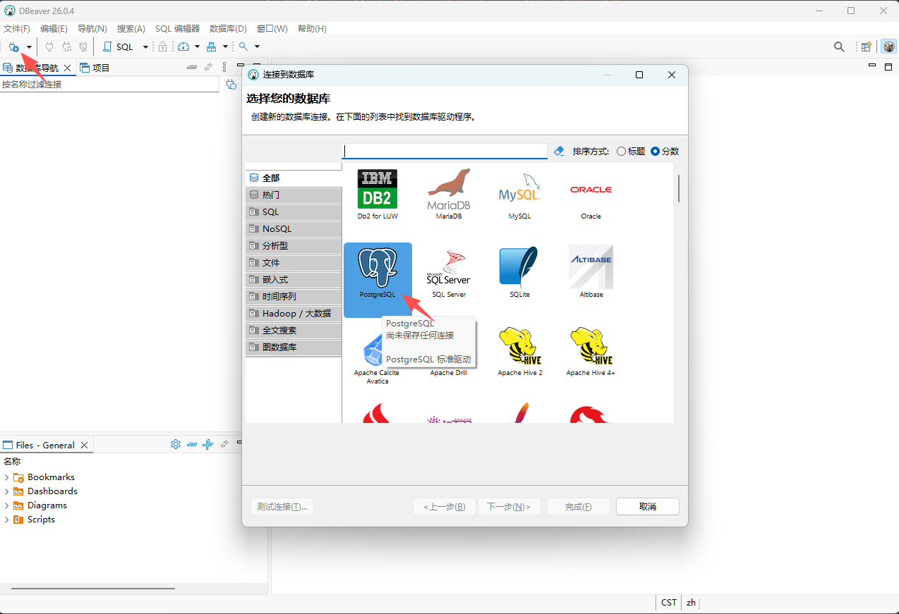
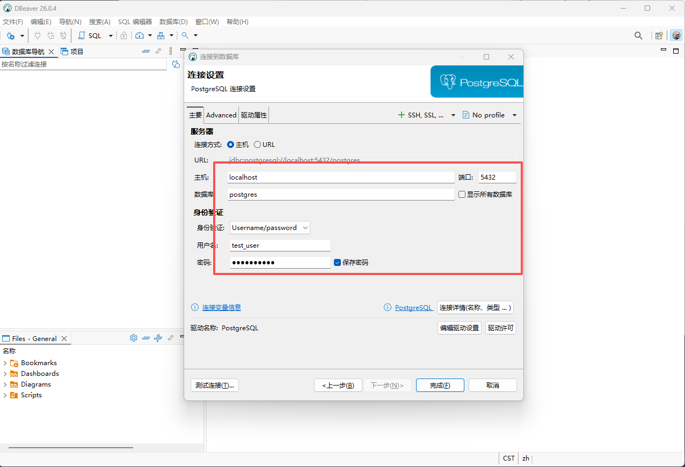
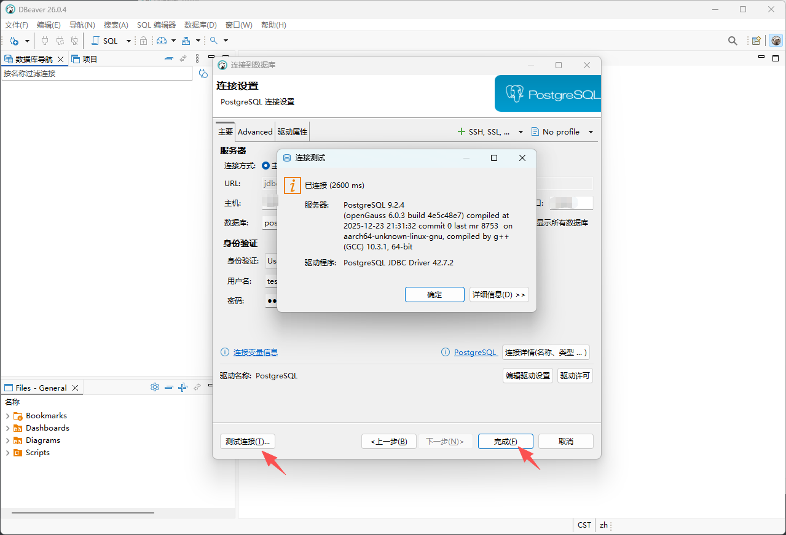
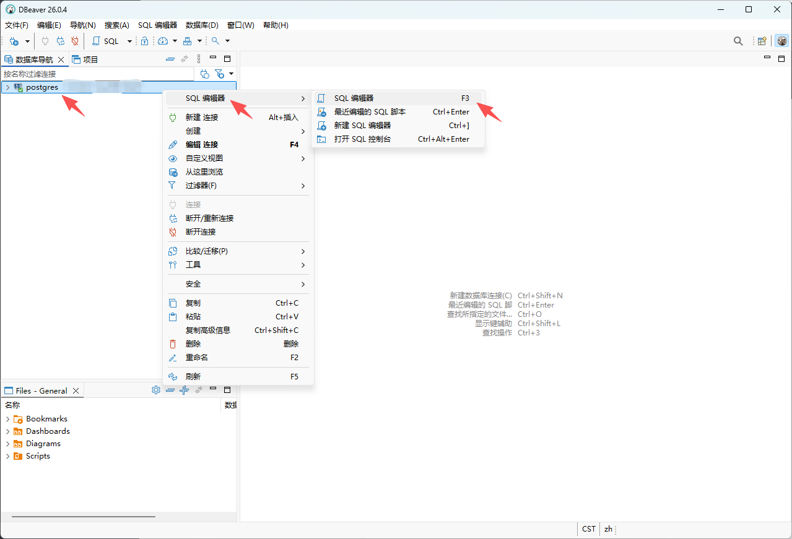
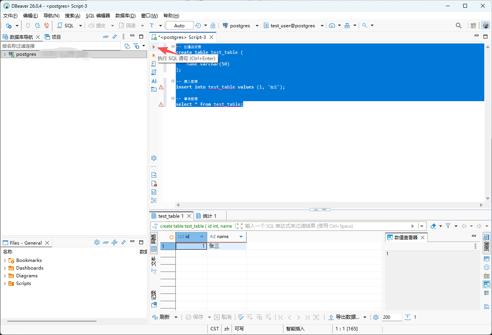

# DBeaver 连接 openGauss 数据库操作指南

本文档详细介绍如何使用 DBeaver 客户端工具连接并操作 openGauss 数据库。

## 前置条件

- 已安装 DBeaver  软件，且可正常运行
- 已安装 openGauss 数据库（本文档以 6.0.3 版本为例）
- 网络互通：客户端能够正常访问 openGauss 服务器的监听端口

## 准备openGauss连接用户

1. 使用 gsql 连接数据库

   ```bash
   gsql -d postgres -p 5432 -r
   ```

2. 配置用户加密方式

   修改系统参数 [password_encryption_type](https://docs.opengauss.org/zh/docs/latest/database_reference/security_and_authentication_postgresql_conf.html#password_encryption_type) 值，使数据库采用md5加密方式。

   ```sql
   ALTER SYSTEM SET password_encryption_type TO 0;
   ```

3. 创建连接用户

   ```sql
   create user test_user with password '******';
   ```

   > [!NOTE]说明
   >
   > 在md5加密方式下，进行新创建用户或修改用户密码操作，用户密码采用md5加密。

4. 授予用户权限

   示例中直接赋予管理员权限，实际生产环境请根据业务需求进行细粒度权限控制。

   ```sql
   grant all privileges to test_user;
   ```

5. 退出gsql

   ```sql
   \q
   ```

## 配置客户端接入认证

openGauss 默认禁止远程连接，需手动配置客户端接入认证后方可远程访问。配置方式如下：

1. 添加客户端认证规则

   ```bash
   gs_guc set -N all -I all -h "host all test_user 0.0.0.0/0 md5"
   ```

   > [!NOTE]说明
   >
   > - test_user 为数据库连接用户名
   > - 远程连接禁止使用初始化用户 omm

2. 重启 openGauss 使配置生效

   ```bash
   gs_om -t restart
   ```

如需了解更多配置细节，请参阅 [配置客户端接入认证](https://docs.opengauss.org/zh/docs/latest/database_administration_guide/configuring_client_access_authentication.html)。

## 使用 DBeaver 连接 openGauss

### 步骤 1：打开 DBeaver

启动 DBeaver 客户端。

### 步骤 2：新建连接

点击顶部连接按钮，选择「PostgreSQL」作为数据库驱动，双击确认。



### 步骤 3：填写连接信息

在弹出的配置窗口中填写以下信息：

| 配置项 | 说明                 |
| :----- | :------------------- |
| 主机   | openGauss 服务器地址 |
| 端口   | 默认 5432            |
| 用户名 | test_user            |
| 密码   | 对应的密码           |



### 步骤 4：测试并添加连接

点击「测试连接」。若连接成功，会显示 openGauss 版本号。确认无误后点击「完成」添加连接。



### 步骤 5：新建 SQL 编辑器

在左侧连接列表中，右键点击已添加的连接，选择「SQL 编辑器」，扩展选项再次选择「SQL 编辑器」，创建 SQL 编辑窗口。



### 步骤 5：执行 SQL 操作

在 SQL 编辑器中输入以下示例语句：

```sql
-- 创建测试表
create table test_table (
    id int,
    name varchar(50)
);

-- 插入数据
insert into test_table values (1, '张三');

-- 查询数据
select * from test_table;
```

选中需要执行的 SQL 语句，点击「执行 SQL 语句」按钮，即可执行 SQL，SQL 编辑器下方会输出执行结果。



## 常见问题排查

| 问题现象 | 可能原因             | 解决建议                                   |
| :------- | :------------------- | :----------------------------------------- |
| 连接超时 | 网络不通或防火墙拦截 | 检查服务器端口是否开放，防火墙规则是否正确 |
| 认证失败 | 用户名/密码错误      | 确认用户名密码正确，检查密码是否过期       |
| 拒绝连接 | 未配置客户端认证     | 按文档指导，完成配置客户端接入认证         |
