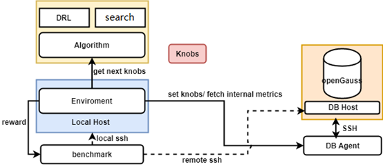

# X-Tuner: Parameter Tuning and Diagnosis<a name="EN-US_TOPIC_0289899994"></a>

## Overview<a name="EN-US_TOPIC_0289900339"></a>

X-Tuner is a parameter tuning tool integrated into databases. It uses AI technologies such as deep reinforcement learning and global search algorithm to obtain the optimal database parameter settings without manual intervention. This function is not necessarily deployed with the database environment. It can be independently deployed and run without the database installation environment.

## Preparations<a name="EN-US_TOPIC_0289900288"></a>

### Prerequisites and Precautions<a name="en-us_topic_0283137591_section887921944913"></a>

- The database status is normal; the client can be properly connected; and data can be imported to the database. As a result, the optimization program can perform the benchmark test for optimization effect.
- To use this tool, you need to specify the user who logs in to the database. The user who logs in to the database must have sufficient permissions to obtain sufficient database status information.
- If you log in to the database host as a Linux user, add  **$GAUSSHOME/bin**  to the  _PATH_environment variable so that you can directly run database O&M tools, such as gsql, gs\_guc, and gs\_ctl.
- This tool can run in three modes. In  **tune**  or  **train**  mode, you must configure the benchmark running environment and import data. This tool will iteratively run the benchmark to check whether the performance is improved after the parameters are modified.
- In  **recommend**  mode, you are advised to run the command when the database is executing the workload to obtain more accurate real-time workload information.
- By default, this tool provides benchmark running script samples of TPC-C, TPC-H, TPC-DS, and sysbench. If you use the benchmarks to perform pressure tests on the database system, you can modify or configure the preceding configuration files. To adapt to your own service scenarios, you need to compile the script file that drives your customized benchmark based on the  **template.py**  file in the  **benchmark**  directory.

### Principles<a name="en-us_topic_0283137591_section1767203555113"></a>

The tuning program is a tool independent of the database kernel. The usernames and passwords for the database and instances are required to control the benchmark performance test of the database. Before starting the tuning program, ensure that the interaction in the test environment is normal, the benchmark test script can be run properly, and the database can be connected properly.

>[!NOTE]NOTE 
>If the parameters to be tuned include the parameters that take effect only after the database is restarted, the database will be restarted multiple times during the tuning. Exercise caution when using  **train**  and  **tune**  modes if the database is running jobs.

X-Tuner can run in any of the following modes:

- **recommend**: Log in to the database using the specified username, obtain the feature information about the running workload, and generate a parameter recommendation report based on the feature information. Report improper parameter settings and potential risks in the current database. Output the currently running workload behavior and characteristics. Output the recommended parameter settings. In this mode, the database does not need to be restarted. In other modes, the database may need to be restarted repeatedly.
- **train**: Modify parameters and execute the benchmark based on the benchmark information provided by users. The reinforcement learning model is trained through repeated iteration so that you can load the model in  **tune**  mode for optimization.
- **tune**: Use an optimization algorithm to tune database parameters. Currently, two types of algorithms are supported: deep reinforcement learning and global search algorithm \(global optimization algorithm\). The deep reinforcement learning mode requires  **train**  mode to generate the optimized model after training. However, the global search algorithm does not need to be trained in advance and can be directly used for search and optimization.

>[!TIP]NOTICE 
>If the deep reinforcement learning algorithm is used in  **tune**  mode, a trained model must be available, and the parameters for training the model must be the same as those in the parameter list \(including max and min\) for tuning.

**Figure  1**  X-Tuner structure<a name="fig137427353816"></a>  


[Figure 1](#fig137427353816)  shows the overall architecture of the X-Tuner. The X-Tuner system can be divided into the following parts:

- DB: The DB\_Agent module is used to abstract database instances. It can be used to obtain the internal database status information and current database parameters and set database parameters. The SSH connection used for logging in to the database environment is included on the database side.
- Algorithm: algorithm package used for tuning, including global search algorithms \(such as Bayesian optimization and particle swarm optimization\) and deep reinforcement learning \(such as DDPG\).
- X-Tuner: The main logic module is encapsulated by the environment module. Each step is a tuning process. The entire tuning process is iterated through multiple steps.
- Benchmark: a user-specified benchmark performance test script, which is used to run benchmark jobs. The benchmark result reflects the performance of the database system.

>[!NOTE]NOTE 
>Ensure that the larger the benchmark script score is, the better the performance is.
>For example, for the benchmark used to measure the overall execution duration of SQL statements, such as TPCH, the inverse value of the overall execution duration can be used as the benchmark score.

### Installing and Running X-Tuner<a name="en-us_topic_0283137591_section275518529540"></a>

Run the following command to obtain the help information about the X-Tuner function:

```
gs_dbmind component xtuner --help 
```

You can specify different commands to obtain the corresponding help information.

### Description of the X-Tuner Configuration File<a name="section5892154973918"></a>

Before running the X-Tuner, you need to load the configuration file. You can run the  **--help**  command to view the absolute path of the configuration file that is loaded by default.

```
...  
 -x TUNER_CONFIG_FILE, --tuner-config-file TUNER_CONFIG_FILE
                        This is the path of the core configuration file of the
                        X-Tuner. You can specify the path of the new
                        configuration file. The default path is /path/to/xtuner/xtuner.conf.
                        You can modify the configuration file to control the
                        tuning process.
...
```

You can modify the configuration items in the configuration file as required to instruct the X-Tuner to perform different actions. For details about the configuration items in the configuration file, see  [Table 2](#command-reference). If you need to change the loading path of the configuration file, you can specify the path through the  **-x**  command line option.

### Benchmark Selection and Configuration<a name="section11685014422"></a>

The benchmark driver script is stored in the benchmark subdirectory of the X-Tuner directory \(_$GAUSSHOME_**/bin/dbmind/components/xtuner**\). X-Tuner provides common benchmark driver scripts, such as time-based detection script \(default\), TPC-C, and TPC-H. The X-Tuner invokes the  **get\_benchmark\_instance\(\)**  command in the  **benchmark/\_\_init\_\_.py**  file to load different benchmark driver scripts and obtain benchmark driver instances. The format of the benchmark driver script is described as follows:

- Benchmark driver script name uniquely identifies the driver script. You can specify the benchmark driver script to be loaded by setting  **benchmark\_script**  in the configuration file of the X-Tuner.
- The driver script contains the  _path_  variable,  _cmd_  variable, and the  **run**  function.

The following describes the three elements of the driver script:

1. _path_: path for storing the benchmark driver script. You can modify the path in the driver script or specify the path by setting the  **benchmark\_path**  configuration item in the configuration file.
2. _cmd_: command for executing the benchmark driver script. You can modify the command in the driver script or specify the command by setting the  **benchmark\_cmd**  configuration item in the configuration file. Placeholders can be used in the text of cmd to obtain necessary information for running cmd commands. For details, see the TPC-H driver script example. These placeholders include:
    - \{_host_\}: IP address of the database host
    - \{_port_\}: listening port number of the database instance
    - \{_user_\}: username for logging in to the database
    - \{_password_\}: password of the user who logs in to the database system
    - \{_db_\}: name of the database that is being optimized

3. **run**: The signature of this function is as follows:

    ```
    def run(remote_server, local_host) -> float:
    ```

    The returned data type is float, indicating the evaluation score after the benchmark is executed. A larger value indicates better performance. For example, the TPC-C test result tpmC can be used as the returned value, the inverse number of the total execution time of all SQL statements in TPC-H can also be used as the return value. A larger return value indicates better performance.

    The  _remote\_server_  variable is the shell command line interface transferred by the X-Tuner program to the remote host \(database host machine\) used by the script. The  _local\_host_  variable is the shell command line interface of the local host \(host where the X-Tuner script is executed\) transferred by the X-Tuner program. Methods provided by the preceding shell command interface include:

    ```
    exec_command_sync(command, timeout)
    Function: This method is used to run the shell command on the host.
    Parameter list:
    command: The data type can be str, and the element can be a list or tuple of the str type. This parameter is mandatory.
    timeout: The timeout interval for command execution in seconds. This parameter is optional.
    Return value:
    Returns 2-tuple (stdout and stderr). stdout indicates the standard output stream result, and stderr indicates the standard error stream result. The data type is str.
    ```

    ```
    exit_status
    Function: This attribute indicates the exit status code after the latest shell command is executed.
    Note: Generally, if the exit status code is 0, the execution is normal. If the exit status code is not 0, an error occurs.
    ```

Benchmark driver script example:

1. TPC-C driver script

    ```
    from tuner.exceptions import ExecutionError
    
    # WARN: You need to download the benchmark-sql test tool to the system,
    # replace the PostgreSQL JDBC driver with the openGauss driver,
    # and configure the benchmark-sql configuration file.
    # The program starts the test by running the following command:
    path = '/path/to/benchmarksql/run' # Path for storing the TPC-C test script benchmark-sql
    cmd = "./runBenchmark.sh props.gs"  # Customize a benchmark-sql test configuration file named props.gs.
    
    
    def run(remote_server, local_host):
        # Switch to the TPC-C script directory, clear historical error logs, and run the test command.
         # You are advised to wait for several seconds because the benchmark-sql test script generates the final test report through a shell script. The entire process may be delayed.
        # To ensure that the final tpmC value report can be obtained, wait for 3 seconds.
        stdout, stderr = remote_server.exec_command_sync(['cd %s' % path, 'rm -rf benchmarksql-error.log', cmd, 'sleep 3'])
        # If there is data in the standard error stream, an exception is reported and the system exits abnormally.
        if len(stderr) > 0:
            raise ExecutionError(stderr)
    
        # Find the final tpmC result.
        tpmC = None
        split_string = stdout.split()  # Split the standard output stream result.
        for i, st in enumerate(split_string):
             # In the benchmark-sql of version 5.0, the value of tpmC is the last two digits of the keyword (NewOrders). In normal cases, the value of tpmC is returned after the keyword is found.
            if "(NewOrders)" in st:
                tpmC = split_string[i + 2]
                break
        stdout, stderr = remote_server.exec_command_sync(
            "cat %s/benchmarksql-error.log" % path)
        nb_err = stdout.count("ERROR:")  # Check whether errors occur during the benchmark running and record the number of errors.
        return float(tpmC) - 10 * nb_err  # The number of errors is used as a penalty item, and the penalty coefficient is 10. A higher penalty coefficient indicates a larger number of errors.
    
    ```

2. TPC-H driver script

    ```
    import time
    
    from tuner.exceptions import ExecutionError
    
    # WARN: You need to import data into the database and SQL statements in the following path will be executed.
    # The program automatically collects the total execution duration of these SQL statements.
    path = '/path/to/tpch/queries'  # Directory for storing SQL scripts used for the TPC-H test
    cmd = "gsql -U {user} -W {password} -d {db} -p {port} -f {file}"  # The command for running the TPC-H test script. Generally, gsql -f script file is used.
    
    
    def run(remote_server, local_host):
        # Traverse all test case file names in the current directory.
        find_file_cmd = "find . -type f -name '*.sql'"
        stdout, stderr = remote_server.exec_command_sync(['cd %s' % path, find_file_cmd])
        if len(stderr) > 0:
            raise ExecutionError(stderr)
        files = stdout.strip().split('\n')
        time_start = time.time()
        for file in files:
            # Replace {file} with the file variable and run the command.
            perform_cmd = cmd.format(file=file)
            stdout, stderr = remote_server.exec_command_sync(['cd %s' % path, perform_cmd])
            if len(stderr) > 0:
                print(stderr)
        # The cost is the total execution duration of all test cases.
        cost = time.time() - time_start
        # Use the inverse number to adapt to the definition of the run function. The larger the returned result is, the better the performance is.
        return - cost
    ```

## Examples<a name="EN-US_TOPIC_0303418332"></a>

X-Tuner supports three modes:  **recommend**  for obtaining parameter diagnosis reports,  **train**  for training reinforcement learning models, and  **tune**  for using an optimization algorithm. The preceding three modes are distinguished by command line parameters, and the details are specified in the configuration file.

### Configuring the Database Connection Information<a name="section1972314173514"></a>

Configuration items for connecting to a database in the three modes are the same. You can enter the detailed connection information in the command line or in the JSON configuration file. Both methods are described as follows:

1. Entering the connection information in the command line

    Input the following options:  **--db-name --db-user --port --host --host-user**. The  **--host-ssh-port**  is optional. The following is an example:

    ```
    gs_dbmind component xtuner recommend --db-name postgres --db-user omm --port 5678 --host 192.168.1.100 --host-user omm
    ```

2. Entering the connection information in the JSON configuration file

    Assume that the file name is  **connection.json**. The following is an example of the JSON configuration file:

    ```
    {
      "db_name": "postgres",  # Database name
      "db_user": "dba",       # Username for logging in to the database
      "host": "127.0.0.1",    # IP address of the database host
      "host_user": "dba",     # Username for logging in to the database host
      "port": 5432,           # Listening port number of the database
      "ssh_port": 22          # SSH listening port number of the database host
    }
    ```

    Input  **-f connection.json**.

>[!NOTE]NOTE 
>To prevent password leakage, the configuration file and command line parameters do not contain password information by default. After you enter the preceding connection information, the program prompts you to enter the database password and the OS login password in interactive mode.

### Example of Using the recommend Mode<a name="section17370104016614"></a>

The configuration item  **scenario**  takes effect for the recommend mode. If the value is  **auto**, the workload type is automatically detected.

Run the following command to obtain the diagnosis result:

```
gs_dbmind component xtuner recommend -f connection.json
```

The diagnosis report is generated as follows:

**Figure  1**  Report generated in recommend mode<a name="fig49748416171"></a>  


In the preceding report, the database parameter configurations in the environment are recommended, and a risk warning is provided. The report also generates the current workload features. The following features are for reference:

- **temp\_file\_size**: number of generated temporary files. If the value is greater than 0, the system uses temporary files. If too many temporary files are used, the performance is poor. If possible, increase the value of  **work\_mem**.
- **cache\_hit\_rate**: cache hit ratio of  **shared\_buffer**, indicating the cache efficiency of the current workload.
- **read\_write\_ratio**: read/write ratio of database jobs.
- **search\_modify\_ratio**: ratio of data query to data modification of a database job.
- **ap\_index**: AP index of the current workload. The value ranges from 0 to 10. A larger value indicates a higher preference for data analysis and retrieval.
- **workload\_type**: workload type, which can be AP, TP, or HTAP based on database statistics.
- **checkpoint\_avg\_sync\_time**: average duration for refreshing data to the disk each time when the database is at the checkpoint, in milliseconds.
- **load\_average**: average load of each CPU core in 1 minute, 5 minutes, and 15 minutes. Generally, if the value is about 1, the current hardware matches the workload. If the value is about 3, the current workload is heavy. If the value is greater than 5, the current workload is too heavy. In this case, you are advised to reduce the load or upgrade the hardware.

>[!NOTE]NOTE 
>
>- Some system catalogs keep recording statistics, which may affect load feature identification. Therefore, you are advised to clear the statistics of some system catalogs, run the workload for a period of time, and then use recommend mode for diagnosis to obtain more accurate results. To clear the statistics, run the following command: 
>
> ```
> select pg_stat_reset_shared('bgwriter');
> select pg_stat_reset();
>  ```
>
>- In recommend mode, information in the **pg\_stat\_database** and **pg\_stat\_bgwriter** system catalogs in the database is read. Therefore, the database login user must have sufficient permissions. (You are advised to own the administrator permission which can be granted to *username* by running **alter user username sysadmin**.) 

### Example of Using the train Mode<a name="section15888321578"></a>

This mode is used to train the deep reinforcement learning model. The configuration items related to this mode are as follows:

- **rl\_algorithm**: algorithm used to train the reinforcement learning model. Currently, this parameter can be set to  **ddpg**.
- **rl\_model\_path**: path for storing the reinforcement learning model generated after training.
- **rl\_steps**: maximum number of training steps in the training process.
- **max\_episode\_steps**: maximum number of steps in each episode.
- **scenario**: specifies the workload type. If the value is  **auto**, the system automatically determines the workload type. The recommended parameter tuning list varies according to the mode.
- **tuning\_list**: specifies the parameters to be invoked. If no parameter is specified, the parameters to be invoked are automatically recommended based on the workload type. If parameters are specified,  **tuning\_list**  indicates the path of the tuning list file. The following is an example of the content of a tuning list configuration file:

    ```
    {
      "work_mem": {
        "default": 65536,
        "min": 65536,
        "max": 655360,
        "type": "int",
        "restart": false
      },
      "shared_buffers": {
        "default": 32000,
        "min": 16000,
        "max": 64000,
        "type": "int",
        "restart": true
      },
      "random_page_cost": {
        "default": 4.0,
        "min": 1.0,
        "max": 4.0,
        "type": "float",
        "restart": false
      },
      "enable_nestloop": {
        "default": true,
        "type": "bool",
        "restart": false
      }
    }
    ```

After the preceding configuration items are configured, run the following command to start the training:

```
gs_dbmind component xtuner train -f connection.json
```

After the training is complete, a model file is generated in the directory specified by the  **rl\_model\_path** configuration item.

### Example of Using the tune Mode<a name="section1487391316816"></a>

The tune mode supports a plurality of algorithms, including a DDPG algorithm based on reinforcement learning \(RL\), and a Bayesian optimization algorithm and a particle swarm algorithm \(PSO\) which are both based on a global optimization algorithm \(GOP\).

The configuration items related to the tune mode are as follows:

- **tune\_strategy**: specifies the algorithm to be used for tuning. The value can be  **rl**\(using the reinforcement learning model\),  **gop**\(using the global optimization algorithm\), or  **auto**\(selected automatically\). If this parameter is set to **rl**, RL-related configuration items take effect. In addition to the preceding configuration items that take effect in train mode, the  **test\_episode** configuration item also takes effect. This configuration item indicates the maximum number of episodes in the tuning process. This parameter directly affects the execution time of the tuning process. Generally, a larger value indicates longer time consumption.
- **gop\_algorithm**: specifies a global optimization algorithm. The value can be  **bayes**  or  **pso**.
- **max\_iterations**: specifies the maximum number of iterations. A larger value indicates a longer search time and better search effect.
- **particle\_nums**: specifies the number of particles. This parameter is valid only for the PSO algorithm.
- For details about  **scenario** and **tuning\_list**, see the description of train mode.

After the preceding items are configured, run the following command to start tuning:

```
gs_dbmind component xtuner tune -f connection.json
```

>[!WARNING]CAUTION 
>Before using the  **tune**  or  **train**  mode, you need to import the data required by the benchmark and check whether the benchmark can run properly. After the optimization is complete, the optimization program automatically restores the database parameter settings.

## Obtaining Help Information<a name="EN-US_TOPIC_0289900462"></a>

Before starting the tuning program, run the following command to obtain help information:

```
gs_dbmind component xtuner --help
```

The command output is as follows:

```
usage:  [-h] [--database DATABASE] [--db-user DB_USER] [--db-port DB_PORT] [--db-host DB_HOST] [--host-user HOST_USER] [--host-ssh-port HOST_SSH_PORT] [-f DB_CONFIG_FILE] [-x TUNER_CONFIG_FILE] [-v]
        {train,tune,recommend}

X-Tuner: a self-tuning tool integrated by openGauss.

positional arguments:
  {train,tune,recommend}
                        Train a reinforcement learning model or tune database by model. And also can recommend best_knobs according to your workload.


optional arguments:
  -h, --help            show this help message and exit
  -f DB_CONFIG_FILE, --db-config-file DB_CONFIG_FILE
                        You can pass a path of configuration file otherwise you should enter database information by command arguments manually. Please see the template file share/server.json.template.
  -x TUNER_CONFIG_FILE, --tuner-config-file TUNER_CONFIG_FILE
                        This is the path of the core configuration file of the X-Tuner. You can specify the path of the new configuration file. The default path is /path/to/config/file. You can modify the configuration file to control the tuning process.
  -v, --version         show program's version number and exit

Database Connection Information:
  --database DATABASE, --db-name DATABASE
                        The name of database where your workload running on.
  --db-user DB_USER     Use this user to login your database. Note that the user must have sufficient permissions.
  --db-port DB_PORT, --port DB_PORT
                        Use this port to connect with the database.
  --db-host DB_HOST, --host DB_HOST
                        The IP address of your database installation host.
  --host-user HOST_USER
                        The login user of your database installation host.
  --host-ssh-port HOST_SSH_PORT
                        The SSH port of your database installation host.

```

## Command Reference<a name="EN-US_TOPIC_0289899901"></a>

**Table  1**  Command-line parameters

<a name="en-us_topic_0283137279_table628178124515"></a>
<table><thead align="left"><tr id="en-us_topic_0283137279_row162968174512"><th class="cellrowborder" valign="top" width="17.18171817181718%" id="mcps1.2.4.1.1"><p id="en-us_topic_0283137279_p1129138144517"><a name="en-us_topic_0283137279_p1129138144517"></a><a name="en-us_topic_0283137279_p1129138144517"></a>Parameter</p>
</th>
<th class="cellrowborder" valign="top" width="58.33583358335833%" id="mcps1.2.4.1.2"><p id="en-us_topic_0283137279_p2029181454"><a name="en-us_topic_0283137279_p2029181454"></a><a name="en-us_topic_0283137279_p2029181454"></a>Description</p>
</th>
<th class="cellrowborder" valign="top" width="24.48244824482448%" id="mcps1.2.4.1.3"><p id="en-us_topic_0283137279_p6291382451"><a name="en-us_topic_0283137279_p6291382451"></a><a name="en-us_topic_0283137279_p6291382451"></a>Value Range</p>
</th>
</tr>
</thead>
<tbody><tr id="en-us_topic_0283137279_row162915844513"><td class="cellrowborder" valign="top" width="17.18171817181718%" headers="mcps1.2.4.1.1 "><p id="en-us_topic_0283137279_p132968134510"><a name="en-us_topic_0283137279_p132968134510"></a><a name="en-us_topic_0283137279_p132968134510"></a>mode</p>
</td>
<td class="cellrowborder" valign="top" width="58.33583358335833%" headers="mcps1.2.4.1.2 "><p id="en-us_topic_0283137279_p11295814511"><a name="en-us_topic_0283137279_p11295814511"></a><a name="en-us_topic_0283137279_p11295814511"></a>Specifies the running mode of the tuning program.</p>
</td>
<td class="cellrowborder" valign="top" width="24.48244824482448%" headers="mcps1.2.4.1.3 "><p id="en-us_topic_0283137279_p02919804513"><a name="en-us_topic_0283137279_p02919804513"></a><a name="en-us_topic_0283137279_p02919804513"></a><strong id="b165012411541"><a name="b165012411541"></a><a name="b165012411541"></a>train</strong>, <strong id="b15631126145414"><a name="b15631126145414"></a><a name="b15631126145414"></a>tune</strong>, and <strong id="b13221628175418"><a name="b13221628175418"></a><a name="b13221628175418"></a>recommend</strong></p>
</td>
</tr>
<tr id="row1949293216101"><td class="cellrowborder" valign="top" width="17.18171817181718%" headers="mcps1.2.4.1.1 "><p id="p57047404102"><a name="p57047404102"></a><a name="p57047404102"></a>--tuner-config-file, -x</p>
</td>
<td class="cellrowborder" valign="top" width="58.33583358335833%" headers="mcps1.2.4.1.2 "><p id="p19705240181019"><a name="p19705240181019"></a><a name="p19705240181019"></a>Path of the core parameter configuration file of X-Tuner. The default path is <strong id="b9559197185014"><a name="b9559197185014"></a><a name="b9559197185014"></a>xtuner.conf</strong> under the installation directory.</p>
</td>
<td class="cellrowborder" valign="top" width="24.48244824482448%" headers="mcps1.2.4.1.3 "><p id="p192324411812"><a name="p192324411812"></a><a name="p192324411812"></a>N/A</p>
</td>
</tr>
<tr id="en-us_topic_0283137279_row19291888452"><td class="cellrowborder" valign="top" width="17.18171817181718%" headers="mcps1.2.4.1.1 "><p id="en-us_topic_0283137279_p16296874513"><a name="en-us_topic_0283137279_p16296874513"></a><a name="en-us_topic_0283137279_p16296874513"></a>--db-config-file, -f</p>
</td>
<td class="cellrowborder" valign="top" width="58.33583358335833%" headers="mcps1.2.4.1.2 "><p id="en-us_topic_0283137279_p13297818451"><a name="en-us_topic_0283137279_p13297818451"></a><a name="en-us_topic_0283137279_p13297818451"></a>Path of the connection information configuration file used by the optimization program to log in to the database host. If the database connection information is configured in this file, the following database connection information can be omitted.</p>
</td>
<td class="cellrowborder" valign="top" width="24.48244824482448%" headers="mcps1.2.4.1.3 "><p id="p322194491819"><a name="p322194491819"></a><a name="p322194491819"></a>N/A</p>
</td>
</tr>
<tr id="en-us_topic_0283137279_row18298818455"><td class="cellrowborder" valign="top" width="17.18171817181718%" headers="mcps1.2.4.1.1 "><p id="en-us_topic_0283137279_p82912864518"><a name="en-us_topic_0283137279_p82912864518"></a><a name="en-us_topic_0283137279_p82912864518"></a>--db-name</p>
</td>
<td class="cellrowborder" valign="top" width="58.33583358335833%" headers="mcps1.2.4.1.2 "><p id="en-us_topic_0283137279_p22917874513"><a name="en-us_topic_0283137279_p22917874513"></a><a name="en-us_topic_0283137279_p22917874513"></a>Specifies the name of a database to be tuned.</p>
</td>
<td class="cellrowborder" valign="top" width="24.48244824482448%" headers="mcps1.2.4.1.3 "><p id="p92194419180"><a name="p92194419180"></a><a name="p92194419180"></a>N/A</p>
</td>
</tr>
<tr id="en-us_topic_0283137279_row9294819456"><td class="cellrowborder" valign="top" width="17.18171817181718%" headers="mcps1.2.4.1.1 "><p id="en-us_topic_0283137279_p1829118104514"><a name="en-us_topic_0283137279_p1829118104514"></a><a name="en-us_topic_0283137279_p1829118104514"></a>--db-user</p>
</td>
<td class="cellrowborder" valign="top" width="58.33583358335833%" headers="mcps1.2.4.1.2 "><p id="en-us_topic_0283137279_p1429208164510"><a name="en-us_topic_0283137279_p1429208164510"></a><a name="en-us_topic_0283137279_p1429208164510"></a>Specifies the user account used to log in to the tuned database.</p>
</td>
<td class="cellrowborder" valign="top" width="24.48244824482448%" headers="mcps1.2.4.1.3 "><p id="p420154491810"><a name="p420154491810"></a><a name="p420154491810"></a>N/A</p>
</td>
</tr>
<tr id="zh-cn_topic_0283137279_row1020015014713"><td class="cellrowborder" valign="top" width="17.18171817181718%" headers="mcps1.2.4.1.1 "><p id="zh-cn_topic_0283137279_p42004013477"><a name="zh-cn_topic_0283137279_p42004013477"></a><a name="zh-cn_topic_0283137279_p42004013477"></a>--port, --db-port</p>
</td>
<td class="cellrowborder" valign="top" width="58.33583358335833%" headers="mcps1.2.4.1.2 "><p id="en-us_topic_0283137279_p1200160134715"><a name="en-us_topic_0283137279_p1200160134715"></a><a name="en-us_topic_0283137279_p1200160134715"></a>Specifies the database listening port.</p>
</td>
<td class="cellrowborder" valign="top" width="24.48244824482448%" headers="mcps1.2.4.1.3 "><p id="p1419744151813"><a name="p1419744151813"></a><a name="p1419744151813"></a><span id="ph785313343287"><a name="ph785313343287"></a><a name="ph785313343287"></a>0-65535</span></p>
</td>
</tr>
<tr id="zh-cn_topic_0283137279_row1836561411475"><td class="cellrowborder" valign="top" width="17.18171817181718%" headers="mcps1.2.4.1.1 "><p id="zh-cn_topic_0283137279_p7365314124713"><a name="zh-cn_topic_0283137279_p7365314124713"></a><a name="zh-cn_topic_0283137279_p7365314124713"></a>--host, --db-host</p>
</td>
<td class="cellrowborder" valign="top" width="58.33583358335833%" headers="mcps1.2.4.1.2 "><p id="en-us_topic_0283137279_p1236541444719"><a name="en-us_topic_0283137279_p1236541444719"></a><a name="en-us_topic_0283137279_p1236541444719"></a>Specifies the host IP address of the database instance.</p>
</td>
<td class="cellrowborder" valign="top" width="24.48244824482448%" headers="mcps1.2.4.1.3 "><p id="p19191442186"><a name="p19191442186"></a><a name="p19191442186"></a><span id="ph322942122814"><a name="ph322942122814"></a><a name="ph322942122814"></a>0-65535</span></p>
</td>
</tr>
<tr id="en-us_topic_0283137279_row1773402524719"><td class="cellrowborder" valign="top" width="17.18171817181718%" headers="mcps1.2.4.1.1 "><p id="en-us_topic_0283137279_p13734825204719"><a name="en-us_topic_0283137279_p13734825204719"></a><a name="en-us_topic_0283137279_p13734825204719"></a>--host-user</p>
</td>
<td class="cellrowborder" valign="top" width="58.33583358335833%" headers="mcps1.2.4.1.2 "><p id="en-us_topic_0283137279_p3734112544712"><a name="en-us_topic_0283137279_p3734112544712"></a><a name="en-us_topic_0283137279_p3734112544712"></a>Specifies the username for logging in to the host where the database instance is located. The database O&amp;M tools, such as <strong id="b26351930155414"><a name="b26351930155414"></a><a name="b26351930155414"></a>gsql</strong> and <strong id="b0234353540"><a name="b0234353540"></a><a name="b0234353540"></a>gs_ctl</strong>, can be found in the environment variables of the username.</p>
</td>
<td class="cellrowborder" valign="top" width="24.48244824482448%" headers="mcps1.2.4.1.3 "><p id="p618154471812"><a name="p618154471812"></a><a name="p618154471812"></a>N/A</p>
</td>
</tr>
<tr id="en-us_topic_0283137279_row12794175884716"><td class="cellrowborder" valign="top" width="17.18171817181718%" headers="mcps1.2.4.1.1 "><p id="en-us_topic_0283137279_p1279485811475"><a name="en-us_topic_0283137279_p1279485811475"></a><a name="en-us_topic_0283137279_p1279485811475"></a>--host-ssh-port</p>
</td>
<td class="cellrowborder" valign="top" width="58.33583358335833%" headers="mcps1.2.4.1.2 "><p id="en-us_topic_0283137279_p779418589472"><a name="en-us_topic_0283137279_p779418589472"></a><a name="en-us_topic_0283137279_p779418589472"></a>Specifies the SSH port number of the host where the database instance is located. This parameter is optional. The default value is <strong id="b8492154151410"><a name="b8492154151410"></a><a name="b8492154151410"></a>22</strong>.</p>
</td>
<td class="cellrowborder" valign="top" width="24.48244824482448%" headers="mcps1.2.4.1.3 "><p id="p15171344161817"><a name="p15171344161817"></a><a name="p15171344161817"></a><span id="ph1364124912283"><a name="ph1364124912283"></a><a name="ph1364124912283"></a>0-65535</span></p>
</td>
</tr>
<tr id="row124653514117"><td class="cellrowborder" valign="top" width="17.18171817181718%" headers="mcps1.2.4.1.1 "><p id="p16465651181116"><a name="p16465651181116"></a><a name="p16465651181116"></a>--help, -h</p>
</td>
<td class="cellrowborder" valign="top" width="58.33583358335833%" headers="mcps1.2.4.1.2 "><p id="p13466651121115"><a name="p13466651121115"></a><a name="p13466651121115"></a>Returns the help information.</p>
</td>
<td class="cellrowborder" valign="top" width="24.48244824482448%" headers="mcps1.2.4.1.3 "><p id="p10161044111814"><a name="p10161044111814"></a><a name="p10161044111814"></a>N/A</p>
</td>
</tr>
<tr id="en-us_topic_0283137279_row1068864085011"><td class="cellrowborder" valign="top" width="17.18171817181718%" headers="mcps1.2.4.1.1 "><p id="en-us_topic_0283137279_p1568814095019"><a name="en-us_topic_0283137279_p1568814095019"></a><a name="en-us_topic_0283137279_p1568814095019"></a>--version, -v</p>
</td>
<td class="cellrowborder" valign="top" width="58.33583358335833%" headers="mcps1.2.4.1.2 "><p id="en-us_topic_0283137279_p368834095019"><a name="en-us_topic_0283137279_p368834095019"></a><a name="en-us_topic_0283137279_p368834095019"></a>Returns the current tool version.</p>
</td>
<td class="cellrowborder" valign="top" width="24.48244824482448%" headers="mcps1.2.4.1.3 "><p id="p499654318184"><a name="p499654318184"></a><a name="p499654318184"></a>N/A</p>
</td>
</tr>
</tbody>
</table>

**Table  2**  Parameters in the configuration file

<a name="table10217184512711"></a>
<table><thead align="left"><tr id="row72171451773"><th class="cellrowborder" valign="top" width="23.52%" id="mcps1.2.4.1.1"><p id="p521714451473"><a name="p521714451473"></a><a name="p521714451473"></a>Parameter</p>
</th>
<th class="cellrowborder" valign="top" width="63.51%" id="mcps1.2.4.1.2"><p id="p1121715452716"><a name="p1121715452716"></a><a name="p1121715452716"></a>Description</p>
</th>
<th class="cellrowborder" valign="top" width="12.97%" id="mcps1.2.4.1.3"><p id="p74782020913"><a name="p74782020913"></a><a name="p74782020913"></a>Value Range</p>
</th>
</tr>
</thead>
<tbody><tr id="row17217114518720"><td class="cellrowborder" valign="top" width="23.52%" headers="mcps1.2.4.1.1 "><p id="p521764516711"><a name="p521764516711"></a><a name="p521764516711"></a>logfile</p>
</td>
<td class="cellrowborder" valign="top" width="63.51%" headers="mcps1.2.4.1.2 "><p id="p1821711451578"><a name="p1821711451578"></a><a name="p1821711451578"></a>Path for storing generated logs.</p>
</td>
<td class="cellrowborder" valign="top" width="12.97%" headers="mcps1.2.4.1.3 "><p id="p10478801895"><a name="p10478801895"></a><a name="p10478801895"></a>N/A</p>
</td>
</tr>
<tr id="row02171545078"><td class="cellrowborder" valign="top" width="23.52%" headers="mcps1.2.4.1.1 "><p id="p112172452714"><a name="p112172452714"></a><a name="p112172452714"></a>output_tuning_result</p>
</td>
<td class="cellrowborder" valign="top" width="63.51%" headers="mcps1.2.4.1.2 "><p id="p721719458717"><a name="p721719458717"></a><a name="p721719458717"></a>(Optional) Specifies the path for saving the tuning result.</p>
</td>
<td class="cellrowborder" valign="top" width="12.97%" headers="mcps1.2.4.1.3 "><p id="p15478709910"><a name="p15478709910"></a><a name="p15478709910"></a>N/A</p>
</td>
</tr>
<tr id="row52171645371"><td class="cellrowborder" valign="top" width="23.52%" headers="mcps1.2.4.1.1 "><p id="p721716456713"><a name="p721716456713"></a><a name="p721716456713"></a>verbose</p>
</td>
<td class="cellrowborder" valign="top" width="63.51%" headers="mcps1.2.4.1.2 "><p id="p121811451717"><a name="p121811451717"></a><a name="p121811451717"></a>Whether to print details.</p>
</td>
<td class="cellrowborder" valign="top" width="12.97%" headers="mcps1.2.4.1.3 "><p id="p174781301998"><a name="p174781301998"></a><a name="p174781301998"></a><strong id="b168002071417"><a name="b168002071417"></a><a name="b168002071417"></a>on</strong> and <strong id="b092610218149"><a name="b092610218149"></a><a name="b092610218149"></a>off</strong></p>
</td>
</tr>
<tr id="row4218184515710"><td class="cellrowborder" valign="top" width="23.52%" headers="mcps1.2.4.1.1 "><p id="p52181645378"><a name="p52181645378"></a><a name="p52181645378"></a>recorder_file</p>
</td>
<td class="cellrowborder" valign="top" width="63.51%" headers="mcps1.2.4.1.2 "><p id="p18218174510717"><a name="p18218174510717"></a><a name="p18218174510717"></a>Path for storing logs that record intermediate tuning information.</p>
</td>
<td class="cellrowborder" valign="top" width="12.97%" headers="mcps1.2.4.1.3 "><p id="p54781010914"><a name="p54781010914"></a><a name="p54781010914"></a>N/A</p>
</td>
</tr>
<tr id="row9148057131217"><td class="cellrowborder" valign="top" width="23.52%" headers="mcps1.2.4.1.1 "><p id="p314915781211"><a name="p314915781211"></a><a name="p314915781211"></a>tune_strategy</p>
</td>
<td class="cellrowborder" valign="top" width="63.51%" headers="mcps1.2.4.1.2 "><p id="p1714910572124"><a name="p1714910572124"></a><a name="p1714910572124"></a>Strategy used in tune mode.</p>
</td>
<td class="cellrowborder" valign="top" width="12.97%" headers="mcps1.2.4.1.3 "><p id="p121491657181214"><a name="p121491657181214"></a><a name="p121491657181214"></a><strong id="b2753133718147"><a name="b2753133718147"></a><a name="b2753133718147"></a>rl</strong>, <strong id="b1697144010149"><a name="b1697144010149"></a><a name="b1697144010149"></a>gop</strong>, and <strong id="b1495864114149"><a name="b1495864114149"></a><a name="b1495864114149"></a>auto</strong></p>
</td>
</tr>
<tr id="row149593134"><td class="cellrowborder" valign="top" width="23.52%" headers="mcps1.2.4.1.1 "><p id="p1349199181315"><a name="p1349199181315"></a><a name="p1349199181315"></a>drop_cache</p>
</td>
<td class="cellrowborder" valign="top" width="63.51%" headers="mcps1.2.4.1.2 "><p id="p1549139151310"><a name="p1549139151310"></a><a name="p1549139151310"></a>Whether to perform drop cache in each iteration. Drop cache can make the benchmark score more stable. If this parameter is enabled, add the login system user to the <strong id="b5254264168"><a name="b5254264168"></a><a name="b5254264168"></a>/etc/sudoers</strong> list and grant the <strong id="b1777505361012"><a name="b1777505361012"></a><a name="b1777505361012"></a>NOPASSWD</strong> permission to the user. (You are advised to enable the <strong id="b154501457191011"><a name="b154501457191011"></a><a name="b154501457191011"></a>NOPASSWD</strong> permission temporarily and disable it after the tuning is complete.)</p>
</td>
<td class="cellrowborder" valign="top" width="12.97%" headers="mcps1.2.4.1.3 "><p id="p94911921317"><a name="p94911921317"></a><a name="p94911921317"></a><strong id="b1912113249145"><a name="b1912113249145"></a><a name="b1912113249145"></a>on</strong> and <strong id="b14121112431413"><a name="b14121112431413"></a><a name="b14121112431413"></a>off</strong></p>
</td>
</tr>
<tr id="row156307123139"><td class="cellrowborder" valign="top" width="23.52%" headers="mcps1.2.4.1.1 "><p id="p136311512151316"><a name="p136311512151316"></a><a name="p136311512151316"></a>used_mem_penalty_term</p>
</td>
<td class="cellrowborder" valign="top" width="63.51%" headers="mcps1.2.4.1.2 "><p id="p1963111251317"><a name="p1963111251317"></a><a name="p1963111251317"></a>Penalty coefficient of the total memory used by the database. This parameter is used to prevent performance deterioration caused by unlimited memory usage. The greater the value is, the greater the penalty is.</p>
</td>
<td class="cellrowborder" valign="top" width="12.97%" headers="mcps1.2.4.1.3 "><p id="p9631141210134"><a name="p9631141210134"></a><a name="p9631141210134"></a>Recommended value: <strong id="b178890273213"><a name="b178890273213"></a><a name="b178890273213"></a>0</strong>–<strong id="b388982922115"><a name="b388982922115"></a><a name="b388982922115"></a>1</strong></p>
</td>
</tr>
<tr id="row151617169130"><td class="cellrowborder" valign="top" width="23.52%" headers="mcps1.2.4.1.1 "><p id="p951641614135"><a name="p951641614135"></a><a name="p951641614135"></a>rl_algorithm</p>
</td>
<td class="cellrowborder" valign="top" width="63.51%" headers="mcps1.2.4.1.2 "><p id="p175161516201316"><a name="p175161516201316"></a><a name="p175161516201316"></a>Specifies the RL algorithm.</p>
</td>
<td class="cellrowborder" valign="top" width="12.97%" headers="mcps1.2.4.1.3 "><p id="p1051681671315"><a name="p1051681671315"></a><a name="p1051681671315"></a><strong id="b115601755191411"><a name="b115601755191411"></a><a name="b115601755191411"></a>ddpg</strong></p>
</td>
</tr>
<tr id="row1097152219137"><td class="cellrowborder" valign="top" width="23.52%" headers="mcps1.2.4.1.1 "><p id="p7975222134"><a name="p7975222134"></a><a name="p7975222134"></a>rl_model_path</p>
</td>
<td class="cellrowborder" valign="top" width="63.51%" headers="mcps1.2.4.1.2 "><p id="p597132219139"><a name="p597132219139"></a><a name="p597132219139"></a>Path for saving or reading the RL model, including the save directory name and file name prefix. In train mode, this path is used to save the model. In tune mode, this path is used to read the model file.</p>
</td>
<td class="cellrowborder" valign="top" width="12.97%" headers="mcps1.2.4.1.3 "><p id="p189702201314"><a name="p189702201314"></a><a name="p189702201314"></a>N/A</p>
</td>
</tr>
<tr id="row480932521319"><td class="cellrowborder" valign="top" width="23.52%" headers="mcps1.2.4.1.1 "><p id="p1180972561313"><a name="p1180972561313"></a><a name="p1180972561313"></a>rl_steps</p>
</td>
<td class="cellrowborder" valign="top" width="63.51%" headers="mcps1.2.4.1.2 "><p id="p128098254133"><a name="p128098254133"></a><a name="p128098254133"></a>Number of training steps of the deep reinforcement learning algorithm</p>
</td>
<td class="cellrowborder" valign="top" width="12.97%" headers="mcps1.2.4.1.3 "><p id="p2179104412595"><a name="p2179104412595"></a><a name="p2179104412595"></a>N/A</p>
</td>
</tr>
<tr id="row356972910136"><td class="cellrowborder" valign="top" width="23.52%" headers="mcps1.2.4.1.1 "><p id="p195692295139"><a name="p195692295139"></a><a name="p195692295139"></a>max_episode_steps</p>
</td>
<td class="cellrowborder" valign="top" width="63.51%" headers="mcps1.2.4.1.2 "><p id="p195694294137"><a name="p195694294137"></a><a name="p195694294137"></a>Maximum number of training steps in each episode.</p>
</td>
<td class="cellrowborder" valign="top" width="12.97%" headers="mcps1.2.4.1.3 "><p id="p81783444594"><a name="p81783444594"></a><a name="p81783444594"></a>N/A</p>
</td>
</tr>
<tr id="row1696662320147"><td class="cellrowborder" valign="top" width="23.52%" headers="mcps1.2.4.1.1 "><p id="p18966192311147"><a name="p18966192311147"></a><a name="p18966192311147"></a>test_episode</p>
</td>
<td class="cellrowborder" valign="top" width="63.51%" headers="mcps1.2.4.1.2 "><p id="p696614239145"><a name="p696614239145"></a><a name="p696614239145"></a>Number of episodes when the RL algorithm is used for optimization.</p>
</td>
<td class="cellrowborder" valign="top" width="12.97%" headers="mcps1.2.4.1.3 "><p id="p20156154475918"><a name="p20156154475918"></a><a name="p20156154475918"></a>N/A</p>
</td>
</tr>
<tr id="row9780928191416"><td class="cellrowborder" valign="top" width="23.52%" headers="mcps1.2.4.1.1 "><p id="p6780128131416"><a name="p6780128131416"></a><a name="p6780128131416"></a>gop_algorithm</p>
</td>
<td class="cellrowborder" valign="top" width="63.51%" headers="mcps1.2.4.1.2 "><p id="p18780112851416"><a name="p18780112851416"></a><a name="p18780112851416"></a>Global search algorithm.</p>
</td>
<td class="cellrowborder" valign="top" width="12.97%" headers="mcps1.2.4.1.3 "><p id="p778092811146"><a name="p778092811146"></a><a name="p778092811146"></a><strong id="b4396141018196"><a name="b4396141018196"></a><a name="b4396141018196"></a>bayes</strong> and <strong id="b73473123193"><a name="b73473123193"></a><a name="b73473123193"></a>pso</strong></p>
</td>
</tr>
<tr id="row3302203141418"><td class="cellrowborder" valign="top" width="23.52%" headers="mcps1.2.4.1.1 "><p id="p16302831201411"><a name="p16302831201411"></a><a name="p16302831201411"></a>max_iterations</p>
</td>
<td class="cellrowborder" valign="top" width="63.51%" headers="mcps1.2.4.1.2 "><p id="p173026314147"><a name="p173026314147"></a><a name="p173026314147"></a>Maximum number of iterations of the global search algorithm. (The value is not fixed. Multiple iterations may be performed based on the actual requirements.)</p>
</td>
<td class="cellrowborder" valign="top" width="12.97%" headers="mcps1.2.4.1.3 "><p id="p4302193112149"><a name="p4302193112149"></a><a name="p4302193112149"></a>N/A</p>
</td>
</tr>
<tr id="row141450346148"><td class="cellrowborder" valign="top" width="23.52%" headers="mcps1.2.4.1.1 "><p id="p15146203421417"><a name="p15146203421417"></a><a name="p15146203421417"></a>particle_nums</p>
</td>
<td class="cellrowborder" valign="top" width="63.51%" headers="mcps1.2.4.1.2 "><p id="p15146133412146"><a name="p15146133412146"></a><a name="p15146133412146"></a>Number of particles when the PSO algorithm is used.</p>
</td>
<td class="cellrowborder" valign="top" width="12.97%" headers="mcps1.2.4.1.3 "><p id="p10146173401410"><a name="p10146173401410"></a><a name="p10146173401410"></a>N/A</p>
</td>
</tr>
<tr id="row74191454141"><td class="cellrowborder" valign="top" width="23.52%" headers="mcps1.2.4.1.1 "><p id="p1041914515145"><a name="p1041914515145"></a><a name="p1041914515145"></a>benchmark_script</p>
</td>
<td class="cellrowborder" valign="top" width="63.51%" headers="mcps1.2.4.1.2 "><p id="p025843115114"><a name="p025843115114"></a><a name="p025843115114"></a>Benchmark driver script. This parameter specifies the file with the same name in the benchmark path to be loaded. Typical benchmarks, such as TPC-C and TPC-H, are supported by default.</p>
</td>
<td class="cellrowborder" valign="top" width="12.97%" headers="mcps1.2.4.1.3 "><p id="p19419194541419"><a name="p19419194541419"></a><a name="p19419194541419"></a><strong id="b1954232513194"><a name="b1954232513194"></a><a name="b1954232513194"></a>tpcc</strong>, <strong id="b1874682715194"><a name="b1874682715194"></a><a name="b1874682715194"></a>tpch</strong>, <strong id="b135175306195"><a name="b135175306195"></a><a name="b135175306195"></a>tpcds</strong>, <strong id="b83249326197"><a name="b83249326197"></a><a name="b83249326197"></a>sysbench</strong>, and others</p>
</td>
</tr>
<tr id="row11663143810146"><td class="cellrowborder" valign="top" width="23.52%" headers="mcps1.2.4.1.1 "><p id="p16632038191412"><a name="p16632038191412"></a><a name="p16632038191412"></a>benchmark_path</p>
</td>
<td class="cellrowborder" valign="top" width="63.51%" headers="mcps1.2.4.1.2 "><p id="p164191545171414"><a name="p164191545171414"></a><a name="p164191545171414"></a>Path for saving the benchmark script. If this parameter is not configured, the configuration in the benchmark drive script is used.</p>
</td>
<td class="cellrowborder" valign="top" width="12.97%" headers="mcps1.2.4.1.3 "><p id="p1466314385148"><a name="p1466314385148"></a><a name="p1466314385148"></a>N/A</p>
</td>
</tr>
<tr id="row1316894301412"><td class="cellrowborder" valign="top" width="23.52%" headers="mcps1.2.4.1.1 "><p id="p161680437143"><a name="p161680437143"></a><a name="p161680437143"></a>benchmark_cmd</p>
</td>
<td class="cellrowborder" valign="top" width="63.51%" headers="mcps1.2.4.1.2 "><p id="p1271811013536"><a name="p1271811013536"></a><a name="p1271811013536"></a>Command for starting the benchmark script. If this parameter is not configured, the configuration in the benchmark drive script is used.</p>
</td>
<td class="cellrowborder" valign="top" width="12.97%" headers="mcps1.2.4.1.3 "><p id="p1216810435142"><a name="p1216810435142"></a><a name="p1216810435142"></a>N/A</p>
</td>
</tr>
<tr id="row138695406353"><td class="cellrowborder" valign="top" width="23.52%" headers="mcps1.2.4.1.1 "><p id="p678917148372"><a name="p678917148372"></a><a name="p678917148372"></a>benchmark_period</p>
</td>
<td class="cellrowborder" valign="top" width="63.51%" headers="mcps1.2.4.1.2 "><p id="p08691403355"><a name="p08691403355"></a><a name="p08691403355"></a>This parameter is valid only for <strong id="b1323124165410"><a name="b1323124165410"></a><a name="b1323124165410"></a>period benchmark</strong>. It indicates the test period of the entire benchmark. The unit is second.</p>
</td>
<td class="cellrowborder" valign="top" width="12.97%" headers="mcps1.2.4.1.3 "><p id="p14869140153519"><a name="p14869140153519"></a><a name="p14869140153519"></a>N/A</p>
</td>
</tr>
<tr id="row17821134014142"><td class="cellrowborder" valign="top" width="23.52%" headers="mcps1.2.4.1.1 "><p id="p18822640181413"><a name="p18822640181413"></a><a name="p18822640181413"></a>scenario</p>
</td>
<td class="cellrowborder" valign="top" width="63.51%" headers="mcps1.2.4.1.2 "><p id="p982210409141"><a name="p982210409141"></a><a name="p982210409141"></a>Type of the workload specified by the user.</p>
</td>
<td class="cellrowborder" valign="top" width="12.97%" headers="mcps1.2.4.1.3 "><p id="p1982218404141"><a name="p1982218404141"></a><a name="p1982218404141"></a><strong id="b117711058141914"><a name="b117711058141914"></a><a name="b117711058141914"></a>tp</strong>, <strong id="b1825391162013"><a name="b1825391162013"></a><a name="b1825391162013"></a>ap</strong>, and <strong id="b1174617372016"><a name="b1174617372016"></a><a name="b1174617372016"></a>htap</strong></p>
</td>
</tr>
<tr id="row12561193614148"><td class="cellrowborder" valign="top" width="23.52%" headers="mcps1.2.4.1.1 "><p id="p4561113617147"><a name="p4561113617147"></a><a name="p4561113617147"></a>tuning_list</p>
</td>
<td class="cellrowborder" valign="top" width="63.51%" headers="mcps1.2.4.1.2 "><p id="p756113365148"><a name="p756113365148"></a><a name="p756113365148"></a>List of parameters to be tuned. For details, see the <strong id="b43918312614"><a name="b43918312614"></a><a name="b43918312614"></a>share/knobs.json.template</strong> file.</p>
</td>
<td class="cellrowborder" valign="top" width="12.97%" headers="mcps1.2.4.1.3 "><p id="p1256193621413"><a name="p1256193621413"></a><a name="p1256193621413"></a>N/A</p>
</td>
</tr>
</tbody>
</table>

## Troubleshooting<a name="EN-US_TOPIC_0289900701"></a>

- Failure of connection to the database instance: Check whether the database instance is faulty or the security permissions of configuration items in the  **pg\_hba.conf**  file are incorrectly configured.
- Restart failure: Check the health status of the database instance and ensure that the database instance is running properly.
- Poor performance of TPC-C jobs: In high-concurrency scenarios such as TPC-C, a large amount of data is modified during pressure tests. Each test is not idempotent, for example, the data volume in the TPC-C database increases, invalid tuples are not cleared using VACUUM FULL, checkpoints are not triggered in the database, and drop cache is not performed. Therefore, it is recommended that the benchmark data that is written with a large amount of data, such as TPC-C, be imported again at intervals \(depending on the number of concurrent tasks and execution duration\). A simple method is to back up the $PGDATA directory.
- When the TPC-C job is running, the TPC-C driver script reports the error "TypeError: float\(\) argument must be a string or a number, not 'NoneType'" \(**none** cannot be converted to the float type\). This is because the TPC-C pressure test result is not obtained. There are many causes for this problem, manually check whether TPC-C can be successfully executed and whether the returned result can be obtained. If the preceding problem does not occur, you are advised to set the delay time of the **sleep** command in the command list in the TPC-C driver script to a larger value.
