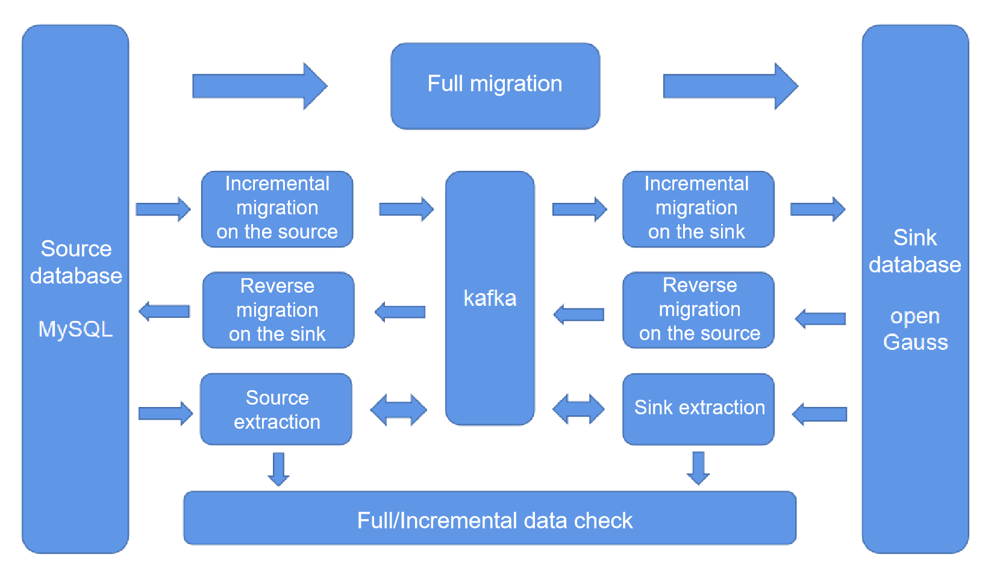

# Migrating Data from MySQL Database to openGauss

## Tool Deployment Architecture

Currently, openGauss supports the following MySQL migration services:

- **[Quick MySQL Migration](quick_mysql_migration.md)**  

-   **[Full migration](full_migration.md)** 
-   **[Incremental migration](incremental_migration.md)** 
-   **[Reverse migration](reverse_migration.md)** 
-   **[Data check](data_check.md)** 
