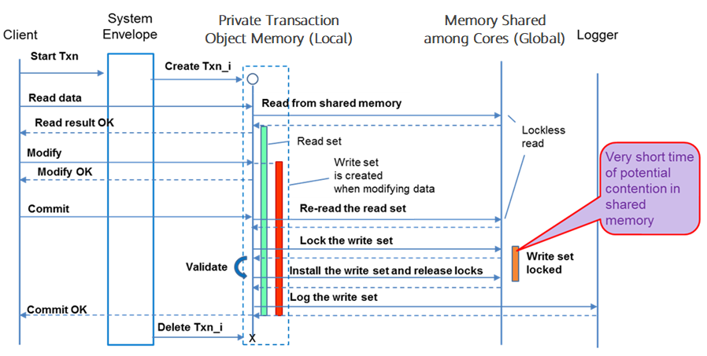

# MOT Concurrency Control Mechanism<a name="EN-US_TOPIC_0270171515"></a>

After investing extensive research to find the best concurrency control mechanism, we concluded that SILO based on OCC is the best ACID-compliant OCC algorithm for MOT. SILO provides the best foundation for MOT's challenging requirements.

With the release of openGauss 5.0 the MOT now includes support for MVCC, which among other benefits reduces the contention between read and update transactions thus reducing transaction aborts that come with OCC method.

>[!NOTE]NOTE 
>MOT is fully Atomicity, Consistency, Isolation, Durability \(ACID\)-compliant, as described in the  [MOT Introduction](mot_introduction.md)  section.

The following topics describe MOT's concurrency control mechanism –

## MOT Local and Global Memory<a name="EN-US_TOPIC_0270171516"></a>

SILO manages both a local memory and a global memory, as shown in.

-   **Global**  memory is long-term shared memory is shared by all cores and is used primarily to store all the table data and indexes

-   **Local**  memory is short-term memory that is used primarily by sessions for handling transactions and store data changes in a primate to transaction memory until the commit phase.

When a transaction change is required, SILO handles the copying of all that transaction's data from the global memory into the local memory. Minimal locks are placed on the global memory according to the OCC approach, so that the contention time in the global shared memory is extremely minimal. After the transaction' change has been completed, this data is pushed back from the local memory to the global memory.

The basic interactive transactional flow with our SILO-enhanced concurrency control is shown in the figure below –

**Figure  1**  Private \(Local\) Memory \(for each transaction\) and a Global Memory \(for all the transactions of all the cores\)



For more details, refer to the Industrial-Strength OLTP Using Main Memory and Many-cores document<sup>\[</sup>[Comparison – Disk vs. MOT](comparison_disk_vs_mot.md)<sup>\]</sup>.

## MOT SILO Enhancements<a name="EN-US_TOPIC_0270171517"></a>

SILO  in its basic algorithm flow outperformed many other ACID-compliant OCCs that we tested in our research experiments. However, in order to make it a product-grade mechanism, we had to enhance it with many essential functionalities that were missing in the original design, such as –

-   Added support for interactive mode transactions, where transactions are running SQL by SQL from the client side and not as a single step on the server side
-   Added optimistic inserts
-   Added support for non-unique indexes
-   Added support for read-after-write in transactions so that users can see their own changes before they are committed 
-   Added support for lockless cooperative garbage collection
-   Added support for lockless checkpoints
-   Added support for fast recovery
-   Multi Version Concurrency Control (MVCC) support was added (openGauss 5.0).

Adding these enhancements without breaking the scalable characteristic of the original SILO was very challenging.

## MOT Isolation Levels<a name="EN-US_TOPIC_0270171518"></a>

Even though MOT is fully ACID-compliant \(as described in the section\), not all isolation levels are supported in openGauss 1.0. The following table describes all isolation levels, as well as what is and what is not supported by MOT.

**Table  1**  Isolation Levels

<a name="table38517424"></a>
<table><thead align="left"><tr id="row29852746"><th class="cellrowborder" valign="top" width="24.240000000000002%" id="mcps1.2.3.1.1"><p id="p2153374"><a name="p2153374"></a><a name="p2153374"></a>Isolation Level</p>
</th>
<th class="cellrowborder" valign="top" width="75.76%" id="mcps1.2.3.1.2"><p id="p40205569"><a name="p40205569"></a><a name="p40205569"></a>Description</p>
</th>
</tr>
</thead>
<tbody><tr id="row35425694"><td class="cellrowborder" valign="top" width="24.240000000000002%" headers="mcps1.2.3.1.1 "><p id="p50908955"><a name="p50908955"></a><a name="p50908955"></a>READ UNCOMMITTED</p>
</td>
<td class="cellrowborder" valign="top" width="75.76%" headers="mcps1.2.3.1.2 "><p id="p29984672"><a name="p29984672"></a><a name="p29984672"></a><strong id="b1426598"><a name="b1426598"></a><a name="b1426598"></a>Not supported by MOT.</strong></p>
</td>
</tr>
<tr id="row12839382"><td class="cellrowborder" valign="top" width="24.240000000000002%" headers="mcps1.2.3.1.1 "><p id="p33357028"><a name="p33357028"></a><a name="p33357028"></a>READ COMMITTED</p>
</td>
<td class="cellrowborder" valign="top" width="75.76%" headers="mcps1.2.3.1.2 "><p id="p17564787"><a name="p17564787"></a><a name="p17564787"></a><strong id="b23865363"><a name="b23865363"></a><a name="b23865363"></a>Supported by MOT.</strong></p>
<p id="p13461675"><a name="p13461675"></a><a name="p13461675"></a>The READ COMMITTED isolation level that guarantees that any data that is read was already committed when it was read. It simply restricts the reader from seeing any intermediate, uncommitted or dirty reads. Data is free to be changed after it has been read so that READ COMMITTED does not guarantee that if the transaction re-issues the read, that the same data will be found.</p>
</td>
</tr>
<tr id="row6786611"><td class="cellrowborder" valign="top" width="24.240000000000002%" headers="mcps1.2.3.1.1 "><p id="p12844628"><a name="p12844628"></a><a name="p12844628"></a>SNAPSHOT</p>
</td>
<td class="cellrowborder" valign="top" width="75.76%" headers="mcps1.2.3.1.2 "><p id="p33781949"><a name="p33781949"></a><a name="p33781949"></a><strong id="b35602093"><a name="b35602093"></a><a name="b35602093"></a>Supported by MOT.</strong></p>
<p id="p51983383"><a name="p51983383"></a><a name="p51983383"></a>The SNAPSHOT isolation level makes the same guarantees as SERIALIZABLE, except that concurrent transactions can modify the data. Instead, it forces every reader to see its own version of the world (its own snapshot). This makes it very easy to program, plus it is very scalable, because it does not block concurrent updates. </p>
</td>
</tr>
<tr id="row49904522"><td class="cellrowborder" valign="top" width="24.240000000000002%" headers="mcps1.2.3.1.1 "><p id="p15734461"><a name="p15734461"></a><a name="p15734461"></a>REPEATABLE READ</p>
</td>
<td class="cellrowborder" valign="top" width="75.76%" headers="mcps1.2.3.1.2 "><p id="p66531800"><a name="p66531800"></a><a name="p66531800"></a><strong id="b61915292"><a name="b61915292"></a><a name="b61915292"></a>Supported by MOT.</strong></p>
<p id="p20366724"><a name="p20366724"></a><a name="p20366724"></a>REPEATABLE READ is a higher isolation level that (in addition to the guarantees of the READ COMMITTED isolation level) guarantees that any data that is read cannot change. If a transaction reads the same data again, it will find the same previously read data in place, unchanged and available to be read.</p>
<p id="p39091944"><a name="p39091944"></a><a name="p39091944"></a>Because of the optimistic model, concurrent transactions are not prevented from updating rows read by this transaction. Instead, at commit time this transaction validates that the REPEATABLE READ isolation level has not been violated. If it has, this transaction is rolled back and must be retried.</p>
</td>
</tr>
<tr id="row16283183"><td class="cellrowborder" valign="top" width="24.240000000000002%" headers="mcps1.2.3.1.1 "><p id="p43869467"><a name="p43869467"></a><a name="p43869467"></a>SERIALIZABLE</p>
</td>
<td class="cellrowborder" valign="top" width="75.76%" headers="mcps1.2.3.1.2 "><p id="p63765972"><a name="p63765972"></a><a name="p63765972"></a><strong id="b37022841"><a name="b37022841"></a><a name="b37022841"></a>Not supported by MOT</strong>.</p>
<p id="p64770113"><a name="p64770113"></a><a name="p64770113"></a>Serializable isolation makes an even stronger guarantee. In addition to everything that the REPEATABLE READ isolation level guarantees, it also guarantees that no new data can be seen by a subsequent read.</p>
<p id="p46060111"><a name="p46060111"></a><a name="p46060111"></a>It is named SERIALIZABLE because the isolation is so strict that it is almost a bit like having the transactions run in series rather than concurrently.</p>
</td>
</tr>
</tbody>
</table>


The following table shows the concurrency side effects enabled by the different isolation levels.

**Table  2**  Concurrency Side Effects Enabled by Isolation Levels

<a name="table47951145"></a>
<table><thead align="left"><tr id="row12791742"><th class="cellrowborder" valign="top" width="32.65%" id="mcps1.2.5.1.1"><p id="p29498151"><a name="p29498151"></a><a name="p29498151"></a>Isolation Level</p>
</th>
<th class="cellrowborder" valign="top" width="18.37%" id="mcps1.2.5.1.2"><p id="p40539992"><a name="p40539992"></a><a name="p40539992"></a>Description</p>
</th>
<th class="cellrowborder" valign="top" width="32.65%" id="mcps1.2.5.1.3"><p id="p62513914"><a name="p62513914"></a><a name="p62513914"></a>Non-repeatable Read</p>
</th>
<th class="cellrowborder" valign="top" width="16.33%" id="mcps1.2.5.1.4"><p id="p30462260"><a name="p30462260"></a><a name="p30462260"></a>Phantom</p>
</th>
</tr>
</thead>
<tbody><tr id="row51524015"><td class="cellrowborder" valign="top" width="32.65%" headers="mcps1.2.5.1.1 "><p id="p12695699"><a name="p12695699"></a><a name="p12695699"></a>READ UNCOMMITTED</p>
</td>
<td class="cellrowborder" valign="top" width="18.37%" headers="mcps1.2.5.1.2 "><p id="p21718662"><a name="p21718662"></a><a name="p21718662"></a>Yes</p>
</td>
<td class="cellrowborder" valign="top" width="32.65%" headers="mcps1.2.5.1.3 "><p id="p14381235"><a name="p14381235"></a><a name="p14381235"></a>Yes</p>
</td>
<td class="cellrowborder" valign="top" width="16.33%" headers="mcps1.2.5.1.4 "><p id="p24029376"><a name="p24029376"></a><a name="p24029376"></a>Yes</p>
</td>
</tr>
<tr id="row14937794"><td class="cellrowborder" valign="top" width="32.65%" headers="mcps1.2.5.1.1 "><p id="p2001795"><a name="p2001795"></a><a name="p2001795"></a>READ COMMITTED</p>
</td>
<td class="cellrowborder" valign="top" width="18.37%" headers="mcps1.2.5.1.2 "><p id="p27927672"><a name="p27927672"></a><a name="p27927672"></a>No</p>
</td>
<td class="cellrowborder" valign="top" width="32.65%" headers="mcps1.2.5.1.3 "><p id="p47548937"><a name="p47548937"></a><a name="p47548937"></a>Yes</p>
</td>
<td class="cellrowborder" valign="top" width="16.33%" headers="mcps1.2.5.1.4 "><p id="p26258720"><a name="p26258720"></a><a name="p26258720"></a>Yes</p>
</td>
</tr>
<tr id="row35001888"><td class="cellrowborder" valign="top" width="32.65%" headers="mcps1.2.5.1.1 "><p id="p16580664"><a name="p16580664"></a><a name="p16580664"></a>REPEATABLE READ</p>
</td>
<td class="cellrowborder" valign="top" width="18.37%" headers="mcps1.2.5.1.2 "><p id="p856520"><a name="p856520"></a><a name="p856520"></a>No</p>
</td>
<td class="cellrowborder" valign="top" width="32.65%" headers="mcps1.2.5.1.3 "><p id="p2269305"><a name="p2269305"></a><a name="p2269305"></a>No</p>
</td>
<td class="cellrowborder" valign="top" width="16.33%" headers="mcps1.2.5.1.4 "><p id="p49596018"><a name="p49596018"></a><a name="p49596018"></a>Yes</p>
</td>
</tr>
<tr id="row43710986"><td class="cellrowborder" valign="top" width="32.65%" headers="mcps1.2.5.1.1 "><p id="p50928963"><a name="p50928963"></a><a name="p50928963"></a>SNAPSHOT</p>
</td>
<td class="cellrowborder" valign="top" width="18.37%" headers="mcps1.2.5.1.2 "><p id="p31605337"><a name="p31605337"></a><a name="p31605337"></a>No</p>
</td>
<td class="cellrowborder" valign="top" width="32.65%" headers="mcps1.2.5.1.3 "><p id="p9895475"><a name="p9895475"></a><a name="p9895475"></a>No</p>
</td>
<td class="cellrowborder" valign="top" width="16.33%" headers="mcps1.2.5.1.4 "><p id="p63335993"><a name="p63335993"></a><a name="p63335993"></a>No</p>
</td>
</tr>
<tr id="row33153033"><td class="cellrowborder" valign="top" width="32.65%" headers="mcps1.2.5.1.1 "><p id="p1041149"><a name="p1041149"></a><a name="p1041149"></a>SERIALIZABLE</p>
</td>
<td class="cellrowborder" valign="top" width="18.37%" headers="mcps1.2.5.1.2 "><p id="p17224274"><a name="p17224274"></a><a name="p17224274"></a>No</p>
</td>
<td class="cellrowborder" valign="top" width="32.65%" headers="mcps1.2.5.1.3 "><p id="p52988976"><a name="p52988976"></a><a name="p52988976"></a>No</p>
</td>
<td class="cellrowborder" valign="top" width="16.33%" headers="mcps1.2.5.1.4 "><p id="p64248638"><a name="p64248638"></a><a name="p64248638"></a>No</p>
</td>
</tr>
</tbody>
</table>

## MOT Optimistic Concurrency Control<a name="EN-US_TOPIC_0270171519"></a>

The Concurrency Control Module \(CC Module for short\) provides all the transactional requirements for the Main Memory Engine. The primary objective of the CC Module is to provide the Main Memory Engine with support for various isolation levels.

### Optimistic OCC vs. Pessimistic 2PL<a name="section2831715540"></a>

The functional differences of Pessimistic 2PL \(2-Phase Locking\) vs. Optimistic Concurrency Control \(OCC\) involve pessimistic versus optimistic approaches to transaction integrity.

Disk-based tables use a pessimistic approach, which is the most commonly used database method. The MOT Engine use an optimistic approach.

The primary functional difference between the pessimistic approach and the optimistic approach is that if a conflict occurs –

-   The pessimistic approach causes the client to wait.

-   The optimistic approach causes one of the transactions to fail, so that the failed transaction must be retried by the client.

**Optimistic Concurrency Control Approach \(Used by MOT\)**

The  **Optimistic Concurrency Control \(OCC\)**  approach detects conflicts as they occur, and performs validation checks at commit time.

The optimistic approach has less overhead and is usually more efficient, partly because transaction conflicts are uncommon in most applications.

The functional differences between optimistic and pessimistic approaches is larger when the REPEATABLE READ isolation level is enforced and is largest for the SERIALIZABLE isolation level.

**Pessimistic Approaches \(Not used by MOT\)**

The  **Pessimistic Concurrency Control**  \(2PL or 2-Phase Locking\) approach uses locks to block potential conflicts before they occur. A lock is applied when a statement is executed and released when the transaction is committed. Disk-based row‑stores use this approach \(with the addition of Multi-version Concurrency Control \[MVCC\]\).

In 2PL algorithms, while a transaction is writing a row, no other transaction can access it; and while a row is being read, no other transaction can overwrite it. Each row is locked at access time for both reading and writing; and the lock is released at commit time. These algorithms require a scheme for handling and avoiding deadlock. Deadlock can be detected by calculating cycles in a wait-for graph. Deadlock can be avoided by keeping time ordering using TSO or by some kind of back-off scheme.

**Encounter Time Locking \(ETL\)**

Another approach is Encounter Time Locking \(ETL\), where reads are handled in an optimistic manner, but writes lock the data that they access. As a result, writes from different ETL transactions are aware of each other and can decide to abort. It has been empirically verified that ETL improves the performance of OCC in two ways –

-   First, ETL detects conflicts early on and often increases transaction throughput. This is because transactions do not perform useless operations, because conflicts discovered at commit time \(in general\) cannot be solved without aborting at least one transaction.
-   Second, encounter-time locking Reads-After-Writes \(RAW\) are handled efficiently without requiring expensive or complex mechanisms.

**Conclusion**

OCC is the fastest option for most workloads. This finding has also been observed in our preliminary research phase.

One of the reasons is that when every core executes multiple threads, a lock is likely to be held by a swapped thread, especially in interactive mode. Another reason is that pessimistic algorithms involve deadlock detection \(which introduces overhead\) and usually uses read-write locks \(which are less efficient than standard spin-locks\).

We have chosen Silo because it was simpler than other existing options, such as TicToc, while maintaining the same performance for most workloads. ETL is sometimes faster than OCC, but it introduces spurious aborts which may confuse a user, in contrast to OCC which aborts only at commit.

### OCC vs 2PL Differences by Example<a name="section9676996592"></a>

The following shows the differences between two user experiences – Pessimistic \(for disk-based tables\) and Optimistic \(MOT tables\) when sessions update the same table simultaneously.

In this example, the following table test command is run –

```
table "TEST" – create table test (x int, y int, z int, primary key(x));
```

This example describes two aspects of the same test – user experience \(operations in the example\) and retry requirements.

**Example Pessimistic Approach – Used in Disk-based Tables**

The following is an example of the Pessimistic approach \(which is not Mot\). Any Isolation Level may apply.

The following two sessions perform a transaction that attempts to update a single table.

A WAIT LOCK action occurs and the client experience is that session \#2 is  _stuck_  until Session \#1 has completed a COMMIT. Only afterwards, is Session \#2 able to progress.

However, when this approach is used, both sessions succeed and no abort occurs \(unless SERIALIZABLE or REPEATABLE-READ isolation level is applied\), which results in the entire transaction needing to be retried.

**Table  1**  Pessimistic Approach Code Example

<a name="table35016046"></a>
<table><thead align="left"><tr id="row63096163"><th class="cellrowborder" valign="top" width="5.1005100510051%" id="mcps1.2.4.1.1">&nbsp;&nbsp;</th>
<th class="cellrowborder" valign="top" width="32.653265326532654%" id="mcps1.2.4.1.2"><p id="p46455584"><a name="p46455584"></a><a name="p46455584"></a>Session 1</p>
</th>
<th class="cellrowborder" valign="top" width="62.24622462246224%" id="mcps1.2.4.1.3"><p id="p4805945"><a name="p4805945"></a><a name="p4805945"></a>Session 2</p>
</th>
</tr>
</thead>
<tbody><tr id="row53737263"><td class="cellrowborder" valign="top" width="5.1005100510051%" headers="mcps1.2.4.1.1 "><p id="p57751017"><a name="p57751017"></a><a name="p57751017"></a>t0</p>
</td>
<td class="cellrowborder" valign="top" width="32.653265326532654%" headers="mcps1.2.4.1.2 "><p id="p47320783"><a name="p47320783"></a><a name="p47320783"></a>Begin</p>
</td>
<td class="cellrowborder" valign="top" width="62.24622462246224%" headers="mcps1.2.4.1.3 "><p id="p7778251"><a name="p7778251"></a><a name="p7778251"></a>Begin</p>
</td>
</tr>
<tr id="row2895395"><td class="cellrowborder" valign="top" width="5.1005100510051%" headers="mcps1.2.4.1.1 "><p id="p33200472"><a name="p33200472"></a><a name="p33200472"></a>t1</p>
</td>
<td class="cellrowborder" valign="top" width="32.653265326532654%" headers="mcps1.2.4.1.2 "><p id="p4883734"><a name="p4883734"></a><a name="p4883734"></a>update test set y=200 where x=1;</p>
</td>
<td class="cellrowborder" valign="top" width="62.24622462246224%" headers="mcps1.2.4.1.3 ">&nbsp;&nbsp;</td>
</tr>
<tr id="row3472420"><td class="cellrowborder" valign="top" width="5.1005100510051%" headers="mcps1.2.4.1.1 "><p id="p12830622"><a name="p12830622"></a><a name="p12830622"></a>t2</p>
</td>
<td class="cellrowborder" valign="top" width="32.653265326532654%" headers="mcps1.2.4.1.2 "><p id="p32647452"><a name="p32647452"></a><a name="p32647452"></a>y=200</p>
</td>
<td class="cellrowborder" valign="top" width="62.24622462246224%" headers="mcps1.2.4.1.3 "><p id="p27197959"><a name="p27197959"></a><a name="p27197959"></a>Update test set y=300 where x=1; -- Wait on lock</p>
</td>
</tr>
<tr id="row43455040"><td class="cellrowborder" valign="top" width="5.1005100510051%" headers="mcps1.2.4.1.1 "><p id="p30197369"><a name="p30197369"></a><a name="p30197369"></a>t4</p>
</td>
<td class="cellrowborder" valign="top" width="32.653265326532654%" headers="mcps1.2.4.1.2 "><p id="p30067794"><a name="p30067794"></a><a name="p30067794"></a>Commit</p>
</td>
<td class="cellrowborder" valign="top" width="62.24622462246224%" headers="mcps1.2.4.1.3 ">&nbsp;&nbsp;</td>
</tr>
<tr id="row41932174"><td class="cellrowborder" valign="top" width="5.1005100510051%" headers="mcps1.2.4.1.1 ">&nbsp;&nbsp;</td>
<td class="cellrowborder" valign="top" width="32.653265326532654%" headers="mcps1.2.4.1.2 ">&nbsp;&nbsp;</td>
<td class="cellrowborder" valign="top" width="62.24622462246224%" headers="mcps1.2.4.1.3 "><p id="p39100271"><a name="p39100271"></a><a name="p39100271"></a>Unlock</p>
</td>
</tr>
<tr id="row16358126"><td class="cellrowborder" valign="top" width="5.1005100510051%" headers="mcps1.2.4.1.1 ">&nbsp;&nbsp;</td>
<td class="cellrowborder" valign="top" width="32.653265326532654%" headers="mcps1.2.4.1.2 ">&nbsp;&nbsp;</td>
<td class="cellrowborder" valign="top" width="62.24622462246224%" headers="mcps1.2.4.1.3 "><p id="p29514091"><a name="p29514091"></a><a name="p29514091"></a>Commit</p>
<p id="p64300229"><a name="p64300229"></a><a name="p64300229"></a>(in READ-COMMITTED this will succeed, in SERIALIZABLE it will fail)</p>
</td>
</tr>
<tr id="row41831152"><td class="cellrowborder" valign="top" width="5.1005100510051%" headers="mcps1.2.4.1.1 ">&nbsp;&nbsp;</td>
<td class="cellrowborder" valign="top" width="32.653265326532654%" headers="mcps1.2.4.1.2 ">&nbsp;&nbsp;</td>
<td class="cellrowborder" valign="top" width="62.24622462246224%" headers="mcps1.2.4.1.3 "><p id="p38884035"><a name="p38884035"></a><a name="p38884035"></a>y = 300</p>
</td>
</tr>
</tbody>
</table>

**Example Optimistic Approach – Used in MOT**

The following is an example of the Optimistic approach.

It describes the situation of creating an MOT table and then having two concurrent sessions updating that same MOT table simultaneously –

```
create foreign table test (x int, y int, z int, primary key(x));
```

-   The advantage of OCC is that there are no locks until COMMIT.
-   The disadvantage of using OCC is that the update may fail if another session updates the same record. If the update fails \(in all supported isolation levels\), an entire SESSION \#2 transaction must be retried.
-   Update conflicts are detected by the kernel at commit time by using a version checking mechanism.
-   SESSION \#2 will not wait in its update operation and will be aborted because of conflict detection at commit phase.

**Table  2**  Optimistic Approach Code Example – Used in MOT

<a name="table17657819"></a>
<table><thead align="left"><tr id="row53251301"><th class="cellrowborder" valign="top" width="11.219999999999999%" id="mcps1.2.4.1.1">&nbsp;&nbsp;</th>
<th class="cellrowborder" valign="top" width="41.839999999999996%" id="mcps1.2.4.1.2"><p id="p13041837"><a name="p13041837"></a><a name="p13041837"></a>Session 1</p>
</th>
<th class="cellrowborder" valign="top" width="46.94%" id="mcps1.2.4.1.3"><p id="p49755886"><a name="p49755886"></a><a name="p49755886"></a>Session 2</p>
</th>
</tr>
</thead>
<tbody><tr id="row3694967"><td class="cellrowborder" valign="top" width="11.219999999999999%" headers="mcps1.2.4.1.1 "><p id="p30856945"><a name="p30856945"></a><a name="p30856945"></a>t0</p>
</td>
<td class="cellrowborder" valign="top" width="41.839999999999996%" headers="mcps1.2.4.1.2 "><p id="p16384644"><a name="p16384644"></a><a name="p16384644"></a>Begin</p>
</td>
<td class="cellrowborder" valign="top" width="46.94%" headers="mcps1.2.4.1.3 "><p id="p52087767"><a name="p52087767"></a><a name="p52087767"></a>Begin</p>
</td>
</tr>
<tr id="row66136720"><td class="cellrowborder" valign="top" width="11.219999999999999%" headers="mcps1.2.4.1.1 "><p id="p55474086"><a name="p55474086"></a><a name="p55474086"></a>t1</p>
</td>
<td class="cellrowborder" valign="top" width="41.839999999999996%" headers="mcps1.2.4.1.2 "><p id="p64216018"><a name="p64216018"></a><a name="p64216018"></a>update test set y=200 where x=1;</p>
</td>
<td class="cellrowborder" valign="top" width="46.94%" headers="mcps1.2.4.1.3 ">&nbsp;&nbsp;</td>
</tr>
<tr id="row38598983"><td class="cellrowborder" valign="top" width="11.219999999999999%" headers="mcps1.2.4.1.1 "><p id="p39509941"><a name="p39509941"></a><a name="p39509941"></a>t2</p>
</td>
<td class="cellrowborder" valign="top" width="41.839999999999996%" headers="mcps1.2.4.1.2 "><p id="p46188627"><a name="p46188627"></a><a name="p46188627"></a>y=200</p>
</td>
<td class="cellrowborder" valign="top" width="46.94%" headers="mcps1.2.4.1.3 "><p id="p50291273"><a name="p50291273"></a><a name="p50291273"></a>Update test set y=300 where x=1;</p>
</td>
</tr>
<tr id="row49968277"><td class="cellrowborder" valign="top" width="11.219999999999999%" headers="mcps1.2.4.1.1 "><p id="p20898627"><a name="p20898627"></a><a name="p20898627"></a>t4</p>
</td>
<td class="cellrowborder" valign="top" width="41.839999999999996%" headers="mcps1.2.4.1.2 "><p id="p15067230"><a name="p15067230"></a><a name="p15067230"></a>Commit</p>
</td>
<td class="cellrowborder" valign="top" width="46.94%" headers="mcps1.2.4.1.3 "><p id="p12486093"><a name="p12486093"></a><a name="p12486093"></a>y = 300</p>
</td>
</tr>
<tr id="row45265976"><td class="cellrowborder" valign="top" width="11.219999999999999%" headers="mcps1.2.4.1.1 ">&nbsp;&nbsp;</td>
<td class="cellrowborder" valign="top" width="41.839999999999996%" headers="mcps1.2.4.1.2 ">&nbsp;&nbsp;</td>
<td class="cellrowborder" valign="top" width="46.94%" headers="mcps1.2.4.1.3 "><p id="p16676820"><a name="p16676820"></a><a name="p16676820"></a>Commit</p>
</td>
</tr>
<tr id="row15873654"><td class="cellrowborder" valign="top" width="11.219999999999999%" headers="mcps1.2.4.1.1 ">&nbsp;&nbsp;</td>
<td class="cellrowborder" valign="top" width="41.839999999999996%" headers="mcps1.2.4.1.2 ">&nbsp;&nbsp;</td>
<td class="cellrowborder" valign="top" width="46.94%" headers="mcps1.2.4.1.3 "><p id="p58431029"><a name="p58431029"></a><a name="p58431029"></a>ABORT</p>
</td>
</tr>
<tr id="row56117216"><td class="cellrowborder" valign="top" width="11.219999999999999%" headers="mcps1.2.4.1.1 ">&nbsp;&nbsp;</td>
<td class="cellrowborder" valign="top" width="41.839999999999996%" headers="mcps1.2.4.1.2 ">&nbsp;&nbsp;</td>
<td class="cellrowborder" valign="top" width="46.94%" headers="mcps1.2.4.1.3 "><p id="p12060815"><a name="p12060815"></a><a name="p12060815"></a>y = 200</p>
</td>
</tr>
</tbody>
</table>


