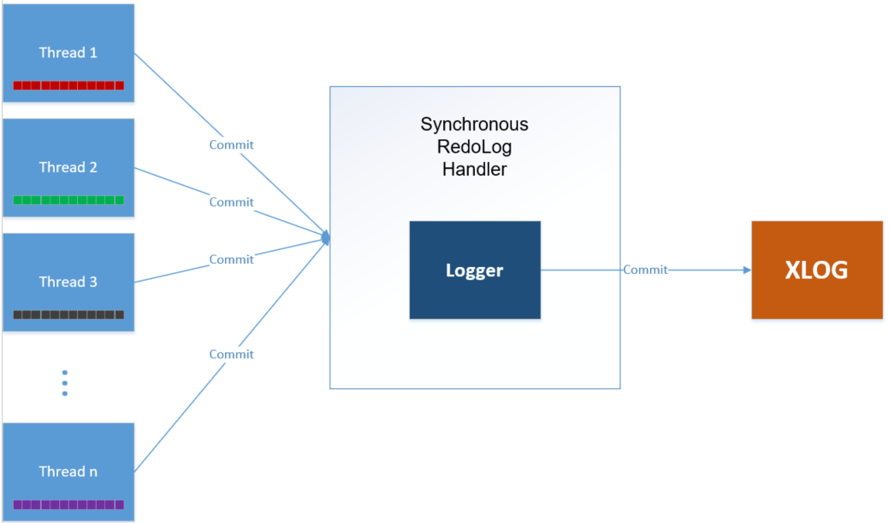
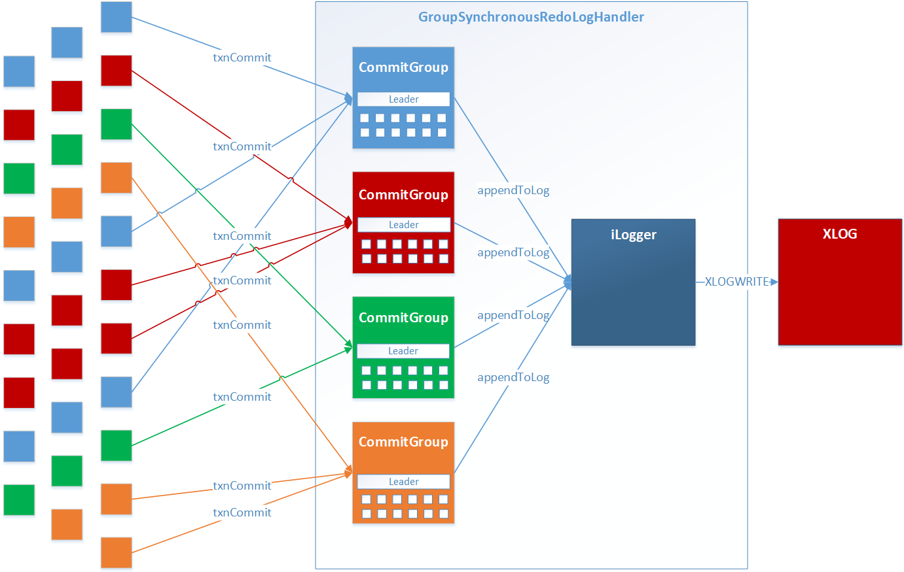
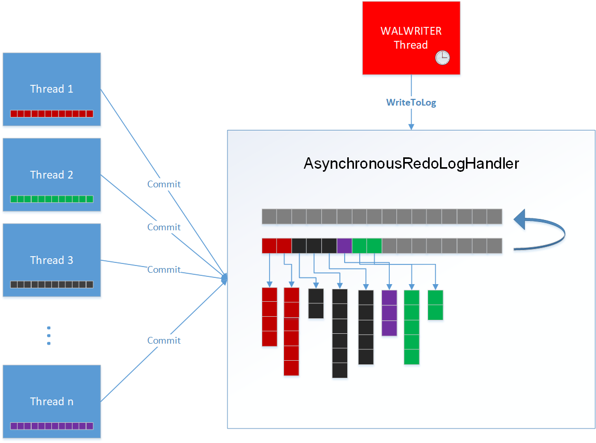
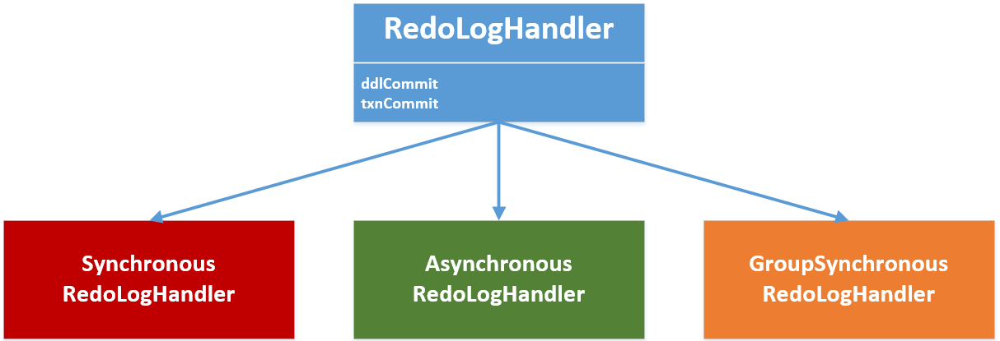
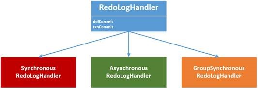
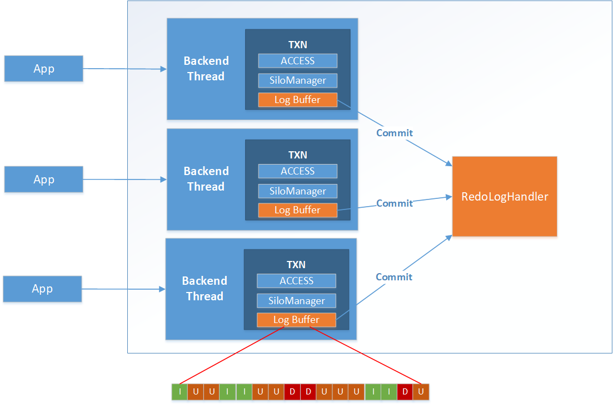

# MOT Durability Concepts

Durability refers to long-term data protection \(also known as  _disk persistence_\). Durability means that stored data does not suffer from any kind of degradation or corruption, so that data is never lost or compromised. Durability ensures that data and the MOT engine are restored to a consistent state after a planned shutdown \(for example, for maintenance\) or an unplanned crash \(for example, a power failure\).

Memory storage is volatile, meaning that it requires power to maintain the stored information. Disk storage, on the other hand, is non-volatile, meaning that it does not require power to maintain stored information, thus, it can survive a power shutdown. MOT uses both types of storage – it has all data in memory, while persisting transactional changes to disk  [MOT Durability](mot_durability.md)  and by maintaining frequent periodic  [MOT Checkpoints](mot_durability.md#section182761535131617)in order to ensure data recovery in case of shutdown.

The user must ensure sufficient disk space for the logging and Checkpointing operations. A separated drive can be used for the Checkpoint to improve performance by reducing disk I/O load.

You may refer to  [MOT Key Technologies](mot_key_technologies.md)  section__for an overview of how durability is implemented in the MOT engine.

MOTs WAL Redo Log and checkpoints enabled durability, as described below –

- **[MOT Checkpoint Concepts](mot_durability_concepts.md)**  

## MOT Logging – WAL Redo Log Concepts

### Overview

Write-Ahead Logging \(WAL\) is a standard method for ensuring data durability. The main concept of WAL is that changes to data files \(where tables and indexes reside\) are only written after those changes have been logged, meaning only after the log records that describe the changes have been flushed to permanent storage.

The MOT is fully integrated with the openGauss envelope logging facilities. In addition to durability, another benefit of this method is the ability to use the WAL for replication purposes.

Three logging methods are supported, two standard Synchronous and Asynchronous, which are also supported by the standard openGauss disk-engine. In addition, in the MOT a Group-Commit option is provided with special NUMA-Awareness optimization. The Group-Commit provides the top performance while maintaining ACID properties.

To ensure Durability, MOT is fully integrated with the openGauss's Write-Ahead Logging \(WAL\) mechanism, so that MOT persists data in WAL records using openGauss's XLOG interface. This means that every addition, update, and deletion to an MOT table's record is recorded as an entry in the WAL. This ensures that the most current data state can be regenerated and recovered from this non-volatile log. For example, if three new rows were added to a table, two were deleted and one was updated, then six entries would be recorded in the log.

- MOT log records are written to the same WAL as the other records of openGauss disk-based tables.
- MOT only logs an operation at the transaction commit phase.
- MOT only logs the updated delta record in order to minimize the amount of data written to disk.
- During recovery, data is loaded from the last known or a specific Checkpoint; and then the WAL Redo log is used to complete the data changes that occur from that point forward.
- The WAL \(Redo Log\) retains all the table row modifications until a Checkpoint is performed \(as described above\). The log can then be truncated in order to reduce recovery time and to save disk space.

    >[!NOTE]NOTE 
    >In order to ensure that the log IO device does not become a bottleneck, the log file must be placed on a drive that has low latency.

- Parallel Redo Recovery - Since the openGauss 5.0 version release, the MOT engine includes a Parallel Recovery mechanism. The recovery operations are performed using multiple threads, while the transaction commit is done with a single thread, ensuring transactional consistency. This delivers low RTO for MOT tables as per openGauss specifications.

### Logging Types

Two synchronous transaction logging options and one asynchronous transaction logging option are supported \(these are also supported by the standard openGauss disk engine\). MOT also supports synchronous Group Commit logging with NUMA-awareness optimization, as described below.

According to your configuration, one of the following types of logging is implemented: 

#### Synchronous Redo Logging

The  **Synchronous Redo Logging**  option is the simplest and most strict redo logger. When a transaction is committed by a client application, the transaction redo entries are recorded in the WAL \(Redo Log\), as follows –

1. While a transaction is in progress, it is stored in the MOT's memory.
2. After a transaction finishes and the client application sends a **Commit** command, the transaction is locked and then written to the WAL Redo Log on the disk. This means that while the transaction log entries are being written to the log, the client application is still waiting for a response.
3. As soon as the transaction's entire buffer is written to the log, the changes to the data in memory take place and then the transaction is committed. After the transaction has been committed, the client application is notified that the transaction is complete.

##### **Technical Description**

When a transaction ends, the SynchronousRedoLogHandler serializes its transaction buffer and write it to the XLOG iLogger implementation.

**Figure  1**  Synchronous Logging

##### **Summary**

The  **Synchronous Redo Logging**  option is the safest and most strict because it ensures total synchronization of the client application and the WAL Redo log entries for each transaction as it is committed; thus ensuring total durability and consistency with absolutely no data loss. This logging option prevents the situation where a client application might mark a transaction as successful, when it has not yet been persisted to disk.

The downside of the  **Synchronous Redo Logging**  option is that it is the slowest logging mechanism of the three options. This is because a client application must wait until all data is written to disk and because of the frequent disk writes \(which typically slow down the database\).

### Group Synchronous Redo Logging

The  **Group Synchronous Redo Logging**  option is very similar to the  **Synchronous Redo Logging**  option, because it also ensures total durability with absolutely no data loss and total synchronization of the client application and the WAL \(Redo Log\) entries. The difference is that the  **Group Synchronous Redo Logging**  option writes  _groups of transaction_redo entries to the WAL Redo Log on the disk at the same time, instead of writing each and every transaction as it is committed. Using Group Synchronous Redo Logging reduces the amount of disk I/Os and thus improves performance, especially when running a heavy workload.

The MOT engine performs synchronous Group Commit logging with Non-Uniform Memory Access \(NUMA\)-awareness optimization by automatically grouping transactions according to the NUMA socket of the core on which the transaction is running.

You may refer to the  [NUMA Awareness Allocation and Affinity](numa_awareness_allocation_and_affinity.md)  section for more information about NUMA-aware memory access.

When a transaction commits, a group of entries are recorded in the WAL Redo Log, as follows –

1. While a transaction is in progress, it is stored in the memory. The MOT engine groups transactions in buckets according to the NUMA socket of the core on which the transaction is running. This means that all the transactions running on the same socket are grouped together and that multiple groups will be filling in parallel according to the core on which the transaction is running.

   Writing transactions to the WAL is more efficient in this manner because all the buffers from the same socket are written to disk together.

   >[!NOTE]NOTE 
   >
   >- Each thread runs on a single core/CPU which belongs to a single socket and each thread only writes to the socket of the core on which it is running.

2. After a transaction finishes and the client application sends a Commit command, the transaction redo log entries are serialized together with other transactions that belong to the same group.
3. After the configured criteria are fulfilled for a specific group of transactions \(quantity of committed transactions or timeout period as describes in the  [REDO LOG \(MOT\)](mot_configuration.md#section361563811235)section\), the transactions in this group are written to the WAL on the disk. This means that while these log entries are being written to the log, the client applications that issued the commit are waiting for a response.
4. As soon as all the transaction buffers in the NUMA-aware group have been written to the log, all the transactions in the group are performing the necessary changes to the memory store and the clients are notified that these transactions are complete.

#### **Technical Description**

The four colors represent 4 NUMA nodes. Thus each NUMA node has its own memory log enabling a group commit of multiple connections.

**Figure  1**  Group Commit – with NUMA-awareness

#### **Summary**

The  **Group Synchronous Redo Logging**  option is an extremely safe and strict logging option because it ensures total synchronization of the client application and the WAL Redo log entries; thus ensuring total durability and consistency with absolutely no data loss. This logging option prevents the situation where a client application might mark a transaction as successful, when it has not yet been persisted to disk.

On one hand this option has fewer disk writes than the  **Synchronous Redo Logging**  option, which may mean that it is faster. The downside is that transactions are locked for longer, meaning that they are locked until after all the transactions in the same NUMA memory have been written to the WAL Redo Log on the disk.

The benefits of using this option depend on the type of transactional workload. For example, this option benefits systems that have many transactions \(and less so for systems that have few transactions, because there are few disk writes anyway\).

### Asynchronous Redo Logging

The  **Asynchronous Redo Logging**  option is the fastest logging method, However, it does not ensure no data loss, meaning that some data that is still in the buffer and was not yet written to disk may get lost upon a power failure or database crash. When a transaction is committed by a client application, the transaction redo entries are recorded in internal buffers and written to disk at preconfigured intervals. The client application does not wait for the data being written to disk. It continues to the next transaction. This is what makes asynchronous redo logging the fastest logging method.

When a transaction is committed by a client application, the transaction redo entries are recorded in the WAL Redo Log, as follows –

1. While a transaction is in progress, it is stored in the MOT's memory.
2. After a transaction finishes and the client application sends a Commit command, the transaction redo entries are written to internal buffers, but are not yet written to disk. Then changes to the MOT data memory take place and the client application is notified that the transaction is committed.
3. At a preconfigured interval, a redo log thread running in the background collects all the buffered redo log entries and writes them to disk.

#### **Technical Description**

Upon transaction commit, the transaction buffer is moved \(pointer assignment – not a data copy\) to a centralized buffer and a new transaction buffer is allocated for the transaction. The transaction is released as soon as its buffer is moved to the centralized buffer and the transaction thread is not blocked. The actual write to the log uses the Postgres walwriter thread. When the walwriter timer elapses, it first calls the AsynchronousRedoLogHandler \(via registered callback\) to write its buffers and then continues with its logic and flushes the data to the XLOG.

**Figure  1**  Asynchronous Logging

#### **Summary**

The Asynchronous Redo Logging option is the fastest logging option because it does not require the client application to wait for data being written to disk. In addition, it groups many transactions redo entries and writes them together, thus reducing the amount of disk I/Os that slow down the MOT engine.

The downside of the Asynchronous Redo Logging option is that it does not ensure that data will not get lost upon a crash or failure. Data that was committed, but was not yet written to disk, is not durable on commit and thus cannot be recovered in case of a failure. The Asynchronous Redo Logging option is most relevant for applications that are willing to sacrifice data recovery \(consistency\) over performance.

Logging Design Details

The following describes the design details of each persistence-related component in the In-Memory Engine Module.

**Figure  2**  Three Logging Options

The RedoLog component is used by both by backend threads that use the In-Memory Engine and by the WAL writer in order to persist their data. Checkpoints are performed using the Checkpoint Manager, which is triggered by the Postgres checkpointer.

#### Additional information

##### Logging Design Overview

Write-Ahead Logging \(WAL\) is a standard method for ensuring data durability. WAL's central concept is that changes to data files \(where tables and indexes reside\) are only written after those changes have been logged, meaning after the log records that describe these changes have been flushed to permanent storage.

The MOT Engine uses the existing openGauss logging facilities, enabling it also to participate in the replication process. 

**Figure  1**  Three Logging Options

The RedoLog component is used by both by backend threads that use the MOT Engine and by the WAL writer in order to persist their data. Checkpoints are performed using the Checkpoint Manager, which is triggered by the Postgres checkpointer.

##### Per-transaction Logging

In the In-Memory Engine, the transaction log records are stored in a transaction buffer which is part of the transaction object \(TXN\). The transaction buffer is logged during the calls to addToLog\(\) – if the buffer exceeds a threshold it is then flushed and reused. When a transaction commits and passes the validation phase \(OCC SILO\[[Comparison – Disk vs. MOT](comparison_disk_vs_mot.md)\]  validation\) or aborts for some reason, the appropriate message is saved in the log as well in order to make it possible to determine the transaction's state during a recovery.

**Figure  1**  Per-transaction Logging

Parallel Logging is performed both by MOT and disk engines. However, the MOT engine enhances this design with a log-buffer per transaction, lockless preparation and a single log record.

- [Exception Handling](#exception-handling)

##### Exception Handling

The persistence module handles exceptions by using the Postgres error reporting infrastructure \(ereport\). An error message is recorded in the system log for each error condition. In addition, the error is reported to the envelope using Postgres's built-in error reporting infrastructure.

The following exceptions are reported by this module –

**Table  1**  Exception Handling

<table><thead align="left"><tr id="row30342279"><th class="cellrowborder" valign="top" width="29.292929292929294%" id="mcps1.2.5.1.1">
Exception Condition

</th>
<th class="cellrowborder" valign="top" width="26.26262626262626%" id="mcps1.2.5.1.2">
Exception Code

</th>
<th class="cellrowborder" valign="top" width="21.21212121212121%" id="mcps1.2.5.1.3">
Scenario

</th>
<th class="cellrowborder" valign="top" width="23.232323232323232%" id="mcps1.2.5.1.4">
Resulting Outcome

</th>
</tr>
</thead>
<tbody><tr id="row538217"><td class="cellrowborder" valign="top" width="29.292929292929294%" headers="mcps1.2.5.1.1 ">
WAL write failure

</td>
<td class="cellrowborder" valign="top" width="26.26262626262626%" headers="mcps1.2.5.1.2 ">
ERRCODE_FDW_ERROR

</td>
<td class="cellrowborder" valign="top" width="21.21212121212121%" headers="mcps1.2.5.1.3 ">
On any case the WAL write fails

</td>
<td class="cellrowborder" valign="top" width="23.232323232323232%" headers="mcps1.2.5.1.4 ">
Transaction terminates

</td>
</tr>
<tr id="row6047043"><td class="cellrowborder" valign="top" width="29.292929292929294%" headers="mcps1.2.5.1.1 ">
File IO error: write, open and so on

</td>
<td class="cellrowborder" valign="top" width="26.26262626262626%" headers="mcps1.2.5.1.2 ">
ERRCODE_IO_ERROR

</td>
<td class="cellrowborder" valign="top" width="21.21212121212121%" headers="mcps1.2.5.1.3 ">
Checkpoint – Called on any file access error

</td>
<td class="cellrowborder" valign="top" width="23.232323232323232%" headers="mcps1.2.5.1.4 ">
FATAL – process exists

</td>
</tr>
<tr id="row15005906"><td class="cellrowborder" valign="top" width="29.292929292929294%" headers="mcps1.2.5.1.1 ">
Out of Memory

</td>
<td class="cellrowborder" valign="top" width="26.26262626262626%" headers="mcps1.2.5.1.2 ">
ERRCODE_INSUFFICIENT_RESOURCES

</td>
<td class="cellrowborder" valign="top" width="21.21212121212121%" headers="mcps1.2.5.1.3 ">
Checkpoint – Local memory allocation failures

</td>
<td class="cellrowborder" valign="top" width="23.232323232323232%" headers="mcps1.2.5.1.4 ">
FATAL – process exists

</td>
</tr>
<tr id="row13208031"><td class="cellrowborder" valign="top" width="29.292929292929294%" headers="mcps1.2.5.1.1 ">
Logic, DB errors

</td>
<td class="cellrowborder" valign="top" width="26.26262626262626%" headers="mcps1.2.5.1.2 ">
ERRCODE_INTERNAL_ERROR

</td>
<td class="cellrowborder" valign="top" width="21.21212121212121%" headers="mcps1.2.5.1.3 ">
Checkpoint: algorithm fails or failure to retrieve table data or indexes.

</td>
<td class="cellrowborder" valign="top" width="23.232323232323232%" headers="mcps1.2.5.1.4 ">
FATAL – process exists

</td>
</tr>
</tbody>
</table>

## MOT Checkpoint Concepts

In openGauss, a Checkpoints is a snapshot of a point in the sequence of transactions at which it is guaranteed that the heap and index data files have been updated with all information written before the checkpoint.

At the time of a Checkpoint, all dirty data pages are flushed to disk and a special checkpoint record is written to the log file.

The data is stored directly in memory. The MOT does not store its data it the same way as openGauss so that the concept of dirty pages does not exist.

For this reason, we have researched and implemented the CALC algorithm, which is described in the paper named Low-Overhead Asynchronous Checkpointing in Main-Memory Database Systems, SIGMOD 2016 from Yale University.

Low-overhead asynchronous checkpointing in main-memory database systems.

### CALC Checkpoint Algorithm – Low Overhead in Memory and Compute

The checkpoint algorithm provides the following benefits –

- **Reduced Memory Usage –**  At most two copies of each record are stored at any time. Memory usage is minimized by only storing a single physical copy of a record while it is live and stable versions are equal or when no checkpoint is actively being recorded.
- **Low Overhead –**  CALC's overhead is smaller than other asynchronous checkpointing algorithms.
- **Uses Virtual Points of Consistency –**  CALC does not require quiescing of the database in order to achieve a physical point of consistency.

### Checkpoint Activation

MOT checkpoints are integrated into openGauss's envelope's Checkpoint mechanism. The Checkpoint process can be triggered manually by executing the  **CHECKPOINT;**  command or automatically according to the envelope's Checkpoint triggering settings \(time/size\).

Checkpoint configuration is performed in the mot.conf file – see the   [CHECKPOINT \(MOT\)](mot_configuration.md#section8719101152712)section.
