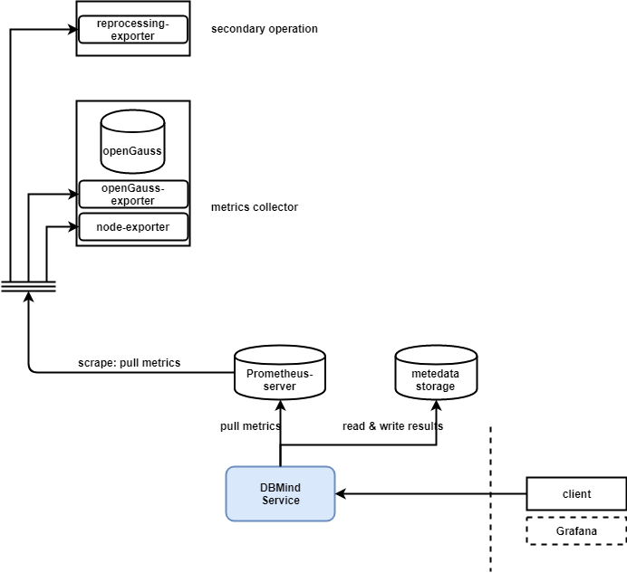

# AI4DB: 数据库自治运维

如上文所述，AI4DB主要用于对数据库进行自治运维和管理，从而帮助数据库运维人员减少运维工作量。在实现上，DBMind的AI4DB框架具有监控和服务化的性质，同时也提供即时AI工具包，提供开箱即用的AI运维功能（如索引推荐）。AI4DB的监控平台以开源的Prometheus为主，DBMind提供监控数据生产者exporter, 可与Prometheus平台完成对接。DBMind的AI4DB服务架构如下图所示：

**图 1**  DBMind AI4DB服务架构  

图中各关键组件说明：

- DBMind Service: DBMind后台服务，可用于定期离线计算，包括慢SQL根因分析、时序预测等；
- Prometheus-server: Prometheus 监控指标存储的服务器；
- metadatabase: DBMind在离线计算结束后，将计算结果存储在此处，支持openGauss、SQLite等数据库；
- client: 用户读取DBMind离线计算结果的客户端，目前仅实现命令行客户端；若采用openGauss等数据库存储计算DBMind计算结果，则用户可以自行配置Grafana等可视化工具对该结果进行可视化；
- openGauss-exporter: 用户从openGauss数据库节点上采集监控指标，供DBMind服务进行计算；
- node-exporter: Prometheus官方提供的exporter, 可用于监控该节点的系统指标，如CPU和内存使用情况；
- reprocessing-exporter: 用于对Prometheus采集到的指标进行二次加工处理，例如计算CPU使用率等。

- **[DBMind模式说明](dbmind_mode.md)**  

- **[DBMind的支持组件](prometheus_exporter_overview.md)**  

- **[DBMind的AI子功能](ai_sub_functions_of_the_dbmind.md)**  
