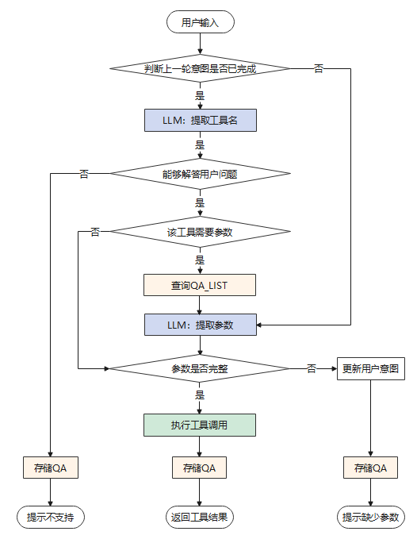

# 智能运维<a name="ZH-CN_TOPIC_0000002293119517"></a>

## 前置操作<a id="0000002258589378"></a>

在使用智能运维之前，需要先注册集群，注册集群后绑定用户需要诊断的集群。另外，还需要绑定用户需要使用的大语言模型。

以用户ID为test\_user，会话ID为test\_session，集群实例地址为10.x.x.x:1为例。

### 注册、绑定集群<a name="section414219541089"></a>

1. 注册集群

    ```
    curl -X 'POST' 'https://x.x.x.x:x/v1/api/clusters/register' -H 'accept: application/json' -H 'Content-Type: application/json' --cacert /path/xxx.crt --key /path/xxx.key --cert /path/xxx.crt -d '{ "cluster_name": "cluster1", "host": "10.x.x.x", "port": "1", "username": "user", "password": "db_password"}' --pass "***"
    ```

2. 绑定集群

    ```
    curl -X 'PUT' 'https://x.x.x.x:x/v1/api/clusters?instance=10.x.x.x:1&user_id=test_user&session_id=test_session' -H 'accept: application/json' -H 'Content-Type: application/json' --cacert /path/xxx.crt --key /path/xxx.key --cert /path/xxx.crt --pass "***"
    ```

    如果返回结果中data值为True，说明绑定成功。如果需要换绑其他集群，仅需修改instance参数值，重新调用该接口即可。如果用户创建新会话，不重新绑定集群的话，默认使用上次绑定的集群。

### 绑定大语言模型<a name="section6312161011917"></a>

1. 查询可用的大语言模型

    ```
    curl -X 'GET' 'https://x.x.x.x:x/v1/api/llms' -H 'accept: application/json' -H 'Content-Type: application/json' --cacert /path/xxx.crt --key /path/xxx.key --cert /path/xxx.crt --pass "***"
    ```

2. 绑定大语言模型

    ```
    curl -X 'PUT' 'https://x.x.x.x:x/v1/api/llms?name=xxx&user_id=xxx&session_id=xxx' -H 'accept: application/json' -H 'Content-Type: application/json' --cacert /path/xxx.crt --key /path/xxx.key --cert /path/xxx.crt --pass "***"
    ```

    如果返回结果中data值为True，说明绑定成功。如果需要换绑其他大语言模型，仅需修改name参数值，重新调用该接口即可。  
     
    如果不绑定大语言模型，直接调用app/intelligent-interaction接口，使用配置文件中默认配置的大语言模型。

## 工具交互<a name="ZH-CN_TOPIC_0000002258589366"></a>

在用户进行工具交互前，需要先执行完成[前置操作](#0000002258589378)，之后可以使用问答的方式对GaussMaster服务进行提问，后台接口为/v1/api/app/intelligent-interaction。此接口参数“mode”的值必须为“tool\_interaction”，即当前模式为工具交互，API详情请参考[API: /v1/api/app/intelligent-interaction](#section95391566019)。工具交互默认支持多轮对话，对话记录长度为1轮。用户可以通过参数"history\_len"指定对话记录的长度，可支持的对话记录长度为\[1-3\]，即大语言模型最多可以记住3轮对话历史。

工具交互的流程图如下[图1](#fig518531224414)所示：

**图 1**  工具交互流程图<a name="fig518531224414"></a>  


### 工具交互约束<a name="section199011054151511"></a>

1. 用户可以使用华为云提供的pangu-38b开源模型工具，识别准确率为90%。也可以指定其他开源模型，通过接口的形式进行调用，使用其他开源模型做工具交互时，识别准确率无法保证。
2. 智能运维中工具交互支持参数追问，参数不全时可基于历史内容进行补全。
3. DBMind/openGauss组件不可用/升级等场景下，GaussMaster服务会受到影响。
4. GaussMaster智能运维不提供前台页面，且目前只支持中文问答。

当前内部已支持的DBmind工具（API）共22个（其中告警查询需要用到DBMind的两个API），如下表：

**表 1**  API列表

<a name="table1133317381846"></a>
<table><thead align="left"><tr id="row103342386416"><th class="cellrowborder" valign="top" width="7.200000000000001%" id="mcps1.2.6.1.1"><p id="p154771952398"><a name="p154771952398"></a><a name="p154771952398"></a>ID</p>
</th>
<th class="cellrowborder" valign="top" width="30.250000000000004%" id="mcps1.2.6.1.2"><p id="p1147745215911"><a name="p1147745215911"></a><a name="p1147745215911"></a>API接口</p>
</th>
<th class="cellrowborder" valign="top" width="16.310000000000002%" id="mcps1.2.6.1.3"><p id="p194601714174"><a name="p194601714174"></a><a name="p194601714174"></a>参数</p>
</th>
<th class="cellrowborder" valign="top" width="23.12%" id="mcps1.2.6.1.4"><p id="p347755216914"><a name="p347755216914"></a><a name="p347755216914"></a>关键信息</p>
</th>
<th class="cellrowborder" valign="top" width="23.12%" id="mcps1.2.6.1.5"><p id="p1247711521090"><a name="p1247711521090"></a><a name="p1247711521090"></a>对话示例</p>
</th>
</tr>
</thead>
<tbody><tr id="row63341138644"><td class="cellrowborder" valign="top" width="7.200000000000001%" headers="mcps1.2.6.1.1 "><p id="p20477452497"><a name="p20477452497"></a><a name="p20477452497"></a>1</p>
</td>
<td class="cellrowborder" valign="top" width="30.250000000000004%" headers="mcps1.2.6.1.2 "><p id="p1147716521097"><a name="p1147716521097"></a><a name="p1147716521097"></a>/v1/api/status/data-directory</p>
</td>
<td class="cellrowborder" valign="top" width="16.310000000000002%" headers="mcps1.2.6.1.3 "><p id="p04601414872"><a name="p04601414872"></a><a name="p04601414872"></a>- instance：str类型，必要参数，需要查询的数据库的数据节点的ip和port</p>
</td>
<td class="cellrowborder" valign="top" width="23.12%" headers="mcps1.2.6.1.4 "><p id="p94775521298"><a name="p94775521298"></a><a name="p94775521298"></a>数据库实例，数据库数据目录状态。</p>
</td>
<td class="cellrowborder" valign="top" width="23.12%" headers="mcps1.2.6.1.5 "><p id="p7477145211911"><a name="p7477145211911"></a><a name="p7477145211911"></a>查询10.90.56.xxx:xxx的数据目录状态。</p>
</td>
</tr>
<tr id="row73343387418"><td class="cellrowborder" valign="top" width="7.200000000000001%" headers="mcps1.2.6.1.1 "><p id="p4477852792"><a name="p4477852792"></a><a name="p4477852792"></a>2</p>
</td>
<td class="cellrowborder" valign="top" width="30.250000000000004%" headers="mcps1.2.6.1.2 "><p id="p847719521495"><a name="p847719521495"></a><a name="p847719521495"></a>/v1/api/app/workload-collection?data_source=dbe_perf.statement_history</p>
</td>
<td class="cellrowborder" valign="top" width="16.310000000000002%" headers="mcps1.2.6.1.3 "><p id="p1646011141076"><a name="p1646011141076"></a><a name="p1646011141076"></a>- start_time：str类型，必要参数，通过SQL语句的开始时间对SQL语句进行筛选，格式为%Y-%m-%d %H:%M:%S</p>
<p id="p6696291899"><a name="p6696291899"></a><a name="p6696291899"></a>- end_time：str类型，必要参数，通过SQL语句的结束时间对SQL语句进行筛选，格式为%Y-%m-%d %H:%M:%S</p>
<p id="p1483165716913"><a name="p1483165716913"></a><a name="p1483165716913"></a>- database：str类型，非必要参数，通过SQL语句运行的数据库名对SQL语句进行筛选，未指定默认为None</p>
<p id="p148314578919"><a name="p148314578919"></a><a name="p148314578919"></a>- schema:  str类型，非必要参数，通过SQL语句运行的数据库模式对SQL语句进行筛选，未指定默认为None</p>
</td>
<td class="cellrowborder" valign="top" width="23.12%" headers="mcps1.2.6.1.4 "><p id="p6477752494"><a name="p6477752494"></a><a name="p6477752494"></a>开始时间、结束时间、数据库名（非必须）、 schema（非必须）。</p>
</td>
<td class="cellrowborder" valign="top" width="23.12%" headers="mcps1.2.6.1.5 "><p id="p194771752492"><a name="p194771752492"></a><a name="p194771752492"></a>查询test_db数据库中上午10点到11点的sql列表。</p>
</td>
</tr>
<tr id="row173344386416"><td class="cellrowborder" valign="top" width="7.200000000000001%" headers="mcps1.2.6.1.1 "><p id="p184772525912"><a name="p184772525912"></a><a name="p184772525912"></a>3</p>
</td>
<td class="cellrowborder" valign="top" width="30.250000000000004%" headers="mcps1.2.6.1.2 "><p id="p124779525912"><a name="p124779525912"></a><a name="p124779525912"></a>/v1/api/app/workload-collection?data_source=pg_stat_activity</p>
</td>
<td class="cellrowborder" valign="top" width="16.310000000000002%" headers="mcps1.2.6.1.3 "><p id="p15460214274"><a name="p15460214274"></a><a name="p15460214274"></a>- database：str类型，非必要参数，通过SQL语句运行的数据库名对SQL语句进行筛选，未指定默认为None</p>
<p id="p557644315812"><a name="p557644315812"></a><a name="p557644315812"></a>- schema:  str类型，非必要参数，通过SQL语句运行的数据库模式对SQL语句进行筛选，未指定默认为None</p>
</td>
<td class="cellrowborder" valign="top" width="23.12%" headers="mcps1.2.6.1.4 "><p id="p164771352992"><a name="p164771352992"></a><a name="p164771352992"></a>数据库名，正在执行的SQL。</p>
</td>
<td class="cellrowborder" valign="top" width="23.12%" headers="mcps1.2.6.1.5 "><p id="p13477152397"><a name="p13477152397"></a><a name="p13477152397"></a>查询test_db数据库中当前正在执行的SQL。</p>
</td>
</tr>
<tr id="row19334133815420"><td class="cellrowborder" valign="top" width="7.200000000000001%" headers="mcps1.2.6.1.1 "><p id="p1247712521598"><a name="p1247712521598"></a><a name="p1247712521598"></a>4</p>
</td>
<td class="cellrowborder" valign="top" width="30.250000000000004%" headers="mcps1.2.6.1.2 "><p id="p11477195217912"><a name="p11477195217912"></a><a name="p11477195217912"></a>/v1/api/summary/sql/top</p>
</td>
<td class="cellrowborder" valign="top" width="16.310000000000002%" headers="mcps1.2.6.1.3 "><p id="p1346017143715"><a name="p1346017143715"></a><a name="p1346017143715"></a>None</p>
</td>
<td class="cellrowborder" valign="top" width="23.12%" headers="mcps1.2.6.1.4 "><p id="p2477952198"><a name="p2477952198"></a><a name="p2477952198"></a>执行频繁的SQL。</p>
</td>
<td class="cellrowborder" valign="top" width="23.12%" headers="mcps1.2.6.1.5 "><p id="p144778524912"><a name="p144778524912"></a><a name="p144778524912"></a>查询top SQL。</p>
</td>
</tr>
<tr id="row2033418381345"><td class="cellrowborder" valign="top" width="7.200000000000001%" headers="mcps1.2.6.1.1 "><p id="p174779522097"><a name="p174779522097"></a><a name="p174779522097"></a>5</p>
</td>
<td class="cellrowborder" valign="top" width="30.250000000000004%" headers="mcps1.2.6.1.2 "><p id="p1747795212911"><a name="p1747795212911"></a><a name="p1747795212911"></a>/v1/api/summary/sql/locking</p>
</td>
<td class="cellrowborder" valign="top" width="16.310000000000002%" headers="mcps1.2.6.1.3 "><p id="p74604142718"><a name="p74604142718"></a><a name="p74604142718"></a>None</p>
</td>
<td class="cellrowborder" valign="top" width="23.12%" headers="mcps1.2.6.1.4 "><p id="p547705215915"><a name="p547705215915"></a><a name="p547705215915"></a>锁等待、阻塞、SQL。</p>
</td>
<td class="cellrowborder" valign="top" width="23.12%" headers="mcps1.2.6.1.5 "><p id="p164771052492"><a name="p164771052492"></a><a name="p164771052492"></a>查询当前被阻塞的SQL。</p>
</td>
</tr>
<tr id="row1233512389417"><td class="cellrowborder" valign="top" width="7.200000000000001%" headers="mcps1.2.6.1.1 "><p id="p174771952691"><a name="p174771952691"></a><a name="p174771952691"></a>6</p>
</td>
<td class="cellrowborder" valign="top" width="30.250000000000004%" headers="mcps1.2.6.1.2 "><p id="p154771752596"><a name="p154771752596"></a><a name="p154771752596"></a>/v1/api/summary/alarms和/v1/api/summary/cluster-diagnosis</p>
</td>
<td class="cellrowborder" valign="top" width="16.310000000000002%" headers="mcps1.2.6.1.3 "><p id="p12460191416710"><a name="p12460191416710"></a><a name="p12460191416710"></a>- start_time：str类型，必要参数，用来筛选告警的时间范围的开始时间，格式为%Y-%m-%d %H:%M:%S</p>
<p id="p101875509109"><a name="p101875509109"></a><a name="p101875509109"></a>- end_time：str类型，必要参数，用来筛选告警的时间范围的结束时间，格式为%Y-%m-%d %H:%M:%S</p>
</td>
<td class="cellrowborder" valign="top" width="23.12%" headers="mcps1.2.6.1.4 "><p id="p1847817524919"><a name="p1847817524919"></a><a name="p1847817524919"></a>开始时间、结束时间、查询告警。</p>
</td>
<td class="cellrowborder" valign="top" width="23.12%" headers="mcps1.2.6.1.5 "><p id="p747813527918"><a name="p747813527918"></a><a name="p747813527918"></a>查询今天10点到12点的告警。</p>
</td>
</tr>
<tr id="row17335838743"><td class="cellrowborder" valign="top" width="7.200000000000001%" headers="mcps1.2.6.1.1 "><p id="p2478145218910"><a name="p2478145218910"></a><a name="p2478145218910"></a>7</p>
</td>
<td class="cellrowborder" valign="top" width="30.250000000000004%" headers="mcps1.2.6.1.2 "><p id="p194781252392"><a name="p194781252392"></a><a name="p194781252392"></a>/v1/api/agents</p>
</td>
<td class="cellrowborder" valign="top" width="16.310000000000002%" headers="mcps1.2.6.1.3 "><p id="p1846011141079"><a name="p1846011141079"></a><a name="p1846011141079"></a>None</p>
</td>
<td class="cellrowborder" valign="top" width="23.12%" headers="mcps1.2.6.1.4 "><p id="p947885213912"><a name="p947885213912"></a><a name="p947885213912"></a>查询纳管集群信息。</p>
</td>
<td class="cellrowborder" valign="top" width="23.12%" headers="mcps1.2.6.1.5 "><p id="p15478115218915"><a name="p15478115218915"></a><a name="p15478115218915"></a>查询当前纳管的所有集群信息。</p>
</td>
</tr>
<tr id="row533514380410"><td class="cellrowborder" valign="top" width="7.200000000000001%" headers="mcps1.2.6.1.1 "><p id="p1478165220913"><a name="p1478165220913"></a><a name="p1478165220913"></a>8</p>
</td>
<td class="cellrowborder" valign="top" width="30.250000000000004%" headers="mcps1.2.6.1.2 "><p id="p1478452297"><a name="p1478452297"></a><a name="p1478452297"></a>/v1/api/status/instances</p>
</td>
<td class="cellrowborder" valign="top" width="16.310000000000002%" headers="mcps1.2.6.1.3 "><p id="p174607141076"><a name="p174607141076"></a><a name="p174607141076"></a>None</p>
</td>
<td class="cellrowborder" valign="top" width="23.12%" headers="mcps1.2.6.1.4 "><p id="p94781652190"><a name="p94781652190"></a><a name="p94781652190"></a>数据库实例状态。</p>
</td>
<td class="cellrowborder" valign="top" width="23.12%" headers="mcps1.2.6.1.5 "><p id="p2047805212913"><a name="p2047805212913"></a><a name="p2047805212913"></a>查询当前数据库实例状态。</p>
</td>
</tr>
<tr id="row0335133815410"><td class="cellrowborder" valign="top" width="7.200000000000001%" headers="mcps1.2.6.1.1 "><p id="p847812521694"><a name="p847812521694"></a><a name="p847812521694"></a>9</p>
</td>
<td class="cellrowborder" valign="top" width="30.250000000000004%" headers="mcps1.2.6.1.2 "><p id="p1647855218919"><a name="p1647855218919"></a><a name="p1647855218919"></a>/v1/api/summary/database-list</p>
</td>
<td class="cellrowborder" valign="top" width="16.310000000000002%" headers="mcps1.2.6.1.3 "><p id="p1746018141277"><a name="p1746018141277"></a><a name="p1746018141277"></a>None</p>
</td>
<td class="cellrowborder" valign="top" width="23.12%" headers="mcps1.2.6.1.4 "><p id="p54783521096"><a name="p54783521096"></a><a name="p54783521096"></a>查询数据库列表。</p>
</td>
<td class="cellrowborder" valign="top" width="23.12%" headers="mcps1.2.6.1.5 "><p id="p74785522919"><a name="p74785522919"></a><a name="p74785522919"></a>查询当前实例下所有的数据库列表。</p>
</td>
</tr>
<tr id="row173353389417"><td class="cellrowborder" valign="top" width="7.200000000000001%" headers="mcps1.2.6.1.1 "><p id="p7478145218914"><a name="p7478145218914"></a><a name="p7478145218914"></a>10</p>
</td>
<td class="cellrowborder" valign="top" width="30.250000000000004%" headers="mcps1.2.6.1.2 "><p id="p747818528919"><a name="p747818528919"></a><a name="p747818528919"></a>/v1/api/summary/knob-recommendation/snapshots</p>
</td>
<td class="cellrowborder" valign="top" width="16.310000000000002%" headers="mcps1.2.6.1.3 "><p id="p1546071414720"><a name="p1546071414720"></a><a name="p1546071414720"></a>None</p>
</td>
<td class="cellrowborder" valign="top" width="23.12%" headers="mcps1.2.6.1.4 "><p id="p134783521915"><a name="p134783521915"></a><a name="p134783521915"></a>指标快照。</p>
</td>
<td class="cellrowborder" valign="top" width="23.12%" headers="mcps1.2.6.1.5 "><p id="p154787522919"><a name="p154787522919"></a><a name="p154787522919"></a>查询当前指标快照。</p>
</td>
</tr>
<tr id="row17335938246"><td class="cellrowborder" valign="top" width="7.200000000000001%" headers="mcps1.2.6.1.1 "><p id="p1847811527918"><a name="p1847811527918"></a><a name="p1847811527918"></a>11</p>
</td>
<td class="cellrowborder" valign="top" width="30.250000000000004%" headers="mcps1.2.6.1.2 "><p id="p147875219918"><a name="p147875219918"></a><a name="p147875219918"></a>/v1/api/summary/knob-recommendation/details</p>
</td>
<td class="cellrowborder" valign="top" width="16.310000000000002%" headers="mcps1.2.6.1.3 "><p id="p846081412712"><a name="p846081412712"></a><a name="p846081412712"></a>None</p>
</td>
<td class="cellrowborder" valign="top" width="23.12%" headers="mcps1.2.6.1.4 "><p id="p16478165218918"><a name="p16478165218918"></a><a name="p16478165218918"></a>参数推荐详情。</p>
</td>
<td class="cellrowborder" valign="top" width="23.12%" headers="mcps1.2.6.1.5 "><p id="p44787521193"><a name="p44787521193"></a><a name="p44787521193"></a>查询参数推荐详情。</p>
</td>
</tr>
<tr id="row143351838341"><td class="cellrowborder" valign="top" width="7.200000000000001%" headers="mcps1.2.6.1.1 "><p id="p1747817521591"><a name="p1747817521591"></a><a name="p1747817521591"></a>12</p>
</td>
<td class="cellrowborder" valign="top" width="30.250000000000004%" headers="mcps1.2.6.1.2 "><p id="p144787525918"><a name="p144787525918"></a><a name="p144787525918"></a>/v1/api/summary/knob-recommendation/warnings</p>
</td>
<td class="cellrowborder" valign="top" width="16.310000000000002%" headers="mcps1.2.6.1.3 "><p id="p174604141272"><a name="p174604141272"></a><a name="p174604141272"></a>None</p>
</td>
<td class="cellrowborder" valign="top" width="23.12%" headers="mcps1.2.6.1.4 "><p id="p247865217913"><a name="p247865217913"></a><a name="p247865217913"></a>不合理或告警的指标配置。</p>
</td>
<td class="cellrowborder" valign="top" width="23.12%" headers="mcps1.2.6.1.5 "><p id="p1847855212918"><a name="p1847855212918"></a><a name="p1847855212918"></a>查询当前不合理的指标配置。</p>
</td>
</tr>
<tr id="row33369389418"><td class="cellrowborder" valign="top" width="7.200000000000001%" headers="mcps1.2.6.1.1 "><p id="p54781052297"><a name="p54781052297"></a><a name="p54781052297"></a>13</p>
</td>
<td class="cellrowborder" valign="top" width="30.250000000000004%" headers="mcps1.2.6.1.2 "><p id="p1147818521595"><a name="p1147818521595"></a><a name="p1147818521595"></a>/v1/api/status/overview</p>
</td>
<td class="cellrowborder" valign="top" width="16.310000000000002%" headers="mcps1.2.6.1.3 "><p id="p346019141771"><a name="p346019141771"></a><a name="p346019141771"></a>None</p>
</td>
<td class="cellrowborder" valign="top" width="23.12%" headers="mcps1.2.6.1.4 "><p id="p647811525913"><a name="p647811525913"></a><a name="p647811525913"></a>数据库概览信息。</p>
</td>
<td class="cellrowborder" valign="top" width="23.12%" headers="mcps1.2.6.1.5 "><p id="p1478145211910"><a name="p1478145211910"></a><a name="p1478145211910"></a>查询数据库概览。</p>
</td>
</tr>
<tr id="row173365388416"><td class="cellrowborder" valign="top" width="7.200000000000001%" headers="mcps1.2.6.1.1 "><p id="p13478852095"><a name="p13478852095"></a><a name="p13478852095"></a>14</p>
</td>
<td class="cellrowborder" valign="top" width="30.250000000000004%" headers="mcps1.2.6.1.2 "><p id="p347819521597"><a name="p347819521597"></a><a name="p347819521597"></a>/v1/api/summary/metrics/pg_settings_setting</p>
</td>
<td class="cellrowborder" valign="top" width="16.310000000000002%" headers="mcps1.2.6.1.3 "><p id="p13215162004317"><a name="p13215162004317"></a><a name="p13215162004317"></a>- name:  str类型，必要参数，需要查询的GUC参数的名称</p>
</td>
<td class="cellrowborder" valign="top" width="23.12%" headers="mcps1.2.6.1.4 "><p id="p144781352591"><a name="p144781352591"></a><a name="p144781352591"></a>GUC参数名。</p>
</td>
<td class="cellrowborder" valign="top" width="23.12%" headers="mcps1.2.6.1.5 "><p id="p84784521293"><a name="p84784521293"></a><a name="p84784521293"></a>查询GUC参数wdr_snapshot_retention_days的值。</p>
</td>
</tr>
<tr id="row123362381743"><td class="cellrowborder" valign="top" width="7.200000000000001%" headers="mcps1.2.6.1.1 "><p id="p447935217913"><a name="p447935217913"></a><a name="p447935217913"></a>15</p>
</td>
<td class="cellrowborder" valign="top" width="30.250000000000004%" headers="mcps1.2.6.1.2 "><p id="p1847918522917"><a name="p1847918522917"></a><a name="p1847918522917"></a>/v1/api/summary/metrics/{name}</p>
</td>
<td class="cellrowborder" valign="top" width="16.310000000000002%" headers="mcps1.2.6.1.3 "><p id="p3456194175515"><a name="p3456194175515"></a><a name="p3456194175515"></a>- name:  str类型，必要参数，需要查询的GUC参数的名称</p>
</td>
<td class="cellrowborder" valign="top" width="23.12%" headers="mcps1.2.6.1.4 "><p id="p134797522919"><a name="p134797522919"></a><a name="p134797522919"></a>指标名、开始时间、结束时间。</p>
</td>
<td class="cellrowborder" valign="top" width="23.12%" headers="mcps1.2.6.1.5 "><p id="p94798521691"><a name="p94798521691"></a><a name="p94798521691"></a>查询指标os_mem_usage在今天上午8点到9点的数据。</p>
</td>
</tr>
<tr id="row1733613382420"><td class="cellrowborder" valign="top" width="7.200000000000001%" headers="mcps1.2.6.1.1 "><p id="p18479105211913"><a name="p18479105211913"></a><a name="p18479105211913"></a>16</p>
</td>
<td class="cellrowborder" valign="top" width="30.250000000000004%" headers="mcps1.2.6.1.2 "><p id="p164798521916"><a name="p164798521916"></a><a name="p164798521916"></a>/v1/api/app/slow-sql-rca</p>
<div class="note" id="note181257275363"><a name="note181257275363"></a><a name="note181257275363"></a><span class="notetitle"> 说明： </span><div class="notebody"><p id="p21251427113617"><a name="p21251427113617"></a><a name="p21251427113617"></a>为了提高工具交互的可用性，简化了原始DBMind的慢SQL诊断接口的入参，与锁事件和等待事件相关的根因，盘溢出根因暂不支持。</p>
</div></div>
</td>
<td class="cellrowborder" valign="top" width="16.310000000000002%" headers="mcps1.2.6.1.3 "><p id="p63161833171319"><a name="p63161833171319"></a><a name="p63161833171319"></a>- query:  str类型，必要参数，需要进行SQL根因分析的查询语句SQL</p>
<p id="p2316733101320"><a name="p2316733101320"></a><a name="p2316733101320"></a>- db_name:  str类型，必要参数，需要进行SQL根因分析的查询语句SQL所在的数据库名</p>
</td>
<td class="cellrowborder" valign="top" width="23.12%" headers="mcps1.2.6.1.4 "><p id="p144797521692"><a name="p144797521692"></a><a name="p144797521692"></a>sql语句、数据库名、慢SQL根因分析。</p>
</td>
<td class="cellrowborder" valign="top" width="23.12%" headers="mcps1.2.6.1.5 "><p id="p1347915217919"><a name="p1347915217919"></a><a name="p1347915217919"></a>数据库test_db中有一条慢SQL：select * from t1 where id = 10000;请帮我进行根因分析。</p>
</td>
</tr>
<tr id="row23368381944"><td class="cellrowborder" valign="top" width="7.200000000000001%" headers="mcps1.2.6.1.1 "><p id="p647918521196"><a name="p647918521196"></a><a name="p647918521196"></a>17</p>
</td>
<td class="cellrowborder" valign="top" width="30.250000000000004%" headers="mcps1.2.6.1.2 "><p id="p44793521991"><a name="p44793521991"></a><a name="p44793521991"></a>/v1/api/app/cluster-diagnosis</p>
</td>
<td class="cellrowborder" valign="top" width="16.310000000000002%" headers="mcps1.2.6.1.3 "><p id="p12215132024320"><a name="p12215132024320"></a><a name="p12215132024320"></a>- start_time：str类型，必要参数，进行集群诊断的时间点，格式为%Y-%m-%d %H:%M:%S</p>
</td>
<td class="cellrowborder" valign="top" width="23.12%" headers="mcps1.2.6.1.4 "><p id="p1847919522919"><a name="p1847919522919"></a><a name="p1847919522919"></a>集群诊断、时间、实例ip地址</p>
</td>
<td class="cellrowborder" valign="top" width="23.12%" headers="mcps1.2.6.1.5 "><p id="p1847945213918"><a name="p1847945213918"></a><a name="p1847945213918"></a>请帮忙对今天12点集群10.90.56.xxx的状态进行诊断。</p>
</td>
</tr>
<tr id="row3336338242"><td class="cellrowborder" valign="top" width="7.200000000000001%" headers="mcps1.2.6.1.1 "><p id="p15479152597"><a name="p15479152597"></a><a name="p15479152597"></a>18</p>
</td>
<td class="cellrowborder" valign="top" width="30.250000000000004%" headers="mcps1.2.6.1.2 "><p id="p124793521596"><a name="p124793521596"></a><a name="p124793521596"></a>/v1/api/app/metric-diagnosis-detail</p>
</td>
<td class="cellrowborder" valign="top" width="16.310000000000002%" headers="mcps1.2.6.1.3 "><p id="p14605141873"><a name="p14605141873"></a><a name="p14605141873"></a>- metric_name：str类型，必要参数，指标名</p>
<p id="p173531617133616"><a name="p173531617133616"></a><a name="p173531617133616"></a>- alarm_cause：str类型，必要参数，告警原因</p>
<p id="p1415221843619"><a name="p1415221843619"></a><a name="p1415221843619"></a>- start_time：str类型，必要参数，开始时间，格式为%Y-%m-%d %H:%M:%S</p>
<p id="p37661418183615"><a name="p37661418183615"></a><a name="p37661418183615"></a>- end_time：str类型，必要参数，结束时间，格式为%Y-%m-%d %H:%M:%S</p>
<p id="p8282191983614"><a name="p8282191983614"></a><a name="p8282191983614"></a>- metric_filter：str类型，非必要参数，指标过滤条件，要求格式为：key1=value1,key2=value2</p>
</td>
<td class="cellrowborder" valign="top" width="23.12%" headers="mcps1.2.6.1.4 "><p id="p154796520910"><a name="p154796520910"></a><a name="p154796520910"></a>指标诊断、指标名、告警原因、开始时间、结束时间、指标过滤条件（非必需）。</p>
</td>
<td class="cellrowborder" valign="top" width="23.12%" headers="mcps1.2.6.1.5 "><p id="p154797521498"><a name="p154797521498"></a><a name="p154797521498"></a>请帮忙诊断指标xlog_margin在上午8点到10点，发生告警high_xlog_count的原因。</p>
</td>
</tr>
<tr id="row43365389417"><td class="cellrowborder" valign="top" width="7.200000000000001%" headers="mcps1.2.6.1.1 "><p id="p154791352893"><a name="p154791352893"></a><a name="p154791352893"></a>19</p>
</td>
<td class="cellrowborder" valign="top" width="30.250000000000004%" headers="mcps1.2.6.1.2 "><p id="p1847912521297"><a name="p1847912521297"></a><a name="p1847912521297"></a>/v1/api/app/memory-check</p>
</td>
<td class="cellrowborder" valign="top" width="16.310000000000002%" headers="mcps1.2.6.1.3 "><p id="p1446014148719"><a name="p1446014148719"></a><a name="p1446014148719"></a>- latest_hours：int类型，非必要参数，对内存进行趋势预测的预测时长，默认值为4小时</p>
</td>
<td class="cellrowborder" valign="top" width="23.12%" headers="mcps1.2.6.1.4 "><p id="p2479125215910"><a name="p2479125215910"></a><a name="p2479125215910"></a>内存情况，诊断时长。</p>
</td>
<td class="cellrowborder" valign="top" width="23.12%" headers="mcps1.2.6.1.5 "><p id="p14794521915"><a name="p14794521915"></a><a name="p14794521915"></a>请对最近1小时的内存情况进行分析。</p>
</td>
</tr>
<tr id="row63371438843"><td class="cellrowborder" valign="top" width="7.200000000000001%" headers="mcps1.2.6.1.1 "><p id="p18479175211918"><a name="p18479175211918"></a><a name="p18479175211918"></a>20</p>
</td>
<td class="cellrowborder" valign="top" width="30.250000000000004%" headers="mcps1.2.6.1.2 "><p id="p847918527918"><a name="p847918527918"></a><a name="p847918527918"></a>/v1/api/app/index-recommendation</p>
</td>
<td class="cellrowborder" valign="top" width="16.310000000000002%" headers="mcps1.2.6.1.3 "><p id="p7216202011434"><a name="p7216202011434"></a><a name="p7216202011434"></a>- sql：str类型，必要参数，需要进行索引推荐的查询语句SQL</p>
<p id="p11894218771"><a name="p11894218771"></a><a name="p11894218771"></a>- db_name：str类型，必要参数，需要进行索引推荐的查询语句SQL所在的数据库名</p>
</td>
<td class="cellrowborder" valign="top" width="23.12%" headers="mcps1.2.6.1.4 "><p id="p747911521393"><a name="p747911521393"></a><a name="p747911521393"></a>sql语句，数据库名。</p>
</td>
<td class="cellrowborder" valign="top" width="23.12%" headers="mcps1.2.6.1.5 "><p id="p1479852294"><a name="p1479852294"></a><a name="p1479852294"></a>请对test_db数据库中sql语句select * from t1 where id = 1000;进行索引推荐。</p>
</td>
</tr>
<tr id="row33375381049"><td class="cellrowborder" valign="top" width="7.200000000000001%" headers="mcps1.2.6.1.1 "><p id="p84797527916"><a name="p84797527916"></a><a name="p84797527916"></a>21</p>
</td>
<td class="cellrowborder" valign="top" width="30.250000000000004%" headers="mcps1.2.6.1.2 "><p id="p19479752395"><a name="p19479752395"></a><a name="p19479752395"></a>/v1/api/app/risk-analysis/{metric}</p>
</td>
<td class="cellrowborder" valign="top" width="16.310000000000002%" headers="mcps1.2.6.1.3 "><p id="p178534454815"><a name="p178534454815"></a><a name="p178534454815"></a>- metric：str类型，必要参数，用来指定需要被预测的指标名</p>
<p id="p08532451189"><a name="p08532451189"></a><a name="p08532451189"></a>- warning_hours：int类型，必要参数，需要趋势预测的未来的长度，单位：小时</p>
</td>
<td class="cellrowborder" valign="top" width="23.12%" headers="mcps1.2.6.1.4 "><p id="p647913525916"><a name="p647913525916"></a><a name="p647913525916"></a>风险分析或指标预测、指标名、预测时长。</p>
</td>
<td class="cellrowborder" valign="top" width="23.12%" headers="mcps1.2.6.1.5 "><p id="p194791952596"><a name="p194791952596"></a><a name="p194791952596"></a>对指标os_mem_usage未来2小时的状态进行预测。</p>
</td>
</tr>
</tbody>
</table>

### 工具交互参考示例<a name="section77501521189"></a>

工具交互调用API详情如下：

```
curl -X 'POST' 'https://x.x.x.x:x/v1/api/app/intelligent-interaction' -H 'accept: application/json' -H 'Content-Type: application/json' -d '{
"query":"数据库test_db中有条sql语句select* from t1 where id = 10000;请帮我进行一下索引推荐",
     "mode":"tool_interaction",
     "user_id":"user123",
     "session_id":"session123",
     "history_len ":1
}' --cacert /path/xxx.crt --key /path/xxx.key --cert /path/xxx.crt --pass "***"
```

工具交互的结果以流式返回，结果中包含多行，每行以“data:”开头，以“\\n\\n”结尾：

```
data:{"data":[{"content":"工具匹配中...","type":"progress"}],"success":true}\n\n
data:{"data":[{"content":"提取参数中...","type":"progress"}],"success":true}\n\n
data:{"data":[{"content":"工具调用中...","type":"progress"}],"success":true}\n\n
data:{"data":[{"color":"black","content":"推荐的索引如下表所示：","type":"str"},{"content":{"headers":["索引描述","预计占用","预计提升"],"rows":[["CREATEINDEX idx_t1_id ON public.t1(id);","2.49MB","99.91%"]]},"type":"table"}],"success":true}\n\n
data:{"data":[{"content":"DONE","type":"progress"}],"success":true}\n\n
```

>[!NOTE]说明 
>在工具交互的过程中，会在日志中记录各阶段的耗时，包括如下4个阶段：
>
>1. 推理工具。
>2. 推理参数。
>3. 调用工具。
>4. 调用大语言模型。
>日志级别为INFO，用户可以根据需要查看各阶段的耗时。

## API接口说明<a name="ZH-CN_TOPIC_0000002293119509"></a>

本章节介绍智能运维模块提供的RESTful API接口。

### API: /v1/api/app/intelligent-interaction<a id="section95391566019"></a>

功能描述：通过交互的方式使用运维工具。

请求方式：POST

参数及其解释：如下表所示：

**表 1**  接口参数说明

<a name="table27279341968"></a>
<table><thead align="left"><tr id="row3727163414616"><th class="cellrowborder" valign="top" width="25%" id="mcps1.2.5.1.1"><p id="p1211735110248"><a name="p1211735110248"></a><a name="p1211735110248"></a>参数名</p>
</th>
<th class="cellrowborder" valign="top" width="25%" id="mcps1.2.5.1.2"><p id="p21179514243"><a name="p21179514243"></a><a name="p21179514243"></a>类型</p>
</th>
<th class="cellrowborder" valign="top" width="25%" id="mcps1.2.5.1.3"><p id="p7117451132414"><a name="p7117451132414"></a><a name="p7117451132414"></a>是否必填</p>
</th>
<th class="cellrowborder" valign="top" width="25%" id="mcps1.2.5.1.4"><p id="p0117105192415"><a name="p0117105192415"></a><a name="p0117105192415"></a>描述</p>
</th>
</tr>
</thead>
<tbody><tr id="row1972718342062"><td class="cellrowborder" valign="top" width="25%" headers="mcps1.2.5.1.1 "><p id="p1811765116248"><a name="p1811765116248"></a><a name="p1811765116248"></a>query</p>
</td>
<td class="cellrowborder" valign="top" width="25%" headers="mcps1.2.5.1.2 "><p id="p1117165192410"><a name="p1117165192410"></a><a name="p1117165192410"></a>str</p>
</td>
<td class="cellrowborder" valign="top" width="25%" headers="mcps1.2.5.1.3 "><p id="p91171951142414"><a name="p91171951142414"></a><a name="p91171951142414"></a>是</p>
</td>
<td class="cellrowborder" valign="top" width="25%" headers="mcps1.2.5.1.4 "><p id="p3117145142418"><a name="p3117145142418"></a><a name="p3117145142418"></a>用户的问题。</p>
</td>
</tr>
<tr id="row07271534366"><td class="cellrowborder" valign="top" width="25%" headers="mcps1.2.5.1.1 "><p id="p181171751182419"><a name="p181171751182419"></a><a name="p181171751182419"></a>user_id</p>
</td>
<td class="cellrowborder" valign="top" width="25%" headers="mcps1.2.5.1.2 "><p id="p181177516247"><a name="p181177516247"></a><a name="p181177516247"></a>str</p>
</td>
<td class="cellrowborder" valign="top" width="25%" headers="mcps1.2.5.1.3 "><p id="p1311714511249"><a name="p1311714511249"></a><a name="p1311714511249"></a>是</p>
</td>
<td class="cellrowborder" valign="top" width="25%" headers="mcps1.2.5.1.4 "><p id="p121171551182419"><a name="p121171551182419"></a><a name="p121171551182419"></a>用户id，要求长度大于等于2，只能由字符、数字和下划线组成。</p>
</td>
</tr>
<tr id="row19727163414610"><td class="cellrowborder" valign="top" width="25%" headers="mcps1.2.5.1.1 "><p id="p6118185116245"><a name="p6118185116245"></a><a name="p6118185116245"></a>session_id</p>
</td>
<td class="cellrowborder" valign="top" width="25%" headers="mcps1.2.5.1.2 "><p id="p181181951122415"><a name="p181181951122415"></a><a name="p181181951122415"></a>str</p>
</td>
<td class="cellrowborder" valign="top" width="25%" headers="mcps1.2.5.1.3 "><p id="p3118951192410"><a name="p3118951192410"></a><a name="p3118951192410"></a>是</p>
</td>
<td class="cellrowborder" valign="top" width="25%" headers="mcps1.2.5.1.4 "><p id="p21182051122416"><a name="p21182051122416"></a><a name="p21182051122416"></a>会话id，要求长度大于等于2，只能由字符、数字和下划线组成。</p>
</td>
</tr>
<tr id="row972719344610"><td class="cellrowborder" valign="top" width="25%" headers="mcps1.2.5.1.1 "><p id="p911835122419"><a name="p911835122419"></a><a name="p911835122419"></a>mode</p>
</td>
<td class="cellrowborder" valign="top" width="25%" headers="mcps1.2.5.1.2 "><p id="p14118195113243"><a name="p14118195113243"></a><a name="p14118195113243"></a>str</p>
</td>
<td class="cellrowborder" valign="top" width="25%" headers="mcps1.2.5.1.3 "><p id="p411845162410"><a name="p411845162410"></a><a name="p411845162410"></a>是</p>
</td>
<td class="cellrowborder" valign="top" width="25%" headers="mcps1.2.5.1.4 "><p id="p4118165116247"><a name="p4118165116247"></a><a name="p4118165116247"></a>交互类型，可选范围为['tool_interaction', 'fault_diagnostic']。</p>
<a name="ul9638293714"></a><a name="ul9638293714"></a><ul id="ul9638293714"><li>'tool_interaction'：工具交互模式。</li><li>'fault_diagnostic'：故障诊断模式。</li></ul>
</td>
</tr>
<tr id="row12727334764"><td class="cellrowborder" valign="top" width="25%" headers="mcps1.2.5.1.1 "><p id="p14118751142413"><a name="p14118751142413"></a><a name="p14118751142413"></a>history_len</p>
</td>
<td class="cellrowborder" valign="top" width="25%" headers="mcps1.2.5.1.2 "><p id="p1611819517245"><a name="p1611819517245"></a><a name="p1611819517245"></a>int</p>
</td>
<td class="cellrowborder" valign="top" width="25%" headers="mcps1.2.5.1.3 "><p id="p1511825115244"><a name="p1511825115244"></a><a name="p1511825115244"></a>否</p>
</td>
<td class="cellrowborder" valign="top" width="25%" headers="mcps1.2.5.1.4 "><p id="p141181051192413"><a name="p141181051192413"></a><a name="p141181051192413"></a>历史对话轮数，默认为1，可选范围[1, 2, 3]。</p>
</td>
</tr>
</tbody>
</table>

返回结果类型：流式event

测试接口样例1：

```
curl -X 'POST' 'https://x.x.x.x:x/v1/api/app/intelligent-interaction' -H 'accept: application/json' -H 'Content-Type: application/json' -d '{
"query":"数据库test_db中有条sql语句select* from t1 where id = 10000;请帮我进行一下索引推荐",
     "mode":"tool_interaction",
     "user_id":"user123",
     "session_id":"session123",
     "history_len":1
}' --cacert /path/xxx.crt --key /path/xxx.key --cert /path/xxx.crt --pass "***"
```

参考返回结果格式：

```
data:{"data":[{"content":"工具匹配中...","type":"progress"}],"success":true}\n\n
data:{"data":[{"content":"提取参数中...","type":"progress"}],"success":true}\n\n
data:{"data":[{"content":"工具调用中...","type":"progress"}],"success":true}\n\n
data:{"data":[{"color":"black","content":"推荐的索引如下表所示：","type":"str"},{"content":{"headers":["索引描述","预计占用","预计提升"],"rows":[["CREATEINDEX idx_t1_id ON public.t1(id);","2.49MB","99.91%"]]},"type":"table"}],"success":true}\n\n
data:{"data":[{"content":"DONE","type":"progress"}],"success":true}\n\n
```

测试接口样例2（query参数值可通过工具交互的告警查询结果获取）：

```
curl -X 'POST' 'https://x.x.x.x:x/v1/api/app/intelligent-interaction' -H 'accept: application/json' -H 'Content-Type: application/json' -d '{
     "query":"{\"history_alarm_id\": \"c_190471\", \"metric_name\": \"gaussdb_cluster_state\", \"instance\": \"10.90.56.xx\", \"alarm_type\": \"ALARM\", \"alarm_level\": 20, \"start_time\": \"2024-09-05 15:28:56\", \"alarm_content\": \"10.90.56.xx(dn   ): {\\\"ping\\\": 0, \\\"dn_status\\\": 1, \\\"bind_ip_failed\\\": 0, \\\"dn_ping_standby\\\": 0, \\\"ffic_updated\\\": 0, \\\"cms_phonydead_restart\\\": 0, \\\"cms_restart_pending\\\": 0, \\\"dn_read_only\\\": 0, \\\"dn_manual_stop\\\": 0, \\\"dn_disk_damage\\\": 0, \\\"dn_nic_down\\\": 0, \\\"dn_port_conflict\\\": 0, \\\"dn_writable\\\": 0} Unknown\", \"source\": \"dbmind\", \"status\": 0}",
     "mode":"fault_diagnostic",
     "model_name":"pangu",
     "user_id":"user123",
     "session_id":"session123"
}' --cacert /path/xxx.crt --key /path/xxx.key --cert /path/xxx.crt --pass "***"
```

参考返回结果格式：

```
    data:{"data":[{"content":"查询故障树...","type":"progress"}],"success":true}
    data:{"data":[{"content":"异常告警信息识别中...","type":"progress"}],"success":true}
    data:{"data":[{"content":"参数识别中...","type":"progress"}],"success":true}
    data:{"data":[{"color":"black","content":"'cluster_feature'","type":"str"}],"success":true}
    data:{"data":[{"content":"DONE","type":"progress"}], "success": true}
```

异常情况：

```
    data:{"data":[{"content":"工具执行异常","type":"str"}],"success":true}\n\n
    data:{"data":[{"content":"大模型服务异常","type":"str"}],"success":true}\n\n
    data:{"data":[{"content":"运维知识库异常","type":"str"}],"success":true}\n\n
```

### API: /v1/api/llms<a name="section148895305817"></a>

功能描述：获取所有可用的大语言模型列表。

请求方式：GET

参数及其解释：无

测试接口样例：

```
curl -X 'GET' 'https://x.x.x.x:x/v1/api/llms' -H 'accept: application/json' -H 'Content-Type: application/json' --cacert /path/xxx.crt --key /path/xxx.key --cert /path/xxx.crt --pass "***"
```

参考返回结果格式：

获取成功1：

```
{"data":{"local":[],"online":["pangu_cloud_sigma_unify_plugin_38b","Llama3-8B-Chinese-Chat"]},"success":true}
```

获取成功2：

```
{"data":true,"success":true}
```

### API: /v1/api/llms<a name="section14812403135"></a>

功能描述：切换大模型。

请求方式：PUT

参数及其解释：如下表所示：

**表 2**  接口参数说明

<a name="table4550125315134"></a>
<table><thead align="left"><tr id="row755119536133"><th class="cellrowborder" valign="top" width="25%" id="mcps1.2.5.1.1"><p id="p028313221413"><a name="p028313221413"></a><a name="p028313221413"></a>参数名</p>
</th>
<th class="cellrowborder" valign="top" width="25%" id="mcps1.2.5.1.2"><p id="p1928312101410"><a name="p1928312101410"></a><a name="p1928312101410"></a>类型</p>
</th>
<th class="cellrowborder" valign="top" width="25%" id="mcps1.2.5.1.3"><p id="p728312141415"><a name="p728312141415"></a><a name="p728312141415"></a>是否必填</p>
</th>
<th class="cellrowborder" valign="top" width="25%" id="mcps1.2.5.1.4"><p id="p1128311211142"><a name="p1128311211142"></a><a name="p1128311211142"></a>描述</p>
</th>
</tr>
</thead>
<tbody><tr id="row7551145331319"><td class="cellrowborder" valign="top" width="25%" headers="mcps1.2.5.1.1 "><p id="p82831323142"><a name="p82831323142"></a><a name="p82831323142"></a>name</p>
</td>
<td class="cellrowborder" valign="top" width="25%" headers="mcps1.2.5.1.2 "><p id="p0283152111416"><a name="p0283152111416"></a><a name="p0283152111416"></a>str</p>
</td>
<td class="cellrowborder" valign="top" width="25%" headers="mcps1.2.5.1.3 "><p id="p2283112141411"><a name="p2283112141411"></a><a name="p2283112141411"></a>是</p>
</td>
<td class="cellrowborder" valign="top" width="25%" headers="mcps1.2.5.1.4 "><p id="p028314261410"><a name="p028314261410"></a><a name="p028314261410"></a>大模型名称。</p>
</td>
</tr>
<tr id="row12551453191315"><td class="cellrowborder" valign="top" width="25%" headers="mcps1.2.5.1.1 "><p id="p128311215147"><a name="p128311215147"></a><a name="p128311215147"></a>user_id</p>
</td>
<td class="cellrowborder" valign="top" width="25%" headers="mcps1.2.5.1.2 "><p id="p128342171415"><a name="p128342171415"></a><a name="p128342171415"></a>str</p>
</td>
<td class="cellrowborder" valign="top" width="25%" headers="mcps1.2.5.1.3 "><p id="p182834231416"><a name="p182834231416"></a><a name="p182834231416"></a>是</p>
</td>
<td class="cellrowborder" valign="top" width="25%" headers="mcps1.2.5.1.4 "><p id="p172832027146"><a name="p172832027146"></a><a name="p172832027146"></a>用户id，要求长度大于等于2，只能由字符、数字和下划线组成。</p>
</td>
</tr>
<tr id="row11551135301314"><td class="cellrowborder" valign="top" width="25%" headers="mcps1.2.5.1.1 "><p id="p1028342131410"><a name="p1028342131410"></a><a name="p1028342131410"></a>session_id</p>
</td>
<td class="cellrowborder" valign="top" width="25%" headers="mcps1.2.5.1.2 "><p id="p13283112161418"><a name="p13283112161418"></a><a name="p13283112161418"></a>str</p>
</td>
<td class="cellrowborder" valign="top" width="25%" headers="mcps1.2.5.1.3 "><p id="p22838251419"><a name="p22838251419"></a><a name="p22838251419"></a>是</p>
</td>
<td class="cellrowborder" valign="top" width="25%" headers="mcps1.2.5.1.4 "><p id="p2283172161414"><a name="p2283172161414"></a><a name="p2283172161414"></a>会话id，要求长度大于等于2，只能由字符、数字和下划线组成。</p>
</td>
</tr>
</tbody>
</table>

测试接口样例：

```
curl -X 'PUT' 'https://x.x.x.x:x/v1/api/llms?name=pangu&user_id=xxx&session_id=xxx' -H 'accept: application/json' -H 'Content-Type: application/json' --cacert /path/xxx.crt --key /path/xxx.key --cert /path/xxx.crt --pass "***"
```

参考返回结果格式：

切换成功：

```
{"data":true,"success":true}
```

切换失败1（模型切换失败的详细原因记录在日志中）：

```
{"data":false,"success":true}
```

切换失败2：

```
{"msg":"Internal server error.","success":false}
```

### API: /v1/api/clusters<a name="section192711489183"></a>

功能描述：获取DBMind纳管的所有数据库集群信息。

请求方式：GET

参数及其解释：无

测试接口样例：

```
curl -X 'GET' 'https://x.x.x.x:x/v1/api/clusters' -H 'accept: application/json' -H 'Content-Type: application/json' --cacert /path/xxx.crt --key /path/xxx.key --cert /path/xxx.crt --pass "***"
```

参考返回结果格式：

获取成功1：

```
{"data":{"x.x.x.x:x":{"cluster_name":"cluster1","intances":["x.x.x.x:x","x.x.x.x:x"],"managed":true},"x.x.x.x:x":{"cluster_name":"cluster2","intances":["x.x.x.x:x","x.x.x.x:x"],"managed":false}},"success":true}
```

获取成功2：

```
{"data":{},"success":true}
```

获取失败：

```
{"msg":"Internal server error.","success":false}
```

### API: /v1/api/clusters<a name="section1767886491"></a>

功能描述：切换当前监控的数据库集群

请求方式：PUT

参数及其解释：如下表所示：

**表 3**  接口参数说明

<a name="table1799374474916"></a>
<table><thead align="left"><tr id="row1399334418493"><th class="cellrowborder" valign="top" width="25%" id="mcps1.2.5.1.1"><p id="p19993124411496"><a name="p19993124411496"></a><a name="p19993124411496"></a>参数名</p>
</th>
<th class="cellrowborder" valign="top" width="25%" id="mcps1.2.5.1.2"><p id="p499319440499"><a name="p499319440499"></a><a name="p499319440499"></a>类型</p>
</th>
<th class="cellrowborder" valign="top" width="25%" id="mcps1.2.5.1.3"><p id="p11994164494910"><a name="p11994164494910"></a><a name="p11994164494910"></a>是否必填</p>
</th>
<th class="cellrowborder" valign="top" width="25%" id="mcps1.2.5.1.4"><p id="p4994184494918"><a name="p4994184494918"></a><a name="p4994184494918"></a>描述</p>
</th>
</tr>
</thead>
<tbody><tr id="row7994544164917"><td class="cellrowborder" valign="top" width="25%" headers="mcps1.2.5.1.1 "><p id="p253420511498"><a name="p253420511498"></a><a name="p253420511498"></a>instance</p>
</td>
<td class="cellrowborder" valign="top" width="25%" headers="mcps1.2.5.1.2 "><p id="p1853417514497"><a name="p1853417514497"></a><a name="p1853417514497"></a>str</p>
</td>
<td class="cellrowborder" valign="top" width="25%" headers="mcps1.2.5.1.3 "><p id="p85359514494"><a name="p85359514494"></a><a name="p85359514494"></a>是</p>
</td>
<td class="cellrowborder" valign="top" width="25%" headers="mcps1.2.5.1.4 "><p id="p75351951154918"><a name="p75351951154918"></a><a name="p75351951154918"></a>数据库实例ip地址，需要带端口号，例如：192.168.100.100:8080</p>
</td>
</tr>
<tr id="row2099454494915"><td class="cellrowborder" valign="top" width="25%" headers="mcps1.2.5.1.1 "><p id="p25351351124910"><a name="p25351351124910"></a><a name="p25351351124910"></a>user_id</p>
</td>
<td class="cellrowborder" valign="top" width="25%" headers="mcps1.2.5.1.2 "><p id="p453515111498"><a name="p453515111498"></a><a name="p453515111498"></a>str</p>
</td>
<td class="cellrowborder" valign="top" width="25%" headers="mcps1.2.5.1.3 "><p id="p11535125164914"><a name="p11535125164914"></a><a name="p11535125164914"></a>是</p>
</td>
<td class="cellrowborder" valign="top" width="25%" headers="mcps1.2.5.1.4 "><p id="p1153535114911"><a name="p1153535114911"></a><a name="p1153535114911"></a>用户id，要求长度大于等于2，只能由字符、数字和下划线组成。</p>
</td>
</tr>
<tr id="row17994144184918"><td class="cellrowborder" valign="top" width="25%" headers="mcps1.2.5.1.1 "><p id="p85354519493"><a name="p85354519493"></a><a name="p85354519493"></a>session_id</p>
</td>
<td class="cellrowborder" valign="top" width="25%" headers="mcps1.2.5.1.2 "><p id="p0535195118492"><a name="p0535195118492"></a><a name="p0535195118492"></a>str</p>
</td>
<td class="cellrowborder" valign="top" width="25%" headers="mcps1.2.5.1.3 "><p id="p1253575114498"><a name="p1253575114498"></a><a name="p1253575114498"></a>是</p>
</td>
<td class="cellrowborder" valign="top" width="25%" headers="mcps1.2.5.1.4 "><p id="p1753545114916"><a name="p1753545114916"></a><a name="p1753545114916"></a>会话id，要求长度大于等于2，只能由字符、数字和下划线组成。</p>
</td>
</tr>
</tbody>
</table>

测试接口样例：

```
curl -X 'PUT' 'https://x.x.x.x:x/v1/api/clusters?instance=x.x.x.x:x&user_id=xxx&session_id=xxx' -H 'accept: application/json' -H 'Content-Type: application/json' --cacert /path/xxx.crt --key /path/xxx.key --cert /path/xxx.crt --pass "***"
```

参考返回结果格式：

切换成功：

```
{"data":true,"success":true}
```

切换失败1：

```
{"data":false,"success":true}
```

切换失败2：

```
{"msg":"Internal server error.","success":false}
```

### API: /v1/api/clusters/register<a name="section11816193111408"></a>

功能描述：注册dbmind纳管范围的数据库集群。

请求方式：POST

参数及其解释：如下表所示：

**表 4**  接口参数说明

<a name="table941991617422"></a>
<table><thead align="left"><tr id="row3420101624211"><th class="cellrowborder" valign="top" width="25%" id="mcps1.2.5.1.1"><p id="p14420161615425"><a name="p14420161615425"></a><a name="p14420161615425"></a>参数名</p>
</th>
<th class="cellrowborder" valign="top" width="25%" id="mcps1.2.5.1.2"><p id="p8420716124212"><a name="p8420716124212"></a><a name="p8420716124212"></a>类型</p>
</th>
<th class="cellrowborder" valign="top" width="25%" id="mcps1.2.5.1.3"><p id="p842051604212"><a name="p842051604212"></a><a name="p842051604212"></a>是否必填</p>
</th>
<th class="cellrowborder" valign="top" width="25%" id="mcps1.2.5.1.4"><p id="p1842091664211"><a name="p1842091664211"></a><a name="p1842091664211"></a>描述</p>
</th>
</tr>
</thead>
<tbody><tr id="row5545528124214"><td class="cellrowborder" valign="top" width="25%" headers="mcps1.2.5.1.1 "><p id="p2765143514422"><a name="p2765143514422"></a><a name="p2765143514422"></a>cluster_name</p>
</td>
<td class="cellrowborder" valign="top" width="25%" headers="mcps1.2.5.1.2 "><p id="p17651235104219"><a name="p17651235104219"></a><a name="p17651235104219"></a>str</p>
</td>
<td class="cellrowborder" valign="top" width="25%" headers="mcps1.2.5.1.3 "><p id="p177651935194214"><a name="p177651935194214"></a><a name="p177651935194214"></a>是</p>
</td>
<td class="cellrowborder" valign="top" width="25%" headers="mcps1.2.5.1.4 "><p id="p8765103514428"><a name="p8765103514428"></a><a name="p8765103514428"></a>集群名称。</p>
</td>
</tr>
<tr id="row16864531124211"><td class="cellrowborder" valign="top" width="25%" headers="mcps1.2.5.1.1 "><p id="p976523554216"><a name="p976523554216"></a><a name="p976523554216"></a>host</p>
</td>
<td class="cellrowborder" valign="top" width="25%" headers="mcps1.2.5.1.2 "><p id="p17651235154219"><a name="p17651235154219"></a><a name="p17651235154219"></a>str</p>
</td>
<td class="cellrowborder" valign="top" width="25%" headers="mcps1.2.5.1.3 "><p id="p2076563574219"><a name="p2076563574219"></a><a name="p2076563574219"></a>是</p>
</td>
<td class="cellrowborder" valign="top" width="25%" headers="mcps1.2.5.1.4 "><p id="p16765143519427"><a name="p16765143519427"></a><a name="p16765143519427"></a>数据库IP（集群内的任意一个IP即可）。</p>
</td>
</tr>
<tr id="row04871830144211"><td class="cellrowborder" valign="top" width="25%" headers="mcps1.2.5.1.1 "><p id="p16765193513424"><a name="p16765193513424"></a><a name="p16765193513424"></a>port</p>
</td>
<td class="cellrowborder" valign="top" width="25%" headers="mcps1.2.5.1.2 "><p id="p1676683516425"><a name="p1676683516425"></a><a name="p1676683516425"></a>int</p>
</td>
<td class="cellrowborder" valign="top" width="25%" headers="mcps1.2.5.1.3 "><p id="p576617350426"><a name="p576617350426"></a><a name="p576617350426"></a>是</p>
</td>
<td class="cellrowborder" valign="top" width="25%" headers="mcps1.2.5.1.4 "><p id="p1676673518427"><a name="p1676673518427"></a><a name="p1676673518427"></a>端口。</p>
</td>
</tr>
<tr id="row242072517420"><td class="cellrowborder" valign="top" width="25%" headers="mcps1.2.5.1.1 "><p id="p776673518426"><a name="p776673518426"></a><a name="p776673518426"></a>username</p>
</td>
<td class="cellrowborder" valign="top" width="25%" headers="mcps1.2.5.1.2 "><p id="p6766113510421"><a name="p6766113510421"></a><a name="p6766113510421"></a>str</p>
</td>
<td class="cellrowborder" valign="top" width="25%" headers="mcps1.2.5.1.3 "><p id="p1176615359426"><a name="p1176615359426"></a><a name="p1176615359426"></a>是</p>
</td>
<td class="cellrowborder" valign="top" width="25%" headers="mcps1.2.5.1.4 "><p id="p676613554218"><a name="p676613554218"></a><a name="p676613554218"></a>数据库用户名。</p>
</td>
</tr>
<tr id="row842017167426"><td class="cellrowborder" valign="top" width="25%" headers="mcps1.2.5.1.1 "><p id="p19766103520420"><a name="p19766103520420"></a><a name="p19766103520420"></a>password</p>
</td>
<td class="cellrowborder" valign="top" width="25%" headers="mcps1.2.5.1.2 "><p id="p87665355428"><a name="p87665355428"></a><a name="p87665355428"></a>str</p>
</td>
<td class="cellrowborder" valign="top" width="25%" headers="mcps1.2.5.1.3 "><p id="p17665351422"><a name="p17665351422"></a><a name="p17665351422"></a>是</p>
</td>
<td class="cellrowborder" valign="top" width="25%" headers="mcps1.2.5.1.4 "><p id="p4766113514421"><a name="p4766113514421"></a><a name="p4766113514421"></a>数据库密码。</p>
</td>
</tr>
</tbody>
</table>

测试接口样例：

```
curl -X 'POST' 'https://x.x.x.x:x/v1/api/clusters/register' -H 'accept: application/json' -H 'Content-Type: application/json' -d '{ "cluster_name": "cluster1", "host": "db_host_ip", "port": "5432", "username": "db_user", "password": "db_password"}' --cacert /path/xxx.crt --key /path/xxx.key --cert /path/xxx.crt --pass "***"
```

参考返回结果格式

注册成功：

```
{"data":{"msg":"注册成功","status":0},"success":true}
```

注册集群的账号密码错误：

```
{"data":{"msg":"无法连接到此集群","status":503},"success":true}
```

注册集群不在dbmind纳管范围：

```
{"data":{"msg":"dbmind没有纳管此集群，无法注册","status":1001},"success":true}
```

注册集群的名字重复：

```
{"data":{"msg":"该集群名已被占用","status":1002},"success":true}
```

>[!NOTE]说明
>注册成功后，集群信息存储在集群管理表，表接口参考附录中[表6](appendix_gaussmaster.md#table56641357133711)。
