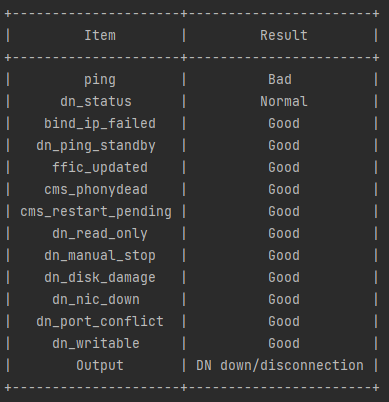

# Cluster Diagnosis<a name="ZH-CN_TOPIC_0000002294471393"></a>

## 概述<a name="ZH-CN_TOPIC_0000002259861282"></a>

在现网业务中需要对发生的故障原因进行快速定位定界，本功能可以通过收集数据库实例中各个组件（如CMS、DN）等的信息和即时状态（如网络连通性），来判断实例环境是否存在故障，以及故障根因。可用于实现实例级别的故障根因诊断。

DBMind对cmd-exporter进行加强，本版本支持DN、CMS、CMA、ffic、OM\_Monitor等日志采集，同时也支持基于节点间网络连通（如ping）状态采集。同时DBMind对现网故障场景进行了梳理，并对数据集进行枚举扩充，最终实现DN故障快速定位。

>[!NOTE]说明
>由于该功能是根据日志来进行诊断的，所以诊断结果中的时间可能因为日志的延迟或者日志的延迟处理，导致诊断结果中的时间晚于故障发生的时间。

**表 1**  现支持诊断的DN故障根因列表

<a name="zh-cn_topic_0000001714829137_table1342813795619"></a>
<table><thead align="left"><tr id="zh-cn_topic_0000001714829137_row045719711563"><th class="cellrowborder" valign="top" width="100%" id="mcps1.2.2.1.1"><p id="zh-cn_topic_0000001714829137_p17861151513"><a name="zh-cn_topic_0000001714829137_p17861151513"></a><a name="zh-cn_topic_0000001714829137_p17861151513"></a>DN故障根因</p>
</th>
</tr>
</thead>
<tbody><tr id="zh-cn_topic_0000001714829137_row845747175610"><td class="cellrowborder" valign="top" width="100%" headers="mcps1.2.2.1.1 "><p id="zh-cn_topic_0000001714829137_p58621565113"><a name="zh-cn_topic_0000001714829137_p58621565113"></a><a name="zh-cn_topic_0000001714829137_p58621565113"></a>未知原因/Unknown。</p>
</td>
</tr>
<tr id="zh-cn_topic_0000001714829137_row12457167155617"><td class="cellrowborder" valign="top" width="100%" headers="mcps1.2.2.1.1 "><p id="zh-cn_topic_0000001714829137_p178625545119"><a name="zh-cn_topic_0000001714829137_p178625545119"></a><a name="zh-cn_topic_0000001714829137_p178625545119"></a>实例被停止/DN manual stop。</p>
</td>
</tr>
<tr id="zh-cn_topic_0000001714829137_row1145717795616"><td class="cellrowborder" valign="top" width="100%" headers="mcps1.2.2.1.1 "><p id="zh-cn_topic_0000001714829137_p8862954519"><a name="zh-cn_topic_0000001714829137_p8862954519"></a><a name="zh-cn_topic_0000001714829137_p8862954519"></a>磁盘故障/DN disk damage。</p>
</td>
</tr>
<tr id="zh-cn_topic_0000001714829137_row6457127115618"><td class="cellrowborder" valign="top" width="100%" headers="mcps1.2.2.1.1 "><p id="zh-cn_topic_0000001714829137_p7862115205118"><a name="zh-cn_topic_0000001714829137_p7862115205118"></a><a name="zh-cn_topic_0000001714829137_p7862115205118"></a>网卡故障/DN NIC down。</p>
</td>
</tr>
<tr id="zh-cn_topic_0000001714829137_row124571720564"><td class="cellrowborder" valign="top" width="100%" headers="mcps1.2.2.1.1 "><p id="zh-cn_topic_0000001714829137_p19862151512"><a name="zh-cn_topic_0000001714829137_p19862151512"></a><a name="zh-cn_topic_0000001714829137_p19862151512"></a>端口冲突/DN port conflict。</p>
</td>
</tr>
<tr id="zh-cn_topic_0000001714829137_row1645819735616"><td class="cellrowborder" valign="top" width="100%" headers="mcps1.2.2.1.1 "><p id="zh-cn_topic_0000001714829137_p158636519518"><a name="zh-cn_topic_0000001714829137_p158636519518"></a><a name="zh-cn_topic_0000001714829137_p158636519518"></a>CM Server仲裁重启DN/DN restarted by cms。</p>
</td>
</tr>
<tr id="zh-cn_topic_0000001714829137_row19458157125616"><td class="cellrowborder" valign="top" width="100%" headers="mcps1.2.2.1.1 "><p id="zh-cn_topic_0000001714829137_p986311595110"><a name="zh-cn_topic_0000001714829137_p986311595110"></a><a name="zh-cn_topic_0000001714829137_p986311595110"></a>进程僵死重启/DN phony dead。</p>
</td>
</tr>
<tr id="zh-cn_topic_0000001714829137_row14581773565"><td class="cellrowborder" valign="top" width="100%" headers="mcps1.2.2.1.1 "><p id="zh-cn_topic_0000001714829137_p188631525110"><a name="zh-cn_topic_0000001714829137_p188631525110"></a><a name="zh-cn_topic_0000001714829137_p188631525110"></a>CORE/Core。</p>
</td>
</tr>
<tr id="zh-cn_topic_0000001714829137_row44179591061"><td class="cellrowborder" valign="top" width="100%" headers="mcps1.2.2.1.1 "><p id="zh-cn_topic_0000001714829137_p3863145205116"><a name="zh-cn_topic_0000001714829137_p3863145205116"></a><a name="zh-cn_topic_0000001714829137_p3863145205116"></a>只读/DN read only。</p>
</td>
</tr>
<tr id="zh-cn_topic_0000001714829137_row15831114270"><td class="cellrowborder" valign="top" width="100%" headers="mcps1.2.2.1.1 "><p id="zh-cn_topic_0000001714829137_p791432204218"><a name="zh-cn_topic_0000001714829137_p791432204218"></a><a name="zh-cn_topic_0000001714829137_p791432204218"></a>主机断网或宕机/DN down/disconnection。</p>
</td>
</tr>
<tr id="zh-cn_topic_0000001714829137_row38311543718"><td class="cellrowborder" valign="top" width="100%" headers="mcps1.2.2.1.1 "><p id="zh-cn_topic_0000001714829137_p3863195145119"><a name="zh-cn_topic_0000001714829137_p3863195145119"></a><a name="zh-cn_topic_0000001714829137_p3863195145119"></a>主备DN间网络异常/DN Primary disconnected with Standby。</p>
</td>
</tr>
<tr id="zh-cn_topic_0000001714829137_row14831104276"><td class="cellrowborder" valign="top" width="100%" headers="mcps1.2.2.1.1 "><p id="zh-cn_topic_0000001714829137_p88631595119"><a name="zh-cn_topic_0000001714829137_p88631595119"></a><a name="zh-cn_topic_0000001714829137_p88631595119"></a>DN IP丢失/DN ip lost。</p>
</td>
</tr>
</tbody>
</table>

>[!NOTE]说明
>当cm\_ctl query的集群状态输出结果异常时，一般是发生了调用栈输出，这种情况下难以获取集群状态，无法获取集群的诊断结果，相关状态标记为"abnormal\_output\_from\_cm\_ctl\_query"， 诊断结果为Unknown。
>当DN节点处于Offline状态时，不对其进行数据库实例故障诊断，返回状态为Normal，状态码-1。

## 使用指导<a name="ZH-CN_TOPIC_0000002259758184"></a>

在DN实例产生异常告警时，一个完整的用于启动实例故障分析功能的命令是：

```
gs_dbmind component cluster_diagnosis --conf {confpath} --host {ip_address} --role dn --time "2023-04-20 16:00:00" --method tree
```

输入此命令后，系统读取所设定时间前3分钟的日志记录，并对选定的DN实例使用选定方法进行分析，分析的结果示例如[图1](#zh-cn_topic_0000001714948973_fig0615168103510)所示。

**图 1**  DN实例使用选定方法分析<a name="zh-cn_topic_0000001714948973_fig0615168103510"></a>  


返回结果前半部分的字典给出对日志的解析结果，其中Good表示该项正常，Bad表示该项有异常；最后的Output表示输出结果。

>[!NOTE]说明
>
>- 单次诊断读取的是诊断时间点之前三分钟的日志和节点状态，由于网络延迟，模型计算用时等因素，实际时间会略短于三分钟，综合各种因素，以150秒内的诊断结果作为参考更为准确。
>- 集群故障诊断功能的网络连通性诊断是通过各个数据库节点之间的连通性来判断的，对于单节点集群，不存在数据库节点之间的连通性，所以集群诊断不支持单节点集群的故障诊断。
>- 数据库实例诊断功能中，判断网络连通性的超时时长是1秒，当网络延迟达到1秒及以上时，节点会被判断为断开连接。
>- 尝试对于新近纳管的集群进行集群诊断时，由于采集数据存在延迟，可能会出现短暂的网络异常。

## 获取帮助<a name="ZH-CN_TOPIC_0000002294398329"></a>

模块命令行说明：

```
gs_dbmind component cluster_diagnosis --help
```

显示如下帮助信息：

```
usage: [-h] --conf CONF --host HOST --role {cn,dn} [--time TIME] [--method {logical,tree}]
Cluster diagnosis.
optional arguments:
  -h, --help            show this help message and exit
  --conf CONF           set the directory of configuration files
  --host HOST           set the host of the cluster node, ip only.
  --role {cn,dn}        set the role of instance for diagnosis. roles: [cn]
                        are not supported for centralized DB.
  --time TIME           set time for diagnosis in timestamp(ms) or datetime format
  --method {logical,tree}
                        set method for the model: logical: if-else, tree: xgboost.
```

## 命令参考<a name="ZH-CN_TOPIC_0000002294471397"></a>

**表 1**  命令行参数说明

<a name="zh-cn_topic_0000001714949065_table1342813795619"></a>
<table><thead align="left"><tr id="zh-cn_topic_0000001714949065_row045719711563"><th class="cellrowborder" valign="top" width="21.535353535353536%" id="mcps1.2.4.1.1"><p id="zh-cn_topic_0000001714949065_p1245710711563"><a name="zh-cn_topic_0000001714949065_p1245710711563"></a><a name="zh-cn_topic_0000001714949065_p1245710711563"></a>参数</p>
</th>
<th class="cellrowborder" valign="top" width="45.13131313131313%" id="mcps1.2.4.1.2"><p id="zh-cn_topic_0000001714949065_p184571871566"><a name="zh-cn_topic_0000001714949065_p184571871566"></a><a name="zh-cn_topic_0000001714949065_p184571871566"></a>参数说明</p>
</th>
<th class="cellrowborder" valign="top" width="33.333333333333336%" id="mcps1.2.4.1.3"><p id="zh-cn_topic_0000001714949065_p9457678569"><a name="zh-cn_topic_0000001714949065_p9457678569"></a><a name="zh-cn_topic_0000001714949065_p9457678569"></a>取值范围</p>
</th>
</tr>
</thead>
<tbody><tr id="zh-cn_topic_0000001714949065_row845747175610"><td class="cellrowborder" valign="top" width="21.535353535353536%" headers="mcps1.2.4.1.1 "><p id="zh-cn_topic_0000001714949065_p945713712568"><a name="zh-cn_topic_0000001714949065_p945713712568"></a><a name="zh-cn_topic_0000001714949065_p945713712568"></a>-h, --help</p>
</td>
<td class="cellrowborder" valign="top" width="45.13131313131313%" headers="mcps1.2.4.1.2 "><p id="zh-cn_topic_0000001714949065_p174574715614"><a name="zh-cn_topic_0000001714949065_p174574715614"></a><a name="zh-cn_topic_0000001714949065_p174574715614"></a>帮助命令。</p>
</td>
<td class="cellrowborder" valign="top" width="33.333333333333336%" headers="mcps1.2.4.1.3 "><p id="zh-cn_topic_0000001714949065_p18457187195615"><a name="zh-cn_topic_0000001714949065_p18457187195615"></a><a name="zh-cn_topic_0000001714949065_p18457187195615"></a>-</p>
</td>
</tr>
<tr id="zh-cn_topic_0000001714949065_row187351049193418"><td class="cellrowborder" valign="top" width="21.535353535353536%" headers="mcps1.2.4.1.1 "><p id="zh-cn_topic_0000001714949065_p173574963416"><a name="zh-cn_topic_0000001714949065_p173574963416"></a><a name="zh-cn_topic_0000001714949065_p173574963416"></a>--conf</p>
</td>
<td class="cellrowborder" valign="top" width="45.13131313131313%" headers="mcps1.2.4.1.2 "><p id="zh-cn_topic_0000001714949065_p2674747103519"><a name="zh-cn_topic_0000001714949065_p2674747103519"></a><a name="zh-cn_topic_0000001714949065_p2674747103519"></a>连接时序数据库需要的配置文件地址。</p>
</td>
<td class="cellrowborder" valign="top" width="33.333333333333336%" headers="mcps1.2.4.1.3 "><p id="zh-cn_topic_0000001714949065_p157352049203419"><a name="zh-cn_topic_0000001714949065_p157352049203419"></a><a name="zh-cn_topic_0000001714949065_p157352049203419"></a>-</p>
</td>
</tr>
<tr id="zh-cn_topic_0000001714949065_row12457167155617"><td class="cellrowborder" valign="top" width="21.535353535353536%" headers="mcps1.2.4.1.1 "><p id="zh-cn_topic_0000001714949065_p205118433215"><a name="zh-cn_topic_0000001714949065_p205118433215"></a><a name="zh-cn_topic_0000001714949065_p205118433215"></a>--host</p>
</td>
<td class="cellrowborder" valign="top" width="45.13131313131313%" headers="mcps1.2.4.1.2 "><p id="zh-cn_topic_0000001714949065_p126961052143518"><a name="zh-cn_topic_0000001714949065_p126961052143518"></a><a name="zh-cn_topic_0000001714949065_p126961052143518"></a>分析的目标节点的IP地址。</p>
</td>
<td class="cellrowborder" valign="top" width="33.333333333333336%" headers="mcps1.2.4.1.3 "><p id="zh-cn_topic_0000001714949065_p1398855873115"><a name="zh-cn_topic_0000001714949065_p1398855873115"></a><a name="zh-cn_topic_0000001714949065_p1398855873115"></a>-</p>
</td>
</tr>
<tr id="zh-cn_topic_0000001714949065_row1145717795616"><td class="cellrowborder" valign="top" width="21.535353535353536%" headers="mcps1.2.4.1.1 "><p id="zh-cn_topic_0000001714949065_p125010403211"><a name="zh-cn_topic_0000001714949065_p125010403211"></a><a name="zh-cn_topic_0000001714949065_p125010403211"></a>--role</p>
</td>
<td class="cellrowborder" valign="top" width="45.13131313131313%" headers="mcps1.2.4.1.2 "><p id="zh-cn_topic_0000001714949065_p183154183620"><a name="zh-cn_topic_0000001714949065_p183154183620"></a><a name="zh-cn_topic_0000001714949065_p183154183620"></a>分析的目标节点的角色（仅支持DN，使用CN会触发异常提示）。</p>
</td>
<td class="cellrowborder" valign="top" width="33.333333333333336%" headers="mcps1.2.4.1.3 "><p id="zh-cn_topic_0000001714949065_p11987758123118"><a name="zh-cn_topic_0000001714949065_p11987758123118"></a><a name="zh-cn_topic_0000001714949065_p11987758123118"></a>目前仅支持{dn}。（输入cn会提示异常：cn不在实例状态中）。</p>
</td>
</tr>
<tr id="zh-cn_topic_0000001714949065_row6457127115618"><td class="cellrowborder" valign="top" width="21.535353535353536%" headers="mcps1.2.4.1.1 "><p id="zh-cn_topic_0000001714949065_p1150749325"><a name="zh-cn_topic_0000001714949065_p1150749325"></a><a name="zh-cn_topic_0000001714949065_p1150749325"></a>--time</p>
</td>
<td class="cellrowborder" valign="top" width="45.13131313131313%" headers="mcps1.2.4.1.2 "><p id="zh-cn_topic_0000001714949065_p189041222123616"><a name="zh-cn_topic_0000001714949065_p189041222123616"></a><a name="zh-cn_topic_0000001714949065_p189041222123616"></a>分析的异常发生的时间点，默认值是当前时间，日期时间格式为 %Y-%m-%d %H:%M:%S。</p>
</td>
<td class="cellrowborder" valign="top" width="33.333333333333336%" headers="mcps1.2.4.1.3 "><p id="zh-cn_topic_0000001714949065_p1095712011916"><a name="zh-cn_topic_0000001714949065_p1095712011916"></a><a name="zh-cn_topic_0000001714949065_p1095712011916"></a>日期时间格式或者以毫秒为单位的时间戳。</p>
</td>
</tr>
<tr id="zh-cn_topic_0000001714949065_row124571720564"><td class="cellrowborder" valign="top" width="21.535353535353536%" headers="mcps1.2.4.1.1 "><p id="zh-cn_topic_0000001714949065_p134912463220"><a name="zh-cn_topic_0000001714949065_p134912463220"></a><a name="zh-cn_topic_0000001714949065_p134912463220"></a>--method</p>
</td>
<td class="cellrowborder" valign="top" width="45.13131313131313%" headers="mcps1.2.4.1.2 "><p id="zh-cn_topic_0000001714949065_p4331330173617"><a name="zh-cn_topic_0000001714949065_p4331330173617"></a><a name="zh-cn_topic_0000001714949065_p4331330173617"></a>分析的方法，目前提供故障定位逻辑模型以及决策树模型两种方法。</p>
</td>
<td class="cellrowborder" valign="top" width="33.333333333333336%" headers="mcps1.2.4.1.3 "><p id="zh-cn_topic_0000001714949065_p15986958123113"><a name="zh-cn_topic_0000001714949065_p15986958123113"></a><a name="zh-cn_topic_0000001714949065_p15986958123113"></a>{logical, tree}。</p>
</td>
</tr>
</tbody>
</table>

## 常见问题处理<a name="ZH-CN_TOPIC_0000002259861290"></a>

如果尝试启动实例诊断时发现系统不能返回预期的诊断结果，需按照以下顺序逐项排查：

- 检查连接时序数据库需要的配置文件地址是否输入正确，是否包含实例诊断需要读取的日志文件，所用账户是否有权限读写日志，以及日志文件是否损坏，能否正常读写。
- 检查目标节点的IP地址是否有误。
- 检查是否支持对所选定的实例进行诊断，实例诊断目前仅支持对DN的诊断，并检查参数是否输入正确。
- 检查所键入的异常发生时间点是否符合日期时间格式，此外，实例诊断仅支持对当前及过去时刻的诊断，即只能针对过去或与当前时间点相关的事件。
- 检查所选择的诊断方法是否有输入正确，并且是否超出支持范围。
- 对于网卡故障的监测，建议在时序数据库采集数据时将cmd-exporter同时连接在多个网卡上，以便在其中某一网卡故障时，其他网卡仍然能正常将消息发送。
