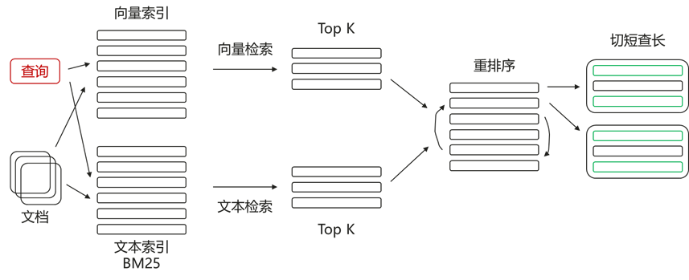
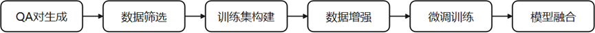
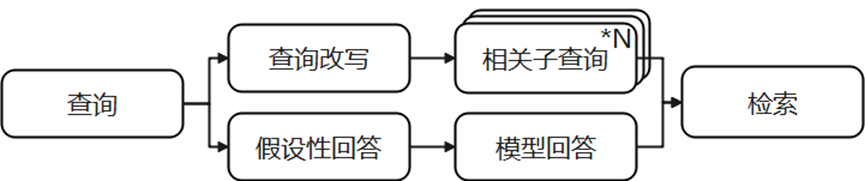
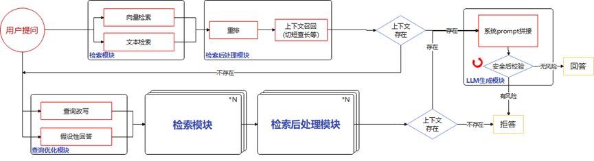

# 大模型RAG技术

检索增强生成（RAG）是指对大型语言模型输出进行优化，使其能够在生成响应之前引用训练数据来源之外的权威知识库。大语言模型用海量数据进行训练，使用数十亿个参数为回答问题、翻译语言和完成句子等任务生成原始输出。在 LLM 本就强大的功能基础上，RAG将其扩展为能访问特定领域或组织的内部知识库，所有这些都无需重新训练模型。这是一种经济高效地改进LLM输出的方法，让它在各种情境下都能保持相关性、准确性和实用性。

GaussMaster构建了openGauss知识库，使用RAG技术从知识库中获取与查询相关的知识片段构建上下文，给大模型提供额外的相关背景知识，进而改进大模型生成回答的质量、减少幻觉、提升用户使用体验。其中RAG技术涉及到查询、检索、模型等优化内容，以下分别介绍各个模块的具体实现设计。

## 检索模块

检索模块的主要功能是根据用户查询，从知识库中检索出最相关的知识片段。当前业界主要采用向量检索方案，通过计算查询向量和知识片段向量间的相似度，选出最相关的前K个文档作为上下文信息。然而，向量间的相似度不一定能够反映真实的语义相似度，仅靠向量化难以保证检索召回率。因此GaussMaster提出了融合检索+重排序的方案，在向量检索的基础上引入了文本检索，并对所有检索结果进行重新排序，获取最终检索结果。文本检索的引入解决了向量检索在搜索人名/短语等方面的缺陷，通过关键词匹配的方式检索到对应结果，多路检索之后，通过重排序模型来判断查询与文档的相似度，将最相关的信息排在最前面，提升了检索模块的召回率。检索模块整体流程如下图[图1](#fig060842511242)所示：

**图 1**  检索模块整体流程图  

其中，各部分说明如下：

1. 索引构建：对于切分好的知识片段，分别进行向量化和文本分词，然后构建向量与文本索引；
2. 向量检索：对于用户查询，进行向量化后进行相似度匹配，获取相似度最高的知识片段作为向量检索topK；
3. 文本检索：对于用户查询，使用BM25算法进行文本相似度匹配，获取相似度最高的知识片段作为文本检索topK；
4. 重排序：对于多路检索的topK，与用户查询构建QA对，传递给重排序模型，计算查询与知识片段的相关性，并使用阈值过滤掉其中相关性较低的结果，重新排序出最相关的topK结果；
5. 切短查长：对重排序之后的知识片段，分别获取相邻知识片段进行整合，丰富上下文信息，提高大模型生成回答的质量。

## 模型微调模块

融合检索方案中会使用向量模型对知识进行向量化用于后续计算向量相似度，同时使用重排序模型对多路检索结果进行查询与知识片段的相关性排序，提取出最相关的知识片段。然而，通用的向量化模型基于开源语料训练而来，没有Gauss数据库知识，因此在进行向量化之后语义丢失，导致相似度计算时效果达不到最优；同样的，由于重排序模型同样基于开源语料训练而来，在判断查询与知识片段相关性时无法理解Gauss知识导致排序紊乱，进而降低检索模块的召回率。因此需要使用Gauss数据库知识对模型进行微调，使得模型在处理相关数据时的性能有所提升。模型微调的主要流程如下图[图1](#fig1419564143512)所示：

**图 1**  模型微调流程图  

其中，各部分说明如下：

1. QA对生成：基于Gauss数据库文档与运维文档，构建point-question-answer思维链，使用大模型一步一步生成基础的问答对；
2. 数据筛选：使用问答对中的问题，进行向量检索，如果回答不在top5中，则问答对被舍弃；
3. 训练集构建：将问答对进行随机打乱，按照1:9比例拆分成训练集与测试集；
4. 数据增强：使用问答对中的问题，进行向量检索，取top200结果，从中丢弃top5结果以及回答，随后采样一定比例作为难负例（Hard Negative）；

    >[!NOTE]说明 
    >难负例（Hard Negative）在机器学习和信息检索领域中指的是那些对于模型来说难以正确分类的负样本。这些样本在特征空间中与某些正样本非常接近，或者模型在预测时对这些样本的置信度很高但实际上它们是负样本。难负例对于模型的训练尤为重要，因为它们能够提供更多的信息，帮助模型更好地学习和区分那些边界模糊或容易混淆的样本。

5. 微调训练：训练每一轮均对难负例进行随机采样，保证负例多样性，同时调整学习率、batch\_size等参数进行模型调优；
6. 模型融合：为避免模型过拟合，可将基础模型与微调模型进行权重融合。

## 查询优化模块

用户在输入查询时，可能由于口语化、表述不清晰等原因导致无法检索到相关知识片段，因此需要引入查询优化模块对用户查询进行改写。GaussMaster中引入了查询改写与假设性回答两种方案分别对查询进行改造，生成合适的查询内容进行检索，扩展检索的知识片段，提升检索模块的召回率。查询优化的主要流程如下图[图1](#fig7240516184920)所示：

**图 1**  查询优化流程图  

其中，各部分说明如下：

1. 查询改写：对于原始查询，首先构建查询改写提示，传递给大模型生成多个相关子查询；
2. 假设性回答：对于原始查询，构建假设性回答提示，由大模型基于认知给出回答；
3. 检索：将查询改写与假设性回答结果分别进行检索获取相关上下文，并进行重排序，选择出其中相关性最高的结果作为上下文用于后续回答生成。

## 端到端问答流程

基于上述三个模块，GaussMaster提供了端到端的问答流程，其流程如下图[图1](#fig1172673785210)所示：

**图 1**  端到端问答流程图  

其中：

1. 当用户进行提问，对应查询首先经过检索模块进行向量检索与文本检索，从向量知识库中获取相关信息；
2. 通过检索处理模块，将检索结果进行重排序，并经过切短查长等方式获取上下文；
3. 判断上下文是否存在；
    1. 当检索的上下文存在时，则对查询与上下文进行prompt拼接，随后传递给大模型LLM，经过安全校验判断无风险则进行回答；如果存在风险信息，则拒答；
    2. 当检索的上下文不存在时，对用户提问进行查询优化，分别通过查询改写与假设性回答方法生成多个子查询，随后经过检索与检索后处理模块，获取相关上下文，如果相关上下文不存在，则进行拒答；如果相关上下文存在则进行prompt拼接，由LLM进行安全校验，有风险则进行拒答，无风险则给出生成的回答结果。

此外，由于大模型生成具有一定的随机性，回答的效果与完整性可能存在差异，因此GaussMaster提供反馈途径，用户可以通过对回答正确且完善的答案进行点赞，对回答不友好的答案进行举报等操作，将相应的反馈信息传递到GaussMaster侧，帮助GaussMaster后续进行迭代改进，提高问答的准确性以及完整性。
