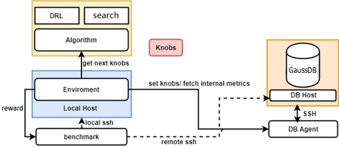
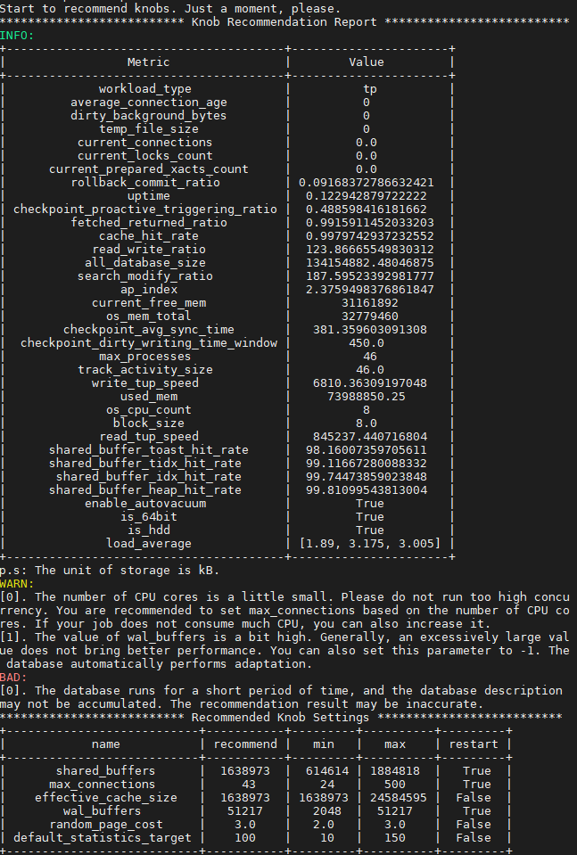

# X-Tuner

## 概述<a name="ZH-CN_TOPIC_0000002259861202"></a>

X-Tuner是一款数据库集成的参数调优工具，通过结合深度强化学习和全局搜索算法等AI技术，实现在无需人工干预的情况下，获取最佳数据库参数配置。本功能不强制与数据库环境部署到一起，支持独立部署，可以脱离数据库安装环境独立运行。

>[!NOTE]说明 
>使用X-Tuner功能会尝试建立数据库连接，从而获取数据库规格。

## 使用准备<a name="ZH-CN_TOPIC_0000002259758104"></a>

### 前提条件与使用事项<a name="zh-cn_topic_0000001666869716_zh-cn_topic_0283137591_section887921944913"></a>

- 数据库状态正常、客户端能够正常连接、且要求数据库内导入数据，以便调优程序可以执行benchmark测试调优效果。
- 使用本工具需要指定登录到数据库的用户身份，要求登录到数据库上的该用户具有足够的权限，以便可以获得充足的数据库状态信息。
- 使用登录到数据库宿主机上的Linux用户，需要将“$GAUSSHOME/bin”添加到PATH环境变量中，即能够直接运行gsql、gs\_guc、gs\_ctl等数据库运维工具。
- 本工具支持以三种模式运行，其中tune和train模式要求用户配置好benchmark运行环境，并导入数据，本工具将会通过迭代运行benchmark来判断修改后的参数是否有性能提升。
- recommend模式建议在数据库正在执行workload的过程中执行，以便获得更准确的实时workload信息。
- 本工具默认带有TPC-C、TPC-H、TPC-DS以及sysbench的benchmark运行脚本样例，如果用户使用上述benchmark对数据库系统进行压力测试，则可以对上述配置文件进行适度修改或配置。如果需要适配用户自己的业务场景，需要您参照benchmark目录中的template.py文件编写驱动您自定义benchmark的脚本文件。
- 调优过程中需要确认环境无HA工具自动拉起数据库服务。调优过程如果存在需要重启才能生效的参数时，X-Tuner会重启数据库服务，此时，如果HA工具自动拉起数据库服务，则会导致X-Tuner出现误判，进而导致程序运行报错。
- 当调优过程中存在需要重启数据库才能生效的参数时，工具仅支持单机部署场景，且注意不能有HA工具自动拉起数据库服务，否则会导致程序运行报错。

### 原理简介<a name="zh-cn_topic_0000001666869716_zh-cn_topic_0283137591_section1767203555113"></a>

调优程序是一个独立于数据库内核之外的工具，需要提供数据库及其所在实例的用户名和登录密码信息，以便控制数据库执行benchmark进行性能测试；在启动调优程序前，要求用户测试环境交互正常，能够正常跑通benchmark测试脚本、能够正常连接数据库。

>[!NOTE]说明
>如果需要调优的参数中，包含重启数据库后才能使修改生效的参数，那么在调优过程中数据库将会重启多次。如果用户的数据库正在执行作业，请慎用train与tune模式。

调优程序X-Tuner包含三种运行模式，分别是:

- recommend：通过用户指定的用户名等信息登录到数据库环境中，获取当前正在运行的workload特征信息，根据上述特征信息生成参数推荐报告。报告当前数据库中不合理的参数配置和潜在风险等；输出根据当前正在运行的workload行为和特征；输出推荐的参数配置。该模式是秒级的，不涉及数据库的重启操作，其他模式可能需要反复重启数据库。
- train：通过用户提供的benchmark信息，不断地进行参数修改和benchmark的执行。通过反复的迭代过程，训练强化学习模型，以便用户在后面通过tune模式加载该模型进行调优。
- tune：使用优化算法进行数据库参数的调优，当前支持两大类算法，一种是深度强化学习，另一种是全局搜索算法（全局优化算法）。深度强化学习模式要求先运行train模式，生成训练后的调优模型，而使用全局搜索算法则不需要提前进行训练，可以直接进行搜索调优。

>[!TIP]须知
>如果在tune模式下，使用深度强化学习算法，要求必须有一个训练好的模型，且要求训练该模型时的参数与进行调优时的参数列表（包括max与min）必须一致。

**图 1**  X-Tuner结构图<a name="zh-cn_topic_0000001666869716_fig137427353816"></a>  


X-Tuner的整体架构如[上方X-Tuner 结构图](#zh-cn_topic_0000001666869716_fig137427353816)所示，系统可以分为：

- DB侧：通过DB\_Agent模块对数据库实例进行抽象，通过该模块可以获取数据库内部的状态信息、当前数据库参数以及设置数据库参数等。DB侧包括登录数据库环境使用的SSH连接。
- 算法侧：用于调优的算法包，包括全局搜索算法（如贝叶斯优化、粒子群算法等）和深度强化学习（如DDPG）。
- X-Tuner主体逻辑模块：通过Environment模块进行封装，每一个step就是一次调优过程。整个调优过程通过多个step进行迭代。
- benchmark：由用户指定的benchmark性能测试脚本，用于运行benchmark作业，通过跑分结果反映数据库系统性能优劣。

>[!NOTE]说明
>应确保benchmark脚本跑分结果越大表示性能越好。
>例如TPCH这种衡量SQL语句整体执行时长的benchmark，可以通过取总体执行时间的相反数作为benchmark的输出分数。

### X-Tuner的运行和安装方法<a name="zh-cn_topic_0000001666869716_zh-cn_topic_0283137591_section275518529540"></a>

执行下述命令即可获取xtuner功能帮助

```
gs_dbmind component xtuner --help 
```

用户可据此给定不同的命令行执行相应的功能。

### X-Tuner的配置文件说明<a name="zh-cn_topic_0000001666869716_section5892154973918"></a>

X-Tuner在运行前需要加载配置文件，用户可以通过“--help”命令查看默认加载的配置文件绝对路径：

```
 -x TUNER_CONFIG_FILE, --tuner-config-file TUNER_CONFIG_FILE
                        This is the path of the core configuration file of the
                        X-Tuner. You can specify the path of the new
                        configuration file. The default path is DBMINDPATH/dbmind/components/xtuner/tuner/xtuner.conf.
                        You can modify the configuration file to control the
                        tuning process.
```

修改配置文件的配置项可以指引X-Tuner执行不同的动作，用户可以根据自己的不同需求来修改配置文件的内容，配置文件的配置项说明详见[表2](#命令参考)。如果需要修改配置文件的加载路径，则可以通过选项“-x”命令行选项来指定。

### Benchmark的选择与配置<a name="zh-cn_topic_0000001666869716_section11685014422"></a>

Benchmark的驱动脚本存放路径为X-Tuner目录的子目录benchmark中。X-Tuner自带常用的benchmark驱动脚本，例如基于时间周期的探测脚本（默认）、TPC-C、TPC-H等。X-Tuner通过调用benchmark/\_\_init\_\_.py文件中get\_benchmark\_instance\(\)命令来加载不同的benchmark驱动脚本，获取benchmark驱动实例。其中，benchmark驱动脚本的格式说明如下：

- 驱动脚本文件名：表示benchmark的名字，该名字用于表示驱动脚本的唯一性，可通过在X-Tuner的配置文件中的配置项benchmark\_script来指定选择加载哪一个benchmark驱动脚本。
- 驱动脚本内容三要素：path变量、cmd变量以及run函数。

下面分别介绍驱动脚本的内容三要素：

1. path变量：表示benchmark脚本的存放地址，可以直接在驱动脚本中修改，也可以通过配置文件的benchmark\_path配置项来指定。
2. cmd变量：表示执行benchmark脚本需要运行的命令。可以直接在驱动脚本中修改，也可以通过配置文件的benchmark\_cmd配置项来指定。cmd中的文本允许使用占位符，用于获取某些运行cmd命令时的必要信息，使用示例参见TPC-H驱动脚本示例。这些占位符包括：
    - \{host\}：数据库宿主机的IP地址。
    - \{port\}：数据库实例的侦听端口号。
    - \{user\}：登录数据库系统上的用户名。
    - \{password\}：与登录数据库系统上的用户相匹配的密码。
    - \{db\}：正在进行调优的数据库名。

        >[!NOTE]说明
        >X-Tuner具备注入防护能力，当用户通过配置文件的benchmark\_cmd配置项来指定时，cmd字段需严格按照模板格式进行填写，否则功能将无法实现，Benchmark驱动脚本cmd字段模板如下：
        >- tpcds和 tpch："find %s -type f -name '\*.sql' -exec gsql -U \{user\} -W \{password\} -d \{db\} -p \{port\} -f \{\} \> /dev/null \\\\;"。
        >- period："gsql -U \{user\} -W \{password\} -d postgres -p \{port\} -c \\"SELECT pg\_catalog.sum\(xact\_commit\) FROM pg\_stat\_database where datname = '\{db\}';\\""。
        >- sysbench："sysbench --test=%s --db-driver=pgsql --pgsql-db=\{db\} --pgsql-user=\{user\} --pgsql-password=\{password\} --pgsql-port=\{port\} --pgsql-host=\{host\} --oltp-tables-count=20 --oltp-table-size=1000 --max-time=30 --max-requests=0 --num-threads=20 --report-interval=3 --forced-shutdown=1 run"。

3. run函数：该函数的函数签名为：

    ```
    def run(remote_server, local_host) -> float:
    ```

    其中，返回数据类型为float，表示benchmark执行后的评估分数值，要求该值越大表示性能越好，例如使用TPC-C跑分结果tpmC即可作为返回值，TPC-H的全部SQL语句执行总时间的相反数（取相反数后可保证返回值越大则性能越好）也可作为返回值。

    remote\_server变量是X-Tuner程序传递给脚本使用的远端主机（数据库宿主机）的shell命令接口，local\_host变量是X-Tuner程序传递给脚本使用的本地主机（运行X-Tuner脚本的主机）的shell命令接口。上述shell命令接口提供的方法包括：

    ```
    exec_command_sync(command, timeout)
    功能：该方法用于在主机上执行shell命令。
    参数列表：
    command 必选，数据类型可以是str, 以及元素为str类型的list或tuple;
    timeout 可选，表示命令执行的超时时长，单位是秒。
    返回值：
    返回二元组 (stdout, stderr)，stdout表示标准输出流结果，stderr表示标准错误流结果，数据类型均为str.
    ```

    ```
    exit_status
    功能：该属性表示最近一条shell命令执行后的退出状态码(exit status code)。
    说明：一般情况，退出状态码为0表示执行正常，非0表示存在错误。
    ```

### Benchmark驱动脚本示例说明<a name="zh-cn_topic_0000001666869716_section7592122116500"></a>

- TPC-C 驱动脚本

    ```
    from tuner.exceptions import ExecutionError
    
    # WARN: You need to download the benchmark-sql test tool to the system,
    # The program starts the test by running the following command:
    path = '/path/to/benchmarksql/run'  # TPC-C测试脚本benchmark-sql 的存放路径
    cmd = "./runBenchmark.sh props.gs"  # 自定义一个名为 props.gs 的benchmark-sql测试配置文件
    
    
    def run(remote_server, local_host):
        # 切换到 TPC-C 脚本目录下，清除历史错误日志，然后运行测试命令。
        # 此处建议等待几秒钟，因为benchmark-sql 测试脚本生成最终测试报告是通过一个shell脚本实现的，整个过程会有延迟，
        # 为了保证能够获取到最终的tpmC数值报告，这里选择等待3秒钟。
        stdout, stderr = remote_server.exec_command_sync(['cd %s' % path, 'rm -rf benchmarksql-error.log', cmd, 'sleep 3'])
        # 如果标准错误流中有数据，则报异常退出。
        if len(stderr) > 0:
            raise ExecutionError(stderr)
    
        # 寻找最终tpmC结果
        tpmC = None
        split_string = stdout.split()  # 对标准输出流结果进行分词。
        for i, st in enumerate(split_string):
            # 在5.0版本的benchmark-sql中，tpmC最终测试结果数值在 ‘(NewOrders)’关键字的后两位，正常情况下，找到该字段后直接返回即可。
            if "(NewOrders)" in st:
                tpmC = split_string[i + 2]
                break
        stdout, stderr = remote_server.exec_command_sync(
            "cat %s/benchmarksql-error.log" % path)
        nb_err = stdout.count("ERROR:")  # 判断整个benchmark运行过程中，是否有报错，记录报错的错误数
        return float(tpmC) - 10 * nb_err  # 这里将报错的错误数作为一个惩罚项，惩罚系数为10，越高的惩罚系数表示越看中报错的数量.
    
    ```

- TPC-H驱动脚本

    ```
    import time
    
    from tuner.exceptions import ExecutionError
    
    # WARN: You need to import data into the database and SQL statements in the following path will be executed.
    # The program automatically collects the total execution duration of these SQL statements.
    path = '/path/to/tpch/queries'  # 存放TPC-H测试用的SQL脚本目录
    cmd = "gsql -U {user} -W {password} -d {db} -p {port} -f {file}"  # 需要运行TPC-H测试脚本的命令，一般使用'gsql -f 脚本文件' 来运行
    
    
    def run(remote_server, local_host):
        # 遍历当前目录下所有的测试用例文件名
        find_file_cmd = "find . -type f -name '*.sql'"
        stdout, stderr = remote_server.exec_command_sync(['cd %s' % path, find_file_cmd])
        if len(stderr) > 0:
            raise ExecutionError(stderr)
        files = stdout.strip().split('\n')
        time_start = time.time()
        for file in files:
            # 使用 file 变量替换 {file}，然后执行该命令行。
            perform_cmd = cmd.format(file=file)
            stdout, stderr = remote_server.exec_command_sync(['cd %s' % path, perform_cmd])
            if len(stderr) > 0:
                print(stderr)
        # 代价为全部测试用例的执行总时长
        cost = time.time() - time_start
        # 取相反数，适配run 函数的定义：返回结果越大表示性能越好。
        return - cost
    ```

## 使用示例<a name="ZH-CN_TOPIC_0000002294398249"></a>

X-Tuner支持三种模式，分别是获取参数诊断报告的recommend模式、训练强化学习模型的train模式、以及使用算法进行调优的tune模式。上述三种模式可以通过命令行参数来区别，通过配置文件来指定具体的细节。

### 配置数据库连接信息<a name="zh-cn_topic_0000001714829221_section1972314173514"></a>

三种模式连接数据库的配置项是相同的，有两种方式：一种是直接通过命令行输入详细的连接信息，另一种是通过JSON格式的配置文件输入，下面分别对两种指定数据库连接信息的方法进行说明。

1. 通过命令行指定：

    分别传递 --db-name --db-user --port --host --host-user 参数，可选 --host-ssh-port 参数，例如：

    ```
    gs_dbmind component xtuner recommend --db-name testdb --db-user omm --port 5678 --host 192.168.1.100 --host-user omm
    ```

2. 通过JSON格式的连接信息配置文件指定：

    JSON配置文件的示例如下，并假设文件名为 connection.json：

    ```
    {
      "db_name": "testdb",  # 数据库名
      "db_user": "dba",       # 登录到数据库上的用户名
      "host": "127.0.0.1",    # 数据库宿主机的IP地址
      "host_user": "dba",     # 登录到数据库宿主机的用户名
      "port": 5432,           # 数据库的侦听端口号
      "ssh_port": 22          # 数据库宿主机的SSH侦听端口号
    }
    ```

    则可通过-f connection.json 传递。

>[!NOTE]说明
>为了防止密码泄露，配置文件和命令行参数中默认都不包含密码信息，用户在输入上述连接信息后，程序会采用交互式的方式要求用户输数据库密码以及操作系统登录用户的密码。

### recommend模式使用示例<a name="zh-cn_topic_0000001714829221_section17370104016614"></a>

对recommend模式生效的配置项为scenario，若为auto，则自动检测workload类型。

执行下述命令，获取诊断结果：

```
gs_dbmind component xtuner recommend -f connection.json
```

则可以生成诊断报告如[图1](#zh-cn_topic_0000001714829221_fig49748416171)：

**图 1**  recommend模式生成的报告示意<a name="zh-cn_topic_0000001714829221_fig49748416171"></a>  


在上述报告中，推荐了该环境上的数据库参数配置，并进行了风险提示。报告同时生成了当前workload的特征信息，其中有几个特征是比较有参考意义的：

- temp\_file\_size：产生的临时文件数量，如果该结果大于0，则表明系统使用了临时文件。使用过多的临时文件会导致性能不佳，如果可能的话，需要提高work\_mem参数的配置。
- cache\_hit\_rate：shared\_buffer的缓存命中率，表明当前workload使用缓存的效率。
- read\_write\_ratio：数据库作业的读写比例。
- search\_modify\_ratio：数据库作业的查询与修改数据的比例。
- ap\_index：表明当前workload的AP指数，取值范围是0到10，该数值越大，表明越偏向于数据分析与检索。
- workload\_type：根据数据库统计信息，推测当前负载类型，分为AP、TP以及HTAP三种类型。
- checkpoint\_avg\_sync\_time：数据库在checkpoint时，平均每次同步刷新数据到磁盘的时长，单位是毫秒。
- load\_average：平均每个CPU核心在1分钟、5分钟以及15分钟内的负载。一般地，该数值在1左右表明当前硬件比较匹配workload、在3左右表明运行当前作业压力比较大，大于5则表示当前硬件环境运行该workload压力过大（此时一般建议减少负载或升级硬件）。

>[!NOTE]说明
>
>- recommend模式会读取数据库中的pg\_stat\_database以及pg\_stat\_bgwriter等系统表中的信息，需要登录到数据库上的用户具有足够的权限（建议为管理员权限，可通过alter user username sysadmin；授予username相应的权限）。
>- 由于某些系统表会一直记录统计信息，这可能会对负载特征识别造成干扰，因此建议先清空某些系统表的统计信息，运行一段时间的workload后再使用recommend模式进行诊断，以便获得更准确的结果。清除统计信息的方法为：
>
> ```
> select pg_stat_reset_shared('bgwriter');
> select pg_stat_reset();
>    ```

### train 模式使用示例<a name="zh-cn_topic_0000001714829221_section15888321578"></a>

该模式是用来训练深度强化学习模型的，与该模式有关的配置项为：

- rl\_algorithm：用于训练强化学习模型的算法，当前支持设置为ddpg。
- rl\_model\_path：训练后生成的强化学习模型保存路径。
- rl\_steps：训练过程的最大迭代步数。
- max\_episode\_steps：每个回合的最大步数。
- scenario：明确指定的workload类型，如果为auto则为自动判断。在不同模式下，推荐的调优参数列表也不一样。
- tuning\_list：用户指定需要调哪些参数，如果不指定，则根据workload类型自动推荐应该调的参数列表**。**如需指定，则tuning\_list表示调优列表文件的路径。一个调优列表配置文件的文件内容示例如下：

    ```
    {
      "work_mem": {
        "default": 65536,
        "min": 65536,
        "max": 655360,
        "type": "int",
        "restart": false
      },
      "shared_buffers": {
        "default": 32000,
        "min": 16000,
        "max": 64000,
        "type": "int",
        "restart": true
      },
      "random_page_cost": {
        "default": 4.0,
        "min": 1.0,
        "max": 4.0,
        "type": "float",
        "restart": false
      },
      "enable_nestloop": {
        "default": true,
        "type": "bool",
        "restart": false
      }
    }
    ```

待上述配置项配置完成后，可以通过下述命令启动训练：

```
gs_dbmind component xtuner train -f connection.json
```

训练完成后，会在配置项rl\_model\_path指定的目录中生成模型文件。

### tune模式使用示例<a name="zh-cn_topic_0000001714829221_section1487391316816"></a>

tune模式支持多种算法，包括基于强化学习（Reinforcement Learning, RL）的DDPG算法、基于全局搜索（Global OPtimization algorithm, GOP）算法的贝叶斯优化算法（Bayesian Optimization）以及粒子群算法（Particle Swarm Optimization, PSO）。

与tune模式相关的配置项为：

- tune\_strategy：指定选择哪种算法进行调优，支持rl（使用强化学习模型进行调优）、gop（使用全局搜索算法）以及auto（自动选择）。若该参数设置为rl，则rl相关的配置项生效。除前文提到过的train模式下生效的配置项外，test\_episode配置项也生效，该配置项表明调优过程的最大回合数，该参数直接影响了调优过程的执行时间（一般地，数值越大越耗时）。
- gop\_algorithm：选择何种全局搜索算法，支持bayes以及pso。
- max\_iterations：最大迭代轮次，数值越高搜索时间越长，效果往往越好。
- particle\_nums：在PSO算法上生效，表示粒子数。
- scenario与tuning\_list见上文train模式中的描述。

待上述配置项配置完成后，可以通过下述命令启动调优：

```
gs_dbmind component xtuner tune -f connection.json
```

>[!WARNING]注意
>在使用tune和train模式前，用户需要先导入benchmark所需数据并检查benchmark能否正常跑通。调优过程结束后，调优程序会自动恢复调优前的数据库参数配置。

## 获取帮助<a name="ZH-CN_TOPIC_0000002294471317"></a>

启动调优程序之前，可以通过如下命令获取帮助信息：

```
gs_dbmind component xtuner --help
```

输出帮助信息结果如下：

```
usage:  [-h] [--database DATABASE] [--db-user DB_USER] [--db-port DB_PORT] [--db-host DB_HOST] [--host-user HOST_USER] [--host-ssh-port HOST_SSH_PORT] [-f DB_CONFIG_FILE] [-x TUNER_CONFIG_FILE] [-v]
        {train,tune,recommend}

X-Tuner: a self-tuning tool integrated by openGauss.

positional arguments:
  {train,tune,recommend}
                        Train a reinforcement learning model or tune database by model. And also can recommend best_knobs according to your workload.

optional arguments:
  -h, --help            show this help message and exit
  -f DB_CONFIG_FILE, --db-config-file DB_CONFIG_FILE
                        You can pass a path of configuration file otherwise you should enter database information by command arguments manually. Please see the template file share/server.json.template.
  -x TUNER_CONFIG_FILE, --tuner-config-file TUNER_CONFIG_FILE
                        This is the path of the core configuration file of the X-Tuner. You can specify the path of the new configuration file. The default path is /path/to/config/file. You can modify the configuration file to control the tuning process.
  -v, --version         show program's version number and exit

Database Connection Information:
  --database DATABASE, --db-name DATABASE
                        The name of database where your workload running on.
  --db-user DB_USER     Use this user to login your database. Note that the user must have sufficient permissions.
  --db-port DB_PORT, --port DB_PORT
                        Use this port to connect with the database.
  --db-host DB_HOST, --host DB_HOST
                        The IP address of your database installation host.
  --host-user HOST_USER
                        The login user of your database installation host.
  --host-ssh-port HOST_SSH_PORT
                        The SSH port of your database installation host.
```

## 命令参考<a name="ZH-CN_TOPIC_0000002259861206"></a>

**表 1**  命令行参数

<a name="zh-cn_topic_0000001714948909_zh-cn_topic_0283137279_table628178124515"></a>
<table><thead align="left"><tr id="zh-cn_topic_0000001714948909_zh-cn_topic_0283137279_row162968174512"><th class="cellrowborder" valign="top" width="17.18171817181718%" id="mcps1.2.4.1.1"><p id="zh-cn_topic_0000001714948909_zh-cn_topic_0283137279_p1129138144517"><a name="zh-cn_topic_0000001714948909_zh-cn_topic_0283137279_p1129138144517"></a><a name="zh-cn_topic_0000001714948909_zh-cn_topic_0283137279_p1129138144517"></a>参数</p>
</th>
<th class="cellrowborder" valign="top" width="58.33583358335833%" id="mcps1.2.4.1.2"><p id="zh-cn_topic_0000001714948909_zh-cn_topic_0283137279_p2029181454"><a name="zh-cn_topic_0000001714948909_zh-cn_topic_0283137279_p2029181454"></a><a name="zh-cn_topic_0000001714948909_zh-cn_topic_0283137279_p2029181454"></a>参数说明</p>
</th>
<th class="cellrowborder" valign="top" width="24.48244824482448%" id="mcps1.2.4.1.3"><p id="zh-cn_topic_0000001714948909_zh-cn_topic_0283137279_p6291382451"><a name="zh-cn_topic_0000001714948909_zh-cn_topic_0283137279_p6291382451"></a><a name="zh-cn_topic_0000001714948909_zh-cn_topic_0283137279_p6291382451"></a>取值范围</p>
</th>
</tr>
</thead>
<tbody><tr id="zh-cn_topic_0000001714948909_zh-cn_topic_0283137279_row162915844513"><td class="cellrowborder" valign="top" width="17.18171817181718%" headers="mcps1.2.4.1.1 "><p id="zh-cn_topic_0000001714948909_zh-cn_topic_0283137279_p132968134510"><a name="zh-cn_topic_0000001714948909_zh-cn_topic_0283137279_p132968134510"></a><a name="zh-cn_topic_0000001714948909_zh-cn_topic_0283137279_p132968134510"></a>mode</p>
</td>
<td class="cellrowborder" valign="top" width="58.33583358335833%" headers="mcps1.2.4.1.2 "><p id="zh-cn_topic_0000001714948909_zh-cn_topic_0283137279_p11295814511"><a name="zh-cn_topic_0000001714948909_zh-cn_topic_0283137279_p11295814511"></a><a name="zh-cn_topic_0000001714948909_zh-cn_topic_0283137279_p11295814511"></a>指定调优程序运行的模式。</p>
</td>
<td class="cellrowborder" valign="top" width="24.48244824482448%" headers="mcps1.2.4.1.3 "><p id="zh-cn_topic_0000001714948909_zh-cn_topic_0283137279_p02919804513"><a name="zh-cn_topic_0000001714948909_zh-cn_topic_0283137279_p02919804513"></a><a name="zh-cn_topic_0000001714948909_zh-cn_topic_0283137279_p02919804513"></a>train、tune、recommend</p>
</td>
</tr>
<tr id="zh-cn_topic_0000001714948909_row1949293216101"><td class="cellrowborder" valign="top" width="17.18171817181718%" headers="mcps1.2.4.1.1 "><p id="zh-cn_topic_0000001714948909_p57047404102"><a name="zh-cn_topic_0000001714948909_p57047404102"></a><a name="zh-cn_topic_0000001714948909_p57047404102"></a>--tuner-config-file, -x</p>
</td>
<td class="cellrowborder" valign="top" width="58.33583358335833%" headers="mcps1.2.4.1.2 "><p id="zh-cn_topic_0000001714948909_p19705240181019"><a name="zh-cn_topic_0000001714948909_p19705240181019"></a><a name="zh-cn_topic_0000001714948909_p19705240181019"></a>X-Tuner的核心参数配置文件路径，默认路径为安装目录下的xtuner.conf。</p>
</td>
<td class="cellrowborder" valign="top" width="24.48244824482448%" headers="mcps1.2.4.1.3 "><p id="zh-cn_topic_0000001714948909_p192324411812"><a name="zh-cn_topic_0000001714948909_p192324411812"></a><a name="zh-cn_topic_0000001714948909_p192324411812"></a>-</p>
</td>
</tr>
<tr id="zh-cn_topic_0000001714948909_zh-cn_topic_0283137279_row19291888452"><td class="cellrowborder" valign="top" width="17.18171817181718%" headers="mcps1.2.4.1.1 "><p id="zh-cn_topic_0000001714948909_zh-cn_topic_0283137279_p16296874513"><a name="zh-cn_topic_0000001714948909_zh-cn_topic_0283137279_p16296874513"></a><a name="zh-cn_topic_0000001714948909_zh-cn_topic_0283137279_p16296874513"></a>--db-config-file, -f</p>
</td>
<td class="cellrowborder" valign="top" width="58.33583358335833%" headers="mcps1.2.4.1.2 "><p id="zh-cn_topic_0000001714948909_zh-cn_topic_0283137279_p13297818451"><a name="zh-cn_topic_0000001714948909_zh-cn_topic_0283137279_p13297818451"></a><a name="zh-cn_topic_0000001714948909_zh-cn_topic_0283137279_p13297818451"></a>调优程序的用于登录到数据库宿主机上的连接信息配置文件路径，若通过该文件配置数据库连接信息，则下述数据库连接信息可省略。</p>
</td>
<td class="cellrowborder" valign="top" width="24.48244824482448%" headers="mcps1.2.4.1.3 "><p id="zh-cn_topic_0000001714948909_p322194491819"><a name="zh-cn_topic_0000001714948909_p322194491819"></a><a name="zh-cn_topic_0000001714948909_p322194491819"></a>-</p>
</td>
</tr>
<tr id="zh-cn_topic_0000001714948909_zh-cn_topic_0283137279_row18298818455"><td class="cellrowborder" valign="top" width="17.18171817181718%" headers="mcps1.2.4.1.1 "><p id="zh-cn_topic_0000001714948909_zh-cn_topic_0283137279_p82912864518"><a name="zh-cn_topic_0000001714948909_zh-cn_topic_0283137279_p82912864518"></a><a name="zh-cn_topic_0000001714948909_zh-cn_topic_0283137279_p82912864518"></a>--db-name</p>
</td>
<td class="cellrowborder" valign="top" width="58.33583358335833%" headers="mcps1.2.4.1.2 "><p id="zh-cn_topic_0000001714948909_zh-cn_topic_0283137279_p22917874513"><a name="zh-cn_topic_0000001714948909_zh-cn_topic_0283137279_p22917874513"></a><a name="zh-cn_topic_0000001714948909_zh-cn_topic_0283137279_p22917874513"></a>指定需要调优的数据库名。</p>
</td>
<td class="cellrowborder" valign="top" width="24.48244824482448%" headers="mcps1.2.4.1.3 "><p id="zh-cn_topic_0000001714948909_p92194419180"><a name="zh-cn_topic_0000001714948909_p92194419180"></a><a name="zh-cn_topic_0000001714948909_p92194419180"></a>-</p>
</td>
</tr>
<tr id="zh-cn_topic_0000001714948909_zh-cn_topic_0283137279_row9294819456"><td class="cellrowborder" valign="top" width="17.18171817181718%" headers="mcps1.2.4.1.1 "><p id="zh-cn_topic_0000001714948909_zh-cn_topic_0283137279_p1829118104514"><a name="zh-cn_topic_0000001714948909_zh-cn_topic_0283137279_p1829118104514"></a><a name="zh-cn_topic_0000001714948909_zh-cn_topic_0283137279_p1829118104514"></a>--db-user</p>
</td>
<td class="cellrowborder" valign="top" width="58.33583358335833%" headers="mcps1.2.4.1.2 "><p id="zh-cn_topic_0000001714948909_zh-cn_topic_0283137279_p1429208164510"><a name="zh-cn_topic_0000001714948909_zh-cn_topic_0283137279_p1429208164510"></a><a name="zh-cn_topic_0000001714948909_zh-cn_topic_0283137279_p1429208164510"></a>指定以何用户身份登录到调优的数据库上。</p>
</td>
<td class="cellrowborder" valign="top" width="24.48244824482448%" headers="mcps1.2.4.1.3 "><p id="zh-cn_topic_0000001714948909_p420154491810"><a name="zh-cn_topic_0000001714948909_p420154491810"></a><a name="zh-cn_topic_0000001714948909_p420154491810"></a>-</p>
</td>
</tr>
<tr id="zh-cn_topic_0000001714948909_zh-cn_topic_0283137279_row1020015014713"><td class="cellrowborder" valign="top" width="17.18171817181718%" headers="mcps1.2.4.1.1 "><p id="zh-cn_topic_0000001714948909_zh-cn_topic_0283137279_p42004013477"><a name="zh-cn_topic_0000001714948909_zh-cn_topic_0283137279_p42004013477"></a><a name="zh-cn_topic_0000001714948909_zh-cn_topic_0283137279_p42004013477"></a>--port, --db-port</p>
</td>
<td class="cellrowborder" valign="top" width="58.33583358335833%" headers="mcps1.2.4.1.2 "><p id="zh-cn_topic_0000001714948909_zh-cn_topic_0283137279_p1200160134715"><a name="zh-cn_topic_0000001714948909_zh-cn_topic_0283137279_p1200160134715"></a><a name="zh-cn_topic_0000001714948909_zh-cn_topic_0283137279_p1200160134715"></a>数据库的侦听端口。</p>
</td>
<td class="cellrowborder" valign="top" width="24.48244824482448%" headers="mcps1.2.4.1.3 "><p id="zh-cn_topic_0000001714948909_p1419744151813"><a name="zh-cn_topic_0000001714948909_p1419744151813"></a><a name="zh-cn_topic_0000001714948909_p1419744151813"></a>1024 ~ 65535</p>
</td>
</tr>
<tr id="zh-cn_topic_0000001714948909_zh-cn_topic_0283137279_row1836561411475"><td class="cellrowborder" valign="top" width="17.18171817181718%" headers="mcps1.2.4.1.1 "><p id="zh-cn_topic_0000001714948909_zh-cn_topic_0283137279_p7365314124713"><a name="zh-cn_topic_0000001714948909_zh-cn_topic_0283137279_p7365314124713"></a><a name="zh-cn_topic_0000001714948909_zh-cn_topic_0283137279_p7365314124713"></a>--host, --db-host</p>
</td>
<td class="cellrowborder" valign="top" width="58.33583358335833%" headers="mcps1.2.4.1.2 "><p id="zh-cn_topic_0000001714948909_zh-cn_topic_0283137279_p1236541444719"><a name="zh-cn_topic_0000001714948909_zh-cn_topic_0283137279_p1236541444719"></a><a name="zh-cn_topic_0000001714948909_zh-cn_topic_0283137279_p1236541444719"></a>数据库实例的宿主机IP。</p>
</td>
<td class="cellrowborder" valign="top" width="24.48244824482448%" headers="mcps1.2.4.1.3 "><p id="zh-cn_topic_0000001714948909_p19191442186"><a name="zh-cn_topic_0000001714948909_p19191442186"></a><a name="zh-cn_topic_0000001714948909_p19191442186"></a>-</p>
</td>
</tr>
<tr id="zh-cn_topic_0000001714948909_zh-cn_topic_0283137279_row1773402524719"><td class="cellrowborder" valign="top" width="17.18171817181718%" headers="mcps1.2.4.1.1 "><p id="zh-cn_topic_0000001714948909_zh-cn_topic_0283137279_p13734825204719"><a name="zh-cn_topic_0000001714948909_zh-cn_topic_0283137279_p13734825204719"></a><a name="zh-cn_topic_0000001714948909_zh-cn_topic_0283137279_p13734825204719"></a>--host-user</p>
</td>
<td class="cellrowborder" valign="top" width="58.33583358335833%" headers="mcps1.2.4.1.2 "><p id="zh-cn_topic_0000001714948909_zh-cn_topic_0283137279_p3734112544712"><a name="zh-cn_topic_0000001714948909_zh-cn_topic_0283137279_p3734112544712"></a><a name="zh-cn_topic_0000001714948909_zh-cn_topic_0283137279_p3734112544712"></a>指定以何用户身份登录到数据库实例的宿主机上，要求该用户名的环境变量中可以找到gsql、gs_ctl等数据库运维工具。</p>
</td>
<td class="cellrowborder" valign="top" width="24.48244824482448%" headers="mcps1.2.4.1.3 "><p id="zh-cn_topic_0000001714948909_p618154471812"><a name="zh-cn_topic_0000001714948909_p618154471812"></a><a name="zh-cn_topic_0000001714948909_p618154471812"></a>-</p>
</td>
</tr>
<tr id="zh-cn_topic_0000001714948909_zh-cn_topic_0283137279_row12794175884716"><td class="cellrowborder" valign="top" width="17.18171817181718%" headers="mcps1.2.4.1.1 "><p id="zh-cn_topic_0000001714948909_zh-cn_topic_0283137279_p1279485811475"><a name="zh-cn_topic_0000001714948909_zh-cn_topic_0283137279_p1279485811475"></a><a name="zh-cn_topic_0000001714948909_zh-cn_topic_0283137279_p1279485811475"></a>--host-ssh-port</p>
</td>
<td class="cellrowborder" valign="top" width="58.33583358335833%" headers="mcps1.2.4.1.2 "><p id="zh-cn_topic_0000001714948909_zh-cn_topic_0283137279_p779418589472"><a name="zh-cn_topic_0000001714948909_zh-cn_topic_0283137279_p779418589472"></a><a name="zh-cn_topic_0000001714948909_zh-cn_topic_0283137279_p779418589472"></a>数据库实例所在宿主机的SSH端口号，可选，默认为22。</p>
</td>
<td class="cellrowborder" valign="top" width="24.48244824482448%" headers="mcps1.2.4.1.3 "><p id="zh-cn_topic_0000001714948909_p15171344161817"><a name="zh-cn_topic_0000001714948909_p15171344161817"></a><a name="zh-cn_topic_0000001714948909_p15171344161817"></a>0 ~ 65535</p>
</td>
</tr>
<tr id="zh-cn_topic_0000001714948909_row124653514117"><td class="cellrowborder" valign="top" width="17.18171817181718%" headers="mcps1.2.4.1.1 "><p id="zh-cn_topic_0000001714948909_p16465651181116"><a name="zh-cn_topic_0000001714948909_p16465651181116"></a><a name="zh-cn_topic_0000001714948909_p16465651181116"></a>--help, -h</p>
</td>
<td class="cellrowborder" valign="top" width="58.33583358335833%" headers="mcps1.2.4.1.2 "><p id="zh-cn_topic_0000001714948909_p13466651121115"><a name="zh-cn_topic_0000001714948909_p13466651121115"></a><a name="zh-cn_topic_0000001714948909_p13466651121115"></a>返回帮助信息。</p>
</td>
<td class="cellrowborder" valign="top" width="24.48244824482448%" headers="mcps1.2.4.1.3 "><p id="zh-cn_topic_0000001714948909_p10161044111814"><a name="zh-cn_topic_0000001714948909_p10161044111814"></a><a name="zh-cn_topic_0000001714948909_p10161044111814"></a>-</p>
</td>
</tr>
<tr id="zh-cn_topic_0000001714948909_zh-cn_topic_0283137279_row1068864085011"><td class="cellrowborder" valign="top" width="17.18171817181718%" headers="mcps1.2.4.1.1 "><p id="zh-cn_topic_0000001714948909_zh-cn_topic_0283137279_p1568814095019"><a name="zh-cn_topic_0000001714948909_zh-cn_topic_0283137279_p1568814095019"></a><a name="zh-cn_topic_0000001714948909_zh-cn_topic_0283137279_p1568814095019"></a>--version, -v</p>
</td>
<td class="cellrowborder" valign="top" width="58.33583358335833%" headers="mcps1.2.4.1.2 "><p id="zh-cn_topic_0000001714948909_zh-cn_topic_0283137279_p368834095019"><a name="zh-cn_topic_0000001714948909_zh-cn_topic_0283137279_p368834095019"></a><a name="zh-cn_topic_0000001714948909_zh-cn_topic_0283137279_p368834095019"></a>返回当前工具版本号。</p>
</td>
<td class="cellrowborder" valign="top" width="24.48244824482448%" headers="mcps1.2.4.1.3 "><p id="zh-cn_topic_0000001714948909_p499654318184"><a name="zh-cn_topic_0000001714948909_p499654318184"></a><a name="zh-cn_topic_0000001714948909_p499654318184"></a>-</p>
</td>
</tr>
</tbody>
</table>

**表 2**  配置文件中的参数详解

<a name="zh-cn_topic_0000001714948909_table10217184512711"></a>
<table><thead align="left"><tr id="zh-cn_topic_0000001714948909_row72171451773"><th class="cellrowborder" valign="top" width="23.52%" id="mcps1.2.4.1.1"><p id="zh-cn_topic_0000001714948909_p521714451473"><a name="zh-cn_topic_0000001714948909_p521714451473"></a><a name="zh-cn_topic_0000001714948909_p521714451473"></a>参数名</p>
</th>
<th class="cellrowborder" valign="top" width="63.51%" id="mcps1.2.4.1.2"><p id="zh-cn_topic_0000001714948909_p1121715452716"><a name="zh-cn_topic_0000001714948909_p1121715452716"></a><a name="zh-cn_topic_0000001714948909_p1121715452716"></a>参数说明</p>
</th>
<th class="cellrowborder" valign="top" width="12.97%" id="mcps1.2.4.1.3"><p id="zh-cn_topic_0000001714948909_p74782020913"><a name="zh-cn_topic_0000001714948909_p74782020913"></a><a name="zh-cn_topic_0000001714948909_p74782020913"></a>取值范围</p>
</th>
</tr>
</thead>
<tbody><tr id="zh-cn_topic_0000001714948909_row17217114518720"><td class="cellrowborder" valign="top" width="23.52%" headers="mcps1.2.4.1.1 "><p id="zh-cn_topic_0000001714948909_p521764516711"><a name="zh-cn_topic_0000001714948909_p521764516711"></a><a name="zh-cn_topic_0000001714948909_p521764516711"></a>logfile</p>
</td>
<td class="cellrowborder" valign="top" width="63.51%" headers="mcps1.2.4.1.2 "><p id="zh-cn_topic_0000001714948909_p1821711451578"><a name="zh-cn_topic_0000001714948909_p1821711451578"></a><a name="zh-cn_topic_0000001714948909_p1821711451578"></a>生成的日志存放路径。</p>
</td>
<td class="cellrowborder" valign="top" width="12.97%" headers="mcps1.2.4.1.3 "><p id="zh-cn_topic_0000001714948909_p10478801895"><a name="zh-cn_topic_0000001714948909_p10478801895"></a><a name="zh-cn_topic_0000001714948909_p10478801895"></a>-</p>
</td>
</tr>
<tr id="zh-cn_topic_0000001714948909_row02171545078"><td class="cellrowborder" valign="top" width="23.52%" headers="mcps1.2.4.1.1 "><p id="zh-cn_topic_0000001714948909_p112172452714"><a name="zh-cn_topic_0000001714948909_p112172452714"></a><a name="zh-cn_topic_0000001714948909_p112172452714"></a>output_tuning_result</p>
</td>
<td class="cellrowborder" valign="top" width="63.51%" headers="mcps1.2.4.1.2 "><p id="zh-cn_topic_0000001714948909_p721719458717"><a name="zh-cn_topic_0000001714948909_p721719458717"></a><a name="zh-cn_topic_0000001714948909_p721719458717"></a>可选，调优结果的保存路径。</p>
</td>
<td class="cellrowborder" valign="top" width="12.97%" headers="mcps1.2.4.1.3 "><p id="zh-cn_topic_0000001714948909_p15478709910"><a name="zh-cn_topic_0000001714948909_p15478709910"></a><a name="zh-cn_topic_0000001714948909_p15478709910"></a>-</p>
</td>
</tr>
<tr id="zh-cn_topic_0000001714948909_row52171645371"><td class="cellrowborder" valign="top" width="23.52%" headers="mcps1.2.4.1.1 "><p id="zh-cn_topic_0000001714948909_p721716456713"><a name="zh-cn_topic_0000001714948909_p721716456713"></a><a name="zh-cn_topic_0000001714948909_p721716456713"></a>verbose</p>
</td>
<td class="cellrowborder" valign="top" width="63.51%" headers="mcps1.2.4.1.2 "><p id="zh-cn_topic_0000001714948909_p121811451717"><a name="zh-cn_topic_0000001714948909_p121811451717"></a><a name="zh-cn_topic_0000001714948909_p121811451717"></a>是否打印详情。</p>
</td>
<td class="cellrowborder" valign="top" width="12.97%" headers="mcps1.2.4.1.3 "><p id="zh-cn_topic_0000001714948909_p174781301998"><a name="zh-cn_topic_0000001714948909_p174781301998"></a><a name="zh-cn_topic_0000001714948909_p174781301998"></a>on、off</p>
</td>
</tr>
<tr id="zh-cn_topic_0000001714948909_row4218184515710"><td class="cellrowborder" valign="top" width="23.52%" headers="mcps1.2.4.1.1 "><p id="zh-cn_topic_0000001714948909_p52181645378"><a name="zh-cn_topic_0000001714948909_p52181645378"></a><a name="zh-cn_topic_0000001714948909_p52181645378"></a>recorder_file</p>
</td>
<td class="cellrowborder" valign="top" width="63.51%" headers="mcps1.2.4.1.2 "><p id="zh-cn_topic_0000001714948909_p18218174510717"><a name="zh-cn_topic_0000001714948909_p18218174510717"></a><a name="zh-cn_topic_0000001714948909_p18218174510717"></a>调优中间信息的记录日志存放路径。</p>
</td>
<td class="cellrowborder" valign="top" width="12.97%" headers="mcps1.2.4.1.3 "><p id="zh-cn_topic_0000001714948909_p54781010914"><a name="zh-cn_topic_0000001714948909_p54781010914"></a><a name="zh-cn_topic_0000001714948909_p54781010914"></a>-</p>
</td>
</tr>
<tr id="zh-cn_topic_0000001714948909_row9148057131217"><td class="cellrowborder" valign="top" width="23.52%" headers="mcps1.2.4.1.1 "><p id="zh-cn_topic_0000001714948909_p314915781211"><a name="zh-cn_topic_0000001714948909_p314915781211"></a><a name="zh-cn_topic_0000001714948909_p314915781211"></a>tune_strategy</p>
</td>
<td class="cellrowborder" valign="top" width="63.51%" headers="mcps1.2.4.1.2 "><p id="zh-cn_topic_0000001714948909_p1714910572124"><a name="zh-cn_topic_0000001714948909_p1714910572124"></a><a name="zh-cn_topic_0000001714948909_p1714910572124"></a>调优模式下采取哪种策略。</p>
</td>
<td class="cellrowborder" valign="top" width="12.97%" headers="mcps1.2.4.1.3 "><p id="zh-cn_topic_0000001714948909_p121491657181214"><a name="zh-cn_topic_0000001714948909_p121491657181214"></a><a name="zh-cn_topic_0000001714948909_p121491657181214"></a>rl、gop、auto</p>
</td>
</tr>
<tr id="zh-cn_topic_0000001714948909_row149593134"><td class="cellrowborder" valign="top" width="23.52%" headers="mcps1.2.4.1.1 "><p id="zh-cn_topic_0000001714948909_p1349199181315"><a name="zh-cn_topic_0000001714948909_p1349199181315"></a><a name="zh-cn_topic_0000001714948909_p1349199181315"></a>drop_cache</p>
</td>
<td class="cellrowborder" valign="top" width="63.51%" headers="mcps1.2.4.1.2 "><p id="zh-cn_topic_0000001714948909_p1549139151310"><a name="zh-cn_topic_0000001714948909_p1549139151310"></a><a name="zh-cn_topic_0000001714948909_p1549139151310"></a>是否在每一个迭代轮次中进行drop cache，drop cache可以使benchmark跑分结果更加稳定。若启动该参数，则需要将登录的系统用户加入到“/etc/sudoers”列表中，同时为其增加NOPASSWD权限（由于该权限可能过高，建议临时启用该权限，调优结束后关闭）。</p>
</td>
<td class="cellrowborder" valign="top" width="12.97%" headers="mcps1.2.4.1.3 "><p id="zh-cn_topic_0000001714948909_p94911921317"><a name="zh-cn_topic_0000001714948909_p94911921317"></a><a name="zh-cn_topic_0000001714948909_p94911921317"></a>on、off</p>
</td>
</tr>
<tr id="zh-cn_topic_0000001714948909_row156307123139"><td class="cellrowborder" valign="top" width="23.52%" headers="mcps1.2.4.1.1 "><p id="zh-cn_topic_0000001714948909_p136311512151316"><a name="zh-cn_topic_0000001714948909_p136311512151316"></a><a name="zh-cn_topic_0000001714948909_p136311512151316"></a>used_mem_penalty_term</p>
</td>
<td class="cellrowborder" valign="top" width="63.51%" headers="mcps1.2.4.1.2 "><p id="zh-cn_topic_0000001714948909_p1963111251317"><a name="zh-cn_topic_0000001714948909_p1963111251317"></a><a name="zh-cn_topic_0000001714948909_p1963111251317"></a>数据库使用总内存的惩罚系数，用于防止通过无限量占用内存而换取的性能表现。该数值越大，惩罚力度越大。</p>
</td>
<td class="cellrowborder" valign="top" width="12.97%" headers="mcps1.2.4.1.3 "><p id="zh-cn_topic_0000001714948909_p9631141210134"><a name="zh-cn_topic_0000001714948909_p9631141210134"></a><a name="zh-cn_topic_0000001714948909_p9631141210134"></a>建议0 ~ 1</p>
</td>
</tr>
<tr id="zh-cn_topic_0000001714948909_row151617169130"><td class="cellrowborder" valign="top" width="23.52%" headers="mcps1.2.4.1.1 "><p id="zh-cn_topic_0000001714948909_p951641614135"><a name="zh-cn_topic_0000001714948909_p951641614135"></a><a name="zh-cn_topic_0000001714948909_p951641614135"></a>rl_algorithm</p>
</td>
<td class="cellrowborder" valign="top" width="63.51%" headers="mcps1.2.4.1.2 "><p id="zh-cn_topic_0000001714948909_p175161516201316"><a name="zh-cn_topic_0000001714948909_p175161516201316"></a><a name="zh-cn_topic_0000001714948909_p175161516201316"></a>选择何种RL算法。</p>
</td>
<td class="cellrowborder" valign="top" width="12.97%" headers="mcps1.2.4.1.3 "><p id="zh-cn_topic_0000001714948909_p1051681671315"><a name="zh-cn_topic_0000001714948909_p1051681671315"></a><a name="zh-cn_topic_0000001714948909_p1051681671315"></a>ddpg</p>
</td>
</tr>
<tr id="zh-cn_topic_0000001714948909_row1097152219137"><td class="cellrowborder" valign="top" width="23.52%" headers="mcps1.2.4.1.1 "><p id="zh-cn_topic_0000001714948909_p7975222134"><a name="zh-cn_topic_0000001714948909_p7975222134"></a><a name="zh-cn_topic_0000001714948909_p7975222134"></a>rl_model_path</p>
</td>
<td class="cellrowborder" valign="top" width="63.51%" headers="mcps1.2.4.1.2 "><p id="zh-cn_topic_0000001714948909_p597132219139"><a name="zh-cn_topic_0000001714948909_p597132219139"></a><a name="zh-cn_topic_0000001714948909_p597132219139"></a>RL模型保存或读取路径，包括保存目录名与文件名前缀。在train 模式下该路径用于保存模型，在tune模式下则用于读取模型文件。</p>
</td>
<td class="cellrowborder" valign="top" width="12.97%" headers="mcps1.2.4.1.3 "><p id="zh-cn_topic_0000001714948909_p189702201314"><a name="zh-cn_topic_0000001714948909_p189702201314"></a><a name="zh-cn_topic_0000001714948909_p189702201314"></a>-</p>
</td>
</tr>
<tr id="zh-cn_topic_0000001714948909_row480932521319"><td class="cellrowborder" valign="top" width="23.52%" headers="mcps1.2.4.1.1 "><p id="zh-cn_topic_0000001714948909_p1180972561313"><a name="zh-cn_topic_0000001714948909_p1180972561313"></a><a name="zh-cn_topic_0000001714948909_p1180972561313"></a>rl_steps</p>
</td>
<td class="cellrowborder" valign="top" width="63.51%" headers="mcps1.2.4.1.2 "><p id="zh-cn_topic_0000001714948909_p128098254133"><a name="zh-cn_topic_0000001714948909_p128098254133"></a><a name="zh-cn_topic_0000001714948909_p128098254133"></a>深度强化学习算法迭代的步数。</p>
</td>
<td class="cellrowborder" valign="top" width="12.97%" headers="mcps1.2.4.1.3 "><p id="zh-cn_topic_0000001714948909_p2179104412595"><a name="zh-cn_topic_0000001714948909_p2179104412595"></a><a name="zh-cn_topic_0000001714948909_p2179104412595"></a>-</p>
</td>
</tr>
<tr id="zh-cn_topic_0000001714948909_row356972910136"><td class="cellrowborder" valign="top" width="23.52%" headers="mcps1.2.4.1.1 "><p id="zh-cn_topic_0000001714948909_p195692295139"><a name="zh-cn_topic_0000001714948909_p195692295139"></a><a name="zh-cn_topic_0000001714948909_p195692295139"></a>max_episode_steps</p>
</td>
<td class="cellrowborder" valign="top" width="63.51%" headers="mcps1.2.4.1.2 "><p id="zh-cn_topic_0000001714948909_p195694294137"><a name="zh-cn_topic_0000001714948909_p195694294137"></a><a name="zh-cn_topic_0000001714948909_p195694294137"></a>每个回合的最大迭代步数。</p>
</td>
<td class="cellrowborder" valign="top" width="12.97%" headers="mcps1.2.4.1.3 "><p id="zh-cn_topic_0000001714948909_p81783444594"><a name="zh-cn_topic_0000001714948909_p81783444594"></a><a name="zh-cn_topic_0000001714948909_p81783444594"></a>-</p>
</td>
</tr>
<tr id="zh-cn_topic_0000001714948909_row1696662320147"><td class="cellrowborder" valign="top" width="23.52%" headers="mcps1.2.4.1.1 "><p id="zh-cn_topic_0000001714948909_p18966192311147"><a name="zh-cn_topic_0000001714948909_p18966192311147"></a><a name="zh-cn_topic_0000001714948909_p18966192311147"></a>test_episode</p>
</td>
<td class="cellrowborder" valign="top" width="63.51%" headers="mcps1.2.4.1.2 "><p id="zh-cn_topic_0000001714948909_p696614239145"><a name="zh-cn_topic_0000001714948909_p696614239145"></a><a name="zh-cn_topic_0000001714948909_p696614239145"></a>使用RL算法进行调优模式的回合数。</p>
</td>
<td class="cellrowborder" valign="top" width="12.97%" headers="mcps1.2.4.1.3 "><p id="zh-cn_topic_0000001714948909_p20156154475918"><a name="zh-cn_topic_0000001714948909_p20156154475918"></a><a name="zh-cn_topic_0000001714948909_p20156154475918"></a>-</p>
</td>
</tr>
<tr id="zh-cn_topic_0000001714948909_row9780928191416"><td class="cellrowborder" valign="top" width="23.52%" headers="mcps1.2.4.1.1 "><p id="zh-cn_topic_0000001714948909_p6780128131416"><a name="zh-cn_topic_0000001714948909_p6780128131416"></a><a name="zh-cn_topic_0000001714948909_p6780128131416"></a>gop_algorithm</p>
</td>
<td class="cellrowborder" valign="top" width="63.51%" headers="mcps1.2.4.1.2 "><p id="zh-cn_topic_0000001714948909_p18780112851416"><a name="zh-cn_topic_0000001714948909_p18780112851416"></a><a name="zh-cn_topic_0000001714948909_p18780112851416"></a>采取何种全局搜索算法。</p>
</td>
<td class="cellrowborder" valign="top" width="12.97%" headers="mcps1.2.4.1.3 "><p id="zh-cn_topic_0000001714948909_p778092811146"><a name="zh-cn_topic_0000001714948909_p778092811146"></a><a name="zh-cn_topic_0000001714948909_p778092811146"></a>bayes、pso</p>
</td>
</tr>
<tr id="zh-cn_topic_0000001714948909_row3302203141418"><td class="cellrowborder" valign="top" width="23.52%" headers="mcps1.2.4.1.1 "><p id="zh-cn_topic_0000001714948909_p16302831201411"><a name="zh-cn_topic_0000001714948909_p16302831201411"></a><a name="zh-cn_topic_0000001714948909_p16302831201411"></a>max_iterations</p>
</td>
<td class="cellrowborder" valign="top" width="63.51%" headers="mcps1.2.4.1.2 "><p id="zh-cn_topic_0000001714948909_p173026314147"><a name="zh-cn_topic_0000001714948909_p173026314147"></a><a name="zh-cn_topic_0000001714948909_p173026314147"></a>全局搜索算法的最大迭代轮次（并非确定数值，可能会根据实际情况多跑若干轮）。</p>
</td>
<td class="cellrowborder" valign="top" width="12.97%" headers="mcps1.2.4.1.3 "><p id="zh-cn_topic_0000001714948909_p4302193112149"><a name="zh-cn_topic_0000001714948909_p4302193112149"></a><a name="zh-cn_topic_0000001714948909_p4302193112149"></a>-</p>
</td>
</tr>
<tr id="zh-cn_topic_0000001714948909_row141450346148"><td class="cellrowborder" valign="top" width="23.52%" headers="mcps1.2.4.1.1 "><p id="zh-cn_topic_0000001714948909_p15146203421417"><a name="zh-cn_topic_0000001714948909_p15146203421417"></a><a name="zh-cn_topic_0000001714948909_p15146203421417"></a>particle_nums</p>
</td>
<td class="cellrowborder" valign="top" width="63.51%" headers="mcps1.2.4.1.2 "><p id="zh-cn_topic_0000001714948909_p15146133412146"><a name="zh-cn_topic_0000001714948909_p15146133412146"></a><a name="zh-cn_topic_0000001714948909_p15146133412146"></a>PSO算法下的粒子数量。</p>
</td>
<td class="cellrowborder" valign="top" width="12.97%" headers="mcps1.2.4.1.3 "><p id="zh-cn_topic_0000001714948909_p10146173401410"><a name="zh-cn_topic_0000001714948909_p10146173401410"></a><a name="zh-cn_topic_0000001714948909_p10146173401410"></a>-</p>
</td>
</tr>
<tr id="zh-cn_topic_0000001714948909_row74191454141"><td class="cellrowborder" valign="top" width="23.52%" headers="mcps1.2.4.1.1 "><p id="zh-cn_topic_0000001714948909_p1041914515145"><a name="zh-cn_topic_0000001714948909_p1041914515145"></a><a name="zh-cn_topic_0000001714948909_p1041914515145"></a>benchmark_script</p>
</td>
<td class="cellrowborder" valign="top" width="63.51%" headers="mcps1.2.4.1.2 "><p id="zh-cn_topic_0000001714948909_p025843115114"><a name="zh-cn_topic_0000001714948909_p025843115114"></a><a name="zh-cn_topic_0000001714948909_p025843115114"></a>使用何种benchmark驱动脚本，该选项指定加载benchmark路径下同名文件，默认支持TPC-C、TPC-H等典型benchmark。</p>
</td>
<td class="cellrowborder" valign="top" width="12.97%" headers="mcps1.2.4.1.3 "><p id="zh-cn_topic_0000001714948909_p19419194541419"><a name="zh-cn_topic_0000001714948909_p19419194541419"></a><a name="zh-cn_topic_0000001714948909_p19419194541419"></a>tpcc、tpch、tpcds、sysbench ...</p>
</td>
</tr>
<tr id="zh-cn_topic_0000001714948909_row11663143810146"><td class="cellrowborder" valign="top" width="23.52%" headers="mcps1.2.4.1.1 "><p id="zh-cn_topic_0000001714948909_p16632038191412"><a name="zh-cn_topic_0000001714948909_p16632038191412"></a><a name="zh-cn_topic_0000001714948909_p16632038191412"></a>benchmark_path</p>
</td>
<td class="cellrowborder" valign="top" width="63.51%" headers="mcps1.2.4.1.2 "><p id="zh-cn_topic_0000001714948909_p164191545171414"><a name="zh-cn_topic_0000001714948909_p164191545171414"></a><a name="zh-cn_topic_0000001714948909_p164191545171414"></a>benchmark 脚本的存储路径，若没有配置该选项，则使用benchmark驱动脚本中的配置。</p>
</td>
<td class="cellrowborder" valign="top" width="12.97%" headers="mcps1.2.4.1.3 "><p id="zh-cn_topic_0000001714948909_p1466314385148"><a name="zh-cn_topic_0000001714948909_p1466314385148"></a><a name="zh-cn_topic_0000001714948909_p1466314385148"></a>-</p>
</td>
</tr>
<tr id="zh-cn_topic_0000001714948909_row1316894301412"><td class="cellrowborder" valign="top" width="23.52%" headers="mcps1.2.4.1.1 "><p id="zh-cn_topic_0000001714948909_p161680437143"><a name="zh-cn_topic_0000001714948909_p161680437143"></a><a name="zh-cn_topic_0000001714948909_p161680437143"></a>benchmark_cmd</p>
</td>
<td class="cellrowborder" valign="top" width="63.51%" headers="mcps1.2.4.1.2 "><p id="zh-cn_topic_0000001714948909_p1271811013536"><a name="zh-cn_topic_0000001714948909_p1271811013536"></a><a name="zh-cn_topic_0000001714948909_p1271811013536"></a>启动benchmark 脚本的命令，若没有配置该选项，则使用benchmark驱动脚本中的配置。</p>
</td>
<td class="cellrowborder" valign="top" width="12.97%" headers="mcps1.2.4.1.3 "><p id="zh-cn_topic_0000001714948909_p1216810435142"><a name="zh-cn_topic_0000001714948909_p1216810435142"></a><a name="zh-cn_topic_0000001714948909_p1216810435142"></a>-</p>
</td>
</tr>
<tr id="zh-cn_topic_0000001714948909_row138695406353"><td class="cellrowborder" valign="top" width="23.52%" headers="mcps1.2.4.1.1 "><p id="zh-cn_topic_0000001714948909_p678917148372"><a name="zh-cn_topic_0000001714948909_p678917148372"></a><a name="zh-cn_topic_0000001714948909_p678917148372"></a>benchmark_period</p>
</td>
<td class="cellrowborder" valign="top" width="63.51%" headers="mcps1.2.4.1.2 "><p id="zh-cn_topic_0000001714948909_p08691403355"><a name="zh-cn_topic_0000001714948909_p08691403355"></a><a name="zh-cn_topic_0000001714948909_p08691403355"></a>仅对period benchmark有效，表明整个benchmark的测试周期是多少，单位是秒。</p>
</td>
<td class="cellrowborder" valign="top" width="12.97%" headers="mcps1.2.4.1.3 "><p id="zh-cn_topic_0000001714948909_p14869140153519"><a name="zh-cn_topic_0000001714948909_p14869140153519"></a><a name="zh-cn_topic_0000001714948909_p14869140153519"></a>-</p>
</td>
</tr>
<tr id="zh-cn_topic_0000001714948909_row17821134014142"><td class="cellrowborder" valign="top" width="23.52%" headers="mcps1.2.4.1.1 "><p id="zh-cn_topic_0000001714948909_p18822640181413"><a name="zh-cn_topic_0000001714948909_p18822640181413"></a><a name="zh-cn_topic_0000001714948909_p18822640181413"></a>scenario</p>
</td>
<td class="cellrowborder" valign="top" width="63.51%" headers="mcps1.2.4.1.2 "><p id="zh-cn_topic_0000001714948909_p982210409141"><a name="zh-cn_topic_0000001714948909_p982210409141"></a><a name="zh-cn_topic_0000001714948909_p982210409141"></a>用户指定的当前workload所属的类型。</p>
</td>
<td class="cellrowborder" valign="top" width="12.97%" headers="mcps1.2.4.1.3 "><p id="zh-cn_topic_0000001714948909_p1982218404141"><a name="zh-cn_topic_0000001714948909_p1982218404141"></a><a name="zh-cn_topic_0000001714948909_p1982218404141"></a>tp、ap、htap</p>
</td>
</tr>
<tr id="zh-cn_topic_0000001714948909_row12561193614148"><td class="cellrowborder" valign="top" width="23.52%" headers="mcps1.2.4.1.1 "><p id="zh-cn_topic_0000001714948909_p4561113617147"><a name="zh-cn_topic_0000001714948909_p4561113617147"></a><a name="zh-cn_topic_0000001714948909_p4561113617147"></a>tuning_list</p>
</td>
<td class="cellrowborder" valign="top" width="63.51%" headers="mcps1.2.4.1.2 "><p id="zh-cn_topic_0000001714948909_p756113365148"><a name="zh-cn_topic_0000001714948909_p756113365148"></a><a name="zh-cn_topic_0000001714948909_p756113365148"></a>准备调优的参数列表文件，可参考“share/knobs.json.template”文件。</p>
</td>
<td class="cellrowborder" valign="top" width="12.97%" headers="mcps1.2.4.1.3 "><p id="zh-cn_topic_0000001714948909_p1256193621413"><a name="zh-cn_topic_0000001714948909_p1256193621413"></a><a name="zh-cn_topic_0000001714948909_p1256193621413"></a>-</p>
</td>
</tr>
</tbody>
</table>

## 常见问题处理<a name="ZH-CN_TOPIC_0000002259758108"></a>

- 数据库实例连接失败：请检查数据库实例的情况，是否数据库实例出现了问题或安全权限配置（gs\_hba.conf文件中的配置项）不正确。
- 重启失败：请检查数据库实例健康情况，确保数据库实例工作正常。
- 执行TPC-C作业时发现性能越来越慢：TPC-C等高并发场景下的压力测试，往往伴随着大量的数据修改。由于每一次测试并非是幂等的（TPC-C数据库数据量的增加、没有进行vacuum 清理掉失效元组、数据库没有触发checkpoint、没有进行drop cache等），因此一般建议TPC-C等伴随着较多数据写入的benchmark应该每隔一段时间（视具体并发量、执行时长的不同而异）重新导入一次数据。
- 执行TPC-C作业时，TPC-C驱动脚本报异常 “TypeError: float\(\) argument must be a string or a number, not 'NoneType'”（不能将None转换为float类型）：这是因为没有获取到TPC-C的压测返回结果，造成该问题的原因比较多，请首先手动检测是否能够跑通TPC-C并能够获取返回结果。若无上述问题，则建议将 TPC-C 驱动脚本中的命令列表中的 "sleep" 命令延迟时间设得更大一些。
