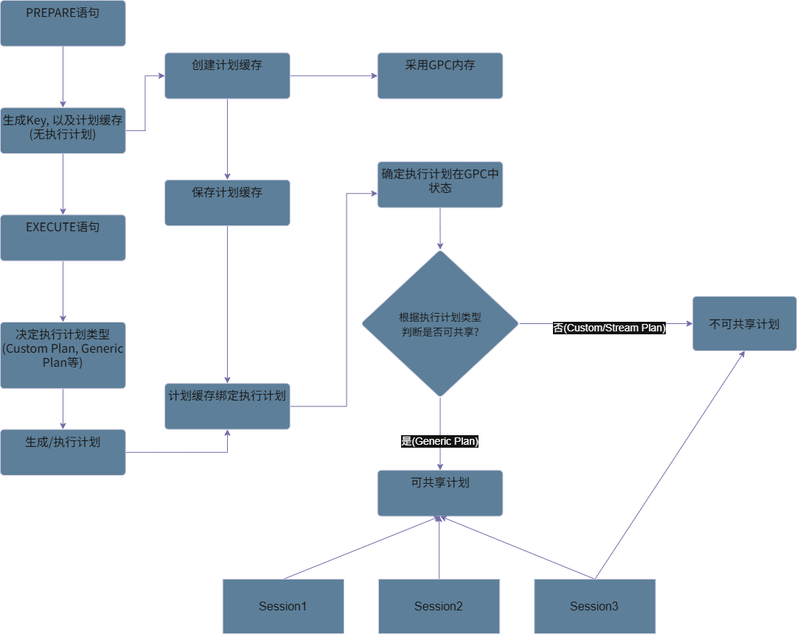
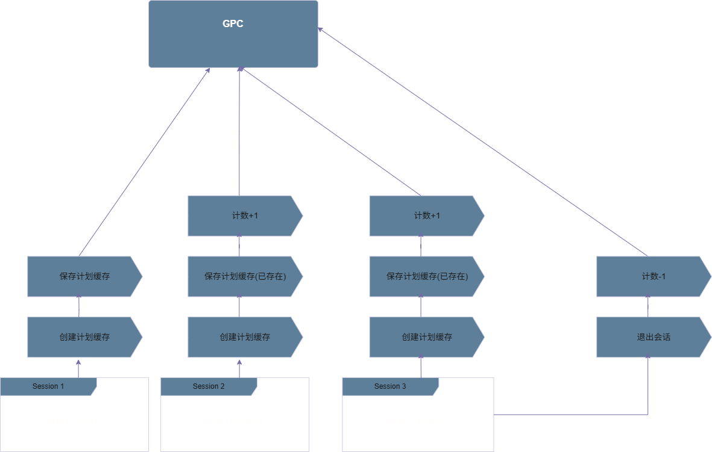

# Global Plan Cache

## 可获得性<a name="section3480125215594"></a>

本特性自openGauss 1.0.0版本开始引入。

## 特性简介<a name="section3480125215595"></a>

全局计划缓存(Global Plan Cache, GPC)是一种针对执行计划缓存的优化特性, 该特性允许执行计划缓存跨会话(session)共享, 进而节省内存空间, 避免重复生成计划, 提升性能表现。 
该特性开启时, 满足特定条件的执行计划缓存可以在不同会话间共享, 当一个执行计划在某会话中被生成后, 其他会话也可以使用该执行计划, 避免了重复生成以及保存复数份执行计划, 可以通过查询DBE_PERF.GLOBAL_PLANCACHE_STATUS查看当前有哪些执行计划缓存正在被共享, 连接同一个openGauss Server的不同会话会得到相同的结果。

## 客户价值<a name="section3480125215596"></a>

在复数连接且需使用执行计划缓存场景下, 减少内存使用, 提升性能表现。

## 特性描述<a name="section3480125215597"></a>

开启该功能后, 新的执行计划缓存会被保存到GPC相关的内存上进行管理, 每当新的执行计划缓存被保存时, 数据库会先判断该执行计划是否可以被共享, 如果是, 该执行计划除执行原有的保存流程外, 其相关信息还会被保存在GPC的一个哈希表中, 该执行计划的信息可以通过一个唯一键被找到。如果不是, 该执行计划的保存基本与原有流程一致。



当某个会话中已经缓存过的执行计划再次被其他会话缓存时, 数据库会先去GPC的哈希表中查看是相同的执行计划是否存在, 如果存在, 则不会重复缓存该执行计划。



## 特性增强<a name="section3480125215598"></a>

无。

## 特性约束<a name="section3480125215599"></a>

- 需开启线程池。
- 仅当执行计划缓存使用Generic Plan时执行计划才会被全局缓存, 其他类型计划(如Custom Plan, Stream Plan)则不会被全局缓存, 依旧只有当前会话可见。

## 依赖关系<a name="section3480125215600"></a>

无。

## 使用指导<a name="section3480125215601"></a>

使用前请参考[GLOBAL_PLANCACHE_STATUS](../sql_reference/global_plancache_status.md)以及[GLOBAL_PLANCACHE_CLEAN](../sql_reference/global_plancache_clean.md)部分
-- 前置条件 开启enable_thread_pool与enable_global_plancache
-- 设置 enable_pbe_optimization = on

```sql
openGauss=# show enable_thread_pool;
 enable_thread_pool 
--------------------
 on
(1 row)

openGauss=# show enable_global_plancache;
 enable_global_plancache 
-------------------------
 on
(1 row)

openGauss=# set enable_pbe_optimization = on;
SET
openGauss=# show enable_pbe_optimization;
 enable_pbe_optimization 
-------------------------
 on
(1 row)

openGauss=# drop table if exists t1;
DROP TABLE
openGauss=# create table t1(id int,v1 int,v2 int,v3 varchar(255));
CREATE TABLE
openGauss=# PREPARE st1 AS INSERT INTO t1 VALUES($1, $2, $3, $4);
PREPARE
openGauss=# EXECUTE st1(1, 2, 3, 'abcd');
INSERT 0 1
openGauss=# select * from dbe_perf.global_plancache_status;
 nodename |                         query                         | refcount | valid | databaseid |  schema_name   | params_num | func_id 
----------+-------------------------------------------------------+----------+-------+------------+----------------+------------+---------
 node3    | PREPARE st1 AS INSERT INTO t1 VALUES($1, $2, $3, $4); |        1 | t     |      16337 | "$user",public |          4 |       0
(1 row)

-- 开启会话2

openGauss=# set enable_pbe_optimization = on;
SET
-- 未尝试保存计划缓存, 此时refcount为1
openGauss=# select * from dbe_perf.global_plancache_status;
 nodename |                         query                         | refcount | valid | databaseid |  schema_name   | params_num | func_id 
----------+-------------------------------------------------------+----------+-------+------------+----------------+------------+---------
 node3    | PREPARE st1 AS INSERT INTO t1 VALUES($1, $2, $3, $4); |        1 | t     |      16337 | "$user",public |          4 |       0
(1 row)

-- 保存计划缓存
openGauss=# PREPARE st1 AS INSERT INTO t1 VALUES($1, $2, $3, $4);
PREPARE
openGauss=# EXECUTE st1(1, 2, 3, 'abcd');
INSERT 0 1
-- 此时计数为2
openGauss=# select * from dbe_perf.global_plancache_status;
 nodename |                         query                         | refcount | valid | databaseid |  schema_name   | params_num | func_id 
----------+-------------------------------------------------------+----------+-------+------------+----------------+------------+---------
 node3    | PREPARE st1 AS INSERT INTO t1 VALUES($1, $2, $3, $4); |        2 | t     |      16337 | "$user",public |          4 |       0
(1 row)

-- 回到会话1进行查询
-- 此时会话1中计数为2
openGauss=# select * from dbe_perf.global_plancache_status;
 nodename |                         query                         | refcount | valid | databaseid |  schema_name   | params_num | func_id 
----------+-------------------------------------------------------+----------+-------+------------+----------------+------------+---------
 node3    | PREPARE st1 AS INSERT INTO t1 VALUES($1, $2, $3, $4); |        2 | t     |      16337 | "$user",public |          4 |       0
(1 row)

-- 退出会话2
-- 此时计数-1
openGauss=# \q

-- 会话1中查看
-- 此时计数为1
openGauss=# select * from dbe_perf.global_plancache_status;
 nodename |                         query                         | refcount | valid | databaseid |  schema_name   | params_num | func_id 
----------+-------------------------------------------------------+----------+-------+------------+----------------+------------+---------
 node3    | PREPARE st1 AS INSERT INTO t1 VALUES($1, $2, $3, $4); |        1 | t     |      16337 | "$user",public |          4 |       0
(1 row)

-- 退出会话1
openGauss=# \q
-- 重新打开会话并查看视图
-- 计数为0
openGauss=# select * from dbe_perf.global_plancache_status;
 nodename |                         query                         | refcount | valid | databaseid |  schema_name   | params_num | func_id 
----------+-------------------------------------------------------+----------+-------+------------+----------------+------------+---------
 node3    | PREPARE st1 AS INSERT INTO t1 VALUES($1, $2, $3, $4); |        0 | t     |      16337 | "$user",public |          4 |       0
(1 row)

-- 删除表
openGauss=# drop table t1;
DROP TABLE

-- 再次查询视图, 记录消失
openGauss=# select * from dbe_perf.global_plancache_status;
 nodename | query | refcount | valid | databaseid | schema_name | params_num | func_id 
----------+-------+----------+-------+------------+-------------+------------+---------
(0 rows)
```