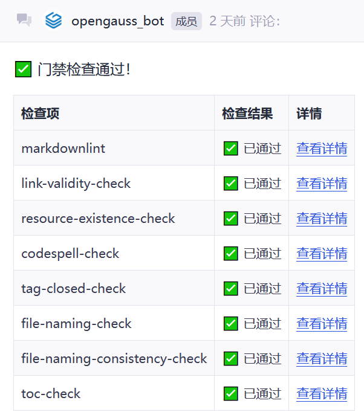

# 文档开发流水线门禁

为提升文档质量，openGauss docs 仓引入了自动化动检视工具，对文档中低错问题进行排查。

开发者提交PR后，会自动触发门禁进行检查。当返回如下结果时表示已经通过了工具检查：



通过门禁检查是PR合入的必要条件之一，检查项提示错误可在`Build Details`查看错误详细信息。

下面将对各个检查项进行介绍：

## tag-closed-check

Tag Closed Check将检查文档里HTML标签闭合问题。请注意，代码块里的HTML标签将不会扫描。

反例：

  ```html
    <table>
      <tr>
        <th>Header 1
        <th>Header 2</th>   <!-- 错误1：未闭合的<th> -->
      <tr>                  <!-- 错误2：未闭合的<tr> -->
        <td>Data 1<td>      <!-- 错误3：自闭合<td> -->
        <td>Data 2</td>
    </table>                <!-- 错误4：未闭合的<tr>导致结构错乱 -->
  ```

正例：

  ```html
    <table>
      <tr>
        <th>Header 1</th>
        <th>Header 2</th>
      </tr>
      <tr>
        <td>Data 1</td>
        <td>Data 2</td>
      </tr>
    </table>
  ```

## link-validity-check

Link Validity Check 将检查文档中出现的所有链接是否有效。

反例：

  ```text
    <!-- 拼写错误导致 404 -->
  ```

正例：

  ```text
  
  ```

## resource-existence-check

此检查项将确认本地图片或者链接是否有效。

反例：

  ```text
    <!-- 图片相对路径错误 -->
  ```

正例：

  ```text
  
  ```

## toc-check

- 新增文档为确保能在 openGauss 文档官网展示，需要在对应`_toc.yaml`文件增加所在章节位置，否则此检查项报错。`toc.yaml`文件格式可参考[_toc.yaml文件写作规范](./directory_structure_introductory.md#目录配置文件格式_tocyaml)。

- 变更文档名称时，Toc Check会检查对应`_toc.yaml`文件是否同步修改文档名称。

- 在进行Toc Check检查时，门禁会对文档进行全量检查，检查每个`_toc.yaml`文件中所有的文件是否存在于文档对应的路径下，若`_toc.yaml`文件中记录的文件不存在，则会报错。

## markdownlint

Markdown Lint 对markdown文档的格式进行检视。markdownlint规则介绍及本仓规则设置，请参考[**检查规则**](https://gitcode.com/opengauss/docs/blob/stable-common/docs/zh/contribute/markdownlint_rules.md)。

## codespell-check

Codespell 主要用于检查文档中的单词拼写错误，详细信息可参考<https://github.com/codespell-project/codespell>。

如果有特殊单词需要加入忽略清单，可联系[wu-donger](https://gitcode.com/Evawudonger)。
