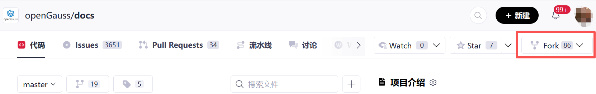
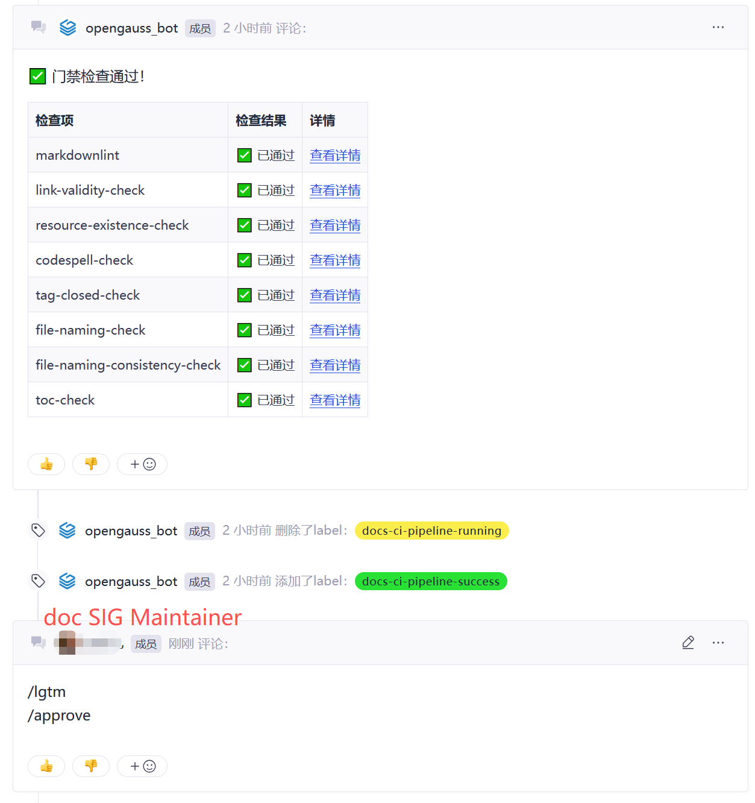

# 快速入门

## 概述

openGauss 文档采用 Markdown 格式编写，通过 Git 进行版本控制，并托管在 Gitee 平台。文档修改通过 Pull Request（PR）工作流进行审核与合并。openGauss 文档存放在 openGauss/docs 仓，由 doc SIG 负责维护。

## 快速开始

下面介绍文档开发流程。

1. Fork openGauss/docs 仓库。

    访问 [Repository 首页](https://gitcode.com/opengauss/docs)。点击右上角的**Fork**按钮，按照指引，创建个人的云上 fork 仓库。

    

2. 克隆 openGauss/docs 仓库。

    克隆 fork 仓库到本地，并关联本地与远程仓库。

    ```bash
    git clone https://gitcode.com/{your_org}/docs.git

    cd docs
    git remote add upstream https://gitcode.com/opengauss/docs.git
    git fetch upstream
    ```

3. 切换分支。

    依据所需修改文档的版本，切换到对应的分支。此处以latest版本为例。

    ```bash
    git checkout -b work upstream/master
    ```

4. 按需更新文档。若新增文档文件，需维护[`_toc.yaml`目录配置文件](./directory_structure_introductory.md#目录配置文件格式_tocyaml)。

5. 提交变更并推送到远程仓库。

      ```bash
      git add .

      git commit -m "提交原因"

      git push origin work
      ```

6. 创建PR。

      在个人文档仓库的 Pull Requests 页面 `https://gitcode.com/{your_org}/docs/pulls`，点击**新建Pull Request**创建PR。源分支选择 `{your_org}/docs/work`，目的分支选择 `openGauss/docs/master`。填写 PR 标题并简要说明修改内容，点击**创建Pull Request**。

7. 合入PR。

      合入条件：文档流水线门禁通过，CLA 已签署，Issue 已关联，doc SIG maintainer 检视通过。

      
