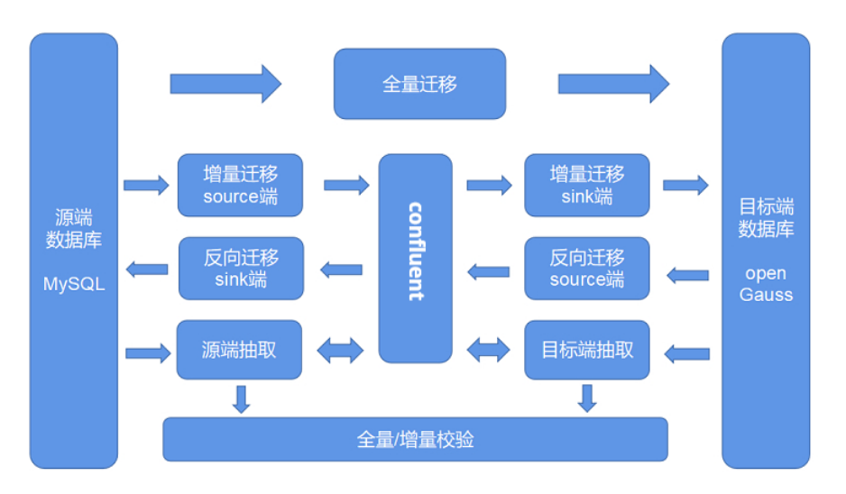

# 迁移MySQL数据库至openGauss

## 工具部署架构图

当前openGauss支持对MySQL迁移服务，具体包括：

- **[MySQL一键式迁移](quick_mysql_migration.md)**  
- **[全量迁移](full_migration.md)**  
- **[增量迁移](incremental_migration.md)**  
- **[反向迁移](reverse_migration.md)**  
- **[数据校验](data_check.md)**  
