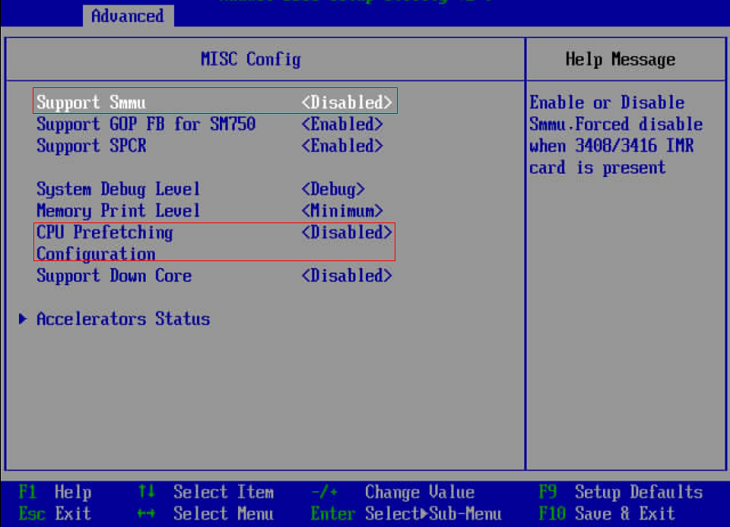
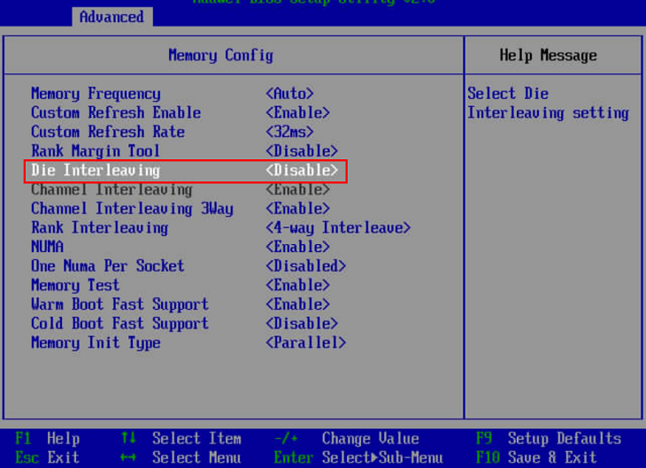
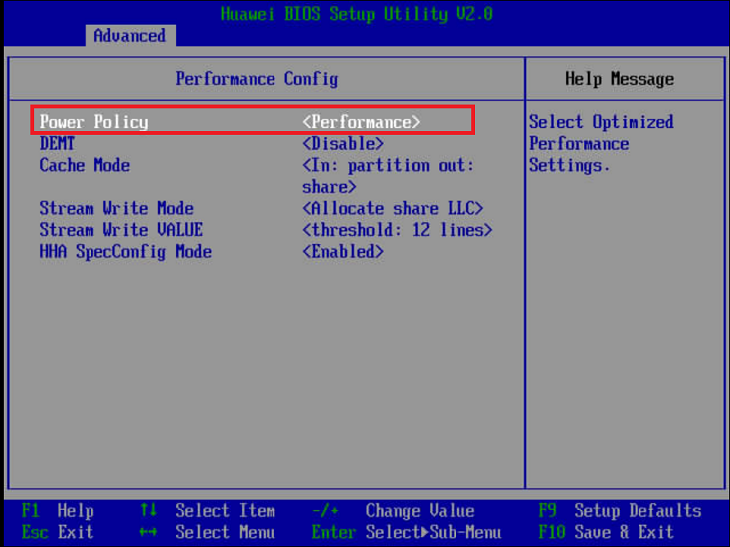

# MOT服务器优化

## MOT服务器优化：x86

通常情况下，数据库由以下组件绑定：

- CPU：更快的CPU可以加速任何CPU绑定的数据库。
- 磁盘：高速SSD/NVME可加速任何I/O绑定数据库。
- 网络：更快的网络可以加速任何SQL\*Net绑定数据库。

除以上内容外，以下通用服务器设置默认使用，可能会明显影响数据库的性能。

MOT性能调优是确保快速的应用程序功能和数据检索的关键步骤。MOT支持最新的硬件，因此调整每个系统以达到最大吞吐量是极为重要的。

以下是用于优化在英特尔x86服务器上运行MOT时的建议配置。这些设置是高吞吐量工作负载的最佳选择。

### BIOS<a name="section23444570"></a>

- Hyper Threading设置为ON。

    强烈建议打开超线程（HT=ON）。

    建议在MOT上运行OLTP工作负载时打开超线程。当使用超线程时，某些OLTP工作负载显示高达40%的性能增益。

### 操作系统环境设置<a name="section9674542"></a>

- NUMA

    禁用NUMA平衡，如下所示。MOT以极其高效的NUMA-aware方式进行内存管理，远远超过操作系统使用的默认方法。

    ```
    echo 0 > /proc/sys/kernel/numa_balancing
    ```

- 服务

    禁用如下服务：

    ```
    service irqbalance stop           # MANADATORY 
    service sysmonitor stop           # OPTIONAL, performance  
    service rsyslog stop       # OPTIONAL, performance
    ```

- 调优服务

    以下为必填项。

    服务器必须运行throughput-performance配置文件。

    ```
    [...]$ tuned-adm profile throughput-performance 
    ```

    throughput-performance配置文件是广泛适用的调优，它为各种常见服务器工作负载提供卓越的性能。

    其他不太适合openGauss和MOT服务器的配置可能会影响MOT的整体性能，包括：平衡配置、桌面配置、延迟性能配置、网络延迟配置、网络吞吐量配置和节能配置。

- 系统命令

    推荐使用下列操作系统设置以获得最佳性能。

    - 在/etc/sysctl.conf文件中添加如下配置，然后执行sysctl -p命令：

        ```
        net.ipv4.ip_local_port_range = 9000 65535 
        kernel.sysrq = 1 
        kernel.panic_on_oops = 1 
        kernel.panic = 5 
        kernel.hung_task_timeout_secs = 3600 
        kernel.hung_task_panic = 1 
        vm.oom_dump_tasks = 1 
        kernel.softlockup_panic = 1 
        fs.file-max = 640000 
        kernel.msgmnb = 7000000 
        kernel.sched_min_granularity_ns = 10000000 
        kernel.sched_wakeup_granularity_ns = 15000000 
        kernel.numa_balancing=0 
        vm.max_map_count = 1048576 
        net.ipv4.tcp_max_tw_buckets = 10000 
        net.ipv4.tcp_tw_reuse = 1 
        net.ipv4.tcp_tw_recycle = 1 
        net.ipv4.tcp_keepalive_time = 30 
        net.ipv4.tcp_keepalive_probes = 9 
        net.ipv4.tcp_keepalive_intvl = 30 
        net.ipv4.tcp_retries2 = 80 
        kernel.sem = 250 6400000 1000 25600 
        net.core.wmem_max = 21299200 
        net.core.rmem_max = 21299200 
        net.core.wmem_default = 21299200 
        net.core.rmem_default = 21299200 
        #net.sctp.sctp_mem = 94500000 915000000 927000000 
        #net.sctp.sctp_rmem = 8192 250000 16777216 
        #net.sctp.sctp_wmem = 8192 250000 16777216 
        net.ipv4.tcp_rmem = 8192 250000 16777216 
        net.ipv4.tcp_wmem = 8192 250000 16777216 
        net.core.somaxconn = 65535 
        vm.min_free_kbytes = 26351629 
        net.core.netdev_max_backlog = 65535 
        net.ipv4.tcp_max_syn_backlog = 65535 
        #net.sctp.addip_enable = 0 
        net.ipv4.tcp_syncookies = 1 
        vm.overcommit_memory = 0 
        net.ipv4.tcp_retries1 = 5 
        net.ipv4.tcp_syn_retries = 5
        ```

    - 按如下方式修改/etc/security/limits.conf对应部分：

        ```
        <user> soft nofile 100000 
        <user> hard nofile 100000
        ```

        软限制和硬限制设置可指定一个进程同时打开的文件数量。软限制可由各自运行这些限制的进程进行更改，直至达到硬限制值。

- 磁盘/SSD

    下面以数据库同步提交模式为例，介绍如何保证磁盘读写性能适合数据库同步提交模式。

    按如下方式运行磁盘/SSD性能测试：

    ```
    [...]$ sync; dd if=/dev/zero of=testfile bs=1M count=1024; sync 
    1024+0 records in 
    1024+0 records out 
    1073741824 bytes (1.1 GB) copied, 1.36034 s, 789 MB/s 
    ```

    当磁盘带宽明显低于789MB/s时，可能会造成openGauss性能瓶颈，尤其是造成MOT性能瓶颈。

### 网络<a name="section19962019"></a>

需要使用10Gbps以上网络。

运行iperf命令进行验证：

```
Server side: iperf -s 
Client side: iperf -c <IP>
```

rc.local：网卡调优

以下可选设置对性能有显著影响：

1. 将[https://gist.github.com/SaveTheRbtz/8875474](https://gist.github.com/SaveTheRbtz/8875474)下的set\_irq\_privacy.sh文件拷贝到/var/scripts/目录下。
2. 进入/etc/rc.d/rc.local，执行chmod命令，确保在boot时执行以下脚本：

    ```
    'chmod +x /etc/rc.d/rc.local'  
    var/scripts/set_irq_affinity.sh -x all <DEVNAME> 
    ethtool -K <DEVNAME> gro off 
    ethtool -C <DEVNAME> adaptive-rx on adaptive-tx on 
    Replace <DEVNAME> with the network card, i.e. ens5f1
    ```

## MOT服务器优化：基于Arm的华为TaiShan2P/4P服务器

以下是基于Arm/鲲鹏架构的华为TaiShan 2280 v2服务器（2路128核）和TaiShan 2480 v2服务器（4路256核）上运行MOT时的建议配置。

除非另有说明，以下设置适用于客户端和服务器的机器。

### BIOS<a name="section31155189"></a>

修改BIOS相关设置：

1. 选择 **BIOS** \>  **Advanced**  \>  **MISC Config**。设置 **Support Smmu** 为 **Disabled**。
2. 选择 **BIOS** \>  **Advanced**  \>  **MISC Config**。设置 **CPU Prefetching Configuration** 为 **Disabled**。

    

3. 选择 **BIOS**  \>  **Advanced**  \>  **Memory Config**。设置 **Die Interleaving** 为 **Disabled** 。

    

4. 选择 **BIOS**  \>  **Advanced**  \>  **Performance Config**。设置 **Power Policy** 为 **Performance**。

    

### 操作系统：内核和启动<a name="section11961253"></a>

- 以下操作系统内核和启动参数通常由sysadmin配置。

    配置内核参数，如下所示。

    ```
    net.ipv4.ip_local_port_range = 9000 65535 
    kernel.sysrq = 1 
    kernel.panic_on_oops = 1 
    kernel.panic = 5 
    kernel.hung_task_timeout_secs = 3600 
    kernel.hung_task_panic = 1 
    vm.oom_dump_tasks = 1 
    kernel.softlockup_panic = 1 
    fs.file-max = 640000 
    kernel.msgmnb = 7000000 
    kernel.sched_min_granularity_ns = 10000000 
    kernel.sched_wakeup_granularity_ns = 15000000 
    kernel.numa_balancing=0 
    vm.max_map_count = 1048576 
    net.ipv4.tcp_max_tw_buckets = 10000 
    net.ipv4.tcp_tw_reuse = 1 
    net.ipv4.tcp_tw_recycle = 1 
    net.ipv4.tcp_keepalive_time = 30 
    net.ipv4.tcp_keepalive_probes = 9 
    net.ipv4.tcp_keepalive_intvl = 30 
    net.ipv4.tcp_retries2 = 80 
    kernel.sem = 32000 1024000000      500     32000 
    kernel.shmall = 52805669 
    kernel.shmmax = 18446744073692774399 
    sys.fs.file-max = 6536438 
    net.core.wmem_max = 21299200 
    net.core.rmem_max = 21299200 
    net.core.wmem_default = 21299200 
    net.core.rmem_default = 21299200 
    net.ipv4.tcp_rmem = 8192 250000 16777216 
    net.ipv4.tcp_wmem = 8192 250000 16777216 
    net.core.somaxconn = 65535 
    vm.min_free_kbytes = 5270325 
    net.core.netdev_max_backlog = 65535 
    net.ipv4.tcp_max_syn_backlog = 65535 
    net.ipv4.tcp_syncookies = 1 
    vm.overcommit_memory = 0 
    net.ipv4.tcp_retries1 = 5 
    net.ipv4.tcp_syn_retries = 5 
    ##NEW 
    kernel.sched_autogroup_enabled=0 
    kernel.sched_min_granularity_ns=2000000 
    kernel.sched_latency_ns=10000000 
    kernel.sched_wakeup_granularity_ns=5000000 
    kernel.sched_migration_cost_ns=500000 
    vm.dirty_background_bytes=33554432 
    kernel.shmmax=21474836480 
    net.ipv4.tcp_timestamps = 0 
    net.ipv6.conf.all.disable_ipv6=1 
    net.ipv6.conf.default.disable_ipv6=1 
    net.ipv4.tcp_keepalive_time=600 
    net.ipv4.tcp_keepalive_probes=3 
    kernel.core_uses_pid=1
    ```

- 调优服务

    以下为必填项。

    服务器必须运行throughput-performance配置文件：

    ```
    [...]$ tuned-adm profile throughput-performance
    ```

    throughput-performance配置文件是广泛适用的调优，它为各种常见服务器工作负载提供卓越的性能。

    其他不太适合openGauss和MOT服务器的配置可能会影响MOT的整体性能，包括：平衡配置、桌面配置、延迟性能配置、网络延迟配置、网络吞吐量配置和节能配置。

- 启动调优

    在内核启动参数中添加iommu.passthrough=1。

    在pass-through模式下运行时，适配器需要DMA转换到内存，从而提高性能。
