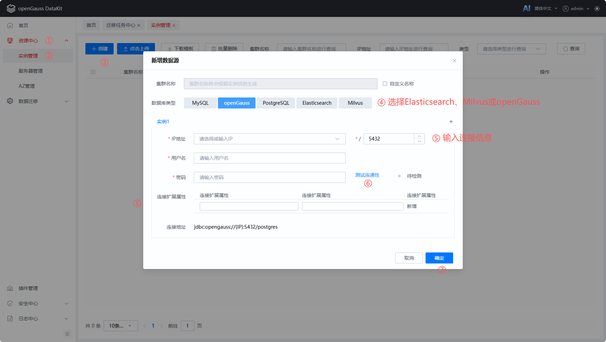
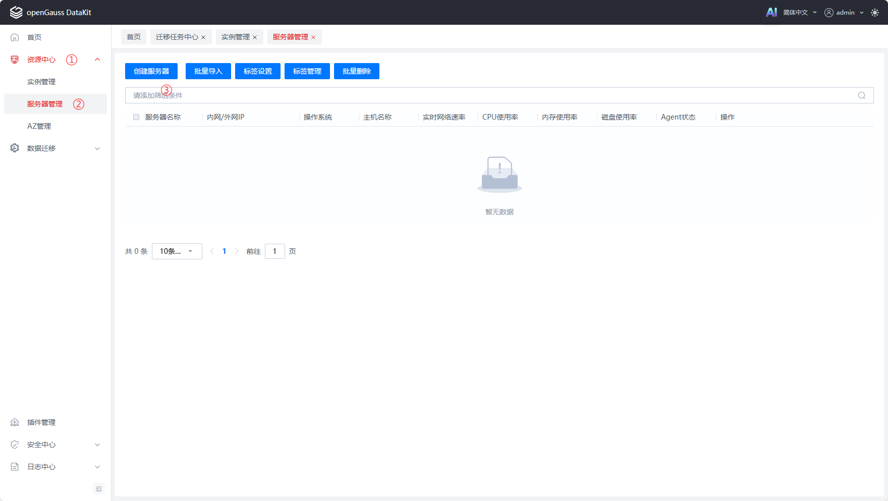
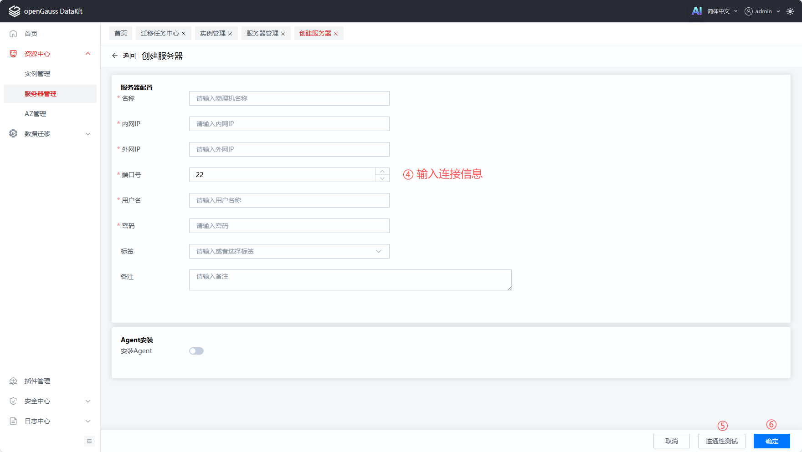
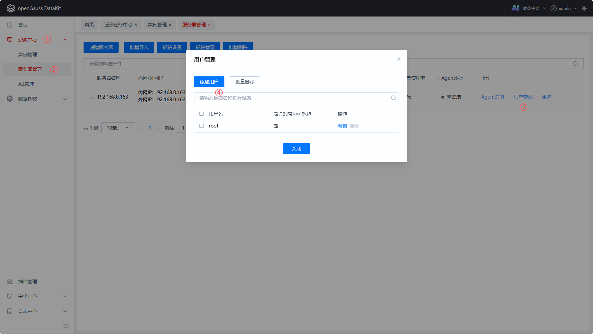
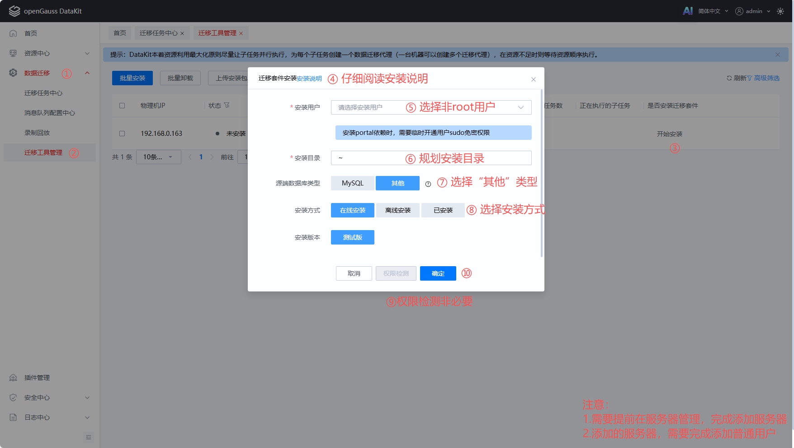
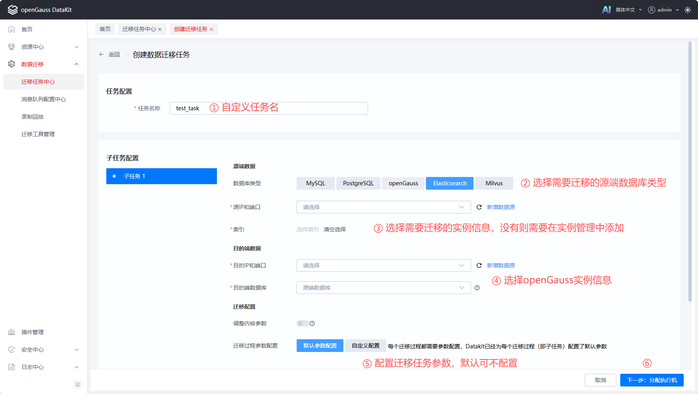
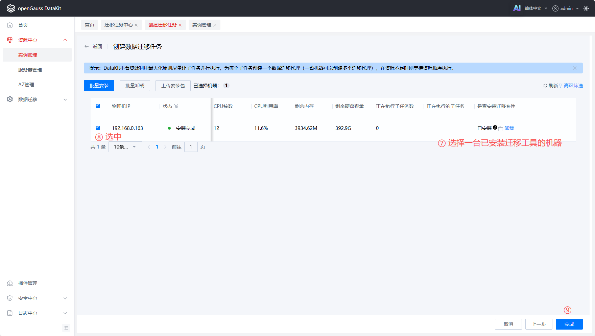
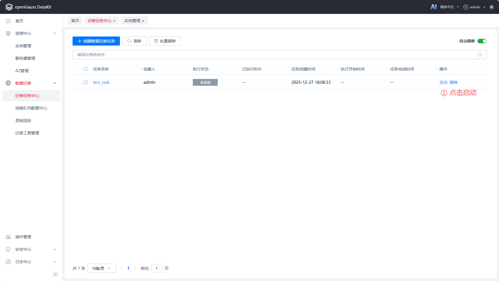
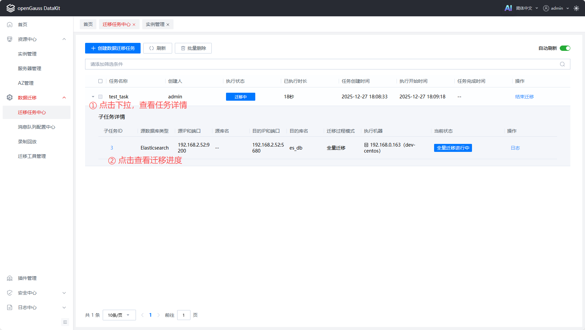
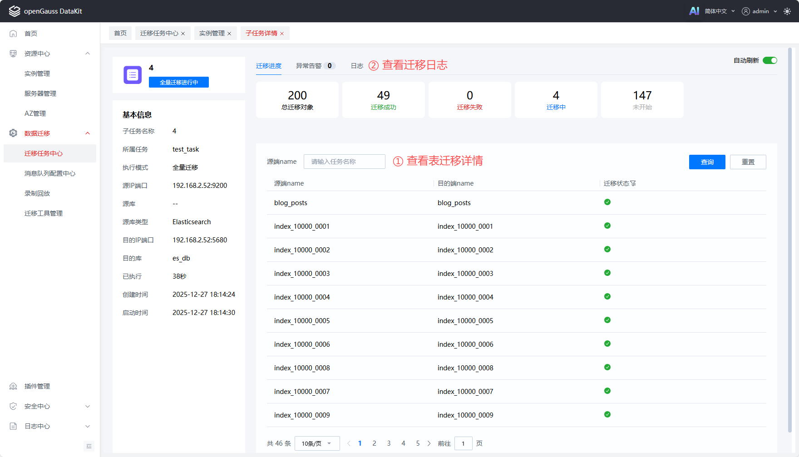

# Elasticsearch和Milvus数据迁移

## 功能介绍

1. 支持将Elasticsearch/Milvus中的数据迁移到openGauss数据库中。
2. 支持的迁移阶段：全量迁移。
3. 支持多表并行迁移。

## 安装说明

Elasticsearch和Milvus数据迁移由DataKit的数据迁移插件提供，DataKit安装成功后，前往“插件管理”菜单查看是否安装“数据迁移插件”，未安装则通过页面上的“安装插件”功能进行数据迁移插件安装。

## 依赖安装

由于Elasticsearch和Milvus的迁移工具是由Python语言开发而成，而后集成到DataKit数据迁移插件中，因此启动迁移前，需要安装一些Python依赖，避免因为依赖不存在，引起迁移工具无法正常运行，导致迁移失败。

请参考如下资料安装Elasticsearch/Milvus迁移工具所需依赖，并按照资料中的步骤测试能否迁移成功，测试成功后，即可使用DataKit的数据迁移功能开始多表并行迁移。参考资料如下：

- Elasticsearch迁移参考资料：[从Elasticsearch迁移至openGauss DataVec](https://docs.opengauss.org/zh/docs/latest/datavec/elasticsearch_to_opengauss.html)
- Milvus迁移参考资料：[从Milvus迁移至openGauss DataVec](https://docs.opengauss.org/zh/docs/latest/datavec/milvus2datavec.html)

## 迁移功能使用

### 添加数据库

在DataKit页面，资源中心-实例管理中添加所需迁移的Elasticsearch/Milvus数据库以及openGauss数据库。

注意事项：

- 添加openGauss数据库需要使用md5加密的连接用户，否则迁移Elasticsearch/Milvus数据库时可能出现报错，导致迁移失败。
- Elasticsearch/Milvus数据库当前仅支持HTTP协议免密连接，暂不支持使用HTTPS协议和用户名密码认证连接。



### 添加服务器

在DataKit页面，资源中心-服务器管理中添加一台Linux服务器，此服务器需要完成上述的“依赖安装”。支持的系统架构有：CentOS7 x86_64、openEuler20.03 x86_64、openEuler20.03 aarch64、openEuler22.03 x86_64、openEuler22.03 aarch64、openEuler24.03 x86_64、openEuler24.03 aarch64。此时添加的服务器，将用于安装数据迁移门户工具portal，其中包含Elasticsearch/Milvus的迁移工具。





### 服务器添加用户

服务器添加成功后，可在服务器列表中看到已添加的服务器，点击对应服务器“用户管理”功能，进行服务器其他用户的添加。迁移工具仅可安装在服务器非root用户下，因此请确保“用户管理”中包含有非root用户。



### 安装迁移工具

在DataKit页面，数据迁移-迁移工具管理，选择已添加的服务器，进行数据迁移门户工具portal的安装。

迁移工具运行需要Java 17+环境，请在普通安装用户下配置好Java 17+的环境变量。

迁移工具安装方式支持在线安装、离线安装和已安装。其中在线安装，需要安装的Linux服务器可正常连接外网，安装时会直接从外网下载安装包到安装目录中进行安装；离线安装则需要用户手动下载好安装包后，从前端页面上传安装包进行安装；已安装则用于绑定服务器上已经安装好的迁移工具。

迁移工具安装包获取：[迁移工具代码仓](https://gitcode.com/opengauss/openGauss-migration-portal/tree/master/multidb-portal)



### 创建迁移任务

在DataKit页面，数据迁移-迁移任务中心，创建迁移任务，并管理所有的迁移任务。





### 启动迁移任务

创建迁移任务成功，迁移任务中心页面的任务列表中会展示已有任务，选择上一步创建的任务，点击启动。



### 查看迁移进度

迁移任务启动后，点击对应迁移任务记录，可展开查看迁移任务的详细配置信息，再次点击下拉中的任务ID，则可查看迁移进度详情信息。





### 结束迁移任务

Elasticsearch/Milvus的数据迁移，在迁移完成后，会自动结束迁移任务。当迁移过程中，需要手动结束时，可进入迁移任务中心，选择对应正在迁移的迁移任务，点击结束迁移。

# 常见问题处理

## 1 Fielddata access on the _id field is disallowed

### 问题现象

迁移报错日志中提示查询数据失败，并且日志中包含如下JSON信息，JSON信息提示`Fielddata access on the _id field is disallowed, you can re-enable it by updating the dynamic cluster setting: indices.id_field_data.enabled`。

```json
{
  "error" : {
    "root_cause" : [
      {
        "type" : "illegal_argument_exception",
        "reason" : "Fielddata access on the _id field is disallowed, you can re-enable it by updating the dynamic cluster setting: indices.id_field_data.enabled"
      }
    ],
    "type" : "search_phase_execution_exception",
    "reason" : "all shards failed",
    "phase" : "query",
    "grouped" : true,
    "failed_shards" : [
      {
        "shard" : 0,
        "index" : "users",
        "node" : "yKLv--_aTEuDYXmCK-oHXg",
        "reason" : {
          "type" : "illegal_argument_exception",
          "reason" : "Fielddata access on the _id field is disallowed, you can re-enable it by updating the dynamic cluster setting: indices.id_field_data.enabled"
        }
      }
    ],
    "caused_by" : {
      "type" : "illegal_argument_exception",
      "reason" : "Fielddata access on the _id field is disallowed, you can re-enable it by updating the dynamic cluster setting: indices.id_field_data.enabled",
      "caused_by" : {
        "type" : "illegal_argument_exception",
        "reason" : "Fielddata access on the _id field is disallowed, you can re-enable it by updating the dynamic cluster setting: indices.id_field_data.enabled"
      }
    }
  },
  "status" : 400
}
```

### 问题原因

 Elasticsearch 高版本中，默认禁用了 `_id` 字段的 fielddata，`_id` 字段是一个特殊的内部字段，启用 fielddata 会占用大量内存。在迁移业务中，批量查询`index`中的数据时，需要根据`_id`进行排序，避免数据重复。

### 问题处理

控制`_id`字段的 fielddata 的参数为`indices.id_field_data.enabled`，默认值为`false`。迁移时，临时开启此参数值为`true`，再次进行迁移，此报错问题解决。修改方式如下：

```bash
# 临时启用（重启后失效）
PUT /_cluster/settings
{
  "transient": {
    "indices.id_field_data.enabled": true
  }
}

# 或永久启用
PUT /_cluster/settings
{
  "persistent": {
    "indices.id_field_data.enabled": true
  }
}
```
