# PostgreSQL数据迁移

## 功能特性介绍

1. 支持将PostgreSQL数据库中的数据迁移到openGauss数据库中。
2. 当前支持的迁移阶段有：全量迁移、增量迁移、反向迁移，暂不支持数据校验。

## 安装说明

PostgreSQL数据迁移由Datakit的数据迁移插件提供，DataKit安装成功后，前往插件管理查看是否安装“数据迁移插件”，未安装则通过页面上的“安装插件”功能进行数据迁移插件安装。

## 迁移功能使用

### 添加数据库

在DataKit页面，资源中心-实例管理中添加所需迁移的PostgreSQL数据库以及openGauss数据库。

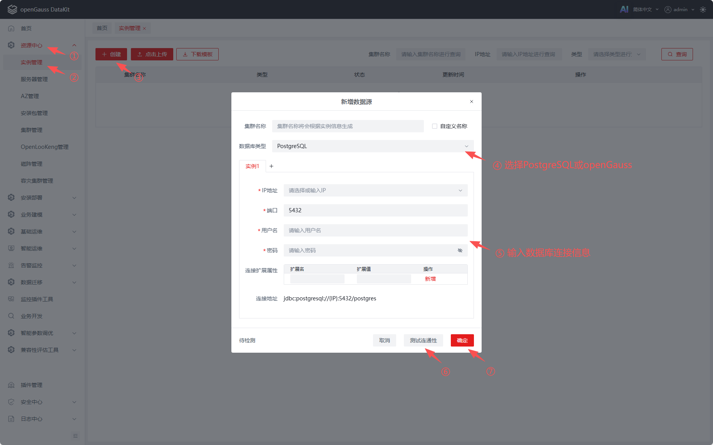

### 添加服务器

在DataKit页面，资源中心-服务器管理中添加一台Linux服务器，支持的系统架构有：CentOS7 x86_64、openEuler20.03 x86_64、openEuler20.03 aarch64、openEuler22.03 x86_64、openEuler22.03 aarch64、openEuler24.03 x86_64、openEuler24.03 aarch64。此时添加的服务器，将用于安装PostgreSQL的迁移工具。

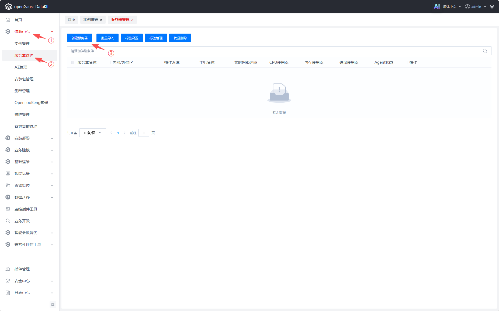

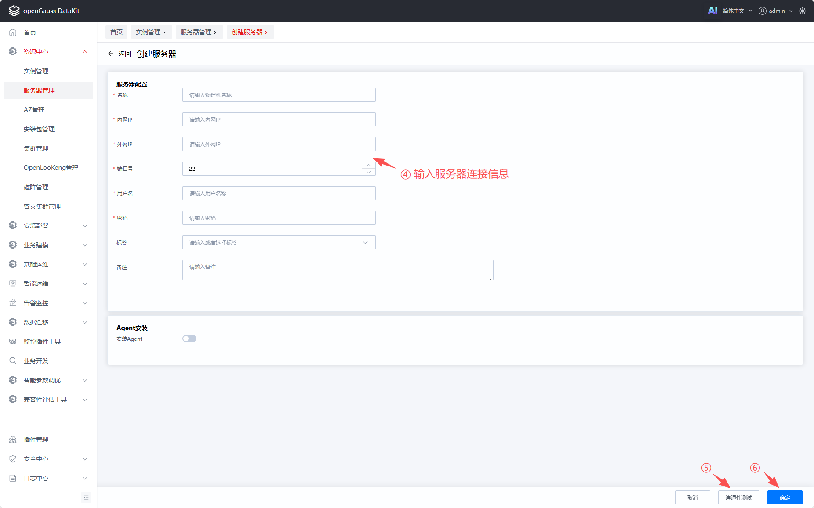

### 服务器添加用户

服务器添加成功后，可在服务器列表中看到已添加的服务器，点击对应服务器“用户管理”功能，进行服务器其他用户的添加。迁移工具仅可安装在服务器非root用户下，因此请确保“用户管理”中包含有非root用户。

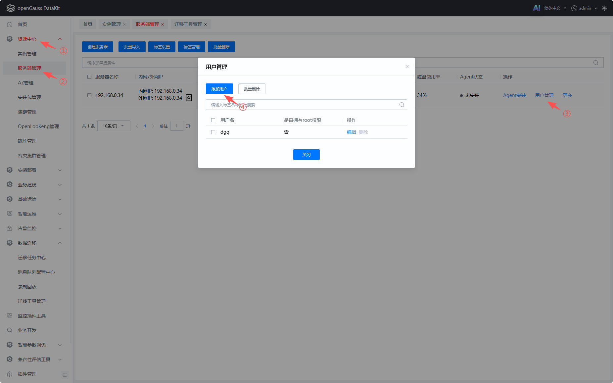

### 安装迁移工具

在DataKit页面，数据迁移-迁移工具管理中选择已添加的服务器，进行迁移工具安装。

迁移工具运行需要JDK 17+环境，请在安装用户下配置好Java 17+的环境变量。

迁移工具安装方式支持在线安装、离线安装和已安装。其中在线安装，需要安装的Linux服务器可正常连接外网，安装时会直接从外网下载安装包到安装目录中进行安装；离线安装则需要用户手动下载好安装包后，从前端页面上传安装包进行安装；已安装则用于绑定服务器上已经安装好的迁移工具。

迁移工具安装包获取：[迁移工具代码仓]: <https://gitcode.com/opengauss/openGauss-migration-portal/tree/master/multidb-portal>

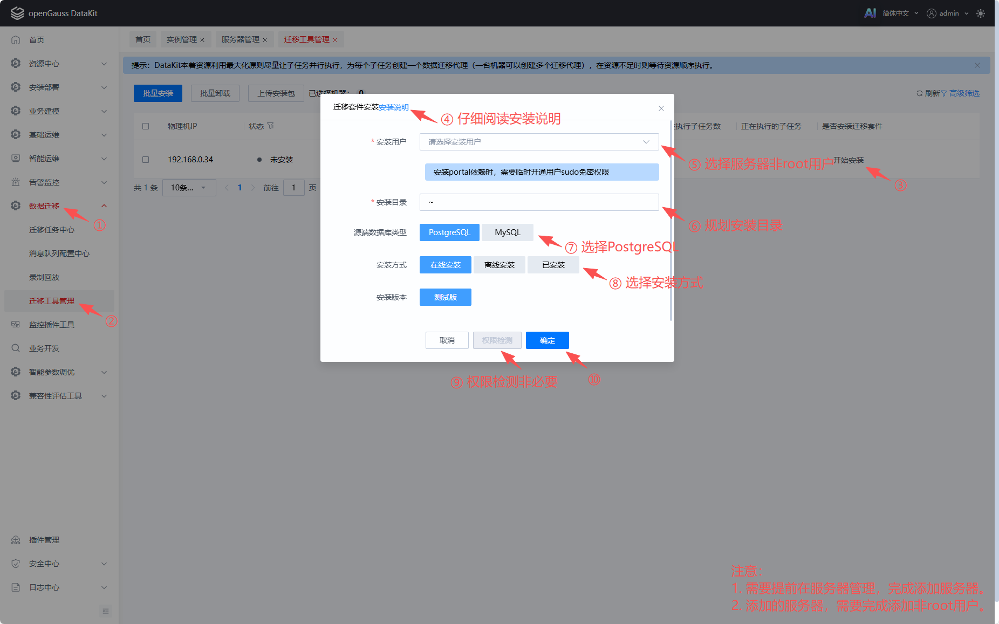

### 创建迁移任务

在DataKit页面，数据迁移-迁移任务中心中创建迁移任务，并管理所有的迁移任务。

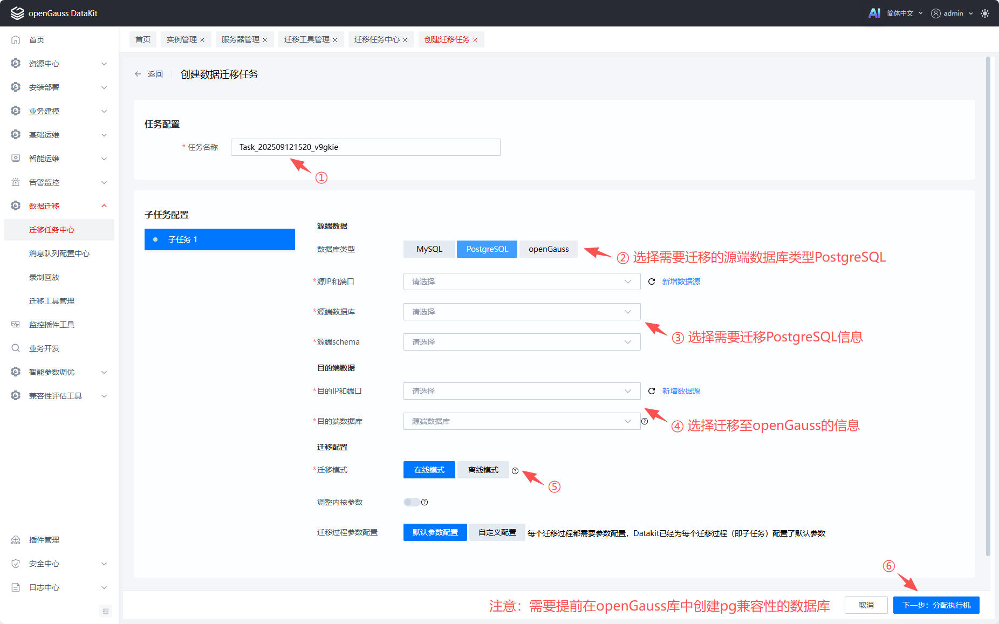

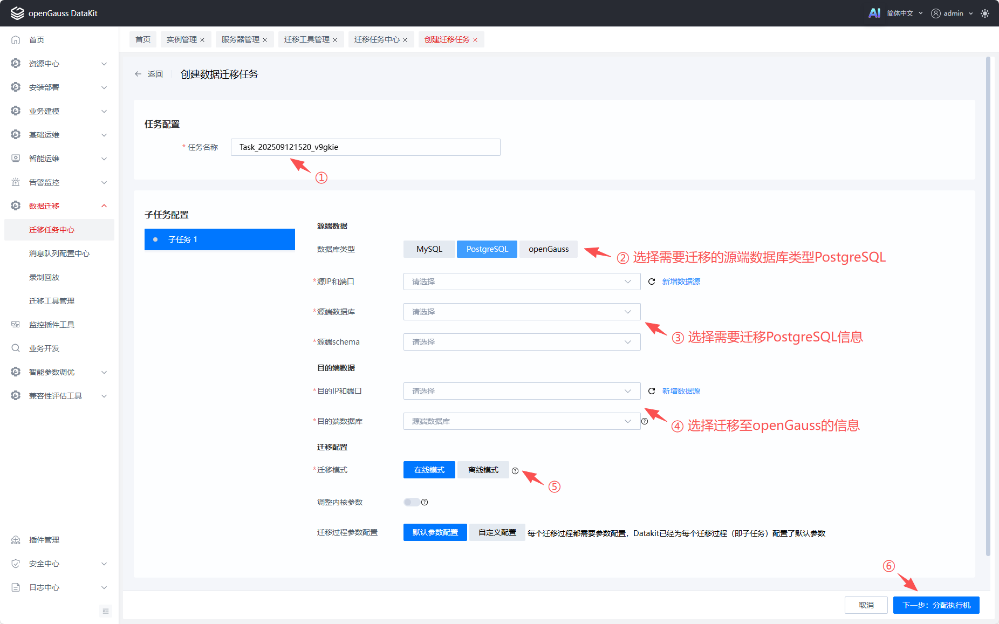

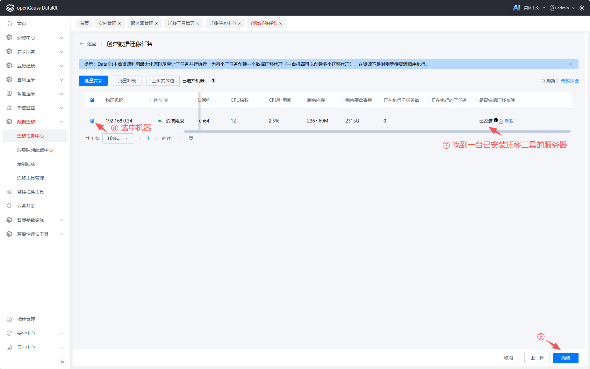

### 启动迁移任务

创建迁移任务成功，迁移任务中心页面的任务列表中会展示已有任务，选择上一步创建的任务，点击启动。

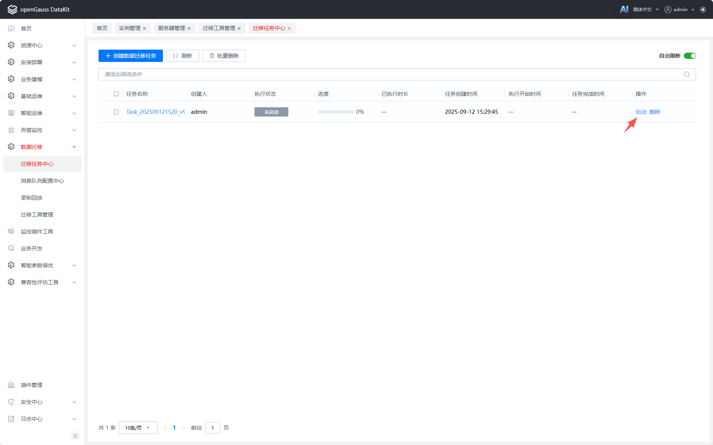

### 查看迁移进度

迁移任务启动后，点击对应迁移任务记录，可展开查看迁移任务的详细配置信息，再次点击下拉中的任务ID，则可查看迁移进度详情信息。

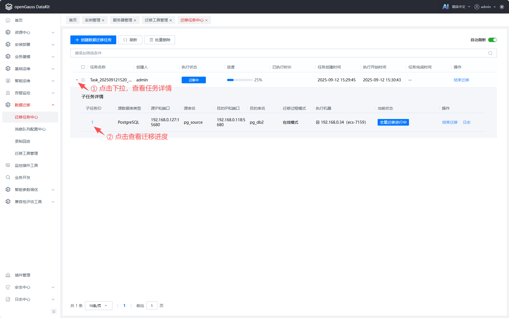

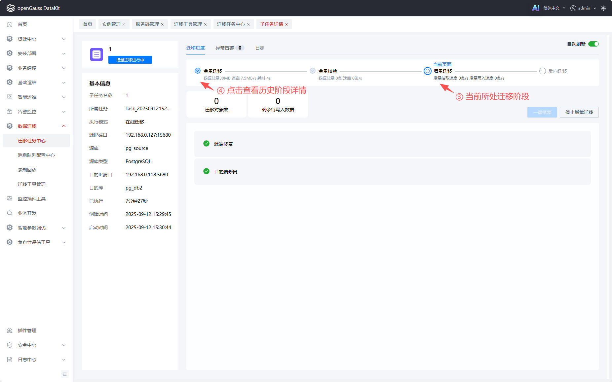

### 结束迁移任务

进入迁移任务中心，选择对应正在迁移的迁移任务，点击结束迁移。

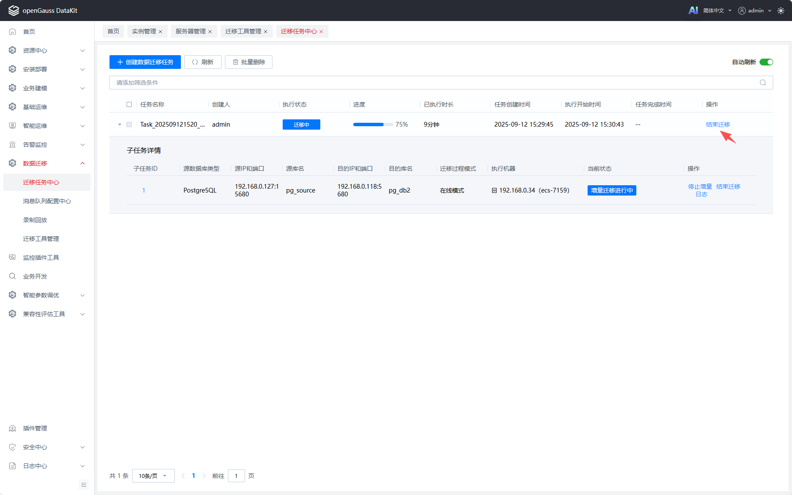

## PostgreSQL与openGauss数据类型对比

PostgreSQL迁移至openGauss数据类型映射关系如下：

| pg类型                                  | og类型                                  | 备注                            |
| --------------------------------------- | --------------------------------------- | ------------------------------- |
| smallint                                | smallint                                |                                 |
| integer                                 | integer                                 |                                 |
| bigint                                  | bigint                                  |                                 |
| decimal                                 | decimal                                 |                                 |
| numeric                                 | numeric                                 |                                 |
| real                                    | real                                    |                                 |
| double precision                        | double precision                        |                                 |
| smallserial                             | smallserial                             |                                 |
| serial                                  | serial                                  |                                 |
| bigserial                               | bigserial                               |                                 |
| money                                   | money                                   |                                 |
| varchar(n) character varying(n)         | varchar(n) character varying(n)         |                                 |
| char(n), character(n)                   | char(n), character(n)                   |                                 |
| varchar                                 | varchar                                 |                                 |
| char                                    | char                                    |                                 |
| text                                    | text                                    |                                 |
| name                                    | name                                    |                                 |
| bytea                                   | bytea                                   |                                 |
| timestamp [ (p) ] [ without time zone ] | timestamp [ (p) ] [ without time zone ] |                                 |
| timestamp [ (p) ] with time zone        | timestamp [ (p) ] with time zone        |                                 |
| timestamp without time zone             | timestamp(6) without time zone          | pg侧创建时不带精度，默认精度为6 |
| timestamp with time zone                | timestamp(6) with time zone             | pg侧创建时不带精度，默认精度为6 |
| date                                    | date                                    |                                 |
| time [ (p) ] [ without time zone ]      | time [ (p) ] [ without time zone ]      |                                 |
| time [ (p) ] with time zone             | time [ (p) ] with time zone             |                                 |
| time without time zone                  | time(6) without time zone               | pg侧创建时不带精度，默认精度为6 |
| time with time zone                     | time(6) with time zone                  | pg侧创建时不带精度，默认精度为6 |
| interval [ fields ] [ (p) ]             | interval [ fields ] [ (p) ]             |                                 |
| interval                                | interval(6)                             | pg侧创建时不带精度，默认精度为6 |
| boolean                                 | boolean                                 |                                 |
| oid                                     | oid                                     |                                 |
| enum                                    | enum                                    |                                 |
| point                                   | point                                   |                                 |
| line                                    | varchar                                 | og不支持，转换成varchar类型     |
| lseg                                    | lseg                                    |                                 |
| box                                     | box                                     |                                 |
| path                                    | path                                    |                                 |
| polygon                                 | polygon                                 |                                 |
| circle                                  | circle                                  |                                 |
| cidr                                    | cidr                                    |                                 |
| inet                                    | inet                                    |                                 |
| macaddr                                 | macaddr                                 |                                 |
| bit                                     | bit(1)                                  | pg侧bit默认精度为1              |
| bit(n)                                  | bit(n)                                  |                                 |
| bit varying(n)                          | bit varying(n)                          |                                 |
| tsvector                                | tsvector                                |                                 |
| tsquery                                 | tsquery                                 |                                 |
| uuid                                    | uuid                                    |                                 |
| xml                                     | xml                                     |                                 |
| json                                    | json                                    |                                 |
| jsonb                                   | jsonb                                   |                                 |
| array                                   | array                                   |                                 |
| Composite Types（组合类型）             | Composite Types                         |                                 |
| int4range                               | int4range                               |                                 |
| int8range                               | int8range                               |                                 |
| numrange                                | numrange                                |                                 |
| tsrange                                 | tsrange                                 |                                 |
| tstzrange                               | tstzrange                               |                                 |
| daterange                               | daterange                               |                                 |
| 域类型                                  | 域类型                                  |                                 |
| pg_lsn                                  | varchar                                 | og不支持，使用varchar替代       |
