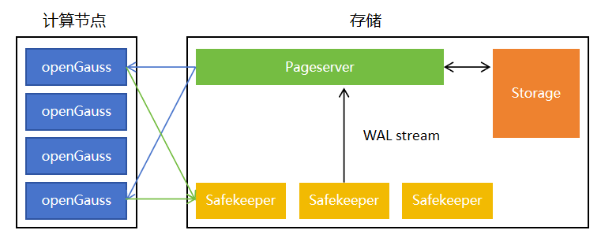

# 数据分支架构

## 一、架构概述

数据分支基于存储计算分离架构实现。openGauss Compute 负责 SQL 解析、优化、执行、事务处理和 WAL 生成；Neon 存储引擎负责页面存储、WAL 持久化、时间线管理和分支管理。

传统数据库创建分支通常需要复制完整数据目录，数据量越大，复制成本越高。数据分支将数据库状态抽象为 Tenant、Timeline、Branch 和 LSN 等对象。新分支从已有 Timeline 的某个 LSN 派生，分叉点之前的数据可以共享，分叉点之后的写入进入各自 Timeline，从而实现低成本分支创建和分支间写入隔离。

整体架构中，Compute 不保存完整数据文件。Compute 执行 SQL 时，如果需要读取本地缓存中不存在的数据页，会向 Pageserver 请求指定 Tenant、Timeline 和 LSN 下的页面版本；写入产生的 WAL 会先进入 Safekeeper，由 Safekeeper 保证日志可靠保存，再由 Pageserver 消费 WAL 并构建新的页面版本。

## 二、整体架构图

## 三、核心组件

### 1. openGauss Compute

openGauss Compute 是计算层组件，对外提供 SQL 连接入口，负责查询执行、事务处理、DML/DDL 执行和 WAL 生成。

Compute 运行时会维护必要的本地缓存，但不保存完整数据库数据文件。当执行查询需要访问某个数据页时，Compute 会先查询本地缓存；如果缓存缺页，则向 Pageserver 请求对应页面。执行写入时，Compute 生成 WAL，并将 WAL 发送到 Safekeeper。

### 2. compute_ctl

`compute_ctl` 是 Compute 的启动控制器，负责读取 Endpoint 配置，生成 openGauss 启动所需参数，并将 Tenant、Timeline、Pageserver、Safekeeper 等信息注入 Compute。

通过 `compute_ctl`，一个 Compute 可以绑定到指定 Timeline。创建分支后，可以为新 Timeline 启动新的 Compute，使用户通过不同连接端口访问不同分支。

### 3. Pageserver

Pageserver 是页面服务核心组件，负责管理 Tenant、Timeline、Branch 和页面版本。

Pageserver 消费 WAL 后，会根据日志内容构建新的页面版本，并将页面数据组织为可持久化的层文件。读取请求到来时，Pageserver 根据请求中的 Tenant、Timeline 和 LSN 定位页面版本，并返回给 Compute。

数据分支能力主要由 Pageserver 的 Timeline 管理能力支撑。新分支创建时，Pageserver 基于源 Timeline 的指定 LSN 创建新的 Timeline。新 Timeline 共享分叉点之前的数据，分叉点之后的写入只影响自身 Timeline。

### 4. Safekeeper

Safekeeper 是 WAL 持久化组件，负责接收 Compute 产生的 WAL，并在 Pageserver 消费 WAL 前保证日志可靠保存。

在多副本形态下，Safekeeper 可以提供更高的 WAL 可用性。Compute 写入提交过程中，会依赖 Safekeeper 的确认来保证 WAL 已可靠保存。Pageserver 后续从 WAL 中构建页面版本，使数据页状态持续向前推进。

### 5. Storage Broker

Storage Broker 是存储组件之间的服务发现组件，负责维护 Pageserver、Safekeeper 等存储侧组件的地址和状态信息。

Pageserver 与 Safekeeper 可以通过 Storage Broker 获取彼此的可达信息，减少组件之间的静态配置依赖。

### 6. Storage Controller

Storage Controller 是存储控制面组件，负责管理存储拓扑、节点状态和 Tenant/Timeline 元信息。

Storage Controller 可以协调 Pageserver 的状态管理、Tenant 位置管理和 Timeline 相关操作。它不直接执行 SQL，也不直接处理用户数据页，而是负责控制面元信息和调度相关能力。

### 7. Storage Controller DB

Storage Controller DB 是 Storage Controller 的元数据库，用于保存控制面状态、节点信息以及 Tenant/Timeline 相关元信息。

该组件服务于控制面，不参与用户 SQL 执行路径。

### 8. Endpoint Storage

Endpoint Storage 用于保存 Endpoint 启动配置和运行所需元信息。`compute_ctl` 启动 Compute 时，可以从 Endpoint 配置中获取绑定的 Tenant、Timeline、连接地址、启动参数等信息。

Endpoint 将“一个可连接的计算节点”与“一个具体 Timeline”关联起来。用户访问不同 Endpoint，即可访问不同数据分支。

### 10. 存储后端

存储后端负责保存 Pageserver 持久化数据，包括 Timeline layer、页面版本、分支历史数据和归档数据。

在本地运行环境中，存储后端可以是本地文件系统；在更大规模场景中，也可以扩展为远端存储。无论底层介质如何变化，Pageserver 对上提供的仍是按 Tenant、Timeline 和 LSN 访问页面的统一接口。

## 四、核心概念

### 1. Tenant

Tenant 是租户隔离单元。不同 Tenant 的数据、Timeline 和 Branch 相互隔离。

### 2. Timeline

Timeline 表示一条数据库状态演进时间线。数据库的写入会产生 WAL，Timeline 随着 WAL 回放不断推进。

### 3. Branch

Branch 是从已有 Timeline 的某个 LSN 派生出的新 Timeline。Branch 创建后，分叉点之前的数据与源 Timeline 共享，分叉点之后的写入进入新 Timeline。

### 4. Endpoint

Endpoint 表示一个可连接的计算节点实例。每个 Endpoint 会绑定到一个 Tenant 和一个 Timeline，用户通过 Endpoint 访问对应分支的数据状态。

## 五、启动流程

数据分支系统启动时，各组件按控制面、存储面、计算面的顺序完成初始化。

1. 初始化本地运行目录和基础配置。
2. 启动 Storage Broker，提供存储组件服务发现能力。
3. 启动 Storage Controller 和 Storage Controller DB，准备控制面元信息。
4. 启动 Pageserver，加载或初始化 Tenant/Timeline 相关状态。
5. 启动 Safekeeper，准备接收 Compute 产生的 WAL。
6. 创建 Tenant 和 Main Timeline。
7. 创建 Endpoint，并将其绑定到指定 Timeline。
8. `compute_ctl` 读取 Endpoint 配置，启动 openGauss Compute。
9. Compute 连接 Pageserver 和 Safekeeper，对外提供 SQL 服务。

## 六、写入数据流

写入路径以 WAL 为核心，保证页面状态可以由日志持续构建。

1. Client 连接 openGauss Compute 并发送 SQL。
2. Compute 执行 SQL，完成事务处理和数据修改。
3. Compute 生成 WAL。
4. WAL 写入 Safekeeper。
5. Safekeeper 对 WAL 进行可靠保存，并向 Compute 返回确认。
6. Pageserver 消费 Safekeeper 中的 WAL。
7. Pageserver 回放 WAL，生成新的页面版本。
8. 当前 Timeline 的可见状态向前推进。

## 七、读取数据流

读取路径以页面按需获取为核心，Compute 不需要保存完整数据文件。

1. Client 连接 openGauss Compute 并发送查询。
2. Compute 根据执行计划访问所需页面。
3. Compute 优先查询本地缓存。
4. 如果缓存缺页，Compute 通过 Neon Extension 向 Pageserver 请求页面。
5. Pageserver 根据 Tenant、Timeline 和 LSN 定位页面版本。
6. Pageserver 返回页面给 Compute。
7. Compute 完成 SQL 执行，并将结果返回给 Client。

## 八、创建分支数据流

创建分支本质上是从已有 Timeline 的某个 LSN 创建新的 Timeline。

1. 用户指定源分支和创建位置。
2. Pageserver 确定源 Timeline 和分叉点 LSN。
3. Pageserver 创建新的 Timeline，并记录其父 Timeline 和分叉点。
4. 新 Timeline 共享父 Timeline 在分叉点之前的数据。
5. 创建新的 Endpoint，并将该 Endpoint 绑定到新 Timeline。
6. 新 Endpoint 启动后，用户即可连接并访问新分支。
7. 新分支后续写入只推进自身 Timeline，不影响父分支。

## 九、端口号占用表

以下端口为本地源码运行时的常见默认端口，实际端口可通过启动参数或配置文件调整。

| 组件 | 默认端口 | 用途 |
| --- | --- | --- |
| openGauss Compute | `55432` | SQL 连接 |
| Branch Compute | `55434` 或自定义 | 分支 SQL 连接 |
| Storage Broker | `50051` | 服务发现与组件通信 |
| Pageserver PG 接口 | `6400` 或 `64000` | Compute 请求页面 |
| Pageserver HTTP 接口 | `9898` | 管理 Tenant、Timeline、Branch |
| Safekeeper WAL 接口 | `5454` | 接收 WAL |
| Safekeeper HTTP 接口 | `7676` | 状态与管理 |
| Storage Controller | `1234` | 存储控制面 API |
| Endpoint Storage | `9993` | Endpoint 元信息服务 |
| Compute 控制接口 | `3080` | Compute 辅助控制接口 |

## 十、架构特点

- 存储计算分离：Compute 负责 SQL 执行，Pageserver 负责页面存储和版本管理。
- 分支创建成本低：新分支不复制完整数据，只记录父 Timeline 和分叉点。
- 历史数据共享：分叉点之前的数据可被多个分支复用。
- 分支写入隔离：分叉点之后的写入进入各自 Timeline。
- WAL 可靠持久化：写入日志先进入 Safekeeper，再由 Pageserver 消费。
- 页面按需加载：Compute 缺页时才向 Pageserver 请求页面。
- Compute 可快速启停：Endpoint 绑定到指定 Timeline 后即可访问对应分支。
- 页面版本统一管理：Pageserver 统一维护多 Timeline 下的数据页版本。
