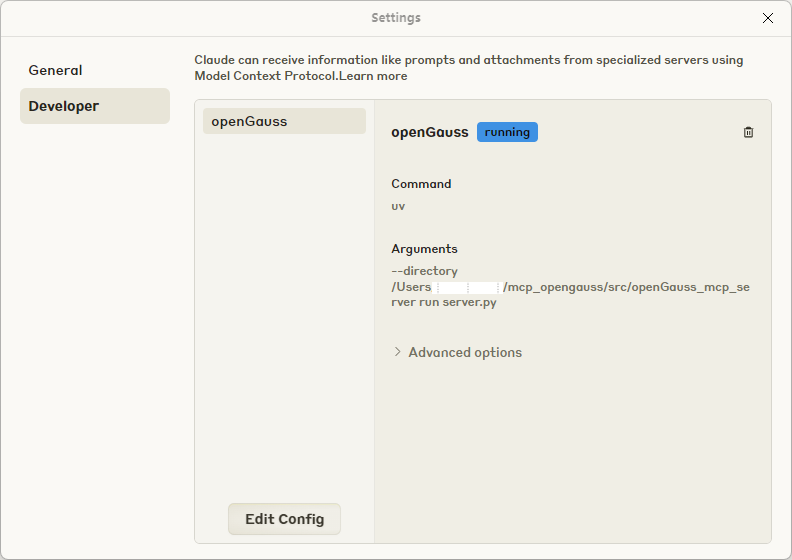
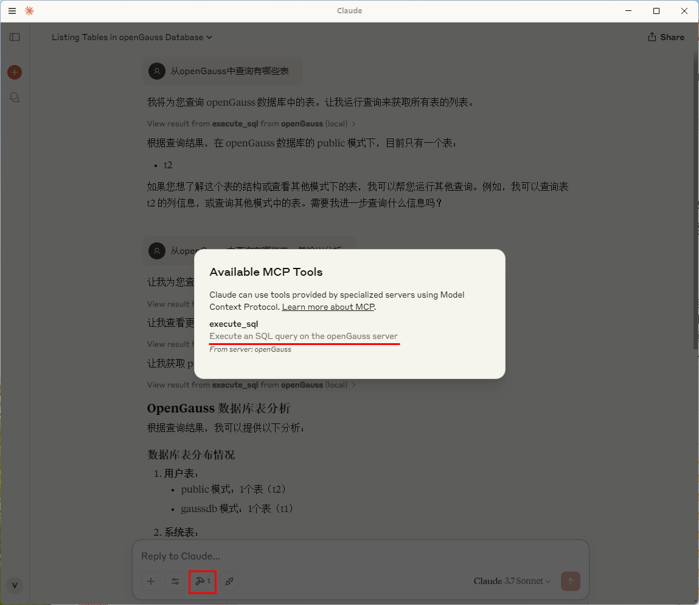
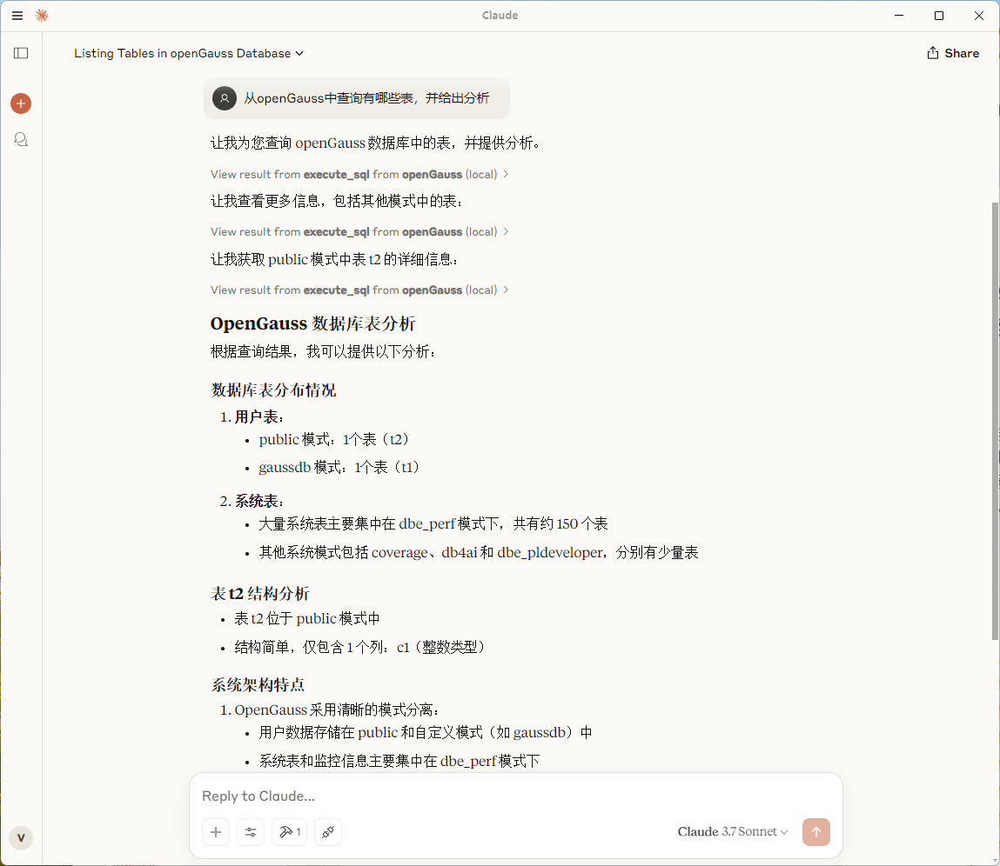
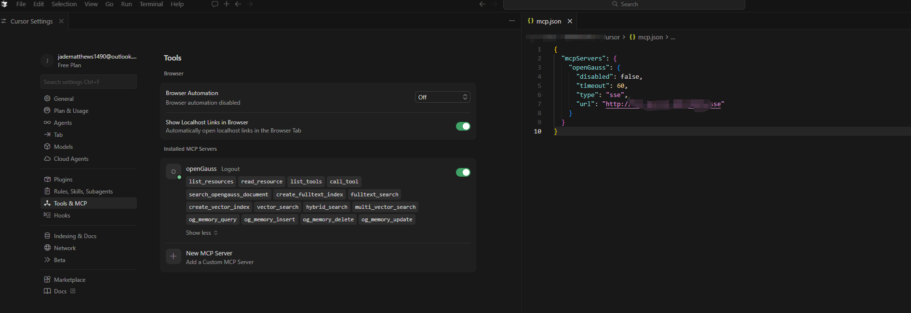
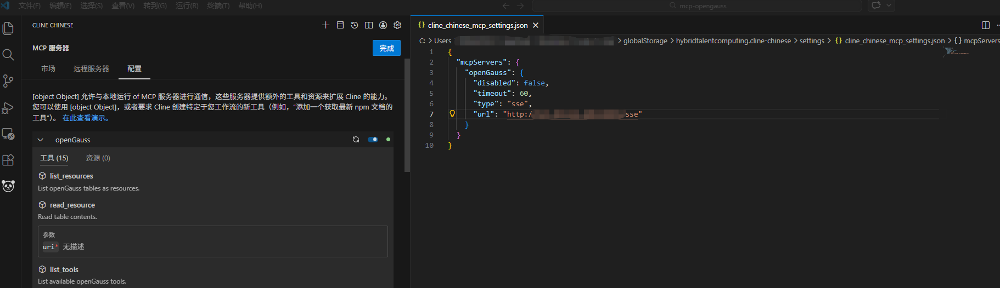
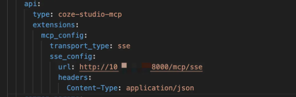

# MCP + openGauss

## 可获得性

本特性自openGauss 7.0.0-RC3 版本开始引入。

## 特性简介

随着AI从静态推理向动态交互演进，智能体（Agent）逐渐成为焦点。Agent不仅能够调用LLM进行推理，还能访问数据库、调用API、执行任务。然而，当前LLM和Agent之间缺乏标准化交互协议, 每个新数据源都需要自定义实现，使得真正互联的系统难以扩展。MCP(Model Context Protocol, 模型上下文协议)解决了这一挑战，MCP是为LLM和Agent系统设计的标准化交互框架，使LLM可以与外部数据库、API和工具进行高效交互。

## 客户价值

MCP适配openGauss数据库让AI智能体能够通过标准化协议安全、高效地直接操作企业级国产数据库，将结构化数据无缝融入AI工作流，大幅降低AI应用与复杂数据系统集成的开发门槛。

## openGauss + MCP + LLM 架构

**图 1**  openGauss + MCP + LLM 架构
<div style="display:flex;justfy-content:center;">
    
</div>

## 快速搭建openGauss + MCP + LLM的AI Agent应用

### 环境准备

- 安装python3环境，安装uv。
- 通过[容器部署](https://docs.opengauss.org/zh/docs/7.0.0-RC1-lite/docs/InstallationGuide/%E5%AE%B9%E5%99%A8%E9%95%9C%E5%83%8F%E5%AE%89%E8%A3%85.html)并启动openGauss数据库。
- 下载Claude Desktop配合MCP协议进行问答操作。

### 获取openGauss_mcp_server源码

访问链接 <https://github.com/vincentsunx/mcp-openGauss.git> 获取openGauss_mcp_server源码，当前版本为（0.1.0）。

### 配置参数
- 打开Claude Desktop设置，编辑配置文件, 设置mcp server启动路径（/src/openGauss_mcp_server)。

**图 2**  Claude Desktop配置页面
<div style="display:flex;justfy-content:center;">
    
</div>

#### Stdio模式

在支持MCP的客户端中，将下面内容填入配置文件，比如在Claude Desktop中可以通过Edit Config增加配置。

```json
{
    "mcpServers": {
        "openGauss": {
            "command": "uv",
            "args": [
            "--directory",
            "path/to/openGauss_mcp_server",
            "run",
            "server.py"
            ],
            "env": {
                "OPENGAUSS_HOST": "localhost",
                "OPENGAUSS_PORT": "8888",
                "OPENGAUSS_USER": "your_username",
                "OPENGAUSS_PASSWORD": "your_password",
                "OPENGAUSS_DBNAME": "your_database",
                "ENABLE_MEMORY": "0"
            }
        }
    }
}
```

#### SSE模式

在SSE模式下，允许多个MCP客户端共享一台服务器，可能是远程服务器，支持HTTP/HTTPS连接。在启动MCP服务前请先配置好相关的环境变量。以下是快速配置的基本步骤。

1）创建配置文件

```bash
cp env_template .env
```

2）配置环境变量

数据库相关配置：

```bash
OPENGAUSS_HOST="localhost"
OPENGAUSS_PORT=your_port
OPENGAUSS_USER="your_username"
OPENGAUSS_DBNAME="your_database"
```

3）配置HTTP/HTTPS连接

如果开启HTTPS连接，则打开HTTPS开关并且设置证书路径：

```bash
# 在 .env 文件中配置
SSL_KEYFILE="certs/server.key"
SSL_CERTFILE="certs/server.crt"
ENABLE_HTTPS="true"
```

如果选择HTTP连接，直接关闭HTTPS开关：

```bash
ENABLE_HTTPS="false"
```

4） 启动服务器

```bash
# 手动加载环境变量
cd mcp-opengauss
source .env
python3 -m src.openGauss_mcp_server.server --transport sse --sse_port <your_port> --sse_host 0.0.0.0
```

MCP服务启动后就可以更新MCP客户端的配置（这里的url如果开启https则使用https协议，没有开启则使用http协议）：

```json
{
  "mcpServers": {
    "openGauss":{
      "type":"sse",
      "url":"https://<yourip>:<yourport>/sse"
        }
  }
}
```

#### Streamable HTTP模式

前面环境变量的配置与SSE模式一致。

启动服务器：

```bash
# 手动加载环境变量
cd mcp-opengauss
source .env
python3 -m src.openGauss_mcp_server.server --transport streamable-http --streamable_http_port <your_port> --streamable_http_host 0.0.0.0
```

MCP客户端配置：

```json
{
  "mcpServers": {
    "openGauss": {
      "type": "streamableHttp",
      "url": "http://<yourip>:<yourport>/mcp"
    }
  }
}
```

### 环境变量详解

#### 1. 数据库连接配置

| 变量名 | 说明 | 默认值 | 必需 |
|--------|------|--------|------|
| `OPENGAUSS_HOST` | openGauss数据库主机地址 | `localhost` | 是 |
| `OPENGAUSS_PORT` | openGauss数据库端口号 | `5432` | 是 |
| `OPENGAUSS_USER` | openGauss数据库用户名 | 无 | 是 |
| `OPENGAUSS_PASSWORD` | openGauss数据库密码，为了提升安全性，openGauss 数据库的密码不建议通过环境变量以明文形式设置。推荐采用交互式输入的方式，避免密码泄露风险。（不设置环境变量会在启动时进行交互式输入） | 无 | 否 |
| `OPENGAUSS_DBNAME` | openGauss数据库名称 |无 | 是 |

#### 2. 记忆系统配置

| 变量名 | 说明 | 默认值 | 必需 |
|--------|------|--------|------|
| `ENABLE_MEMORY` | 记忆系统开关：`1`=启用，`0`=禁用 | `1` | 否 |
| `EMBEDDING_MODEL_PROVIDER` | 嵌入模型提供商，暂时只支持`huggingface`| `huggingface` | 否 |
| `LOCAL_MODEL_DIR` | 本地嵌入模型路径 | `""` | 否 |
| `REMOTE_MODEL_NAME` | 远程嵌入模型名称 | `BAAI/bge-small-en-v1.5` | 否 |

#### 3. HTTPS/SSL配置

| 变量名 | 说明 | 默认值 | 必需 |
|--------|------|--------|------|
| `ENABLE_HTTPS` | 是否启用HTTPS：`true`/`false`、`1`/`0`、`yes`/`no`、`on`/`off` | `true` | 否 |
| `SSL_KEYFILE` | SSL私钥文件路径 | `certs/server.key` | 当HTTPS启用时 |
| `SSL_CERTFILE` | SSL证书文件路径 | `certs/server.crt` | 当HTTPS启用时 |
| `SSL_KEYFILE_PASSWORD` | SSL私钥密码（如果有），不设置环境变量会在启动时进行交互式输入 | `""` | 否 |
| `SSL_CA_CERTS` | SSL CA证书路径 | `""` | 否 |

## openGauss MCP工具特性描述

- 执行SQL语句
- 查询数据库中所有表格
- 查询表格部分内容
- 查询SQL语句的执行计划
- 创建BM25全文索引
- 带标量的全文搜索（暂时只支持BM25全文索引）
- 创建向量索引（支持指定openGauss的任何向量索引）
- 带标量的向量搜索
- 通过全文、向量、标量进行混合搜索（可以设置全文和向量的计分权重）
- 查询openGauss官网文档
- 用户记忆系统（主要是针对用户的个性化信息进行记忆的存储与应用）

## AI服务集成

### 重新启动Claude Desktop

可以看到可用MCP Tool, 执行sql通过openGauss server

**图 3**  Claude Desktop可用MCP Tool
<div style="display:flex;justfy-content:center;">
    
</div>

### 使用Cluade Desktop通过openGauss进行问答

**图 4**  Claude Desktop问答演示
<div style="display:flex;justfy-content:center;">
    
</div>

### 示例

问题一：查看数据库的所有表格。

```sql
tablename,tableowner,schemaname
documents,test2,public
og_mcp_memory,test2,public
test_vectors_5d,test2,public
```

问题二：混合搜索（全文+向量+标量）
对表格test_vectors_5d进行混合搜索，要求全文搜索的权重是0.7，返回参数不需要返回向量列。

```json
{
  "id": 1,
  "title": "Document A",
  "description": "First test document",
  "score": 0.0870114043354988,
  "bm25_norm": 1.0,
  "vector_norm": 1.0,
  "hybrid_score": 1.0
}

{
  "id": 3,
  "title": "Document C",
  "description": "Third test document",
  "score": 0.0870114043354988,
  "bm25_norm": 1.0,
  "vector_norm": 0.9974683567754559,
  "hybrid_score": 0.9992405070326367
}
```

问题三：用户记忆系统 <br>
1）我喜欢吃火锅，平时住在西安。

```text
AI：用户提供了个人偏好信息（喜欢吃火锅，住在杭州），这应该被存储到个人记忆系统中。我需要使用og_memory_insert工具来存储这些信息。
...
```

2）推荐好喝的饮料。

```text
AI：让我先使用og_memory_query工具来查询用户的饮料偏好信息。
...
```

## MCP客户端配置案例

### cursor

**图 5**  cursor mcp客户端配置
<div style="display:flex;justfy-content:center;">
    
</div>


### vscode cline插件

**图 6**  vscode cline插件mcp客户端配置
<div style="display:flex;justfy-content:center;">
    
</div>

### coze

由于coze网页版和coze studio的官方均没有提供可以外接其他mcp server的接口，如需让 Coze 连接自定义 MCP 服务，可以参考[Coze Studio 二次开发（一）支持 MCP Server 静态配置](https://juejin.cn/post/7582808491607261238)的改造方案，对 Coze Studio 进行扩展，实现第三方 MCP Server 的静态配置与远程调用。

代码仓： [coze-studio-plus](https://github.com/yangkun19921001/coze-studio-plus)

mcp插件配置：

<div style="display:flex;justfy-content:center;">
    
</div>

## 特性约束

- MCP（模型上下文协议）作为一个工具层，其核心职责是精确执行用户通过自然语言下达的数据库操作指令。它本身并不具备独立的意识或内容生成能力，因此不会主动输出任何违反安全规范的言论，MCP仅对数据库进行必要的功能性存取操作。<br>
- MCP结合大模型具备对数据库的操作能力，请注意模型理解偏差可能导致的数据误删风险，用户需要对执行命令进行审核，并且建议为数据库连接配置最小必要权限，确保即使指令有误，也无法造成超出预期的破坏。<br>
- 大模型在提供服务时，通常会收集用户的对话数据用于模型训练或服务优化，这可能涉及企业机密、个人隐私等敏感信息的意外暴露。为保障数据隐私，建议对包含敏感数据的场景使用本地部署的大模型，以降低持续分析带来的泄露风险。<br>