# Core 常见问题与解决方法

## **问题1：误删除单机pg_xlog处理恢复**

### 问题描述

2024-05-27，单节点集群分级发布库的pg_xog磁盘空间占用接近100%，数据中心使用一体化脚本打算删除80%的xlog，误导致整个pg_xlog目录全部被删除，数据库宕机。
(pg_xlog磁盘用满未进行定位，一般由归档不成功或者有复制槽未清理，导致xlog不回收)

### 解决方案

先确定暂时没法从系统层面恢复误删除文件，从数据库层面进行恢复。

#### pg_resetxlog

`pg_resetxlog /ogdata/data/dn1 -f`  
[pg_resetxlog](https://docs.opengauss.org/zh/docs/latest/tool_and_commandreference/pg_resetxlog.html)
由于xlog全部删除，使用pg_resetxlog强制重新设置xlog文件，然后拉起数据库，数据库可以正常启动起来。

>[!WARNING]注意
>
>1. 假如近一段时间没有写业务，即可以确保脏页的数据全部落盘，后面重启后也不需要从xlog回放数据，这么做可以保证集群恢复后正常。
>2. 假如正好有写的业务落盘xlog但是还未刷脏，那么就会导致部分数据丢失，出现不一致的问题。（不过对于这种极端场景，能恢复大部分数据也胜过无法修复。）

#### 集群恢复  

集群启动后，由于应用侧一直在链接访问，运行一会后出现数据库coredump

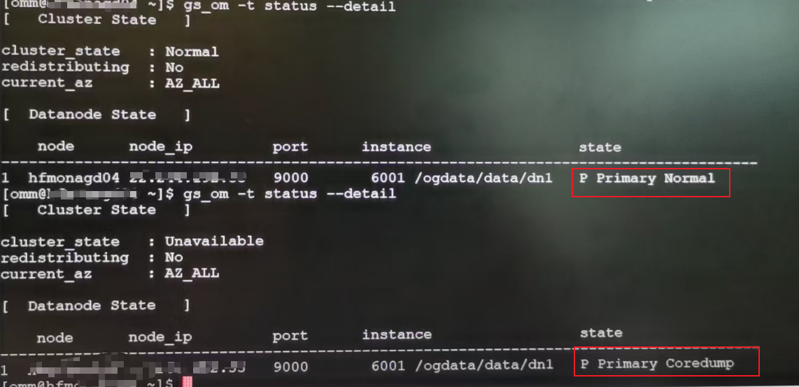

可以看到日志里面有PANIC级别日志：

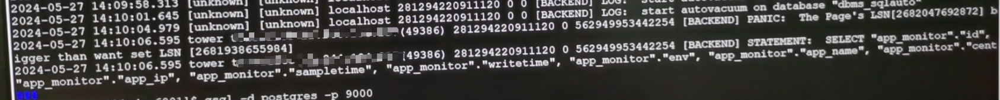

该错误是数据页上的LSN，比正常运行的要大，在有业务访问表的时候直接校验不过core掉。数据页上的没法回滚回去。

STATEMENT打印了访问的表名称，该表是受到影响的，没法正常恢复。
避免频繁数据库core掉，针对出问题的表，重命名下，避免访问就挂掉。
`alter table t1 rename to t1_bak;`

因为有些表保留历史数据，不重要，基于旧表的定义建立新表

```
## 查询表定义，根据表定义建新表
select * from pg_get_tabledef('app_monitor_bak');
新建表遇到有约束（主键、外键、唯一约束）冲突的，删除约束
alter table app_monitor_bak drop constraint app_monitor_pkey;
```

对于新建的表，业务用户权限不够的，可以给业务用户赋予表的所有权限。

#### enable_roach_standby_cluster

以上操作已恢复了集群，下一步考虑如何恢复数据。
由于受到影响的表已经不可查，查询就coredump，考虑在查询时候如何可以关闭校验。
开启 enable_roach_standby_cluster=on，重启数据库进程后，再次查询异常的表，不会产生coredump，而且可以查出来数据。

```
### 然后将受损坏的表数据导入到新建表里面
insert into table_new select * from table_bak;
```

Select该页面大概率是因为触发了heap_prune，进而导致core掉，从代码上看，开启enable_roach_standby_cluster后，可以跳过prune。
该参数未在社区有说明，不建议开启，除非极端情况下；开启后也建议只对表做查询操作，不能做任何更新。最保险的还是开启后导出数据，重建集群导入数据。

heap_page_prune_opt 函数
跳过校验：

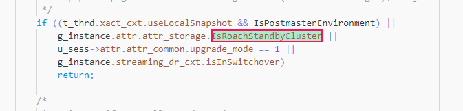

upgrade_mode设置为1，应该也有相同的效果跳过校验。

>[!WARNING]注意
>
>pgxlog目录不要手动删除，清理不掉是有其他原因导致，修复后让数据库自行清理。

## **问题2：主机core掉定位过程**

### 问题描述

定位命令 `addr2line -e bin/gaussdb fbcf8d -C -f`
上午7:47左右，主节点进程突然宕机，未生成core文件。

### 解决方案

查看ffic日志记录：

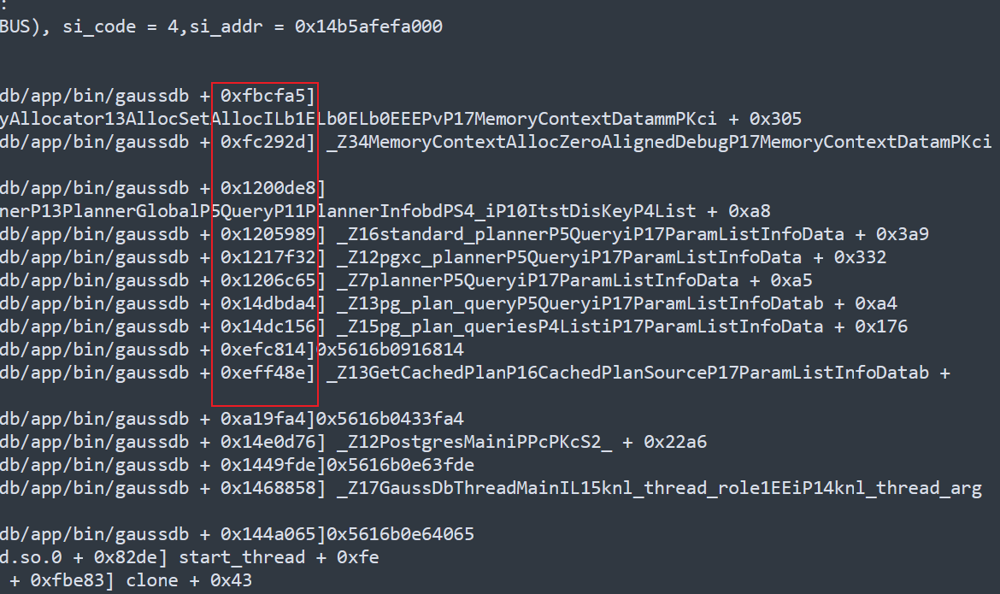

Addr2line可以定位到函数所在行，获取到具体的调用关系：

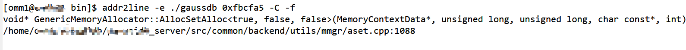
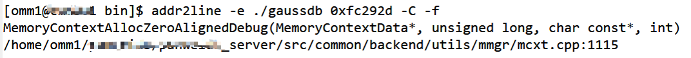
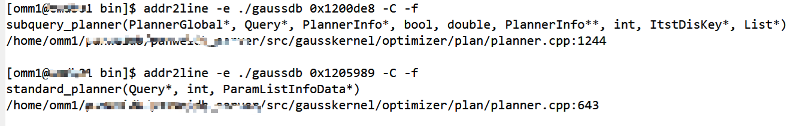

问题出在这一行:

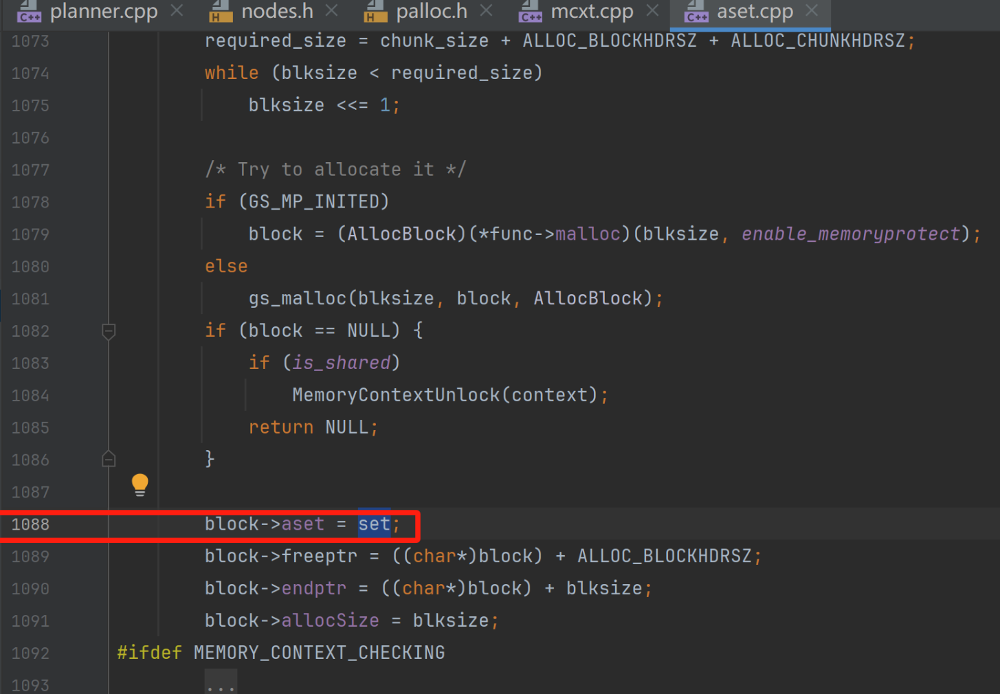

atal signal info: 

`si_signo = 7 (SIGBUS), si_code = 4,si_addr = 0x14b5afefa000`
这个错误信息表示程序在访问内存时发生了总线错误（SIGBUS）。

- si_signo 是信号编号，这里表示接收到的信号是 SIGBUS，总线错误信号。
- si_code 是信号代码，表示具体的错误类型。在这种情况下，si_code = 4 通常表示试图    访问未对齐的内存地址或者访问硬件上不存在的物理内存地址。
- si_addr 是导致错误的内存地址，这里表示在访问地址 0x14b5afefa000 时发生了总线错误。
- RAX = 0x000014b5afefa000

dmesg -T 查看当时有硬件异常，正好对应于core堆栈的地址：目前认为是内存异常导致。

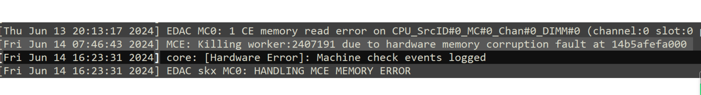
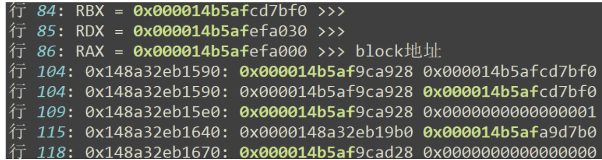
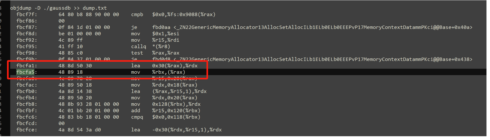
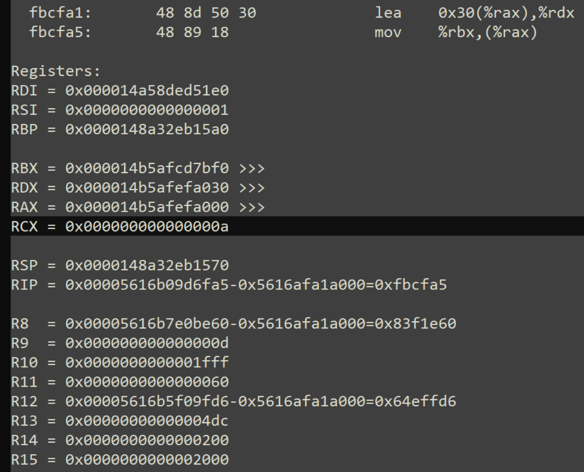

## **问题3：某客户业务版本定时任务开启后数据库异常分析**

### 问题描述

501版本B库下创建定时任务导致数据库异常退出，重新拉起库，数据库进程很快退出
`gsql (openGauss 5.0.1 build 98ae973e) compiled at 2024-06-27 14:56:02 commit 0 last mr`

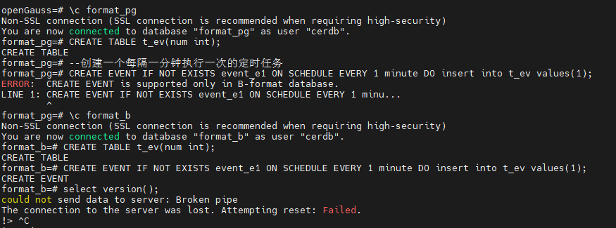
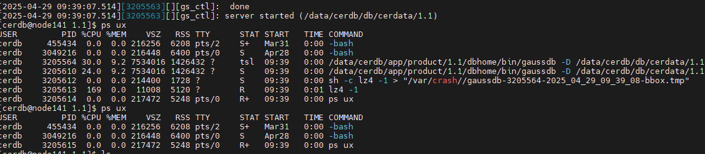

相关堆栈如下：

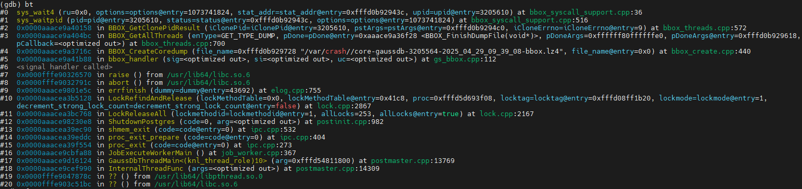

相关日志如下：

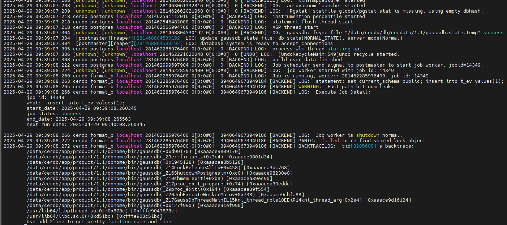

### 根本原因及分析

根本原因及分析见[pr](https://gitee.com/opengauss/openGauss-server/pulls/4861)

### 解决方案

目前采用job_queue_processes=0，不开启定时任务来进行规避：

- 解决方案一：如需开启定时任务，需要升级相关业务库；
- 解决方案二：不升级库的情况下，将定时任务写成脚本的形式来进行规避。

社区openGauss 5.0.2版本无问题：

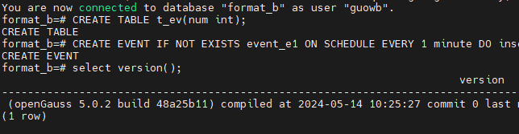

对应社区openGauss 5.0.3版本无问题：

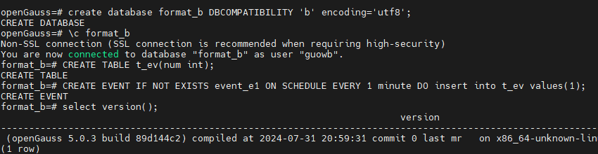

对应社区openGauss 6.0.1版本无问题：

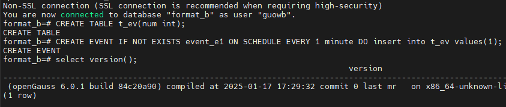

## **问题4：批量插入性能问题初步分析**

### 问题描述

某客户现场测试遇到使用 OCI 批量插入数据性能比 Oracle 慢：

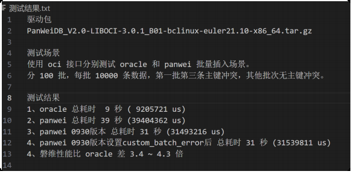

### 问题复现

现场是多线程场景测试，实际上单线程使用批量插入可以复现比 Oracle 慢的问题。

**Oracle 单线程批量插入 1 万行数据**


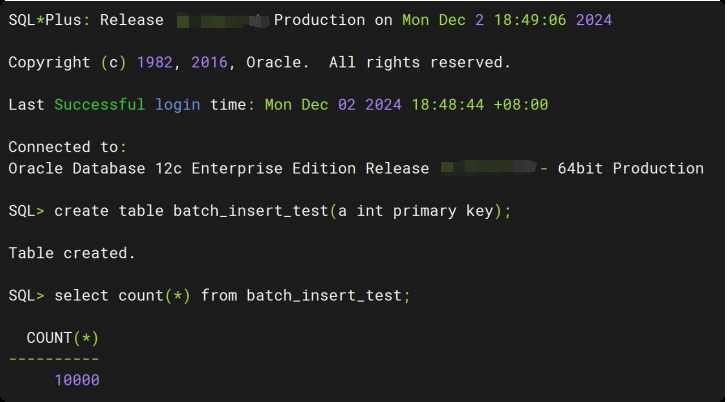

**PanWeiDB 单线程批量插入 1 万行数据**

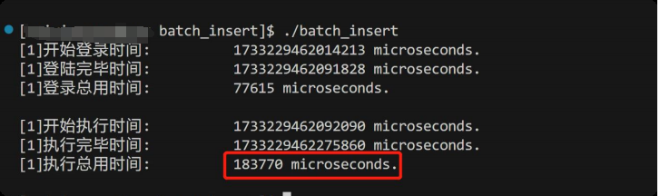
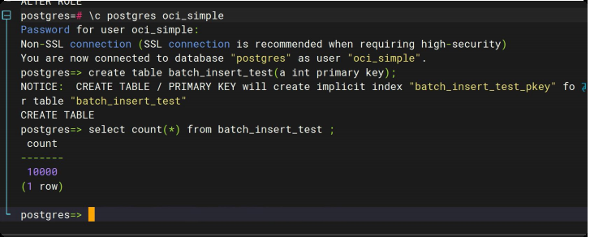

调整如下参数：

```
shared_buffers =64GB // 未调,默认 1G
session_timeout = 0 // 已调，默认 10min
track_activities = off // 已调，默认 on
track_counts = off // 已调，默认 on
enable_stmt_track = off // 已调，默认 on
enable_resource_track = off // 已调，默认 on
use_workload_manager = off // 已调，默认 on
log_min_duration_statement = -1 // 已调，默认 30min
shared_preload_libraries = '' // 已调，默认 security_plugin
enable_memory_limit = off // 已调，默认 on
enable_codegen = off // 默认
enable_bloom_filter = off // 已调，默认 on
enable_global_syscache = off // 已调，默认 on
enable_indexscan_optimization=on // 已调，默认 off
operation_mode = on // 已调，默认 off
enable_opfusion = on // 默认
enable_instr_rt_percentile=off // 已调，默认 on
enable_bitmapscan = off // 已调，默认 on
enable_alarm = off // 已调，默认 on
enable_instr_cpu_timer = off // 已调，默认 on
enable_instr_track_wait = off // 已调，默认 on
enable_page_lsn_check = off // 已调，默认 on
enable_xlog_prune = off // 已调，默认 on
track_sql_count = off // 已调，默认 on
enable_opfusion_reuse = on --> 没有这个参数
wal_buffers =1GB // 未调，默认 16MB
enable_save_datachanged_timestamp=off // 已调，默认 on
```

**性能差距**

Oracle: 54967 微秒
PanWeiDB: 183770 微秒
即，183770/54967 ≈ 3.34 倍

**火焰图抓取**

测试机火焰图
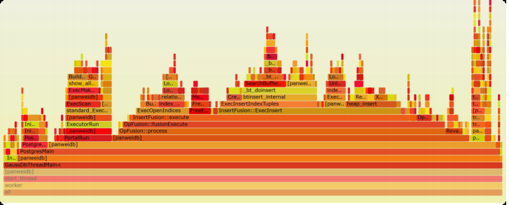

### 附录

复现测试程序
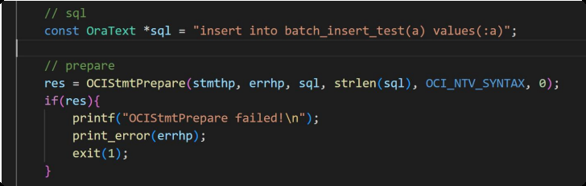
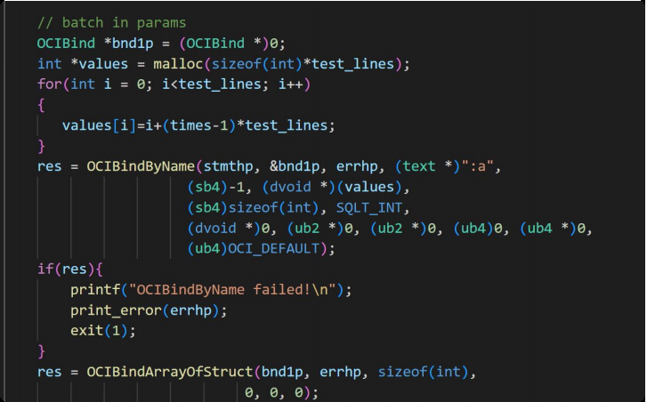
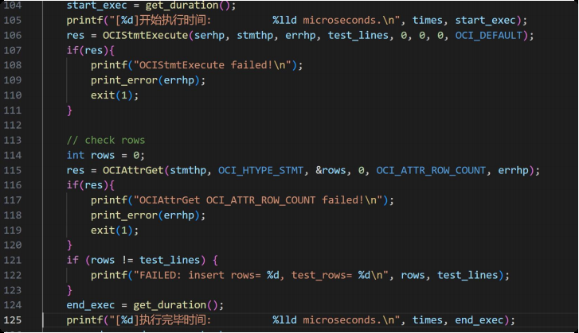

## **问题5：某客户alter table .. after core问题故障报告**

### 问题描述

观察到数据库集群主从之间频繁切换，并且产生了core文件。在集群状态异常前，数据库进行了表结构变更操作，其中变更涉及了alter table ... after语法。
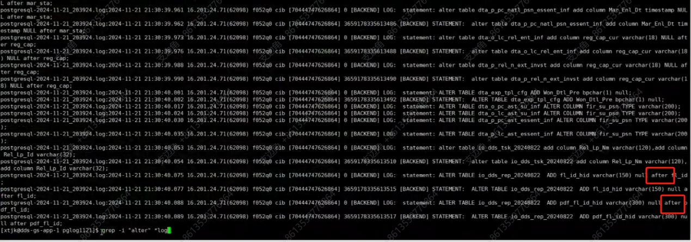
数据库版本：openGauss 5.0.0

### 问题分析定位过程

1. 根据现象描述，高度疑似某个5.0.0版本已知的bug，该bug由alter table ... after|first语法引入，在5.0.2版本中修改解决。该bug具体表现为使用上述语法后，未更新统计信息前，查询表会偶现core问题。
2. 已知上述bug的产生原理是alter table after后，pg_statistic(记录统计信息的系统表)未更新但是pg_attrribute(记录库内表字段属性的系统表)已更新，两者产生差异从而导致的core，因此规避方法为analyze table，更新统计信息即可。顾试用此方法，将所有涉及到alter table ..after 操作的表，全部进行了analyze操作。进行该操作后，问题未复现，基本证明是该bug引起。
3. 由于产生了core堆栈，我们最终通过core堆栈再双重确认下问题是否由该bug引起。

这里我们在core堆栈中主要确认两个问题：

    1. core堆栈里执行的sql是否涉及相关表执行过 alter table ... after操作

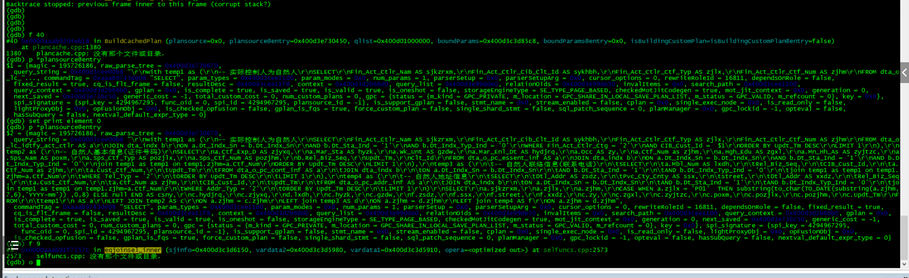

        对比Sql中涉及的表以及当晚做过analyze的表，发现sql中的部分表在当晚进行过alter table .. after操作。

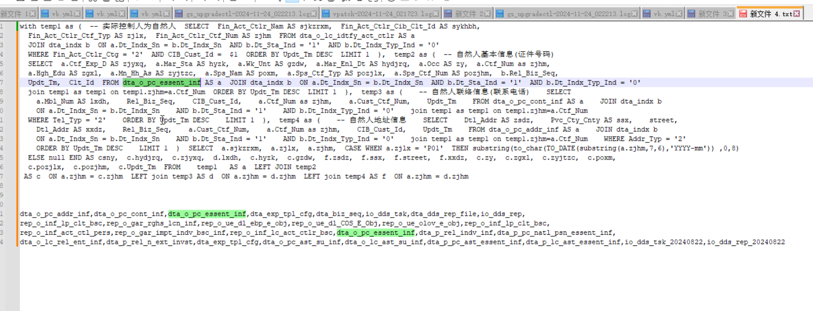

    2. 打印core堆栈中涉及查询的字段在统计信息表中的属性：

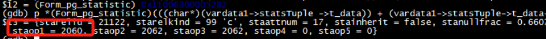

        该操作符2060在pg_operator中对应的是timestamp类型的操作符。

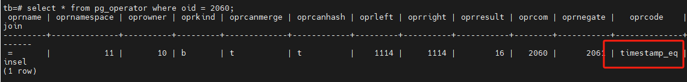

        而实际查询是text。因此可以确认是由于统计信息异常导致的问题。

4. 最终得到如下结论：

本问题为已知问题：[issue=I8SZS3](https://e.gitee.com/opengaussorg/dashboard?issue=I8SZS3)，由于是社区内部提单，外部人员无权限访问，对应issue截图如下：

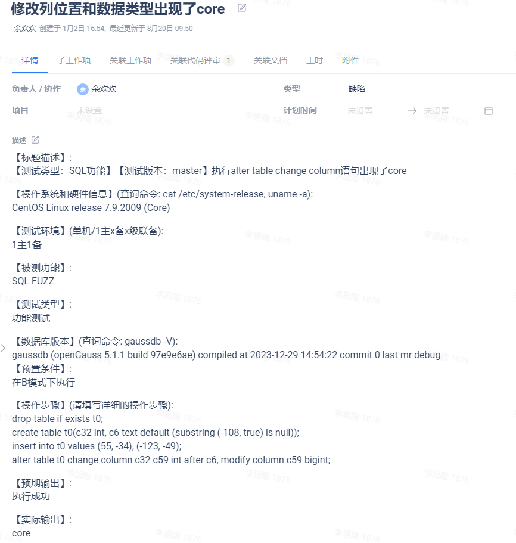

修改pr如下：[pr](https://gitee.com/opengauss/openGauss-server/pulls/4694)
问题修改的版本为openGauss 5.0.2

### 问题根因

使用`alter table ... add/modify/change ... first/after`语法进行指定位置增加/更新列时，会使目标表在pg_attribute中的列序号重新排列，但代码中未更新目标表在pg_statistic中的列序号，导致pg_attribute中的列序号与pg_statistic对应的列序号不一致。
在查询优化过程中，会按照pg_attribute中的列序号到pg_statistic获取对应列的统计信息元组，此时会获取到错误的统计信息元组，在后续的处理中会按照pg_attribute中的列数据类型进行数据解析、内存申请/释放等操作，从而引起宕机。（例如使用text类型的方法解析日期数据类型即会宕机）

### 规避方案

问题存在版本：openGauss 5.0.0，openGauss 5.0.1:

1. 尽量避免使用first | after语法进行表结构的变更，不使用改语法时不会出现上述问题;
2. 如业务侧一定要使用，应在使用上述语法后，立即对涉及的该ddl的表执行analyze table的操作。
    >[!WARNING]注意
    >该方法存在一定风险，因为analyze操作是不锁表的，在没有执行完成时，可能会执行查询，同样存在宕机风险。

## **问题6：某客户在线数据库core问题分析**

### 问题描述

- 2026.04.14：有2套集群从mysql迁移到openGauss 5.0.1版本，2026.04.14发生主机切换的告警。
- 2026.04.14：2套集群先从mysql全量迁移到openGauss，迁移过程无问题，而后开启增量迁移。
- 2026.04.15 08:54：集群1发生主备切换操作。
- 2026.04.15 16:54：集群2(emp一套)，发生主备切换的操作。

经查询系统相关信息，均是源主机产生coredump导致宕机，由CM选择备机升主。两者均产生core文件且堆栈一致。

### 定位过程

1. 解core文件，core在了datum2autoinc函数（属于seq自增序列）

    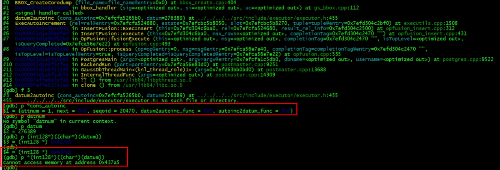

    `cons_autoinc->datum2autoinc_func`为空，会走到最有一个分支，该分支实际执行地址没有值。
    本地调试正常的操作，应该走到 `cons_autoinc->datum2autoinc_func != NULL` 的分支里面。怀疑可能是钩子函数的问题。

    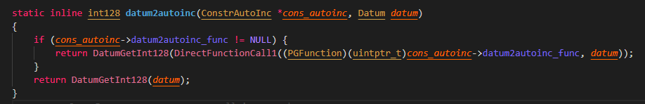

2. 打印coredump时候的sql，为 insert 语句。手动将语句在数据库实际执行，执行结果正常，未出现core问题。（说明不是数据类型等引起的，否则会是必现问题）

    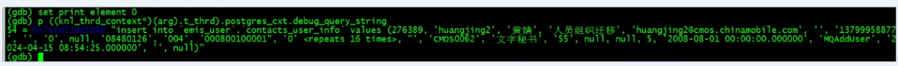

3. 查看序列信息，也都在范围内，未越界。

    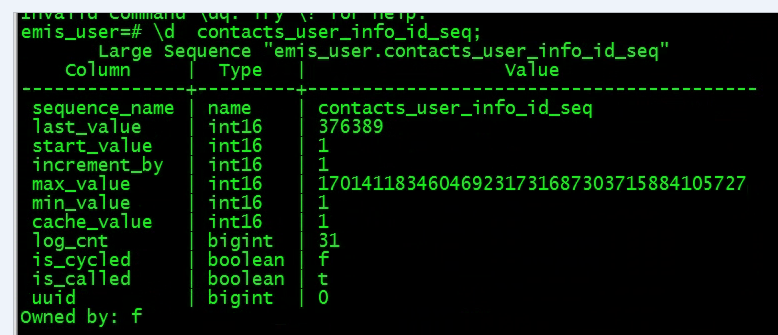

4. 第二套集群同样的core堆栈，也是插入seq导致core掉。

### 问题原因

钩子函数为空，在钩子函数的赋值、设置以及获取方面可能有问题。
问题的分析和修复过程见PR：
[PR](https://gitee.com/opengauss/openGauss-server/pulls/4849) 

1. 在开启globalsyscache后，系统表信息会记录到globalcache中。
2. Autovacuum不加载dolphin插件。当autovacuum woker清理该表时候，构建时候会将钩子函数cons_autoinc->datum2autoinc_func置为NULL，但是由于xmin未推进等原因不会真正清理。但是globalsyscache中的钩子函数已经被置为NULL。
3. 客户端的会话线程在访问表时候，会构建以及初始化钩子函数，但是从localcache找，找不到然后会去globalcache找，会在globalcache中找到现成的需要的表数据结构信息。但是该结构中，由于autovacuum清理到了钩子函数，导致客户端会话也无法找到该函数，走到非预期分支产生coredump。

该问题在5.0.2以及6.0.0RC1以上版本修复。

### 规避措施

- **概况：**
该问题是由于开启globalcache后，客户端backend线程和autovacuum都会查找以及设置globalcache里面表结构信息，出现冲突问题导致。
- **规避措施：**
可以通过关闭globalcache来规避，各个backend线程使用自身的localcache，互不影响。

- **LocalCache说明：**
Localsyscache中存放系统表以及业务表结构元数据。 当一个新的会话链接访问表时候，会先从localsyscache中看其是否存在，如果不存在则走打开表流程，读取到数据后会缓存在localsyscache中。这个会话如果是一个长链接，那么localcache会缓存会话中所有访问到的表结构信息。每个session都会做同样的操作，session级别缓存。

- **GlobalCache说明：**
如上localcache是session级别缓存，那么多个session可能都会打开和缓存同样的表结构数据。这样会导致重复数据占用内存。
引入globalsyscache后，会将表结构数据缓存到globalcache中，新的会话访问表时候，先从localcache找，找不到则去globalcache找，globalcache找不到则从本地打开，这样节省了多个session的cache占用，也能从globalcache内存拿数据，比磁盘读要快一些。

- **关闭globalcache带来的影响：**
新会话从globalcache读数据，比从磁盘读取性能上要快一些。（仅读取表结构）
如果会话是长链接，只要长链接不断开，那么该会话localcache一直会保存所打开的表结构信息，性能不会比globalcache慢上多少。
需要确认：
local_syscache_threshold 配置是否够用，避免local_syscache_threshold缓存达到上限频繁进行置换。
可以通过`select * from gs_session_memory_detail where sesstype = 'postgres' order by usedsize limit 10;`来确定。

### 复现验证

- **数据库版本：**
5.0.1
- **用例：**
参考[ISSUES I90JHX](https://gitee.com/opengauss/openGauss-server/issues/I90JHX?from=project-issue)，表包含自增序列，进行增删改查操作。
- **并发数：**
用例启动100并发执行
- **数据库配置：**
autovacuum_naptime=10s 每隔10s执行一次autovacuum

    - 场景一：开启globalcache (enable_global_syscache=on)
运行10s左右，数据库core掉

    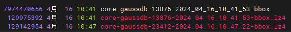

    解core文件报错在在钩子函数为空

    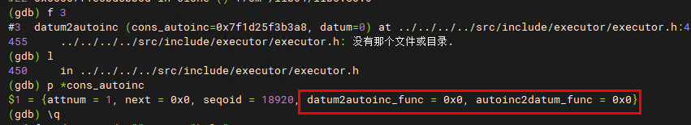

    - 场景二：关闭globalcache (enable_global_syscache=off)
运行30min数据库进程正常。

    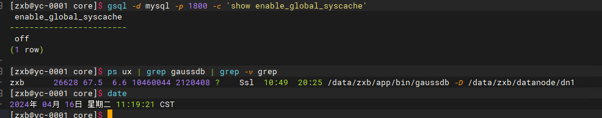
