# 基础安装常见问题与解决方法

## **问题1：6.0.0版本扩容失败**

### 问题描述

6.0.0版本数据库，进行扩容，扩容执行失败。

### 问题定位

#### 节点ip对应多个hostname

1. 扩容失败报错如下：

    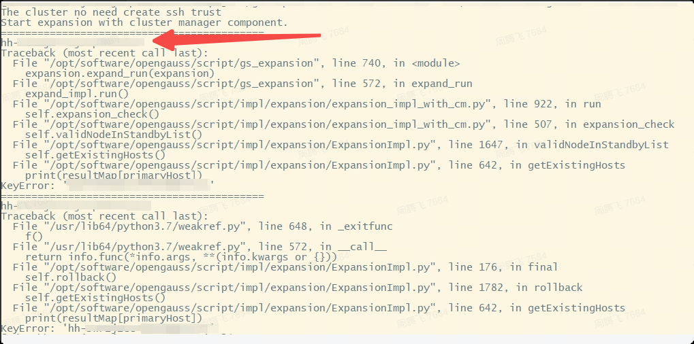

    根据报错信息查看代码，在相应位置添加日志打印，发现是ip和hostname的映射有问题，因此在通过
    ssh远程执行命令时报错。
    如果也是使用6.0.0版本的用户，可以排查一下是否也需要修改，查看是否也存在该问题。（该问题一般
    是由于在一台服务器上起了多了业务，除了数据库外。有其他业务也创建了互信，但是记录的ip
    hostname与数据库记录的不同导致），通过查看文件即可确认，如下所示：

    ```sh
    cat /etc/hosts
    ```

2. 查看社区OM仓，发现已经有相关的修改pr：

    [pr-954](https://gitee.com/opengauss/openGauss-OM/pulls/954)

    [pr-969](https://gitee.com/opengauss/openGauss-OM/pulls/969)

3. 通过git工具将修改apply到6.0.0LTS版本中。

4. 编译OM

    ```sh
    cd openGauss-OM
    sh build.sh -3rd /xxxxxx/binarylibs  ## 路径为3方库路径，3方库可在openGauss-server的readme中找到编译好的报就在package目录下面
    ```

5. 两种场景下进行本地验证。

    1. 已安装的环境，替换OM包验证：

        - 下载官网安装包安装1主2备环境
        192.168.0.19/20/21 
        - 缩容21节点，成功
        - 修改/etc/hosts文件，是192.168.0.21对应多个hostanme，改为
        - 清理21节点数据库
        5- 在19节点执行扩容，预期应该失败
        结果：失败
        - 修改om代码，重新编译，并且替换OM安装包
        替换OM的两个文件，重新解压om包，解压之后会自动覆盖之前的script目录
        - 拷贝xml文件（原来的xml不要删），清理掉删除21节点信息
        在主节点重新执行preinstall，-X指定的为新的xml文件。通过preinstall将之前安装的OM脚本替换掉
        结果：执行成功
        - 执行扩容，执行成功
    2. 重新安装：只需替换掉安装包中OM包，安装之后进行扩容测试即可。

6. 验证无问题之后发给客户。

#### bclinux系统安装openGauss失败

安装包发给客户之后，客户环境进行验证，客户反映执行安装仍然失败。

1. 报错如下：

    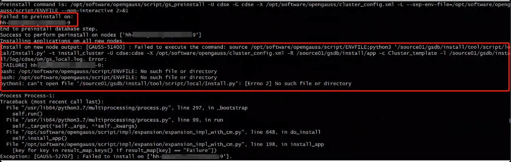

    问题如下：
    在扩容节点上找不到文件ENVFILE；
    扩容节点执行预安装gs_preinstall失败。

2. 问题定位：

    - 在扩容节点上找不到文件ENVFILE问题：

    1. 首先查看预安装命令以及报错的路径是否正常，常看之后无异常。
    2. 查看代码发现，在预安装失败后，失败节点会自动清理环境变量问题，所以该报错是预安装失败导致。

    - 预安装失败问题

    1. 根据图中报错，会将结果重定向到gs_local.log日志中，查看该日志，未发现异常（主节点日志
    正常，待扩容节点无该日志生成）
    2. 查看gs_expersion扩容工具的日志，在$GAUSSLOG/om路径下，在该日志下发现异常，报
    错：不支持bclinux系统安装。
    3. 之前帮助客户定位过该问题，给客户提供过安装包以及修改方式；咨询客户对接的同事，发现
    安装时是手动改的om脚本，没有把修改同步到安装包里面（之前对接的客户同事离职了，新同事按照文
    档改的）。而在扩容的时候，om工具会向扩容节点将安装包传到扩容节点（不是发送的他们修改后的脚
    本，是发送的安装包），因此确认是该问题导致。
    4. 重新编译OM，将两个问题的修改都同步到6.0.0LTS版本中，验证后发给客户。该问题对应修改
    的pr链接如下：[pr-802](https://gitee.com/opengauss/openGauss-OM/pulls/802)

    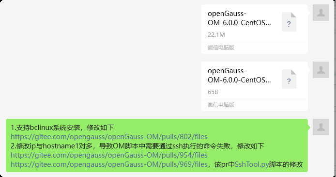

3. 其他问题

    其间还出现了一个问题，缺少.so文件。

    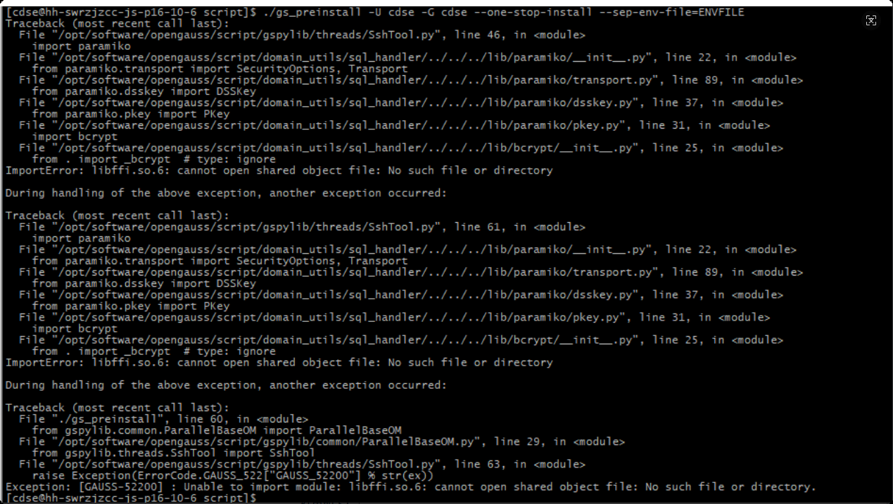

    - 查看是否存在该文件，`find/-namelibffi.so*`。结果如下：

    

    - 该问题为.so文件的版本不一致，查找资料发现libffi.so.7与libffi.so.6兼容，因此可以创建软连接解决。

        `ln-s/usr/lib/libffi.so.7/usr/lib/libffi.so.6`

#### 扩容后扩容节点启动失败问题

客户验证，之前的问题并未报错，但是在最后一步拉起扩容节点的时候，拉起失败。  

1. 报错如下：

    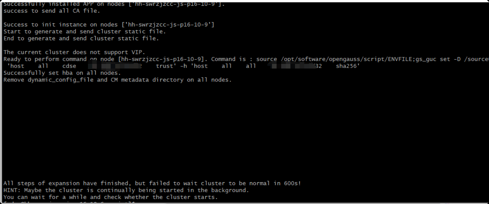

2. 问题定位：

    - 查看数据库状态，如下：

        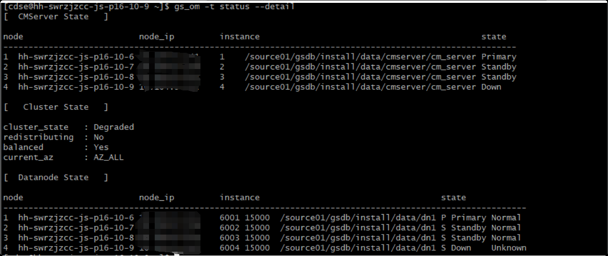

        初步确认该节点cm_server和数据库进程启动都存在问题。

    - 到对应节点上面进行查看`psux`：

        查看该节点进程启动情况，发现cm相关的cm_agent、cm_server、om_monitor进程以及数据库进程都没有，因此需要查看om_monitor日志。

        ```txt
        前情提要：数据库启动顺序如下
        定时任务->om_monitor->cmagent->cm_server、数据库、自定义资源
        （crontab-l查看定位任务无异常，因此需要查看ommonitor日志）
        ```

        om_monitor日志中找到报错（如下图），发现是设置打开的最大句柄数不够，最小需要640000：

        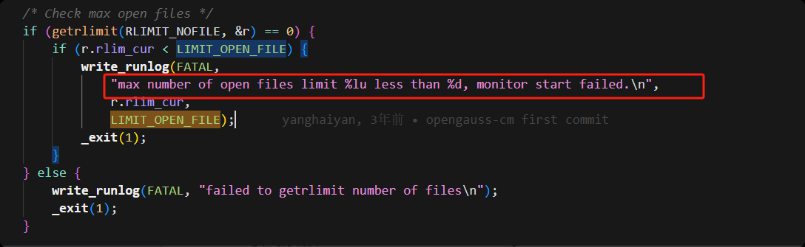

        查看命令`ulimit-n`或`ulimit-a`。

### 解决方案

修改`/etc/security/limits.conf`文件，进行配置。

```
omm   soft   as  unlimited 
omm   hard   as  unlimited 
omm   soft   nproc unlimited
omm   hard   nproc unlimited
```

修改之后，该节点会自动拉起（需要等待一段时间，定时任务1分钟一次拉起om_monitor）问题解决。

## **问题2：centos8版本安装适配**


### 背景描述

centos8从2021年年底开始停服，openGauss并未给centos8做安装适配。 但是存在部分客户仍然使用centos8以及相应发行版，但是社区发布的镜像不能直接拿来安装，需要单独为centos8出包。

### 安装指导

#### 选型

centos8的内核版本和openssl版本：
更接近于openEuler20.03 （kernel=4.19.10 和 openssl=1.1.1d ）
而 Centos7 下 ， （ kernel=3.10 和 openssl=1.1.0 ） ， 在 centos 上 编 译 的 三 方 库 会 去 找 
libssl.so.1.10导致找不到报错。
因此，适配centos8，使用社区发布的openEuler20.03的Server内核 + 编译适配的OM包

#### OM出包步骤

OM依赖一些三方组件，而这些三方组件依赖openssl，因此需要再centos8系统上重新编译OM
依赖的三方组件。
以5.0.0版本为例：

1. 下载三方库源码：`git clone https://gitee.com/opengauss/openGauss-third_party.git -b 5.0.0`。
2. 安装编译依赖：`yum install python3-devel libffi-devel expect libaio-devel readline-devel -y`。
3. 编译OM依赖的组件：

    在 openGauss-third_party/dependency/build 目录下，有一个 om_build_dependency.sh
    脚本，该脚本里面放着om依赖的组件。
    注释掉该组件里面的openssl，即不编译openssl组件。（我们要用系统的openssl）

    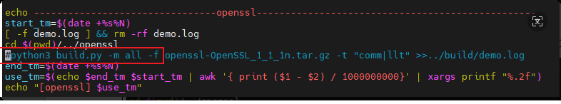

4. 编译三方依赖，编译的结果在源码目录下的 output 下：`sh om_build_dependency.sh`。
5. 三方库挪下二进制（将三方组件编译出来的so二进制，从python版本号的目录下，拷贝到上一级目录。）

    ```sh
    find . -name lib3.6
    for i in `cat filepath`;do echo $i;cp $i/*.so $i/..;done
    ```

    这里是因为适配多个python版本需求，给每个so依赖建立个目录（如python3.6的目录是
    lib3.6）存放，实际使用时候需要挪到上一层目录。（6.0.0版本后OM可以从lib3.6下面找，就不
    需要这一步了。）

    至此，OM依赖的三方组件编译完成。

6. 编译OM包

    下载om代码，OM代码的 script/gs_preinstall 文件删除这个函数（因为这里面校验了so文件的架构和系统是否匹配，但是我们新编的包里面没有这里需要的so文件，因此删除跳过）
    `check_os_and_package_arch`。

    对于script下增加的 scp ssh ssh-* 脚本转换格式。（主要是在安装时候遇到格式不对的报错）

    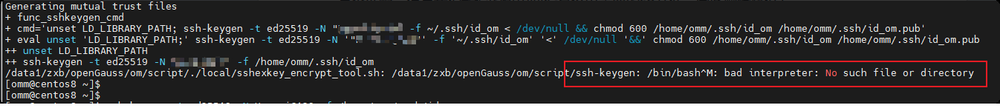

    ```sh
    echo "scp
    ssh
    ssh-add
    ssh-agent
    ssh-copy-id
    ssh-keygen" > sshfiles
    for i in `cat sshfiles`; do sed 's/^M//' $i > tmp_filename;mv -f tmp_filename $i;done;
    for i in `cat sshfiles`; do sed -i 's/\r$//' $i ;done;
    rm sshfiles
    cat -A file 检查下
    ```

    OM 打包

    ```sh
    sh build.sh -3rd /opt/compile/openGauss-third_party/output/
    ```

7. 合并总包:

从社区下载完整的 openEuler20.03得ALL包，把里面的-om.tar.gz -om.sha256删除，将openGauss-OM/package下的包移动进来（OM包名字是否修改没关系，不需要识别），重
新打个ALL总包即可。

#### 其他问题

1. preinstall卡主不动可能是lib有问题，无法import导入。在lib下 python3 -c 'import xxx'进行检查。

    ```sh
    [root@centos8 lib]# find . -name lib3.6
    ./nacl/lib3.6
    ./cryptography/hazmat/bindings/lib3.6
    ./bcrypt/lib3.6
    ```

    里面的so都要拷贝到外一层，即可lib3.6平级。

2. scp等脚本格式不对。

    ```sh
    /data1/zxb/openGauss/om/script/ssh-keygen: /bin/bash^M: bad interpreter: No such 
    file or directory
    /data1/zxb/openGauss/om/script/scp: /bin/bash^M: bad interpreter: No such file or 
    directory
    ```

    这类错误更改下包格式：

    ```sh
    sed 's/^M//' file > tmp_filename;mv -f tmp_filename file
    sed -i 's/\r$//' file
    ```

## **问题3：OM安装后，linux命令报错openssl不兼容**

### 问题描述

在部分系统中，使用 OM 安装完成 openGauss 数据库后，会出现例如 yum install 不可用， 或者 ssh 不可用的问题。

### 问题现象

1. 在 openeuler20.03 系统上，使用 openGauss 3.0.3 之前的版本，OM 安装完成后，切换到 root 下使用 yum 安装组件，会出现如下错误：
`symbol SSLv3_method version OPENSSL_1_1_0 not defined in file libssl.so.1.1 with link time reference`。
2. 在一些高版本系统中，如 centos8 以上。安装完成数据库后，使用 ssh 报错：
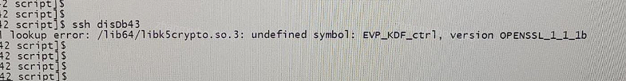

### 问题定位

为了保证兼容和稳定，openGauss 在开源三方库里面引入了 openssl 组件进行管理和维护，这样依赖会导致 openGauss 使用的 openssl 版本和操作系统上自带 openssl 版本的可能存在不兼容的问题。

OM 安装完成后，会再 /etc/profile 里面写入自身的环境变量，如下:

```sh
export GPHOME=/opt/huawei/install/om
export UNPACKPATH=/opt/software/openGauss
export PATH=$PATH:$GPHOME/script/gspylib/pssh/bin:$GPHOME/script
export LD_LIBRARY_PATH=$GPHOME/script/gspylib/clib:$LD_LIBRARY_PATH
export LD_LIBRARY_PATH=$GPHOME/lib:$LD_LIBRARY_PATH
export PYTHONPATH=$GPHOME/lib
export PATH=$PATH:/root/gauss_om/omm/script
```

其中的LD_LIBRARY_PATH会将 openGauss 包中 lib 目录下的 so 库文件优先级提前，在使用如 yum 命令时候，就会优先去加载 openGauss lib 目录下的二级制。

而 openGauss lib 下放着 libssl.so 和 libcrypto.so ，这两个输入 openssl 的库文件。如果此时存在不兼容，那么在使用操作系统工具时候，如果工具依赖了 openssl 的相关不兼容函数，就会报错。

1. 编译选项不同导致不兼容
    symbol SSLv3_method 就是由于编译选项引起的不兼容现象。早起 openGauss-third-party 中的 openssl 在编译时候并未开启 sslv3-method，但是操作系统 yum 所依赖的二进制需要用到 sslv3 相关的函数，就导致报错 sslv3-method symbol not found。
2. 系统上对 openssl 做修改导致接口不兼容
    在 Centos 8 以及相关的发行版中，操作系统自身对 openssl 做了很大的 patch 改动，其中存在对接口函数的增加和删除。 undefined symbol EVP_KDF_ctrl报错就是场景之一。 在原始的 openssl 中具有该函数，但是在 Centos8 系统上却对该函数做了删除。 此时安装了 openGauss 后，在 openGauss 的环境变量下，部分工具必然会出现问题。

### 问题解决

1. 对于 symbol SSLv3_method not found， 可以更新下三方库，在构建 openssl 的时候开启编译选项 enable-ssl3-method。

    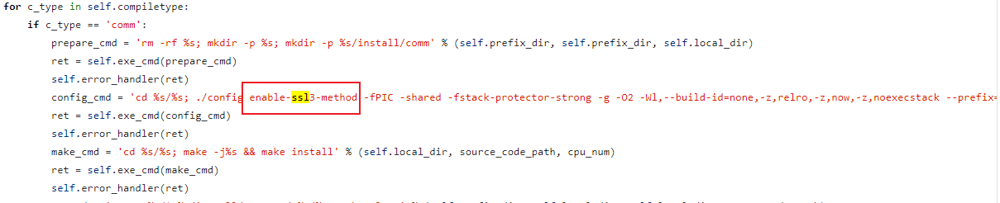

2. 对于 OM 安装过程中出现 undefined symbol EVP_KDF_ctrl 问题，可以把系统上的 libcrypto.so 放到 $TOOL/script/gspylib/clib 替换掉 om 包里面的 lib 文件。
3. 同意对于 OM 安装过程中出现问题的场景，由于 OM 需要依赖一些开源组件如 psutil,paramiko 等，这些组件编译的二进制文件依赖 openssl 进而产生了不兼容问题，可以在操作系统上手动安装如下四个组件:

    ```sh
    psutil
    netifaces
    cryptography
    paramiko
    ```

    然后 OM 安装时候， preinstall 加上 --unused-third-party 即可使用系统的组件替代 OM 包中的组件，进而规避该问题。
    `./gs_preinstall -U xx -G xx -X /xx/single.xml --unused-third-party`
4. 对于在安装后，使用 ssh 工具出现 undefined symbol EVP_KDF_ctrl 问题的场景； 可以再在使用 ssh 之前， 把系统的 lib 库库优先级放到前面，就不会影响 ssh。

    ```sh
    export LD_LABRRRY_PATH=/usr/lib64:$LD_LABRRRY_PATH；ssh ***.***.***.***00 command;
    ```

这个问题由于系统自身对 openssl 做了修改，尤其在 Centos8 上， 删除 openssl 中的函数在 openGauss 中还继续使用，该兼容问题无法解决，只能通过加载环境变量的优先级方式来规避。

## **问题4：preinstall出现pssh相关报错时的解决方法**

### 问题描述

[GAUSS-51222] : Failed to check hostname mapping. Command: "pssh -s -H hostname1 hostname". Error:

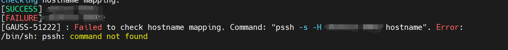

### 解决方法

当出现如上报错时，大概率是因为先前安装过数据库，环境变量存在一定的问题。Pssh的二进制文件保存在openGauss的安装包中链接如下：
`script/gspylib/pssh/bin`。
当出现该问题时，大概率是系统原先就有pssh，或者是om安装出现了未知的bug导致没有正确关联环境变量。
此时我们只需要在root用户下关联环境变量即可，注意需要在所有主备环境下关联环境变量
`Vim /etc/profile` 
Export对应环境变量即可,
关联后发现正常preinstall。

## **问题5：Yat使用安装**

### Yat使用安装

- 环境要求：Java 1.8+,Python 3.6+
- 下载yat：

    ```sh
    git clone https://gitee.com/opengauss/Yat/tree/master/yat-master
    cd Yat/yat-master
    chmod 755 gradlew
    ./gradlew pack
    ```

    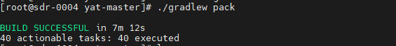

    ```sh
    cd Yat/yat-master/pkg
    ./install -F
    ```

    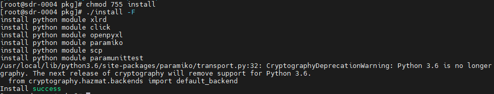

- 生成测试套：yat suite init -d exp-imp-lob

    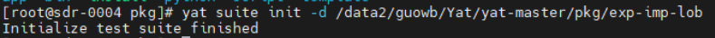

- 初始后的路径如下：

    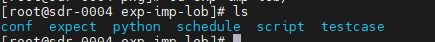

- 编辑conf/nodes.yml,配置测试库信息：数据库创建相关数据库及用户并赋权

    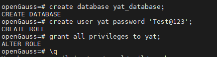
    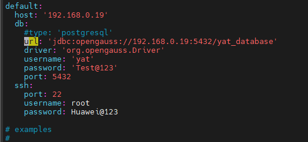

    /usr/local/yat创建lib目录，将驱动放进目录，将驱动设置为755

    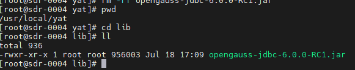

- 拷贝社区相关用例到testcase:

    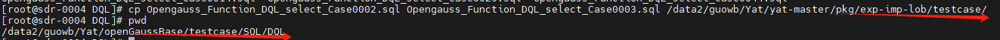

- 拷贝社区相关用例的期望到expect:

    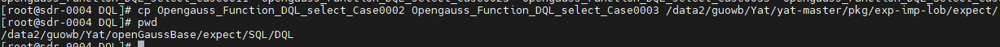

- schedule目录下创建test1.schd,将用例编号放进去，sql用例不带后缀.sql

    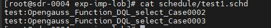

- 执行测试：两个用例通过，说明脚本跟期望是匹配的。

    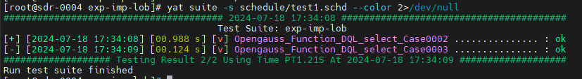

### 常见问题

#### 问题1：打包过慢问题：更换国内镜像网站

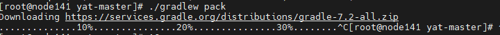

`vim /data/guowb/Yat/yat-master/gradle/wrapper/gradle-wrapper.properties`

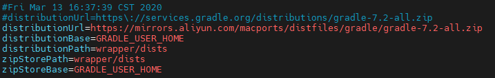

#### 问题2：./gradlew pack报错

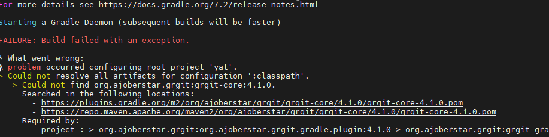

**解决方法：**

备份build.gradle.kts，然后删掉报错行。

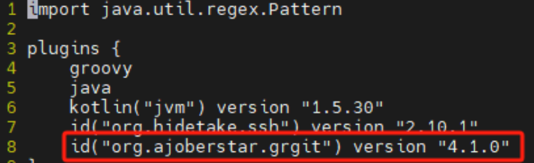

#### 问题3：初始化报错

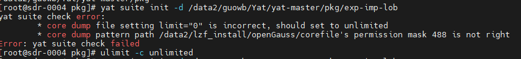

**解决方法：**

```sh
ulimit -c unlimited
chmod 777 corefile
```

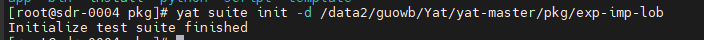

#### 问题4：执行过程中报用例名不合法

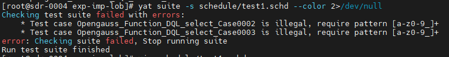

**解决方法：**
`vim conf/configure.yml`将下面一行放开注释。

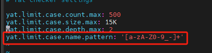

## **问题6：安装时出现Could not create file : Invalid argument报错**

### 问题描述

```sh
creating template1 database in /home/opp/data2/base/1 ... 2024-05-09 06:15:10.730 [unknown] [unknown] localhost 548254040080 0[0:0#0]  [BACKEND] WARNING:  macAddr is 578/2886795268, sysidentifier is 37923857/316241, randomNum is 2360857425
2024-05-09 06:15:10.771 [unknown] [unknown] localhost 548254040080 0[0:0#0]  [DBL_WRT] PANIC:  Could not create file "global/pg_dw_meta": Invalid argument
2024-05-09 06:15:10.771 [unknown] [unknown] localhost 548254040080 0[0:0#0]  [DBL_WRT] BACKTRACELOG:  tid[758]'s backtrace:
        /home/ott/mppdb_temp_install/bin/gaussdb() [0x12c073c]
        /home/ott/mppdb_temp_install/bin/gaussdb(_Z9errfinishiz+0x334) [0x12b7470]
        /home/ott/mppdb_temp_install/bin/gaussdb(_Z14dw_create_filePKc+0xd4) [0x212c8b4]
        /home/ott/mppdb_temp_install/bin/gaussdb(_Z21dw_generate_meta_fileP21st_dw_batch_meta_file+0x20) [0x212af68]
        /home/ott/mppdb_temp_install/bin/gaussdb(_Z12dw_bootstrapv+0xb8) [0x212a6c4]
        /home/ott/mppdb_temp_install/bin/gaussdb(_Z13BootStrapXLOGv+0x16ec) [0x216bd44]
        /home/ott/mppdb_temp_install/bin/gaussdb(_Z20BootStrapProcessMainiPPc+0xae4) [0x143d14c]
        /home/ott/mppdb_temp_install/bin/gaussdb(main+0x5d4) [0x1a45a2c]
        /lib64/libc.so.6(__libc_start_main+0xe0) [0x7fa68bcf60]
        /home/ott/mppdb_temp_install/bin/gaussdb() [0xba53cc]
        Use addr2line to get pretty function name and line

could not write to child process: Broken pipe
```

安装时出现如下错误，主要报错信息为`Could not create file : Invalid argument`

### 问题根因

opengauss源码中，为了提升性能，在读写文件时，使用了IO_DIRECT这一参数，主要功能为，不经过缓存直接通过IO操作读取文件，这里通过这个操作可以减少数据复制和减少内核态和用户态之间的上下文切换次数。
当使用了不支持O_DIRECT的文件系统时，则无法进行数据库的初始化。

### 解决方案

首先我们检测下文件系统是否支持O_DIRECT，执行如下cpp编译的文件即可。

```sh
#include <fcntl.h>
#include <unistd.h>
#include <stdio.h>

int main() {
    int fd = open("testfile", O_RDWR | O_DIRECT);
    if (fd == -1) {
        perror("not support");
        return 1;
    }
    close(fd);
    printf("support");
    return 0;
}

```

> [NOTE]说明
>
> - 只要我们在当前磁盘下可以通过O_DIRECT的方式打开文件，则证明该文件系统是支持。
> - 当不支持时，我们需要更换支持的磁盘目录，或者重新给磁盘安装支持O_DIRECT的文件系统。

## **问题7：安装后启动失败，报错缺少gs_initdb,gaussdb；容器环境下报错illegal instruction时的解决方案**

### 背景描述

在使用官网提供的镜像安装数据库，有时会遇到一些 "非法指令" "illegal instruction" 的问题，或者在一些本地搭建的虚拟机上，数据库启动失败，但是没有很明确的错误信息的问题。 这些往往是由于 CPU 指令集不兼容导致的。

常见的有 3 种：

1. arm CPU 下的 lse 指令
2. x86_64 CPU 下的 rdtscp 指令
3. x86_64 CPU 下的 avx 指令

#### arm CPU 下的 lse 指令

官网发布的 openEuler_arm 包，在编译的时候，打开了ARM_LSE指令集做了编译的优化。但是对于一些其他 arm 服务器，不一定支持。

构建脚本：

```sh
build\script\utils\make_compile.sh

# it may be risk to enable 'ARM_LSE' for all ARM CPU, but we bid our CPUs are not elder than ARMv8.1
```

实测在 鲲鹏 920 和 麒麟 990 的 cpu 芯片下是支持安装的。 cpu 可以通过 lscpu 名称查看。

对于其他不自持该指令的系统，需要去掉 -D__ARM_LSE 指令重新编译即可。

在编译脚本中 build\script\utils\make_compile.sh，删除掉所有的 -D__ARM_LSE ， 重新打包数据库。

```sh
sh build.sh -m release -3rd /sdb/binarylibs -pkg

# -3rd 是对应三方库二进制的目录
```

patch 如下图：

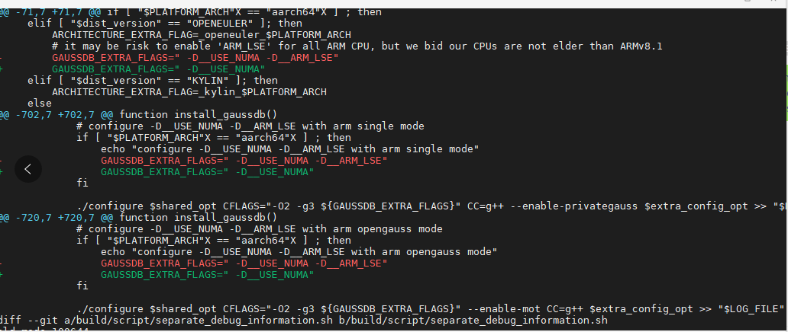

#### x86 服务器下 rdtscp 指令

rdtscp 指令集用来检索 CPU 周期计数器,MOT 特性有用到

在 server 中位置如下： src\gausskernel\storage\mot\core\infra\synchronization\cycles.h

```sh
/**
     * @brief Retrieve the CPU cycle counter using rdtscp instruction
     * @detail Force processor barrier and memory barrier
     * @return The CPU cycle counter value.
     */
    static __inline __attribute__((always_inline)) uint64_t Rdtscp()
    {
#if defined(__GNUC__) && (defined(__x86_64__) || defined(__i386__))
        uint32_t low, high;
        __asm__ __volatile__("rdtscp" : "=a"(low), "=d"(high) : : "%rcx");
        return (((uint64_t)high << 32) | low);
#elif defined(__aarch64__)
        unsigned long cval = 0;
        asm volatile("isb; mrs %0, cntvct_el0" : "=r"(cval) : : "memory");
        return cval;
#else
#error "Unsupported CPU architecture or compiler."
#endif
    }
```
有些自己搭建的虚拟机可能没有这个指令集，导致数据库无法启动。

**检测方法**

使用 lscpu 命令进行检测是否具有该指令集： `lscpu | grep rdtscp`

**解决方法**

如果没有该指令集，需要开启 CPU 直通模式 (host-passthrough)。

#### x86 服务器下 avx 指令

avx 指令集用来进行加速计算，主要是 db4ai 在使用。该指令集从 2.1.0 版本开始引入，如果存在 2.1.0 之前版本可以运行数据库而 2.1.0 之后数据库启动失败，也有可能是没有该指令导致。

**检测方法**

使用 lscpu 命令进行检测是否具有该指令集： `lscpu | grep avx`

**解决方法**

如果没有该指令集，从代码中删掉该指令集的引用，重新打包数据库。

该指令集的引用在 Makefile 里面，可以全局搜索 -mavx , 删掉如下编译选项里面加载-mavx 指令，然后重新打包构建即可。

```sh
ifeq ($(PLATFORM_ARCH),x86_64)
        override CPPFLAGS += -mavx
endif
```

## **问题8：安装时出现路径冲突的解决方法**

### 问题描述

安装opengauss在preinstall阶段会出现如下问题
The /usr2/test/om/install already exists. Please remove it. It should be a symbolic link to $GAUSSHOME if it exists

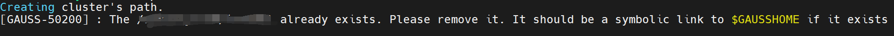

### 问题定位

脚本在检测文件是否存在时，检测的不是最终的目录，而是第二层的目录，因此预安装前应确保第二层目录是不存在的才可以正常安装。

### 解决方案

此时我们发现/usr2/test/om是不存在的，但是/usr2/test是存在的。
当我们删除/usr2/test后，再执行则不报错，安装成功。

## **问题9：镜像获取错误**

### 问题描述

preinstall预安装报错某个so文件不存在，但是实际该文件是存在的。

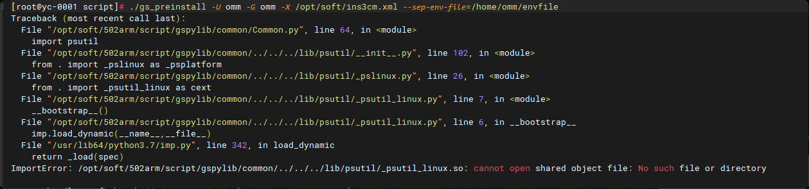

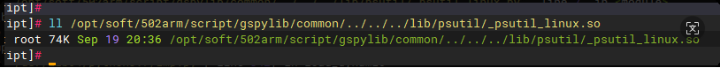

### 解决方案

这种问题是由于取错了架构的包导致，可以通过 file 查看文件的架构，和 `uname -p` 核对系统架构是否匹配。（新版本OM增加了对架构的校验）

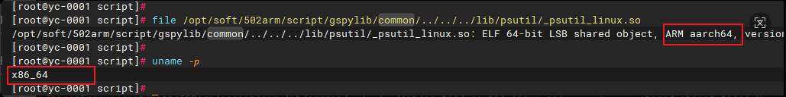

## **问题10：Python版本不匹配导致安装卡住**

### 问题描述

系统上的python版本和OM需要的版本不匹配时候报错甚至preinstall执行会卡住。

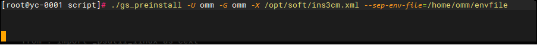

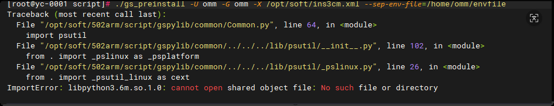

### 问题定位

根本原因在于OM所依赖的三方库，强绑定了python版本，进而导致om对python版本强依赖。

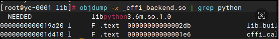

| 操作系统        | Python版本 |
|----------------|------------|
| Centos7.6      | 3.6        |
| openEuler20.03 | 3.7        |
| openEuler22.03 | 3.9        |
| openEuler24.03 | 3.11       |

### 问题解决

6.0.0之后，OM支持多种不同的python版本，可以解决该问题，其实也是对所依赖的三方库在不通的python下构建二进制，按需获取。

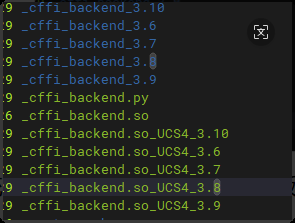

此外preinstall也提供了一种方式，可以选择用系统自带的依赖，可以做到任意版本都能兼容。

`./gs_preinstall -U omm -G omm -X single.xml  --unused-third-party`

**前提：**系统使用pip install如下组件:

- psutil
- netifaces
- cryptography
- paramiko

## **问题11：建立互信失败**

### 问题定位

互信可以让节点之间免密进行ssh scp，安装过程需要root和omm用户互信，通过在本节点发起命令在其他主备节点执行。

建立互信失败往往是系统层面配置的相关问题导致，排查时候可以检查sshd服务状态，以及排查系统日志。
`systemctl status sshd -l;     /var/log/message`

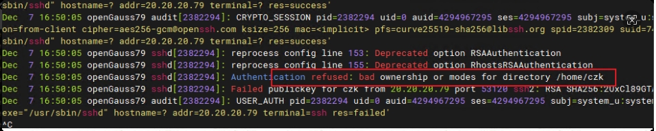
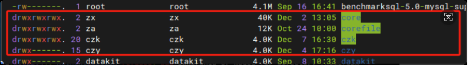

常见的是目录权限被随意更改，权限有严格要求，不是越大越好。此外需要排查下关闭selinux相关配置：

```sh
setenforce 0
sed -i '/^SELINUX=/c'SELINUX=disabled /etc/selinux/config
```

## **问题12：系统兼容适配**

### 问题描述

OM安装对于其他一些系统出现安装不支持的问题。

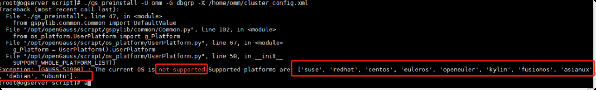

### 解决方案
社区发布的镜像可以适配安装系统：

| 系统版本         | 架构       |  发行版     | 
|---------------- |------------|------------|
| Centos7         | X86       |红旗Asianux 7|
| openEuler       | X86+ARM   |麒麟v10、UOS、FUSIONOS、UNIONTECH|

OM做过适配，可以直接使用社区的包来在这些系统进行安装：

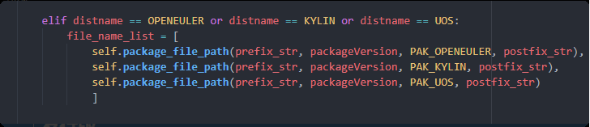

对于其他的系统，只要是基于centos7或者openEuler的发行版，可以经过很简单的适配就能使用社区镜像安装。

1. 修改系统的 /etc/os-release相关文件为已适配的系统，通过OM校验。
2. 修改OM代码，增加一个系统适配： [PR-675](https://gitee.com/opengauss/openGauss-OM/pulls/675/files) 

**系统选择：**遇到用户使用一个新的系统，应该选择社区哪个镜像？

主要关注操作系统的内核版本（uname -a），和社区发行的是否匹配。

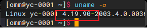

| 社区发布镜像    | 匹配系统内核版本 |
|----------------|----------------|
| Centos 7        | 3.10        |
| openEuler2003 | 4.19        |
| openEuler2203 | 5.10        |

## **问题13：gs_install校验失败**

### 问题描述

在gs_install的第一步， CheckPreInstall.py失败。

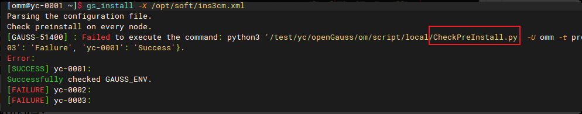

### 解决方案

CheckPreInstall.py   gs_install的第一步检查preinstall是否完成。原理是检查环境变量里面GAUSS_ENV的值：
`1 - preinstall结束     2 - install完成`。

对于CheckPreInstall失败，主要检查两点：

1. omm用户的互信是否正常。
2. 各个节点环境变量里面 GAUSS_ENV得值是否为1。

## **问题14：启动失败-内存信号量不足**

### 问题描述

内存较小的机器，启动出现申请信号量不足的报错。

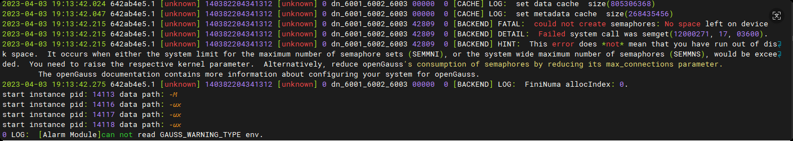

### 解决方案

在调用系统semget申请共享内存时候，资源不足导致。

1. 排查系统空闲内存和配置的shared_buffer大小，可以适当调小shared_buffer或者清理释放下系统内存。
2. 调整系统的shm配置。

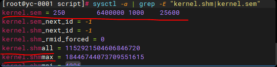

>[NOTE]说明
>
>- kernel.sem配置第二个参数过小会导致该问题。
>- kernel.shmall和shmmak配置过小也会导致问题。

## **问题15：启动失败-指令集**

### 问题定位

gs_install最后一步启动数据库，在启动时候报`gaussdb coredump，illegal instruction`等错误，往往是一些指令集引起启动失败。常见有三种：

1. ARM下LSE指令

    LSE扩展指令集在armv8.1以上cpu才具有，社区构建包基于鲲鹏920，支持lse指令集并且也在社区发布的镜像带上了该指令集的优化。鲲鹏 920 和 麒麟 990 的 cpu 芯片下是支持安装的。

    对于客户使用如飞腾2000的cpu，不支持该指令集，会导致coredump。

    需要在构建脚本，去掉 -D__ARM_LSE指令集重新构建包。

    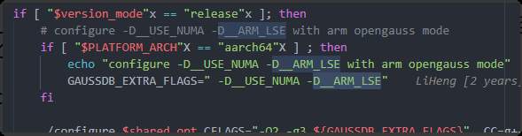

2. x86下rdtscp指令

    rdtscp用于时钟计算，目前仅MOT功能有使用到。系统没有该指令集也会导致启动coredump掉。解析core文件可以看到执行到该函数报错。

    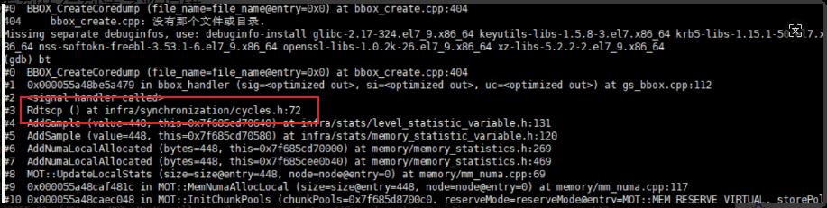

    一般对于虚拟机常见该问题，可以开启CPU直通模式解决。

3. x86下avx指令集

    avx指令集用于加速计算，AI功能有用到，从2.1.0版本开始引入。出现coredump问题也可以关注下是否有该指令集。也可以去掉该指令集后重新构建进行可用。

    

## **问题16：MOT引起启动失败**

### 问题描述

数据库在启动时候，会进行MOT一些初始化操作，即便MOT关掉也会执行这些操作，MOT初始化失败也会导致数据库启动失败。常见有两种情况：

1. rdtscp指令集不存在  
2. Numa节点分布不均匀

### 解决方案

lscpu可以查看NUMA节点分配情况，如下图是4个numa节点，每个有32核，分布是均匀的。


如果对于其他机器，这里面分配不均匀，如node0 32核，node1分配20核，那就会导致mot启动失败进而引起数据库启动不成功。

构建包时候，去掉mot功能。 `--disable-mot`

## **问题17：AZName和优先级引发cm启动失败**

### 问题定位

azname用来划分集群中的节点为哪个数据中心，azpriority对应优先级。

CM要求azname和优先级必须匹配，且不同的azname需要具有不同的az优先级，否则cm启动会一直报错。

表现也有可能为 cms虽然正常，但是cms主一直在发生切换（cms一直在重启）

### 解决方案

使用命令检查az配置情况： cm_ctl view | grep az
确保不同的az具备不同的优先级。


## **问题18：主备建联失败**

### 问题描述

主备节点的通信端口未放开，安装在主备建联阶段失败。

主备安装最后步骤中，主备各个节点启动后，备机会做build建立主备关系操作。当需要的端口没有放开会导致build卡主或者失败。

### 解决方案

1. 关闭防火墙 `systemctl stop firewalld`
2. 关闭iptables  `iptables -F`
3. 关闭selinux    `sed -i '/^SELINUX=/c'SELINUX=disabled /etc/selinux/config`

## **问题19：麒麟系统OM安装报错openssl不兼容**

### 问题描述

修复在麒麟系统升级openssh后，出现系统ssh和数据库libcrypto.so不兼容导致om无法使用的问题。

### 根因分析

#### 问题现象

在麒麟v10-sp2 arm环境，由于修复安全漏洞，升级了openssh，导致系统上ssh命令无法使用，报错如下：


#### 规避和处理措施

在om的script目录下，创建ssh/scp/ssh-add/ssh-kengen/ssh-copy-id文件，里面添加如下脚本：
比如scp：

```bash
#!/bin/bash
export LD_LIBRARY_PATH=/usr/lib64 && /usr/bin/scp $@
```

ssh：

```bash
#!/bin/bash
export LD_LIBRARY_PATH=/usr/lib64 && /usr/bin/ssh $@
```

在script下面创建复写ssh等文件，里面指定使用系统的lib库路径：参考修复[pr](https://gitee.com/opengauss/openGauss-OM/pulls/635/files) 。

#### 原因分析

1. openGauss自身引入libcrypto.so 组件

    openGauss强依赖openssl开源组件，固定了该组件的版本（1.1.1n），并基于该版本源码编译了。
    openssl，将编译的产物动态库(libssl.so.1.1 libcrypto.so.1.1) 打包到数据库的安装包里面。在安装时候会解压到 `$GAUSSHOME/lib` 下。
    操作系统本身也有这两个文件（/usr/lib64 目录下），为了避免冲突，openGauss安装时候，通过设置环境变量的方式去加载这两个动态库。在omm用户下，`$GAUSSHOME/lib` 的优先级是要高于系统的。
    因此会在omm的 `.bashrc` 里面写入下面的环境变量来保证优先级。

    `export LD_LIBRARY_PATH=$GAUSSHOME/lib:$LD_LIBRARY_PATH`

    

    使用ldd命令可以看到，gaussdb必须加载自带的 `libcrypto.so.1.1`。

2. ssh在升级后，依赖系统的libcrypto.so

    

    但是在omm下，优先加载了openGauss的环境，导致ssh去依赖openGauss的libcrypto.so库，可以看到，此时已经提示系统的ssh和openGauss的libcrypto.so已经不兼容了。

    

    最根本原因是由于，系统升级补丁后，新版本的openssl库和openGauss自身的不能兼容。

    使用ldd分别看看系统升级后的libcrypto.so和openGauss lib下的，存在不兼容的接口：

    
    

#### 修复方案

考虑几个修复方案：

1. 数据库升级openssl，加上1_1_1_f和系统兼容 --- 但是假如后面存在升级补丁到其他openssh版本怎么办？数据库没法和系统保证同步升级。
2. 复写 ssh 到环境变量会不会有效果？ `alias ssh='LD_LIBRARY_PATH=/usr/lib64/&&/usr/bin/ssh'`--- 这个只能执行一次，就会修改环境变量，导致数据库的不可用。
3. 把ssh打包到om包里面，后面只依赖自己包里面的ssh。 --- openGauss只发布openEuler-arm，上面的`openssh=7.8`，而像麒麟v10，`openssh=8.2`，也有不兼容现象。
4. OM里面ssh强依赖系统的，加载时候主动去导入系统的路径`LD_LIBRARY_PATH=/usr/lib64`。

**实现方案**

使用方案4：OM里面ssh强依赖系统的，加载时候主动去导入系统的路径。
主要涉及两处修改：

1. om里面的ssh强制指定系统，并加载系统依赖 `LD_LIBRARY_PATH=/usr/lib64`。 包括 `ssh scp ssh-agent ssh-add ssh-copy-id`。
2. 解决了om工具后，在omm下直接使用ssh也会报错：复写ssh工具到omm的环境变量路径下。
    比如ssh工具

    ```bash
    #!/bin/bash
    ##########################################################################
    ###
    # Copyright (c): 2021-2025, Huawei Tech. Co., Ltd.
    # FileName : ssh
    # Date : 2023-12-09
    ##########################################################################
    ###
    export LD_LIBRARY_PATH=/usr/lib64 && /usr/bin/ssh $@
    ```

这样，如果不加载om的环境变量，则默认使用系统的ssh。如果加载了om环境变量，则使用系统ssh前导入系统的lib路径。保证手动使用ssh也可行。

[关联需求或issue](https://gitee.com/opengauss/openGauss-server/issues/I8MCW0?from=project-issue)

