# 迁移常见问题与解决方法

## **问题1：Mysql longblob二进制正常迁移opengauss，导致二进制图片打不开**

### 问题描述

Opengauss B库兼容下longblob接收有问题，需要转成bytea。

### 解决方案

datakit迁移配置修改：

1. 在配置迁移过程参数中，点击编辑任务配置参数。

    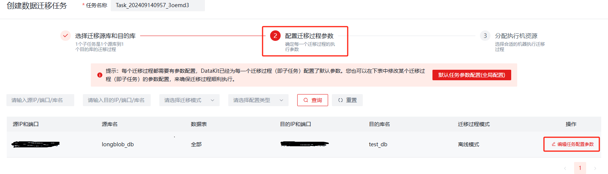

    点击高级参数

    

2. 将下列数值修改：在迁移过程中将mysql的longblob类型转换为bytea,点击保存。

    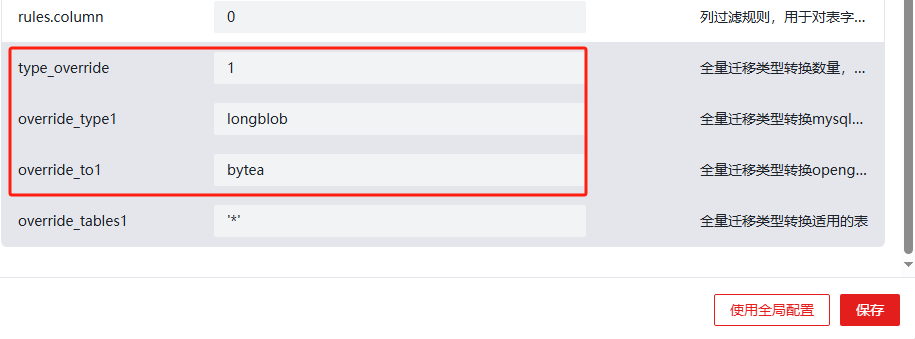

3. 迁移：
    迁移后的表类型为

    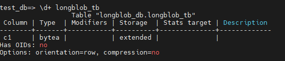

4. 简单验证：
    mysql将图片二进制插入表中：

    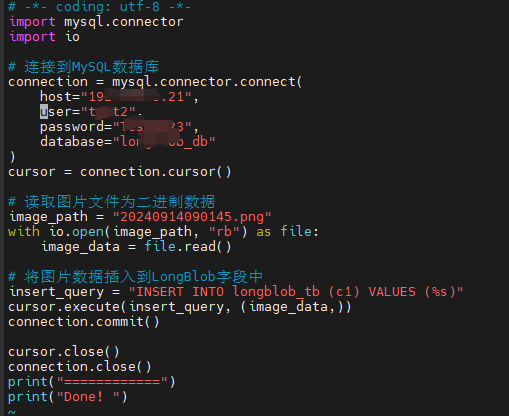

    Opengauss将迁移过来的表数据读取输出图片：

    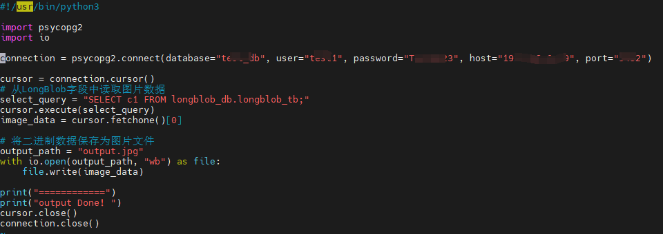
    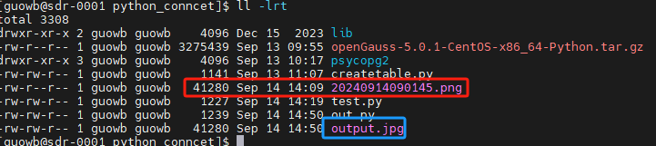

    将jpg文件放在windows桌面可正常打开。

## **问题2：使用DataStudio实现数据迁移**

### 解决方案

#### DataStudio下载及使用

1. DataStudio下载:[DataStudio](https://opengauss.org/zh/download/archive/)，
找到相关页面点击下载：

    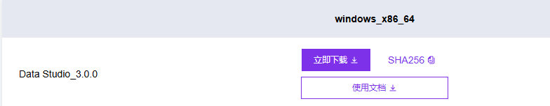

2. 将下载的压缩包解压

    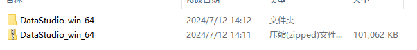

3. 解压出现如下内容：点击exe程序，即可启动（确保windows环境有Java11，否则会报错）

    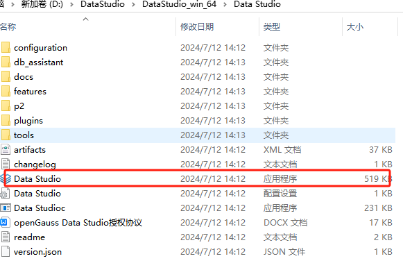

4. 即可进入到DataStudio主界面

    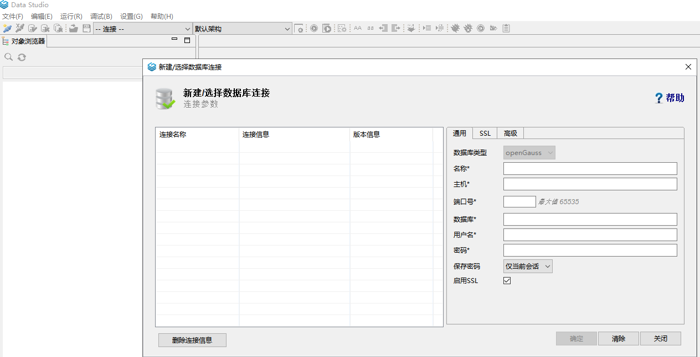

5. 数据库执行如下：

    ```bash
    create database db_1;
    create roles test1 password 'xxxxxxxx';
    grant all privileges to test1;
    create schema test1;
    gs_guc reload -D Dn -h "host all all 0.0.0.0/0 sha256" #（添加windows白名单到数据库配置文件）
    ```

6. 客户段按照填完相关信息，不勾选启用SSL，点击确定，然后点击继续。

    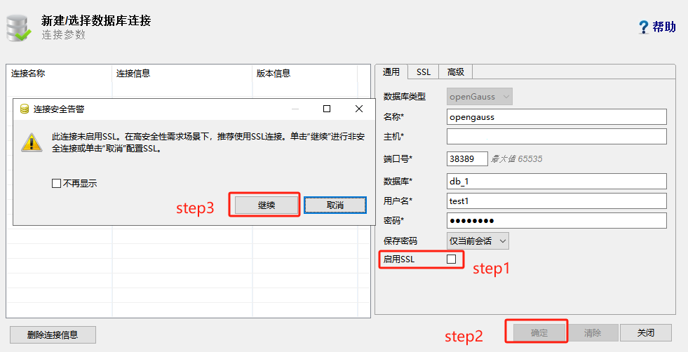

    数据库连接成功：

    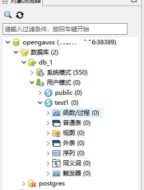

#### 迁移数据

假设db_1库,test1模式下有如下内容：

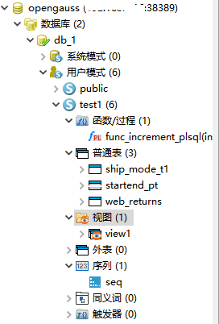

1. 在**对象浏览器**窗格中，右键单击所选模式，选择**导出 DDL 和数据**。 
Data Studio 显示**安全警告**对话框。 
用户可关闭此对话框。详情请参见安全警告。

2. 单击**确定**。 
Data Studio 显示**另存为**对话框。

3. 在**另存为**对话框中，选择定义和数据的保存位置，单击**保存**。状态栏会显示操作进度。

    >[!NOTE]说明
    >
    >DataStudio导出文件位置必须有路径权限，否则会导出失败。

    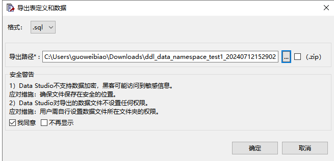

    导出完成：

    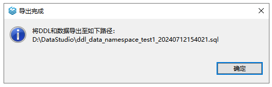

    导出后为模式下的整个sql,
    新库可以使用gsql工具导入相关表sql。

    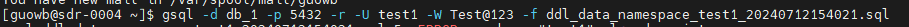

    在两个不同库，相同表结构下，可以将表数据导出，再导入表数据到其他库中相同的表，目前只能一个表依次操作导入，效率不高。

    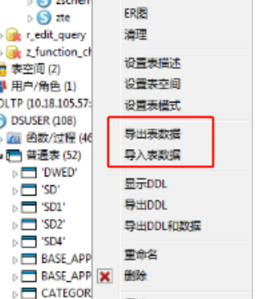
