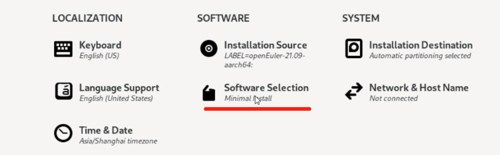
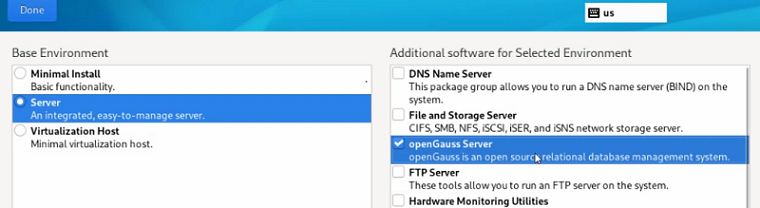

# RPM安装

本章节主要介绍在openEuler、Fedora、RedHat、SUSE操作系统上，通过yum/zypper命令一键安装openGauss数据库。

## 支持的架构、操作系统版本以及对应的openGauss版本

| 操作系统                 |     架构      |      openGauss版本     |     updata版本    |
| ----------------------- | ------------- | --------------- | ---------------- |
| openEuler 24.03 LTS SP1 | ARM64/x86_64  | openGauss 6.0.0 极简版  |     无     |
| openEuler 22.03 LTS SP4 | ARM64/x86_64  | openGauss 5.0.1 Lite   | openGauss 6.0.0 极简版 |
| openEuler 24.03 LTS     | ARM64/x86_64  | openGauss 2.1.0 Lite   |     无     |
| openEuler 22.03 LTS SP3 | ARM64/x86_64  | openGauss 2.1.0 Lite   |     无     |
| openEuler 20.03 LTS SP4 | ARM64/x86_64  | openGauss 2.1.0 Lite   |     无     |
| openEuler 22.03 LTS SP1 | ARM64/x86_64  | openGauss 2.1.0 Lite   |     无     |
| Fedora Linux 41         | ARM64/x86_64  | openGauss 6.0.0 极简版  |     无     |
| RedHat 9                | ARM64/x86_64  | openGauss 6.0.0 极简版  |     无     |
| SUSE 15.6               | ARM64/x86_64  | openGauss 6.0.0 极简版  |     无     |

注意：

- 上面列举的都是openEuler正在维护的版本，如果需要openEuler其他版本上安装openGauss，请联系华为技术支持。
- openGauss版本表示系统当前支持安装的openGauss版本，update版本表示通过yum update命令升级到的openGauss版本。

## 支持特性

- 从openGauss 5.0.1开始，支持兼容性B库，详细参考[dolphin插件](../extension_reference/dolphin概述.md)。
  
## 约束

- openGauss 6.0.0极简版不包含mot，obs和codegen功能，以及om、cm等外部组件，仅有纯数据库功能（支持兼容性B库）。

## 使用限制

- 当前仅在openEuler、Fedora、RedHat、SUSE操作系统上支持yum/zypper方式安装，支持arm64和x86_64两种架构。
- 集成到openEuler系统上的数据库基于openGauss轻量版的能力构建。
- RPM方式安装的仅为单机版数据库实例，升级时候只能替换二进制，不支持灰度升级。
- 默认安装实例监听127.0.0.1:7654地址和端口。如果需要进行远程连接，需要手动修改postgresql.conf文件中的listen_address。
- 安装数据库默认创建用户openGauss，卸载数据库后不删除该用户。

## 安装方式

### openEuler操作系统

- 安装完成操作系统后使用yum install安装。

    `yum install opengauss -y`

- 在安装操作系统过程中，software选择openGauss，安装操作系统时候默认安装上openGauss数据库。





### Fedora操作系统

- 以sudo用户安装为例。

```shell
# 1. 配置仓库
sudo tee /etc/yum.repos.d/opengauss.repo >/dev/null << 'EOF'
[opengauss]
name=openGauss Database Server
baseurl=https://repo.opengauss.org/yum/fedora/41/opengauss-org/6.0.0/aarch64/
enabled=1
gpgcheck=0
EOF

# 2. 更新缓存
sudo yum makecache

# 3. 查看可用包
sudo yum list available | grep opengauss

# 4. 安装
sudo yum install opengauss

# 5. 验证安装
rpm -qi opengauss
```

### RedHat操作系统

- 以sudo用户安装为例。

```shell
# 1. 配置仓库
sudo tee /etc/yum.repos.d/opengauss.repo >/dev/null << 'EOF'
[opengauss]
name=openGauss Database Server
baseurl=https://repo.opengauss.org/yum/redhat/9/opengauss-org/6.0.0/aarch64/
enabled=1
gpgcheck=0
EOF

# 2. 更新缓存
sudo yum makecache

# 3. 查看可用包
sudo yum list available | grep opengauss

# 4. 安装
sudo yum install opengauss

# 5. 验证安装
rpm -qi opengauss
```

### SUSE操作系统

- 以sudo用户安装为例。

```shell
# 1. 配置仓库
sudo tee /etc/zypp/repos.d/opengauss.repo >/dev/null <<'EOF'
[opengauss]
name=openGauss Database Server
baseurl=https://repo.opengauss.org/zypper/suse/15/opengauss-org/6.0.0/x86_64
enabled=1
gpgcheck=0
EOF

# 2. 更新缓存
sudo zypper refresh

# 3. 查看可用包
sudo zypper packages --available | grep opengauss

# 4. 安装
sudo zypper install opengauss

# 5. 验证安装
zypper info opengauss
```

## 卸载方式

- Fedora、RedHat系统

```shell
sudo yum remove opengauss
```

- SUSE系统

```shell
sudo zypper remove opengauss
```

## 使用说明

1. 切换到opengauss用户 `su - opengauss`。

2. 对于openEuler系统，执行 `gs_ctl start`。
   
3. 查看进程 `ps ux`, 可以看到，二进制安装目录在 `/usr/local/opengauss`下，默认启动的数据目录在`/var/lib/opengauss/data`目录下。

4. 数据库连接 `gsql -d postgres -p 7654 -r`，数据库默认端口为7654。连接到数据库后，可正常使用数据库。

## 数据库升级

注：当前仅支持在openEuler操作系统上升级。

1. 支持从低版本的数据库升级到高版本的数据库。
   注意：不支持从2.1.0 Lite升级到6.0.0 LTS，支持从2.1.0 Lite升级到5.0.1 Lite，以及5.0.1 Lite升级到6.0.0 LTS。

## 容器内进行yum安装opengauss

openGauss已经集成到了openEuler系统里面，可以yum install opengauss一键安装。但是由于容器镜像缩减了很多工具，要在容器里执行yum安装需要进行以下配置。

以 openEuler-24.03-SP3系统容器镜像为例：

1. 启动操作系统容器

   ```
   docker run --privileged --cap-add=SYS_PTRACE --security-opt seccomp=unconfined -itd --name openeuler2403sp3-test --restart=always openeuler-24.03-lts-sp3:latest /bin/bash
   ```

2. 登录到容器里安装依赖

   ```
   yum install util-linux systemd
   ```

3. 退出容器，由于容器没有以systemd方式启动，需要加上配置

   ```
   docker stop <container id>
   systemctl stop docker
   sed -i "s#/bin/bash#/sbin/init#g" /var/lib/docker/containers/<container id>/config.v2.json
   systemctl start docker
   docker start <container id>
   ```

4. 登录到容器里安装opengauss

   ```
   yum install opengauss
   ```

**说明**
  >
  > 1. 由于数据库做yum安装需要启用systemd服务，而容器镜像做了缩减去掉了systemd，以上的步骤目的都是为了在容器内安装和启用systemd

  > 2. 容器内做yum安装步骤繁琐，不推荐这么使用。 如果需要用容器部署数据库，推荐使用官网的数据库容器镜像。 
