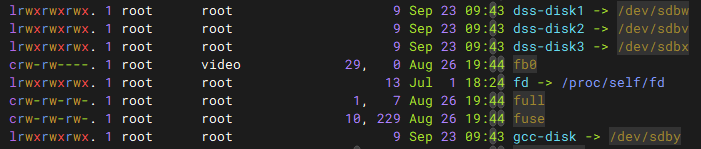
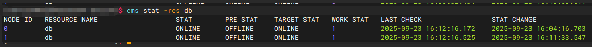

# oGRAC两节点安装

本文旨在介绍如何在物理机上进行`oGRAC`的两节点安装部署。

## 安装前须知

### 硬件要求

- 主机数量：2台ARM架构物理机/DCS虚拟机
- 推荐主机硬件最低规格：
    - 内存：8GB
    - CPU：4核（16位）
    - 磁盘空闲空间：100GB
---

## 安装准备

### 操作系统要求

- 支持的操作系统：
    - openEuler 20.03/22.03 LTS arrch64
- 建议使用上述版本的操作系统进行编译和部署，其余环境未作正确性验证

---

## 安装 oGRAC

### 1. 环境准备

#### 1.1 系统初始化

在`root`用户下，关闭 SELinux 和防火墙：

```shell
setenforce 0
sed -i 's/^SELINUX=.*/SELINUX=disabled/' /etc/selinux/config
systemctl stop firewalld
systemctl disable firewalld
```

#### 1.2 创建用户

- 两节点均需创建用户，并设置密码，两节点操作一致。

```shell
useradd ogdba
passwd ogdba  # 然后回显需要输入设置密码
```

#### 1.3 安装必要依赖

```shell
yum install -y wget python3 python3-devel iputils iproute --skip-broken
```

---

### 2. 获取安装包并传输到各个安装节点
创建安装目录（这里以`/data`目录举例，不建议将安装目录存放在`/home`下，以免存在不可预期的权限问题）
```shell
mkdir /data/ograc
```

- 可以在[openGauss官网](https://docs.opengauss.org/zh/)的`下载`页面进行安装包的下载获取。

```shell
假如安装包放在节点一的`/data/ograc`目录下，则需要执行下面这个命令给节点二也传输一份

scp /data/ograc/[package_name] root@[ip2]:/data/ograc/[package_name]
```

---

### 3. 两节点安装准备

> 请提前准备好 4 个 LUN，并在磁阵上划分好后挂载到主机。
>
>说明：
>
> - DeviceManager是在有了存储设备后自行配置的一个用于管理存储设备的网页。
> - 在第一次扫描、查询盘符时，如果查找不到，则可以使用iscsiadm -m node --logoutall=all 和iscsiadm -m node -p ip -l来断开连接并重新登录连接，注意该操作会影响所有连接的存储设备，可能会影响其他用户，请谨慎操作。这里的ip是存储设备的ip地址，可以使用iscsiadm -m node来查询。

通过如下步骤来进行LUN的划分：

1. 登录集群DeviceManager，选择`服务`->`LUN组`->`LUN`->`创建`来创建四个LUN，分为一个5G、一个4T、两个2T大小；(具体的大小请根据业务需求进行设置)
2. 将创建好的四个LUN添加映射到对应的主机组中即可；

#### 3.1 前期准备：解压文件并时间同步

节点1操作如下：

```shell
cd /data/ograc
tar -zxvf [package_name]
chmod 777 ograc_connector -R; 
chown root:root ograc_connector -R
cd ograc_connector/action
ntpdate -u ntp.xxx.com # 同步机器时间，这里可以采用多种服务时间
date   # 检查两台机器时间是否同步，否则 CMS 无法启动
```

节点2操作如下：

```shell
cd /data/ograc
tar -zxvf [package_name]
chmod 777 ograc_connector -R; 
chown root:root ograc_connector -R
ntpdate -u ntp.xxx.com # 同步机器时间，这里可以采用多种服务时间
date   # 检查两台机器时间是否同步，否则 CMS 无法启动
```

#### 3.2 LUN 软链接建立（两节点均需执行，盘符以 by-id 为准）

节点1、2操作如下：

```shell
ln -s /dev/sdxx /dev/dss-disk1
ln -s /dev/sdxx /dev/dss-disk2
ln -s /dev/sdxx /dev/dss-disk3
ln -s /dev/sdxx /dev/gcc-disk
```

示意图如下：



建立软链接的对应关系如下表：

| 软链接 | 使用类型 | dss卷名 |  大小  |
|--------|--------|---------|---------|
| gcc-disk | cm投票盘 |不对该卷进行显式管理| 5G|
| dss-disk1| page   |vg1    |    2T   |
| dss-disk2| redo   |vg2    |    4T   |
| dss-disk3| 归档   |vg3    |    2T   |

请注意，上述`gcc`为`CM`组件特有名称，与编译器类型无关。

#### 3.3 配置文件修改

- 进入 action 目录：

```shell
cd /data/ograc/ograc_connector/action
```

- 编辑 `config_params_lun.json`，注意节点参数差异，其中如果为小规格机器（如内存小于255GB），请将`auto_tune`置为1，进行自适应参数调节，否则将会因内存资源不足导致安装失败。

节点1上的`config_params_lun.json`进行如下修改配置：

```json
{
    "deploy_mode": "dss",
    "deploy_user": "ogdba:ogdba",
    "node_id": "0",
    "cms_ip": "xx.xx.xx.1;xx.xx.xx.2",
    "db_type": "1",
    "mes_ssl_switch": false,
    "MAX_ARCH_FILES_SIZE": "300G",
    "redo_num": "6",
    "redo_size": "5G",
    "auto_tune": "0",
    "dss_vg_list": {
        "vg1": "/dev/dss-disk1",
        "vg2": "/dev/dss-disk2",
        "vg3": "/dev/dss-disk3"
    },
    "gcc_home": "/dev/gcc-disk"              
}
```

节点2上的`config_params_lun.json`进行如下修改配置：

```json
{
    "deploy_mode": "dss",
    "deploy_user": "ogdba:ogdba",
    "node_id": "1",
    "cms_ip": "xx.xx.xx.1;xx.xx.xx.2",
    "db_type": "1",
    "mes_ssl_switch": false,
    "MAX_ARCH_FILES_SIZE": "300G",
    "redo_num": "6",
    "redo_size": "5G",
    "auto_tune": "0",
    "dss_vg_list": {
        "vg1": "/dev/dss-disk1",
        "vg2": "/dev/dss-disk2",
        "vg3": "/dev/dss-disk3"
    },
    "gcc_home": "/dev/gcc-disk"
}
```
其中，各字段含义如下：
- deploy_mode：安装模式，当前默认推荐使用dss安装；
- deploy_user：安装管理用户；
- node_id：节点序号，从0开始；
- mes_ssl_switch：mes通信是否通过ssl加密；
- db_type：数据库标识，不建议修改；
- MAX_ARCH_FILES_SIZE：归档最大文件大小；
- redo_num：redo文件的数量；
- redo_size：redo文件的大小，由于首次起库会`dd`抹除盘中所有内容，不建议设置过大；
- auto_tune：是否开启自适应参数配置（小规格机器建议开启）；
- dss_vg_list：分别为数据盘、redo盘、归档盘目录；
- gcc_home：CM仲裁盘使用目录；

---

### 4. 节点安装与启动
接下来进行两节点安装，首先，在节点一执行如下命令，执行`install`步骤安装一节点：
```shell
sh appctl.sh install config_params_lun.json
```
其次，在节点二执行如下命令，安装而节点：
```shell
sh appctl.sh install config_params_lun.json
```

接下来进行两节点启动，首先，在节点一执行如下命令：
```shell
sh appctl.sh start
```
其次，在节点二执行如下命令，启动二节点：
```shell
sh appctl.sh start
```
---

### 5. 查询集群状态
登录任一节点，执行以下命令，查看节点状态信息：
```shell
su -s /bin/bash ograc
cms stat -res db
```

示意图如下：



## 卸载 oGRAC

首先，在两节点均利用stop命令停止数据库：
```shell
sh appctl.sh stop
```

随后，利用`uninstall`命令删除数据、安装目录及相关环境变量。
```shell
sh appctl.sh uninstall override
```
